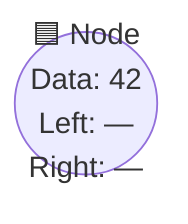
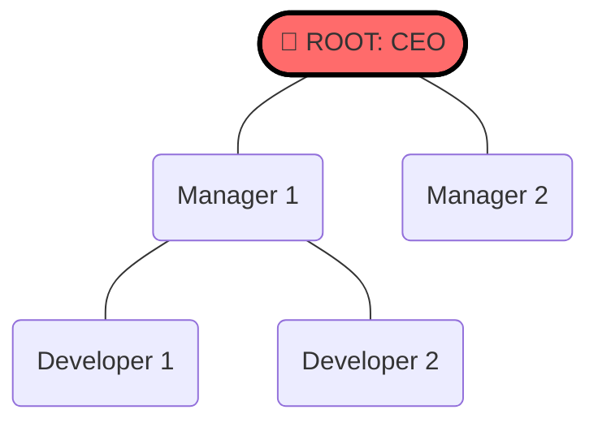
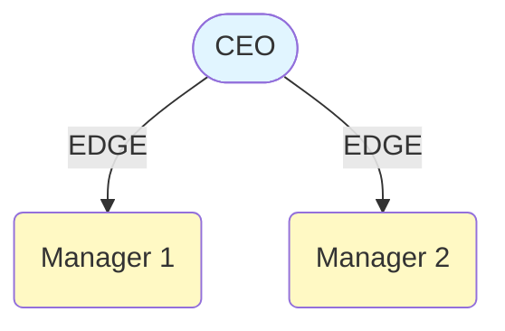
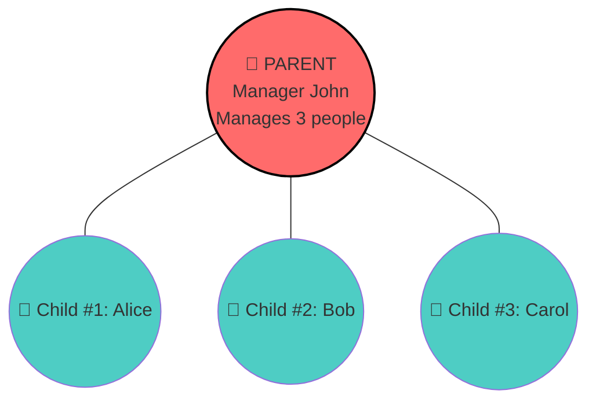
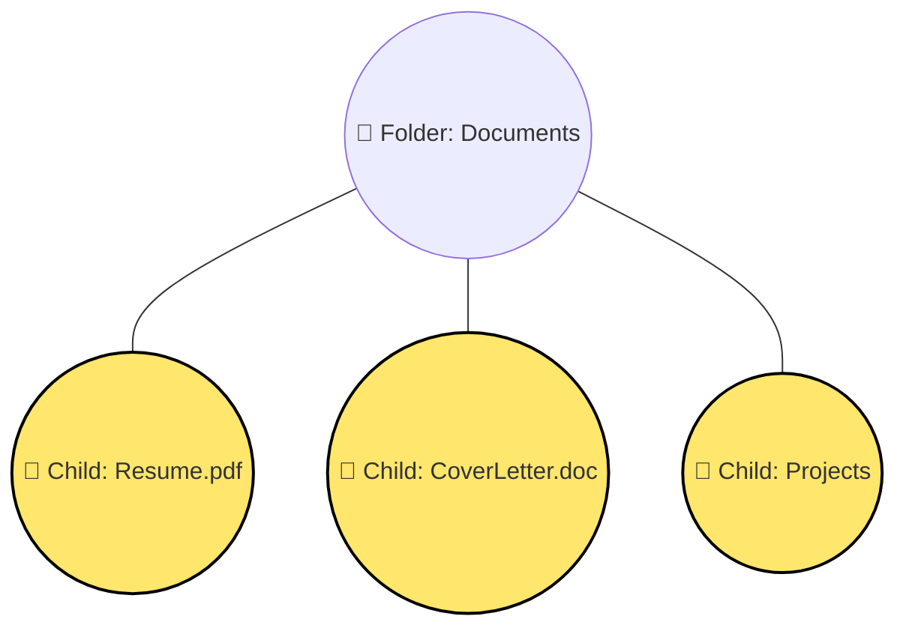
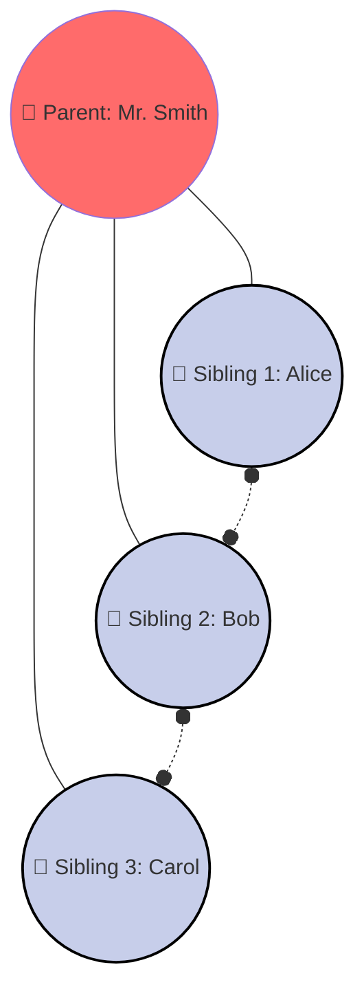
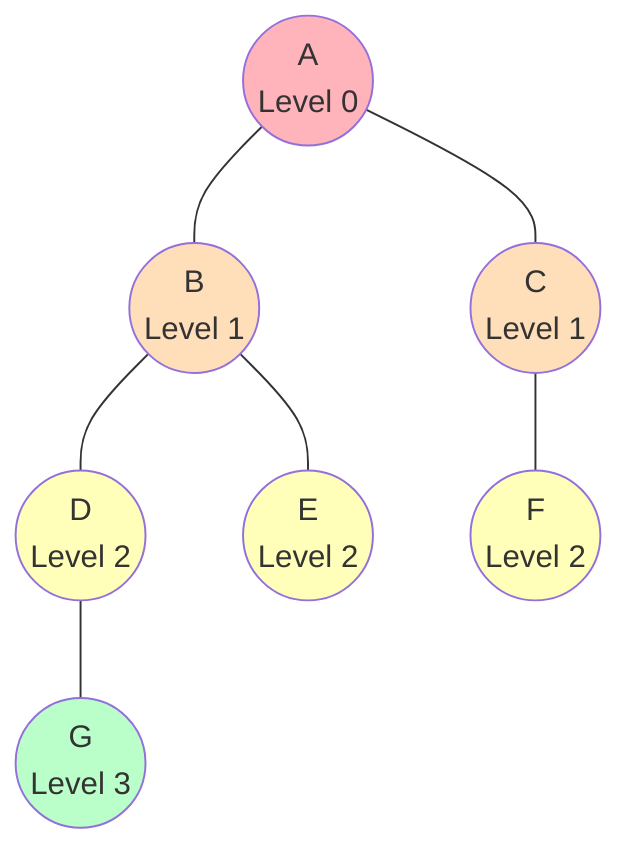
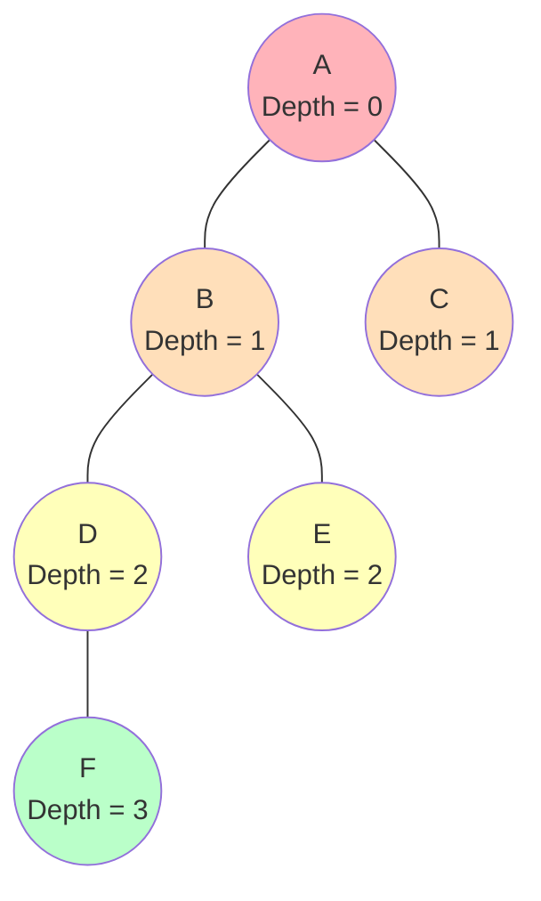
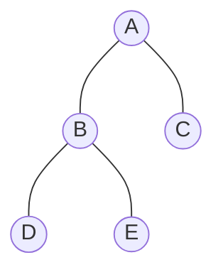

# 🌳 Tree Data Structure: Complete Terminology Guide

## Introduction: What is a Tree?

A **Tree** is a hierarchical data structure where elements (called nodes) are connected by edges in a parent-child relationship. Unlike linear structures (arrays, linked lists), trees organize data hierarchically—think of how folders organize files on your computer, or how a family hierarchy works.

> **Real-World Analogy**: A tree data structure is like an **organizational chart** in a company. The CEO is the root, managers report to the CEO, team members report to managers, and so on. Each person (node) has one boss (parent) but can have multiple subordinates (children).

---

## Why Learn Tree Terminology?

Before we can build and manipulate trees, we must speak the same language. This section covers the essential vocabulary you'll encounter in every tree-related problem.

---

## 🏗️ Part 1: Basic Components

### 1. **Node** 
A **Node** is a container that holds:
- **Data/Value**: The actual information stored
- **Links/Pointers**: References to child nodes (and parent in some implementations)

**Visual Example**:


**Real-World Examples**:
1. A person in a family tree (contains: name, age)
2. A file or folder in your computer
3. An employee in an organization (contains: ID, name, role)
4. A city in a transportation network
5. A word in a dictionary structure

---

### 2. **Root Node**
The **Root** is the topmost node in a tree with **no parent**. There is exactly **ONE root per tree**.

**Visual Example**:


**Examples from Real Life**:
1. **Family Tree**: The oldest ancestor is the root
2. **Company Org Chart**: CEO is the root
3. **Computer File System**: `/` (root directory) is the root
4. **Website Sitemap**: Homepage (index.html) is the root
5. **Biology/Taxonomy**: Kingdom is root (organism classification)

**Key Principle**: 
```
Every tree has EXACTLY 1 root node
```

---

### 3. **Edge**
An **Edge** is a connection between two nodes, representing the parent-child relationship.

**Mathematical Property**: 
$$\text{Number of Edges} = \text{Number of Nodes} - 1$$

**Proof**:
- Every node except the root has exactly **one parent**
- Root has **no parent**
- Therefore: (n-1) nodes contribute (n-1) edges
- QED: Edges = n - 1

**Visual Examples**:

**Example 1 - Company Structure**:


**Example 2 - Verification with 5-node tree**:
```
Nodes: 5 (A, B, C, D, E)
Edges: 4 (A-B, A-C, B-D, B-E)
Formula Check: 5 - 1 = 4 ✓
```

---

### 4. **Parent Node**
A **Parent** is any node that has one or more child nodes.

**Visual Example** - Corporate Hierarchy:


**Real-World Examples**:
1. Your biological mother/father are your parents
2. A manager has subordinates as children
3. A folder contains files (children)
4. An HTML `<div>` contains child elements
5. A country contains states as children

**Relationship**:
```
If X is parent of Y, then:
- X has Y as a child
- Y has X as parent  
- X is ancestor of Y
- Y is descendant of X
```

---

### 5. **Child Node**
A **Child** is any node that has a parent node (all nodes except the root).

**Visual Example** - File System:


**Formula for entire tree**:
```
Number of Child Nodes = Total Nodes - 1
(because root has no parent)
```

---

### 6. **Siblings**
**Siblings** are nodes that share the same parent node.

**Visual Example** - Family Tree:


**Sibling Definition**: 
```
If parent P has children: C1, C2, C3, ...
Then C1, C2, C3 are all siblings of each other
```

**Real Examples**:
- Your brothers and sisters
- Multiple projects under same client
- All files in one folder
- All state capitals in one database table

---

## 🎯 Part 2: Node Classification

### 7. **Leaf Node (External Node)**
A **Leaf** is a node with **no children**—it's an endpoint of the tree.

**Definition**:
$$\text{Leaf Node} \iff \text{Degree}(\text{Node}) = 0$$

**Visual Example**:
```mermaid
graph TD
    A((A<br/>(Degree=2)))
    B((B<br/>(Degree=2)))
    C((C<br/>(Degree=1)))
    D((🍃 D<br/>(LEAF)))
    E((🍃 E<br/>(LEAF)))
    F((🍃 F<br/>(LEAF)))
    
    A --- B
    A --- C
    B --- D
    B --- E
    C --- F
    
    style A fill:#e1f5ff
    style B fill:#e1f5ff
    style C fill:#e1f5ff
    style D fill:#90ee90,stroke:#000,stroke-width:2px
    style E fill:#90ee90,stroke:#000,stroke-width:2px
    style F fill:#90ee90,stroke:#000,stroke-width:2px
```

**Real-World Examples**:
1. A person with no children in family tree
2. A file (not a folder) in file system
3. An employee with no subordinates
4. A leaf on an actual tree 🍂
5. A dead-end street in a network

**Count Property**: For a binary tree with structure, we can calculate the exact number of leaves.

---

### 8. **Internal Node**
An **Internal Node** is any node with **at least one child**.

**Definition**:
$$\text{Internal Node} \iff \text{Degree}(\text{Node}) \geq 1$$

**Visual Example**:
```mermaid
graph TD
    A((🔴 A<br/>(INTERNAL)<br/>Degree=2))
    B((🔴 B<br/>(INTERNAL)<br/>Degree=2))
    C((🔴 C<br/>(INTERNAL)<br/>Degree=2))
    D((L (Leaf)))
    E((L (Leaf)))
    F((L (Leaf)))
    G((L (Leaf)))
    
    A --- B
    A --- C
    B --- D
    B --- E
    C --- F
    C --- G
    
    style A fill:#ff6b6b,stroke:#000,stroke-width:2px
    style B fill:#ff6b6b,stroke:#000,stroke-width:2px
    style C fill:#ff6b6b,stroke:#000,stroke-width:2px
```

**Relationship**:
$$\text{Internal Nodes} + \text{Leaf Nodes} = \text{Total Nodes}$$

**Examples**:
1. A manager with team members (internal)
2. A folder containing files (internal)
3. A junction connecting multiple roads
4. A word that has sub-words (in a trie structure)

---

### 9. **Ancestor Node**
An **Ancestor** of node X is any node on the path from root to X (includes parents, grandparents, great-grandparents, **but historically NOT including the node itself**).

**Definition**:
```
Ancestors of X = All nodes Y where:
- Y is on path from Root to X
- Y ≠ X (does not include X itself)
```

**Visual Example**:
```mermaid
graph TD
    A((🔴 A<br/>(ANCESTOR<br/>of D)))
    B((🔴 B<br/>(ANCESTOR<br/>of D)))
    C((🔴 C<br/>(ANCESTOR<br/>of D)))
    D((D<br/>(TARGET)))
    E((E))
    F((F))
    
    A --- B
    A --- E
    B --- C
    B --- F
    C --- D
    
    style A fill:#ffb3ba,stroke:#000,stroke-width:2px
    style B fill:#ffb3ba,stroke:#000,stroke-width:2px
    style C fill:#ffb3ba,stroke:#000,stroke-width:2px
    style D fill:#ffe66d,stroke:#000,stroke-width:2px
```

**Path Analysis**:
- Path from Root to D: A → B → C → D
- Ancestors of D: **{A, B, C}** (excludes D)

**Real Example - Hierarchy**:
- Your ancestors: parents, grandparents, great-grandparents, ...
- Exclude yourself from the ancestor list

---

### 10. **Descendant Node**
A **Descendant** of node X is any node in the subtree rooted at X (**excluding X itself** by standard definition).

**Definition**:
```
Descendants of X = All nodes Y where:
- Y is in subtree rooted at X
- Y ≠ X (does not include X itself)
```

**Visual Example**:
```mermaid
graph TD
    A((A<br/>(BASE NODE)))
    B((B<br/>(DESCENDANT)))
    C((C<br/>(DESCENDANT)))
    D((D<br/>(DESCENDANT)))
    E((E<br/>(DESCENDANT)))
    F((F<br/>(DESCENDANT)))
    
    A --- B
    A --- C
    B --- D
    B --- E
    C --- F
    
    style A fill:#4ecdc4,stroke:#000,stroke-width:2px
    style B fill:#ffe66d,stroke:#000,stroke-width:2px
    style C fill:#ffe66d,stroke:#000,stroke-width:2px
    style D fill:#ffe66d,stroke:#000,stroke-width:2px
    style E fill:#ffe66d,stroke:#000,stroke-width:2px
    style F fill:#ffe66d,stroke:#000,stroke-width:2px
```

**Descendants of A**: {B, C, D, E, F}

**Key Relationship**:
```
If X is ancestor of Y, then Y is descendant of X
```

---

## 📊 Part 3: Tree Measurements

### 11. **Degree of a Node**
The **Degree** of a node is the number of children it has.

**Definition**:
$$\text{Degree}(n) = \text{Number of children of node } n$$

**Visual Examples**:

**Example 1 - High Degree**:
```mermaid
graph TD
    A((A<br/>Degree = 3<br/>(3 children)))
    B((B))
    C((C))
    D((D))
    
    A --- B
    A --- C
    A --- D
    
    style A fill:#ff6b6b,stroke:#000,stroke-width:2px
```

**Example 2 - Medium Degree**:
```mermaid
graph TD
    B((B<br/>Degree = 2<br/>(2 children)))
    D((D))
    E((E))
    
    B --- D
    B --- E
    
    style B fill:#ff6b6b,stroke:#000,stroke-width:2px
```

**Example 3 - Zero Degree (Leaf)**:
```mermaid
graph TD
    L((Leaf Node<br/>Degree = 0<br/>(no children)))
    
    style L fill:#90ee90,stroke:#000,stroke-width:2px
```

**Degree Values**:
- Tree degree can range from 0 (leaf) to n-1 (all other nodes as children)
- In a **binary tree**, degree ≤ 2

---

### 12. **Degree of a Tree**
The **Degree of a Tree** is the maximum degree among all nodes.

**Formula**: 
$$\text{Degree}(\text{Tree}) = \max(\text{Degree}(n_1), \text{Degree}(n_2), ..., \text{Degree}(n_k))$$

**Visual Example with Calculation**:
```mermaid
graph TD
    A((A (Degree=2)))
    B((B (Degree=3)⭐))
    C((C (Degree=1)))
    D((D (Degree=0)))
    E((E (Degree=0)))
    F((F (Degree=0)))
    G((G (Degree=0)))
    
    A --- B
    A --- C
    B --- D
    B --- E
    B --- F
    C --- G
    
    style B fill:#ff6b6b,stroke:#000,stroke-width:3px
```

**Calculation**:
- Degree(A) = 2 (children: B, C)
- Degree(B) = 3 (children: D, E, F) ← **Maximum**
- Degree(C) = 1 (child: G)
- Degree(D,E,F,G) = 0 (no children)
- **Degree(Tree) = 3**

**Key Insight**: 
- **Binary Tree** has Degree = 2
- **Ternary Tree** has Degree = 3
- **m-ary Tree** has Degree = m

---

### 13. **Level**
The **Level** of a node is the number of edges from the root to that node.

**Convention**: Root is at Level 0

**Formula**:
$$\text{Level}(n) = \text{Number of edges from root to } n$$

**Visual Example with Level Coloring**:


**Level vs Node Count** - All nodes at same level:
- Level 0: 1 node (root)
- Level 1: up to n nodes
- Level k: potentially high number of nodes

**Key Property**:
```
Maximum nodes at level k = 2^k (in a binary tree)
```

---

### 14. **Depth**
The **Depth** of a node is the number of edges from the root to that node.

> **Note**: Depth and Level are **synonymous** in most current literature.

**Definition**:
$$\text{Depth}(n) = \text{Level}(n) = \text{Number of edges from root to } n$$

**Visual Example**:


**Historical Note**: Depth and Level were sometimes distinguished in older texts, but modern usage treats them as identical.

---

### 15. **Height of a Node**
The **Height** of a node is the number of edges on the longest path from that node **downward** to any leaf.

**Key Property**: 
- Leaf nodes have height = **0** (no edges below)
- Height increases upward from leaves
- Only counts **downward paths**

**Definition**:
$$\text{Height}(n) = \begin{cases}
0 & \text{if } n \text{ is a leaf} \\
1 + \max(\text{Height}(\text{children})) & \text{otherwise}
\end{cases}$$

**Visual Example with Calculations**:
```mermaid
graph TD
    A((A<br/>Height = 3))
    B((B<br/>Height = 2))
    C((C<br/>Height = 1))
    D((D<br/>Height = 1))
    E((E (Leaf)<br/>Height = 0))
    F((F (Leaf)<br/>Height = 0))
    G((G (Leaf)<br/>Height = 0))
    
    A --- B
    A --- C
    B --- D
    B --- E
    C --- F
    D --- G
    
    style E fill:#90ee90,stroke:#000,stroke-width:2px
    style F fill:#90ee90,stroke:#000,stroke-width:2px
    style G fill:#90ee90,stroke:#000,stroke-width:2px
```

**Step-by-Step Height Calculation**:
- Height(E) = 0 (is leaf)
- Height(F) = 0 (is leaf)
- Height(G) = 0 (is leaf)
- Height(D) = 1 + max(Height(G)) = 1 + 0 = 1
- Height(C) = 1 + max(Height(F)) = 1 + 0 = 1
- Height(B) = 1 + max(Height(D), Height(E)) = 1 + 1 = 2
- Height(A) = 1 + max(Height(B), Height(C)) = 1 + 2 = 3

**Common Confusion**: 
```
Height ≠ Level  (Height counts DOWN, Level counts UP)
Height ≠ Number of nodes on path
```

---

### 16. **Height of a Tree**
The **Height of a Tree** is the height of the root node.

**Formula**:
$$\text{Height}(\text{Tree}) = \text{Height}(\text{Root})$$

**Examples**:

**Example 1 - Balanced Tree**:

**Calculation**: 
- Height(D) = Height(E) = 0
- Height(B) = 1
- Height(C) = 0  
- Height(A) = 2
- **Height(Tree) = 2**

**Example 2 - Skewed Tree (Worst Case)**:

**Calculation**:
- Height(E) = 0
- Height(D) = 1
- Height(C) = 2
- Height(B) = 3
- Height(A) = 4
- **Height(Tree) = 4**

**Example 3 - Single Node Tree**:
```mermaid
graph TD
    A((A<br/>(Single node)))
```
**Calculation**: Height(A) = 0, **Height(Tree) = 0**

**Importance**:
- Height directly affects algorithm complexity
- Balanced trees (height ~ log n) are optimal
- Skewed trees (height ~ n) are worst case

---

## 🎓 Part 4: Structure Concepts

### 17. **Subtree**
A **Subtree** is a portion of the tree rooted at any node that forms a complete tree itself.

**Definition**:
```
Subtree rooted at X includes:
- Node X
- All descendants of X
- All edges connecting them
```

**Visual Example - Multiple Subtrees Highlighted**:
```mermaid
graph TD
    A((A))
    B((B))
    C((C))
    D((D))
    E((E))
    F((F))
    
    A --- B
    A --- C
    B --- D
    B --- E
    C --- F
    
    style B fill:#ffb3ba
    style D fill:#ffb3ba
    style E fill:#ffb3ba
```

**Subtree rooted at B** = **{B, D, E}** with edges B-D and B-E

**All Subtrees in this tree**:
- Root at A: tree itself = {A,B,C,D,E,F}
- Root at B: {B,D,E}
- Root at C: {C,F}
- Root at D: {D} (single node, leaf)
- Root at E: {E} (single node, leaf)
- Root at F: {F} (single node, leaf)

**Total Subtrees**: 6 (one rooted at each node)

---

### 18. **Path**
A **Path** is a sequence of nodes and edges connecting a node with a (usually direct) descendant.

**Types of Paths**:
1. **Simple Path**: No repeated nodes
2. **Root-to-Node Path**: From root to target
3. **Node-to-Descendant Path**: From any node downward

**Visual Example - Multiple Complete Paths**:
```mermaid
graph TD
    A((A))
    B((B))
    C((C))
    D((D))
    E((E))
    F((F))
    
    A --- B
    A --- C
    B --- D
    B --- E
    C --- F
    
    A -->|"Path 1"| B
    B -->|"Path 2"| D
    C -->|"Path 3"| F
    
    style A fill:#ffe66d,stroke:#000,stroke-width:2px
    style B fill:#ffe66d,stroke:#000,stroke-width:2px
    style D fill:#ffe66d,stroke:#000,stroke-width:2px
```

**All Paths from Root A**:
1. A (length 0)
2. A → B (length 1)
3. A → C (length 1)
4. A → B → D (length 2)
5. A → B → E (length 2)
6. A → C → F (length 2)

**Path Properties**:
```
Path from A to D: A → B → D
- Contains 3 nodes
- Contains 2 edges  
- Edges = Nodes - 1
```

---

### 19. **Forest**
A **Forest** is a collection of **multiple disjoint trees** (trees that don't connect to each other).

**Visual Example - 3 Separate Trees**:
```mermaid
graph TD
    subgraph T1["🌲 Tree 1"]
        A((A))
        B((B))
        C((C))
        A --- B
        A --- C
    end
    
    subgraph T2["🌲 Tree 2"]
        D((D))
        E((E))
        D --- E
    end
    
    subgraph T3["🌲 Tree 3"]
        F((F))
    end
```

**Forest Definition**: 
$$\text{Forest} = \{\text{Tree}_1, \text{Tree}_2, ..., \text{Tree}_k\} \text{ where } k \geq 1$$

**How to Create a Forest from a Tree**:
Remove 1 edge → Get 2 trees = Forest of 2 trees
Remove 2 edges → Get 3 trees = Forest of 3 trees
Remove k edges → Get k+1 trees

**Real-World Forest Examples**:
1. Multiple file system folder structures
2. Multiple organization charts (multiple companies)
3. Multiple family trees (different families)
4. Separate computer networks
5. Multiple databases in a system

**Mathematical Property**:
$$n \text{ trees with } N \text{ total nodes and } E \text{ edges}$$
$$E = N - n$$

---

## 📋 Comprehensive Reference Table

| Term | Definition | Range/Value | Example |
|:---|:---|:---|:---|
| **Node** | Data container with links | Any element | Employee record |
| **Root** | Top node, no parent | Exactly 1 per tree | CEO |
| **Edge** | Parent-child connection | n-1 for n nodes | Reports-to link |
| **Parent** | Node with children | Any internal node | Manager |
| **Child** | Node with parent | Any non-root | Employee |
| **Sibling** | Same parent | Multiple possible | Co-workers |
| **Leaf** | Degree = 0 | ≥1 per tree | No reports |
| **Internal** | Degree ≥ 1 | ≥1 per tree | Has reports |
| **Ancestor** | Path from root | All nodes excluding self | Parents/grandparents |
| **Descendant** | Downward subtree | All except self | Children/grandchildren |
| **Degree(Node)** | # of children | 0 to n-1 | 3 direct reports |
| **Degree(Tree)** | Max degree | Max of all nodes | Binary = 2 |
| **Level** | Edges from root | 0 to h | Level 2 = 2 edges |
| **Depth** | = Level | 0 to h | Depth 2 = 2 edges |
| **Height(Node)** | Longest down path | 0 to n-1 | Leaf = 0 |
| **Height(Tree)** | Root's height | 0 to n-1 | Balanced = O(log n) |
| **Subtree** | Connected portion | n choices | Subtree at any node |
| **Path** | Connected sequence | Many possible | Root to leaf |
| **Forest** | Disjoint trees | n ≥ 1 | 3 separate trees |

---

## 🎯 Key Formulas & Mathematical Properties

### Property 1: Edges and Nodes Relationship
$$\text{Edges} = \text{Nodes} - 1$$

**Proof**: Each non-root node has exactly one parent edge.

### Property 2: Height vs Nodes Relationship
$$\text{Height} \leq \text{Nodes} - 1$$

**Equality holds** when tree is completely skewed (linked list shape).

### Property 3: Leaves and Internal Nodes
$$\text{Leaf Nodes} + \text{Internal Nodes} = \text{Total Nodes}$$

### Property 4: Degree Sum
$$\sum_{i=1}^{n} \text{Degree}(i) = \text{Number of Edges} = n - 1$$

**Intuition**: Each child contributes to one parent's degree; total = (n-1) children.

### Property 5: Maximum Nodes at Level k (Binary Tree)
$$\text{Max Nodes at Level } k = 2^k$$

### Property 6: Maximum Nodes in Binary Tree of Height h
$$\text{Max Total Nodes} = 2^{h+1} - 1$$

---

## 💡 Why This Matters

Understanding tree terminology is crucial because:

1. **Communication**: Describe tree problems precisely to others
2. **Algorithm Design**: Height, depth, and degree directly affect O(n) analysis
3. **Problem Solving**: Recognizing node types helps categorize problem types
4. **Complexity Analysis**: Computing tree properties requires exact definitions
5. **Implementation**: Knowing concepts helps design efficient data structures

---

## 🎓 Practice Exercises

**Exercise 1**: In this tree, identify the requested properties and explain:
```
       A
      /|\
     B C D
    /   |
   E    F
```
- Root node?
- All leaf nodes?
- Height of tree?
- Degree of tree?
- Total edges?
- All nodes at level 1?

**Exercise 2**: Draw a tree where:
- Total nodes = 10
- Height = 3
- Node X has degree 3
- External nodes = 6

**Exercise 3**: For a tree with n = 15 nodes:
- How many edges?
- Maximum possible height?
- Minimum possible height?
- If degree = 3, what's minimum height?

**Exercise 4**: Prove that a tree with k internal nodes and degree d has at least how many leaf nodes?


