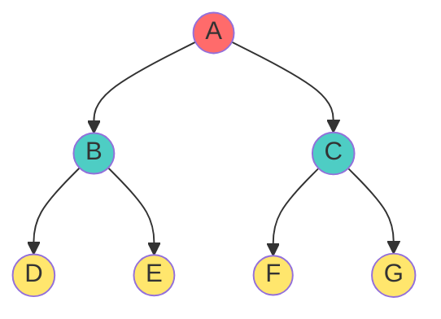
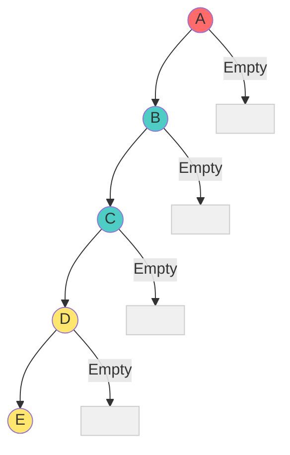
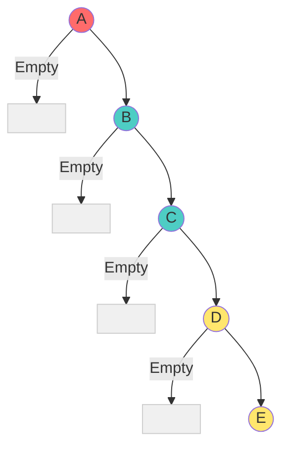
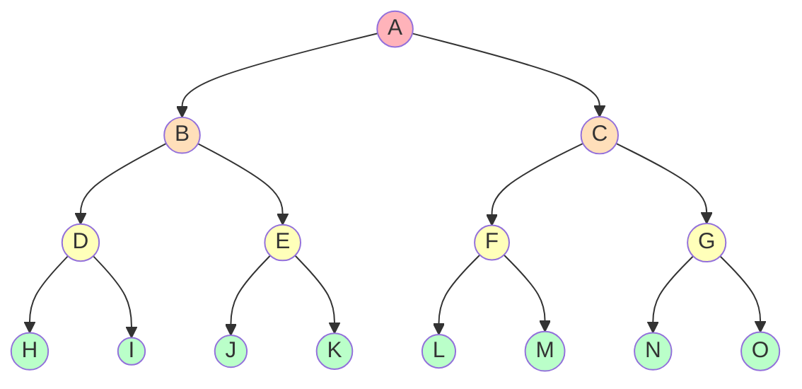
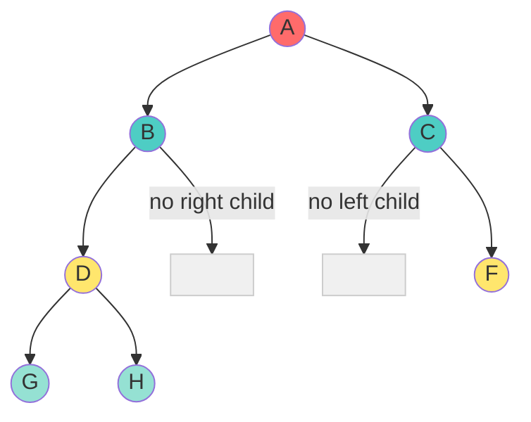
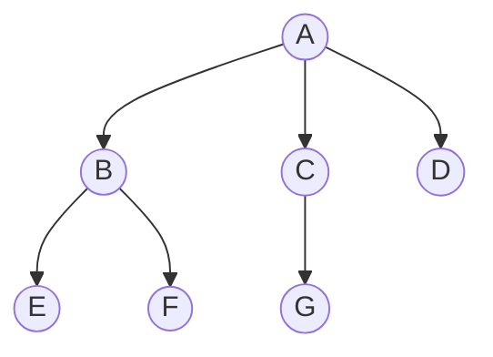
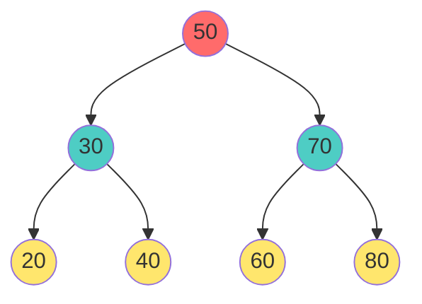
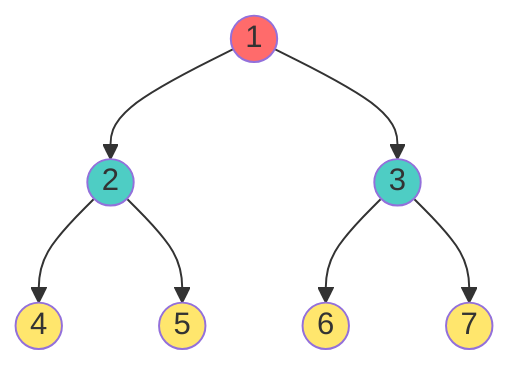
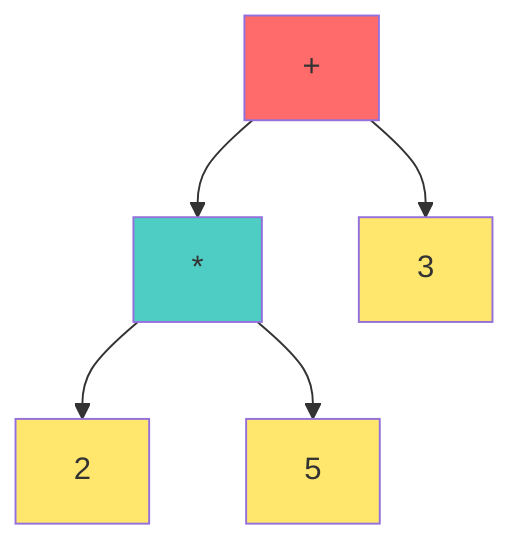

# 🚀 Binary Tree: Complete Beginner-to-Pro Guide

## What is a Binary Tree?

A **Binary Tree** is a special type of tree where **every node can have at most 2 children**. These two children are typically called the **left child** and **right child**.

> **Real-World Analogy**: Think of binary decisions in everyday life. At each choice point, you can go **LEFT** or **RIGHT**:
> - At a fork in the road: turn left or turn right
> - A coin flip: heads (left branch) or tails (right branch)
> - A yes/no decision tree: yes (left) or no (right)
> - DNA replication: each cell divides into at most 2 daughter cells

---

## 🏷️ The Core Rule

### Definition
$$\text{Binary Tree} \iff \forall \text{ node } n: \text{Degree}(n) \leq 2$$

### What This Means
In a Binary Tree:
- **Degree of Tree ≤ 2** (no node has more than 2 children)
- **Children per node**: {0, 1, or 2}
- **Child designation**: Left Child and Right Child (positional information!)

> **CRITICAL**: If any node has 3 or more children, it's a **General Tree**, NOT a binary tree!

---

## 📊 Why Binary Trees Matter

**Computational Advantage**:
```
Linear Search (array): O(n)
Binary Search Tree: O(log n)  ← Binary structure enables logarithmic search!
Sorted Array + Binary Search: O(log n)
```

By restricting to 2 children:
1. **Faster searching** (divide and conquer)
2. **Predictable memory layout** (array representation)
3. **Parallel processing** (left and right branches independently)
4. **Foundation for** AVL Trees, Red-Black Trees, Heaps, BSTs

---

## 📦 Part 1: Binary Tree Types & Examples

### Example 1: Standard Binary Tree (Balanced)



**Analysis**:
- Root A: Degree = 2 (left: B, right: C)
- Node B: Degree = 2 (left: D, right: E)
- Node C: Degree = 2 (left: F, right: G)
- Leaf nodes: {D, E, F, G}
- **Is this a Binary Tree?** ✅ **YES** (all nodes have ≤ 2 children)

**Properties**:
- Height = 2
- Total nodes = 7
- Leaf nodes = 4
- Internal nodes = 3

---

### Example 2: Binary Tree (Unbalanced Left)



**Analysis**:
- Each node has AT MOST 1 child (left only)
- This is a **Left-Skewed Binary Tree**
- Resembles a Linked List

**Is this a Binary Tree?** ✅ **YES**
- A-B: B is left child of A
- B-C: C is left child of B
- C-D: D is left child of C
- D-E: E is left child of D
- All degrees ≤ 2

---

### Example 3: Binary Tree (Right Skewed)



**Analysis**:
- Each node has AT MOST 1 child (right only)
- This is a **Right-Skewed Binary Tree**
- Also resembles a Linked List

**Is this a Binary Tree?** ✅ **YES**
- All degrees ≤ 2

**Worst Case Property**:
- Height = n-1 (linear height!)
- Binary search becomes Linear search O(n)
- This is why **Tree Balancing** (AVL, Red-Black) matters!

---

### Example 4: Perfect Binary Tree



**Perfect Binary Tree Properties**:
- ALL internal nodes have exactly 2 children
- ALL leaves at same level
- Height = $\log_2(n+1) - 1$
- Total nodes = $2^{h+1} - 1$

**Example Analysis** (height h=3):
- Level 0: 1 node (A)
- Level 1: 2 nodes (B, C)
- Level 2: 4 nodes (D, E, F, G)
- Level 3: 8 nodes (H, I, J, K, L, M, N, O)
- Total = 1 + 2 + 4 + 8 = 15 = $2^4 - 1$ ✓

**Is this a Binary Tree?** ✅ **YES**

---

### Example 5: Binary Tree (Mixed Degrees)



**Analysis**:
- A: degree 2 (left B, right C)
- B: degree 1 (only left child D)
- C: degree 1 (only right child F)
- D: degree 2 (left G, right H)
- **Mixed degrees allowed** ✅

**Is this a Binary Tree?** ✅ **YES**
- Some nodes have 2 children
- Some nodes have 1 child
- Some nodes have 0 children (leaves)
- All ≤ 2

---

### Example 6: NOT a Binary Tree! ❌



**Analysis**:
- Node A has 3 children: B, C, D
- Degree(A) = 3
- **Violates the "at most 2 children" rule**

**Is this a Binary Tree?** ❌ **NO**
- This is a **General n-ary Tree** with degree 3

---

## 🎓 Part 2: Properties of Binary Trees

### Property 1: Minimum and Maximum Nodes

**For a Binary Tree of Height h**:

**Minimum Nodes** (skewed):
$$\text{Min Nodes} = h + 1$$

**Maximum Nodes** (perfect):
$$\text{Max Nodes} = 2^{h+1} - 1$$

**Example**:
- Height h = 2
- Minimum nodes = 2 + 1 = 3 (skewed chain)
- Maximum nodes = $2^3 - 1$ = 7 (perfect tree)

---

### Property 2: Minimum Height for n Nodes

**Given n nodes**, the minimum height is:
$$h_{\min} = \lceil \log_2(n+1) \rceil - 1$$

**Example**:
- n = 15 nodes
- $h_{\min} = \lceil \log_2(16) \rceil - 1 = 4 - 1 = 3$
- (This is a perfect binary tree of height 3)

---

### Property 3: Leaf Count Relationship

For a **complete binary tree**:
- If internal nodes = i
- Then leaf nodes = i + 1

**Proof**: In a binary tree:
- Every internal node has at least 1 child
- The sum of all edges = sum of children = n - 1
- Each edge connects to exactly 1 "child slot"
- In a complete binary tree, leaves = internals + 1

---

## 📋 Part 3: Identifying Binary Trees

### Decision Tree for Classification

```
Does every node have ≤ 2 children?
│
├─→ YES: This might be a Binary Tree
│   │
│   └─→ Are children designated as LEFT/RIGHT?
│       │
│       ├─→ YES: It's a Binary Tree ✅
│       └─→ NO: It's an unordered tree with max 2 edges
│
└─→ NO: This is a General Tree (not binary) ❌
```

---

## 🎯 Part 4: Common Binary Tree Variants

### Variant 1: Binary Search Tree (BST)



**BST Property**:
- Left child < parent
- Right child > parent
- Enables O(log n) search

**Is this a Binary Tree?** ✅ YES (plus ordering property)

---

### Variant 2: Heap (Complete Binary Tree)



**Heap Property**:
- Parent ≤ all children (Min Heap)
- OR Parent ≥ all children (Max Heap)
- Complete structure (filled left to right)

**Is this a Binary Tree?** ✅ YES (plus completeness and heap ordering)

---

### Variant 3: Expression Tree



**Expression**: $(2 \times 5) + 3$

**Is this a Binary Tree?** ✅ YES (operators as internal, operands as leaves)

---

## 📊 Comparison Table: Binary vs General Trees

| Aspect | Binary Tree | General Tree |
|:---|:---|:---|
| **Max Children** | 2 | Unlimited |
| **Positional Info** | Left/Right distinguished | No position |
| **Degree of Tree** | ≤ 2 | Unbounded |
| **Search Speed (BST)** | O(log n) average | O(n) |
| **Array Representation** | Compact (formula-based) | Sparse |
| **Common Use** | Search trees, Heaps | File systems, organics |

---

## 💡 Part 5: Why Binary Trees?

### Advantage 1: **Logarithmic Search**
With n nodes, BST depth ~log₂(n), enabling fast searches

### Advantage 2: **Memory Efficiency**
Positional information (left/right) allows array representation without pointers for all edges

### Advantage 3: **Divide & Conquer**
Each decision splits problem into 2 independent subproblems

### Advantage 4: **Natural Representation**
- Decision trees (yes/no)
- Expression evaluation
- Huffman coding
- Game trees (chess, checkers)

---

## 🔍 Part 6: Key Formulas Quick Reference

| Formula | Applies To |
|:---|:---|
| $\text{Min Nodes} = h + 1$ | Skewed tree of height h |
| $\text{Max Nodes} = 2^{h+1} - 1$ | Perfect tree of height h |
| $h_{\min} = \lceil \log_2(n+1) \rceil - 1$ | n nodes minimum height |
| $h_{\max} = n - 1$ | n nodes maximum height |
| $\text{Nodes at Level } k = 2^k$ | Perfect tree, level k |
| $\text{Total Nodes (perfect, height h)} = 2^{h+1} - 1$ | All levels full |

---

## 🎓 Practice Exercises

**Exercise 1: Tree Classification**
For each tree, determine if it's a binary tree:
1. A tree where each node has exactly 0 or 2 children
2. A tree where node degrees = {0, 1, 2, 3}
3. A tree with 3 nodes, one node has 2 left children

**Exercise 2: Property Calculation**
For a binary tree with height h = 4:
- Maximum possible nodes?
- Minimum possible nodes?
- If perfectly balanced with 31 nodes, what's its height?

**Exercise 3: Balance Analysis**
Draw two binary trees with same 7 nodes:
- One balanced (height ~ 3)
- One skewed (height ~ 7)
- Explain why balance matters for search

**Exercise 4: Variant Identification**
Is a Heap a Binary Tree? Yes or No, and explain why.

---

## 🔗 Next Steps

Now that you understand binary trees, explore:
1. **Binary Search Trees** - adding ordering
2. **AVL Trees** - maintaining balance
3. **Heaps** - priority queue implementation
4. **Tree Traversals** - visiting all nodes
5. **Tree Rotations** - rebalancing techniques


