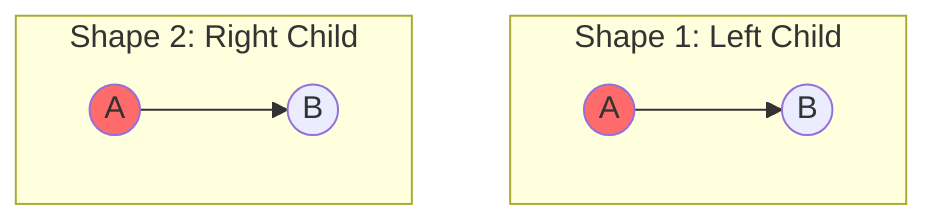
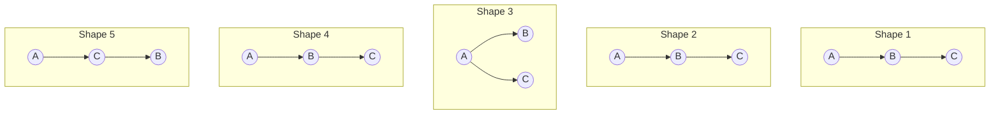
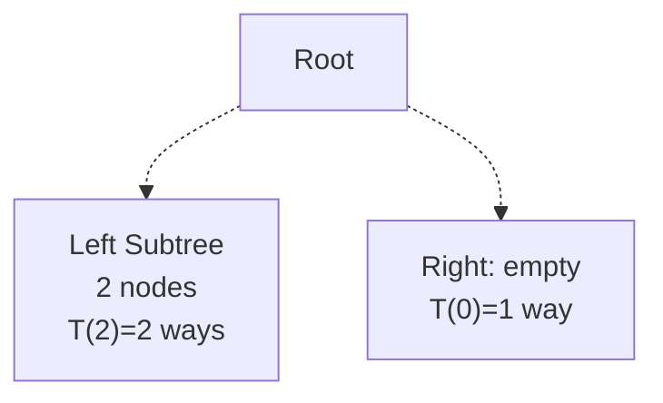
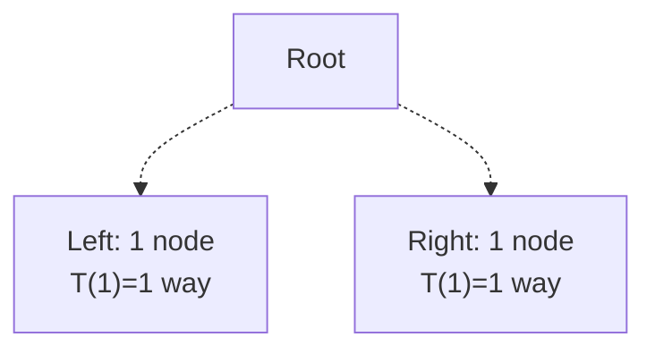
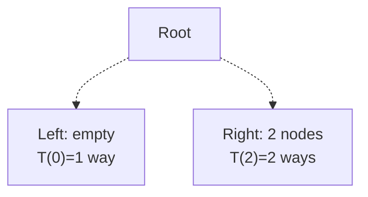
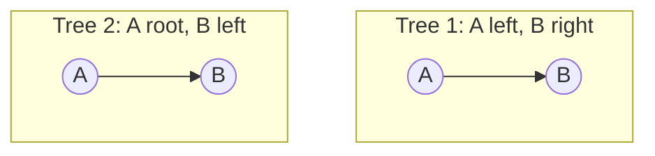

# 🔢 How Many Binary Trees? Complete Guide to Catalan Numbers

## Introduction: The Combinatorial Challenge

When you have **n distinct nodes**, a fundamental question arises: **How many structurally different binary trees can we build?**

The answer depends critically on whether nodes are:
1. **Unlabeled** (just considering structure/shape)
2. **Labeled** (considering which specific node goes where)

> **Real-World Analogy**: Imagine building organizational charts with n employees:
> - **Unlabeled trees** = "How many different hierarchy structures exist?"
> - **Labeled trees** = "How many ways can we assign n specific people to those structures?"

---

## 🧠 Part 1: Intuitive Understanding (Before Math!)

### Why This Problem Matters

Understanding tree counts is crucial for:
1. **Database indexing** — How many BST shapes possible?
2. **Compiler design** — Expression parsing (expression trees)
3. **Combinatorics** — Understanding growth rates
4. **Algorithm analysis** — Worst-case scenarios

### The Simple Cases

**n = 1 node**: 1 tree shape

Only one possibility! ✓

**n = 2 nodes**: 2 tree shapes


**Why 2 and not more?** Because position matters! Left child ≠ Right child in a binary tree.

**n = 3 nodes**: 5 tree shapes



---

## 📐 Part 2: The "Fix Root, Split Rest" Logic

### The Key Insight

To count trees with n nodes:

1. **Fix 1 node as root** (we have to pick one)
2. **Distribute remaining (n-1) nodes** between left and right subtrees
3. **Count recursively** for each distribution
4. **Multiply and sum** all possibilities

### Example: Building T(3) Step-by-Step

**Starting with 3 nodes, pick one as root:**

```
3 total nodes = 1 root + 2 remaining nodes

Question: How many ways to split 2 nodes into left & right subtrees?
```

**Option 1**: All 2 nodes go LEFT, 0 go RIGHT

Ways = T(2) × T(0) = 2 × 1 = **2 trees**

**Option 2**: 1 node LEFT, 1 node RIGHT

Ways = T(1) × T(1) = 1 × 1 = **1 tree**

**Option 3**: 0 nodes LEFT, 2 nodes RIGHT

Ways = T(0) × T(2) = 1 × 2 = **2 trees**

**Total for n=3**: 2 + 1 + 2 = **5 trees** ✓

---

## 🎨 Part 3: Unlabeled Nodes (Shapes Only) - Catalan Numbers

### The Recursive Formula

$$T(n) = \begin{cases}
1 & \text{if } n = 0 \\
\sum_{i=0}^{n-1} T(i) \times T(n-1-i) & \text{if } n > 0
\end{cases}$$

**Intuition**: 
- Left subtree uses i nodes: T(i) ways
- Right subtree uses (n-1-i) nodes: T(n-1-i) ways
- Multiply for total combinations
- Sum over all possible splits

### The Closed-Form Formula (Catalan Numbers)

$$T(n) = C_n = \frac{1}{n+1} \binom{2n}{n} = \frac{(2n)!}{(n+1)! \cdot n!}$$

This is the **n-th Catalan Number**!

### Quick Reference Table - Catalan Numbers

| n | T(n) | Calculation |
|:---|:---|:---|
| **0** | **1** | Base case (empty tree) |
| **1** | **1** | Only root |
| **2** | **2** | 2 positions for child |
| **3** | **5** | 2 + 1 + 2 |
| **4** | **14** | $\frac{8!}{5! \cdot 4!}$ |
| **5** | **42** | $\frac{10!}{6! \cdot 5!}$ |
| **6** | **132** | Growing exponentially! |
| **7** | **429** | Already 429 shapes! |
| **10** | **16,796** | Explosion! |

---

## 📊 Detailed Derivations

### Derivation of T(4) - Full Breakdown

**n=4**: Fix root, distribute 3 remaining nodes:

| Case | Left Nodes | Right Nodes | Left Ways | Right Ways | Product |
|:---|:---|:---|:---|:---|:---|
| 1 | 0 | 3 | T(0) = 1 | T(3) = 5 | **5** |
| 2 | 1 | 2 | T(1) = 1 | T(2) = 2 | **2** |
| 3 | 2 | 1 | T(2) = 2 | T(1) = 1 | **2** |
| 4 | 3 | 0 | T(3) = 5 | T(0) = 1 | **5** |
| **TOTAL** | | | | | **14** ✓ |

**Verification using formula**:
$$T(4) = \frac{1}{5} \binom{8}{4} = \frac{1}{5} \times 70 = 14$$ ✓

### Derivation of T(5) - Hand Calculation

**Using Catalan formula**:

$$T(5) = \frac{1}{6} \binom{10}{5}$$

**Step 1**: Calculate $\binom{10}{5}$

$$\binom{10}{5} = \frac{10!}{5! \cdot 5!} = \frac{10 \times 9 \times 8 \times 7 \times 6}{5 \times 4 \times 3 \times 2 \times 1}$$

$$= \frac{30,240}{120} = 252$$

**Step 2**: Divide by (n+1)

$$T(5) = \frac{252}{6} = \mathbf{42}$$ ✓

---

## 🏷️ Part 4: Labeled Nodes - Permutations

### The Challenge

When nodes are **labeled** (A, B, C, D, ...), we ask: **"In how many ways can we assign n labeled nodes to trees?"**

### The Formula

$$\text{Labeled Trees} = T(n) \times n!$$

**Where**:
- $T(n)$ = number of shape structures (Catalan)
- $n!$ = ways to fill those shapes with distinct labels

### Intuition via "Architecture vs. People"

Think of building an apartment complex:
- **Catalan shapes** = different floor plans (architectures)
- **n! permutations** = different ways to assign n families to those apartments

```
Example with n=3:
- 5 different floor plans (shapes)
- 6 ways to assign families (A,B,C), (A,C,B), (B,A,C), etc.
- Total: 5 × 6 = 30 different buildings
```

### Examples with Labeled Nodes

**n = 2 labeled nodes (A, B)**:



**Count**: T(2) = 2 shapes, 2! = 2 permutations
**Total** = 2 × 2 = **4 labeled trees**

**n = 3 labeled nodes (A, B, C)**:

With 5 shapes and 3! = 6 permutations each:
**Total** = 5 × 6 = **30 labeled binary trees**

### Verification Formula for Labeled Trees

$$\text{Labeled Trees}(n) = \frac{(2n)!}{(n+1)!}$$

**Example for n=3**:
$$\frac{6!}{4!} = \frac{720}{24} = 30$$ ✓

---

## 🔬 Part 5: The Catalan Number Family

### Why "Catalan"?

Named after mathematics Eugène Charles Catalan (1814-1894), though discovered earlier by other mathematicians. Catalan numbers appear in **many** combinatorial problems!

### Appearances of Catalan Numbers

Catalan numbers count:

1. **Binary tree shapes** ← Our main topic
2. **Valid parentheses sequences** — How many ways to write n pairs of valid parentheses?
3. **Balanced bracket strings** — How many ways to arrange n pairs of [ and ]?
4. **Triangulations of polygons** — Ways to divide (n+2)-gon into triangles
5. **Dyck paths** — Lattice paths that don't cross diagonal
6. **Monotonic paths** — Paths in grid not going above diagonal

### Example: Valid Parentheses vs. Binary Trees

For n=3 pairs of parentheses, there are exactly **5** valid sequences:
1. `((()))`
2. `(()())`
3. `(())()`
4. `()(())`
5. `()()()`

Same count as 3-node binary tree shapes! Not coincidence—deep mathematical connection. ✓

---

## 📈 Part 6: Growth Rate & Complexity

### How Fast Do Catalan Numbers Grow?

```
n    | T(n)    | Growth
-----|---------|----------
1    | 1       | 
2    | 2       | ×2
3    | 5       | ×2.5
4    | 14      | ×2.8
5    | 42      | ×3
10   | 16,796  | Exponential!
15   | ~9 billion | Massive!
20   | ~6 trillion | Astronomical!
```

### Asymptotic Formula

$$C_n \approx \frac{4^n}{n^{3/2} \sqrt{\pi}}$$

This shows **exponential growth**: roughly $\sim 4^n / n^{3/2}$

**Implication**: The number of binary tree shapes grows exponentially with n!

---

## 🎯 Part 7: Practical Impact

### Problem 1: BST Uniqueness

If you have 5 distinct values to insert into a BST in random order, how many unique final trees possible?

**Answer**: Not all T(5)=42 shapes! Only those satisfying BST property. Typically fewer (depends on values).

### Problem 2: Expression Evaluation

For 4 operands and 3 binary operators, how many ways to parenthesize?

**Answer**: T(4) = 14 ways! (One for each tree shape)

### Problem 3: Tournament Brackets

How many ways to organize an elimination tournament with n teams?

**Answer**: T(n) **for binary tournament structure!**

---

## 🧮 Part 8: Computing Catalan Numbers

### Method 1: Recursive (Simple but Slow)

```
T(0) = 1
T(n) = sum of T(i) × T(n-1-i) for i = 0 to n-1
```

**Time**: O(2^n) — exponential!

### Method 2: Iterative with DP (Fast)

```
dp[0] = 1
for n from 1 to target:
    dp[n] = 0
    for i from 0 to n-1:
        dp[n] += dp[i] × dp[n-1-i]
```

**Time**: O(n²) — polynomial!

### Method 3: Using Formula (Fastest for single value)

$$C_n = \frac{(2n)!}{(n+1)! \times n!}$$

Use precomputed factorials or optimize binomial coefficient.

---

## 📋 Quick Reference: Formulas

| Scenario | Formula |
|:---|:---|
| **Unlabeled shapes (n nodes)** | $C_n = \frac{1}{n+1}\binom{2n}{n}$ |
| **Labeled trees (n nodes)** | $C_n \times n! = \frac{(2n)!}{(n+1)!}$ |
| **Recursive definition** | $T(n) = \sum_{i=0}^{n-1} T(i) \times T(n-1-i)$ |
| **Asymptotic growth** | $C_n \approx \frac{4^n}{n\sqrt{\pi n}}$ |

---

## 🎓 Practice Exercises

**Exercise 1: Manual Calculation**
Calculate T(6) using:
- (a) Recursive summation method
- (b) Catalan formula
- Verify both give same answer

**Exercise 2: Combinatorial Understanding**
- How many valid parenthesizations for 4 pairs?
- Draw 3 different valid arrangements
- Compare with T(4)

**Exercise 3: Real-World Application**
For 5 employees and a management hierarchy:
- How many distinct org charts possible?
- Assume binary supervision (each manager supervises at most 2 people)

**Exercise 4: Growth Analysis**
- At what value of n does T(n) exceed 1 million?
- What is T(15)?
- Why does banker's care about this growth?

**Exercise 5: Labeled vs Unlabeled**
- For n=4 nodes with labels {1,2,3,4}
- How many distinct labeled trees?
- Show the calculation step-by-step

---

## 🔗 Next Topics

Now that you understand tree counts:
1. **Tree Traversals** — Visit all these different structures
2. **AVL Trees** — Maintain balance among all possible shapes
3. **B-Trees** — Generalize to more children
4. **Heap Sort** — Leverage complete tree structure
5. **Binary Search Trees** — Leverage ordering + structure


---

## 📊 Formula Cheat Sheet (Pro Summary)

| Case | Formula | Description |
| :--- | :--- | :--- |
| **Unlabeled (Shapes)** | $T(n) = \frac{^{2n}C_n}{n+1}$ | Use **Catalan Number**. Only the shape matters. |
| **Labeled (Filling)** | $T(n) \times n! = \frac{(2n)!}{(n+1)!}$ | Multiplies Shapes by $n!$ for distinct nodes. |
| **Recursive Approach** | $\sum_{i=1}^{n} T(i-1)T(n-i)$ | Build results using subtrees (Root Splitting). |
| **Maximum Height** | $2^{n-1}$ | Specifically for **Skewed Trees** (1 node per level). |

---

## 💡 Final Summary
- **Unlabeled (Shapes)**: Use **Catalan Number** $T(n)$.
- **Labeled (Filling)**: Use **$T(n) \times n!$**.
- **Max Height**: Use **$2^{n-1}$**.
