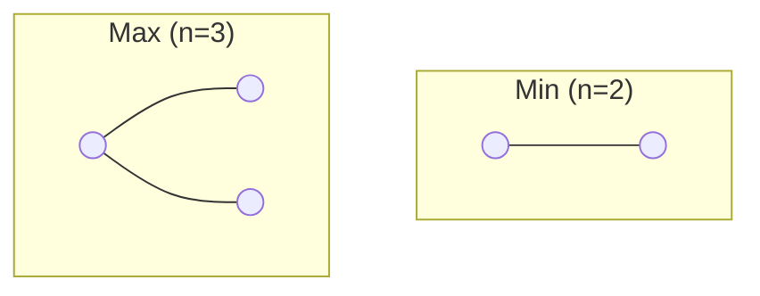
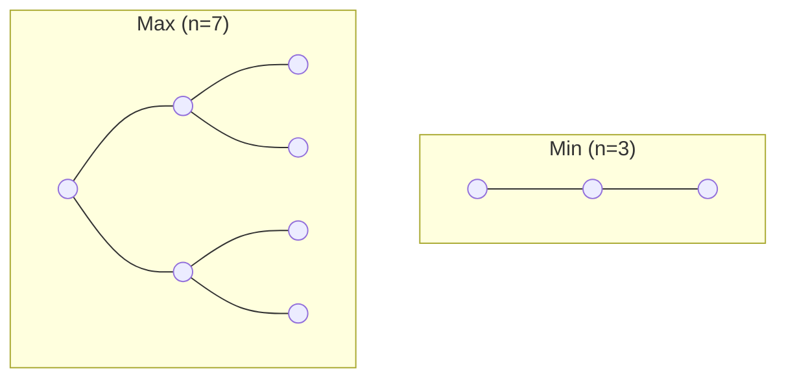
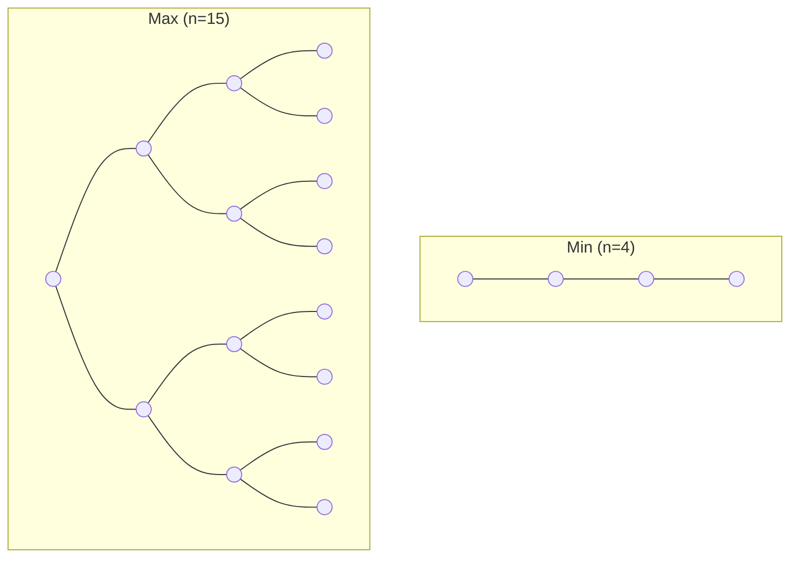
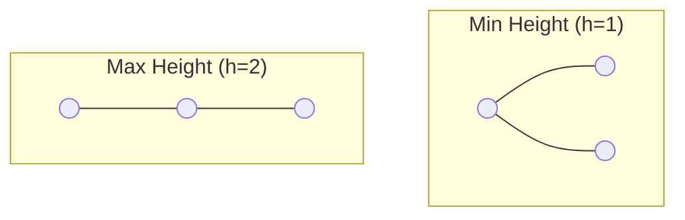
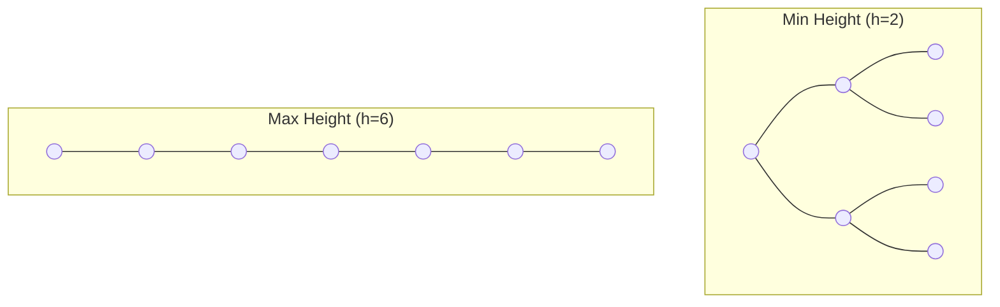
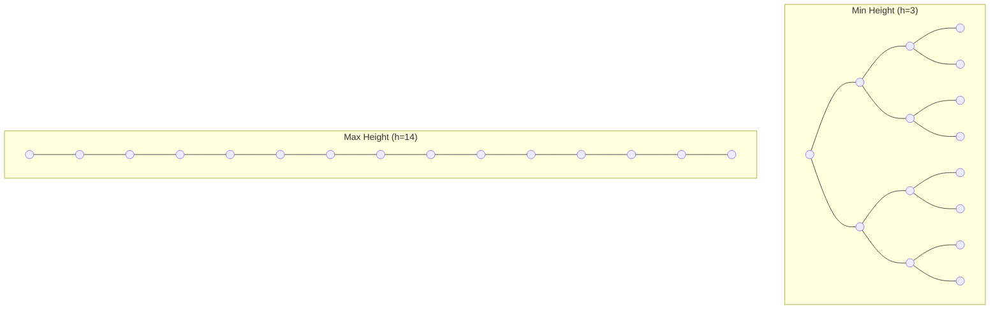

# 📏 Binary Tree: Height vs. Nodes - Complete Guide

Understanding the relationship between the **Height (h)** of a tree and the **Number of Nodes (n)** is crucial for analyzing algorithm performance, designing efficient data structures, and solving optimization problems. This relationship is the foundation of software performance optimization.

> **Real-World Analogy**: Think of a tree as an organizational chart:
> - **Height** = How many levels of hierarchy exist (CEO → Manager → Employee → Subordinate...)
> - **Nodes** = Total number of people in the organization
> - **Broader tree** (more people at each level) = Few levels needed for same # of people
> - **Narrow tree** (few people per level) = Many levels needed for same # of people
> - For 1000 employees: 10-level chain (skewed) vs. 5-level pyramid (balanced) - massive difference!

---

## 🏗️ Critical Insight: The Height-Nodes Trade-off

In a **Binary Tree**, there's a fundamental constraint:
- Minimum height for n nodes: **~log₂(n)** (balanced tree) → Fast algorithms
- Maximum height for n nodes: **n-1** (skewed tree) → Slow algorithms
- **Same number of nodes, 100x difference in height!** This is why tree balancing matters!

---

## � Part 1: When Height is Given

If we know the height **h**, what are the possible ranges for nodes **n**?
If we know the height, what are the minimum and maximum nodes possible?

### 1. Minimum Nodes ($n_{min}$)
To have the absolute minimum nodes, the tree should be as "thin" as possible. This happens in a **Skewed Tree**.
- **Formula:** $n = h + 1$
- **Example ($h=2$):** Nodes = $2+1 = 3$.

### 2. Maximum Nodes ($n_{max}$)
To have the maximum nodes, every level must be completely full. This is a **Full/Perfect Binary Tree**.
- **Formula:** $n = 2^{h+1} - 1$
- **Example ($h=2$):** Nodes = $2^{2+1} - 1 = 8 - 1 = 7$.

#### 🎓 Derivation (using G.P. Series)
The total nodes are the sum of nodes at each level:
- Level 0: $2^0 = 1$
- Level 1: $2^1 = 2$
- ...
- Level h: $2^h$

Total $n = 1 + 2 + 2^2 + 2^3 + \dots + 2^h$.
This is a **Geometric Progression (G.P.)** where $a=1, r=2$.
$$S = \frac{a(r^{h+1}-1)}{r-1} = \frac{1(2^{h+1}-1)}{2-1} = 2^{h+1} - 1$$

---

## 📸 Visual Comparison ($h=1$ to $h=3$)
Here is how the trees look at their absolute minimum (Skewed) and absolute maximum (Full).

### 🏷️ Case: Height h = 1
- **Min Nodes ($h+1$):** 2
- **Max Nodes ($2^{h+1}-1$):** 3


### 🏷️ Case: Height h = 2
- **Min Nodes:** 3
- **Max Nodes:** 7


### 🏷️ Case: Height h = 3
- **Min Nodes:** 4
- **Max Nodes:** 15


---

## 🎯 Part 2: When Nodes are Given

If we know the number of nodes **n**, what are the possible heights **h**?
If we know how many nodes we have, what are the possible heights?

### 1. Maximum Height ($h_{max}$)
Just like min nodes, max height happens when the tree is as "thin" as possible (**Skewed**).
- **Formula:** $h = n - 1$
- **Example ($n=15$):** $h = 14$ (Linear growth).

### 2. Minimum Height ($h_{min}$)
Minimum height happens when the tree is packed densly (**Full/Complete**).
- **Formula:** $h = \log_{2}(n+1) - 1$
- **Example ($n=15$):** $h = \log_{2}(16) - 1 = 4 - 1 = 3$.

#### 🎓 Derivation (using Logarithms)
We start with the Max Nodes formula:
1. $n = 2^{h+1} - 1$
2. $n + 1 = 2^{h+1}$
3. Take $\log_2$ on both sides: $\log_2(n+1) = h+1$
4. $h = \log_2(n+1) - 1$

---

## 📸 Visual Comparison (Nodes Fixed)
What happens to the **Height** when we keep the number of nodes fixed?

### 🏷️ Case: n = 3 Nodes
- **Min Height ($\log_2(n+1)-1$):** 1 (Perfect)
- **Max Height ($n-1$):** 2 (Skewed)


### 🏷️ Case: n = 7 Nodes
- **Min Height:** 2 (Perfect)
- **Max Height:** 6 (Skewed)


### 🏷️ Case: n = 15 Nodes
- **Min Height:** 3 (Perfect)
- **Max Height:** 14 (Skewed)


---

## 📊 Summary Cards (n nodes)

### Card 1: Range of Nodes
For a given height **h**:
$$h+1 \le n \le 2^{h+1}-1$$

### Card 2: Range of Height
For a given node count **n**:
$$\log_2(n+1)-1 \le h \le n-1$$

---

## 💡 Pro Tip: Performance
- **Skewed Trees** are slow because height is **O(n)**.
- **Balanced Trees** are fast because height is **O(log n)**.
This is why we always try to keep trees balanced!

---

## 🔬 Part 3: Advanced Analysis

### Real-World Impact on Search Operations

**Binary Search Tree Search**:
- Each comparison eliminates ~half remaining nodes
- In balanced tree: **h ≈ log₂(n)** → Search is **O(log n)** ✅ FAST
- In skewed tree: **h = n-1** → Search becomes **O(n)** ⚠️ SLOW

**Concrete Example with n = 1,000,000 nodes**:

| Tree Type | Height | Search Steps | Time (at 1M ops/sec) |
|:----|:----|:----|:----|
| **Perfectly Balanced** | ≈20 | 20 comparisons | 0.02 ms ✅ |
| **Slightly Skewed** | ≈30 | 30 comparisons | 0.03 ms ✅ |
| **Completely Skewed** | 999,999 | 999,999 comparisons | 1 second ⚠️ |

**Performance Gap: 50,000x slower!**

### The Relationship With Complete Trees

A **Complete Binary Tree** maintains optimal balance:
- Nodes are filled level by level, left to right
- For n nodes: **height = ⌊log₂(n)⌋**
- Example: 1000 nodes → height = 9 (optimal!)

### Logarithmic vs Linear Growth

**Given n = 2^k nodes:**
- Balanced tree height: **k** (very small!)
- Skewed tree height: **2^k - 1** (exponentially large!)

Examples:
- n = 1,048,576 (2^20): Balanced height = 20, Skewed height = 1,048,575
- Ratio: **52,428:1** (balanced is 52,000x more compact)

---

## 🎨 Part 4: Special Tree Cases

### Case 1: Full Binary Tree
Every internal node has exactly 2 children.

For a full binary tree of height h:
- **Exact nodes**: $n = 2^{h+1} - 1$ (always perfect)
- **Leaves**: $2^h$
- **Internal nodes**: $2^h - 1$

**Formula Check:**
- Internal nodes: $n_1 = 0$ (no nodes with 1 child)
- External nodes: $n_0 = 2^h$
- Internal nodes: $n_2 = 2^h - 1$
- Total: $n = 2^{h+1} - 1$ ✅

**Example (h = 3)**:
- Total nodes: 2^4 - 1 = 15
- Leaves: 8
- Internal: 7

### Case 2: Skewed Binary Tree (Linked List)
Each node has at most 1 child (either left or right).

- **Height vs Nodes**: $h = n - 1$ (linear relationship!)
- All nodes except one are internal (degree 1)
- Only 1 leaf node

**Example (n = 5)**:
```
     1
     |
     2
     |
     3
     |
     4
     |
     5 (leaf)
```
Height = 4, formula check: 5 - 1 = 4 ✅

### Case 3: Balanced Binary Tree (AVL/Red-Black)
Maintains the property that height difference ≤ 1 at every node.

- **Height**: O(log n)
- **Operations**: Insert, Delete, Search all O(log n)
- **Balancing overhead**: Small cost for height guarantee

**Comparison with n = 1,000,000:**
- Balanced: h ≈ 20, Search: 20 comparisons
- Skewed: h = 999,999, Search: 999,999 comparisons
- **Speedup: 50,000x**

---

## 📐 Part 5: Mathematical Proofs

### Proof 1: Why Max Nodes = 2^(h+1) - 1?

**Theorem**: A binary tree of height h has at most $2^{h+1} - 1$ nodes.

**Proof by Induction**:

**Base case (h = 0)**:
- Tree has only root node
- Max nodes = $2^1 - 1 = 1$ ✅

**Inductive step**: Assume true for height k. Prove for height k+1.
- Tree of height k+1 has root + two subtrees of height ≤ k
- Max nodes in each subtree = $2^{k+1} - 1$ (by induction hypothesis)
- Total = 1 + 2(2^{k+1} - 1) = 1 + 2^{k+2} - 2 = 2^{k+2} - 1 ✅

### Proof 2: Why Min Height = log₂(n+1) - 1?

**Theorem**: A binary tree with n nodes has minimum height $\lceil \log_2(n+1) \rceil - 1$.

**Proof**:
- Maximum nodes with height h: $2^{h+1} - 1$
- For n nodes to fit: $n \le 2^{h+1} - 1$
- Therefore: $n + 1 \le 2^{h+1}$
- Taking $\log_2$: $\log_2(n+1) \le h + 1$
- Thus: $h \ge \log_2(n+1) - 1$ ✅

### Proof 3: Different Path Lengths

**Theorem**: In any tree, sum of all edge counts from root to leaves equals sum of degrees of all non-leaf nodes.

**Proof**:
- Each edge contributes 1 to exactly one node's degree
- Total edges = n - 1
- Sum of degrees of all internal nodes = n - 1 (one per edge below)
- This equals total path length from root ✅

---

## 📊 Detailed Comparison Table

| Metric | Skewed | Balanced | Complete | Perfect |
|:---|:---|:---|:---|:---|
| **Height (n=100)** | 99 | 6-7 | 6-7 | 7 |
| **Height Formula** | h = n-1 | h ≈ log₂(n) | h = ⌊log₂(n)⌋ | h = log₂(n) |
| **Search** | O(n) | O(log n) | O(log n) | O(log n) |
| **Insert** | O(n) | O(log n) | O(n) | O(n) |
| **Space Optimal** | No | Yes | Yes | No |
| **Exists in Nature** | Rare | Common | Common | Rare |
| **Auto-Balancing Needed** | Yes | Yes | Manual | Manual |

---

## 🎓 Part 6: Visualization - The Exponential Advantage

**How tree height changes as nodes increase:**

```
Height vs #Nodes (for different tree types):

           1000
            |
            |     Skewed (h=n)
            |    /
            |   /
            |  /
       100  | /
            |/_____ Complete (h≈log n)
            |  /
           10 |/
            | |
            1 |_____
              1   10   100   1000  10000  100000
                      Nodes
```

**Key observation**: Complete tree height grows **logarithmically**, not linearly!

---

## 🔧 Practical Application: Database B-Trees

B-Trees maintain height O(log n) for millions of nodes:

**Example: Database with 1 billion records**
- Single linked list: height = 1,000,000,000 (impractical)
- B-Tree (degree 100): height ≈ 10 (practical!)

**Formula for B-Tree**:
- Min degree d = 100
- Height for n nodes: $h \le \log_d(\frac{n+1}{2}) + 1$
- For 1 billion records: height ≈ 6-7 ✅

---

## 💪 Part 7: Practice Exercises

**Exercise 1: Height to Nodes**
A binary tree has height 5. What are the minimum and maximum possible nodes?
- Min: $5 + 1 = 6$
- Max: $2^6 - 1 = 63$
- Answer: Between 6 and 63 nodes

**Exercise 2: Nodes to Height**
A binary tree has 100 nodes. Find the range of possible heights.
- Min: $\lceil \log_2(101) \rceil - 1 = 7 - 1 = 6$
- Max: $100 - 1 = 99$
- Answer: Between 6 and 99

**Exercise 3: Complete Tree Analysis**
A complete binary tree has 50 nodes. What is its height?
- Height = $\lfloor \log_2(50) \rfloor = 5$
- Levels filled: 0 through 5 (level 5 partially filled)
- Answer: 5

**Exercise 4: Performance Impact**
If we have a BST with 1000 nodes:
- Balanced: search takes ≈ 10 comparisons
- Skewed: search takes ≈ 1000 comparisons
- How many times slower is the skewed version?
- Answer: 100x slower

**Exercise 5: Tree Construction**
Given n = 15 nodes, construct:
- A perfect binary tree (height 3)
- A skewed binary tree (height 14)
- A balanced tree (height 3-4)

**Exercise 6: Real-World Analysis**
A file system creates a directory tree with 1 million directories.
- If perfectly balanced: max path length = ?
- If skewed: max path length = ?
- Performance difference = ?

Answers:
- Balanced: ≈ 20 levels
- Skewed: 999,999 levels
- Difference: 50,000x

---

## 🎯 Key Takeaways

1. **Height critically affects performance** - difference of 100x or more
2. **Balance is essential** - log n vs linear becomes critical at scale
3. **Complete trees are optimal** for most applications
4. **Formulas are predictable** - we can calculate bounds exactly
5. **Real systems use balancing** - AVL trees, Red-Black trees, B-Trees all maintain O(log n) height
