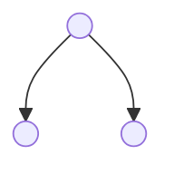
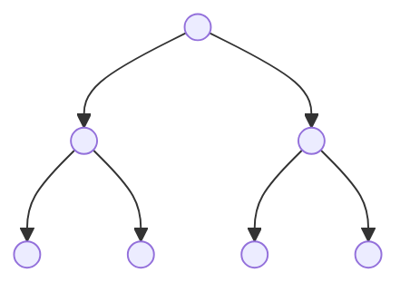
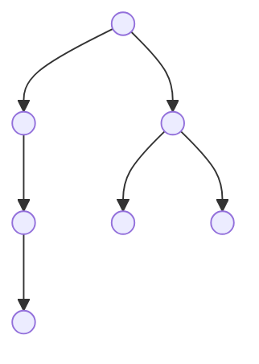
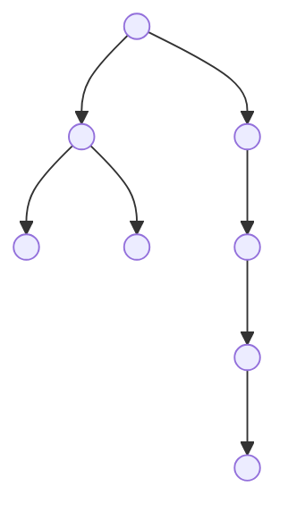

# 🌳 Internal and External Nodes: The Fundamental Degree Relationship

In tree theory, understanding the relationship between nodes of different degrees is crucial for analyzing tree properties, solving counting problems, and proving tree theorems. This fundamental relationship is one of the most elegant mathematical properties in computer science.

> **Real-World Analogy**: Think of a company organizational chart:
> - **External nodes (Leaves)** = Individual contributors (no people report to them)
> - **Internal nodes** = Managers/leaders (people report to them)
> - **Nodes with 2 children** = Managers with exactly 2 direct reports
> - The surprising truth: Number of individual contributors = Number of managers with exactly 2 reports + 1
> - This holds regardless of managers with 1 report!

---

## 🎯 The Golden Relationship: n₀ = n₂ + 1

### What Does This Mean?

In **any binary tree**:
- **n₀** (leaf nodes) = nodes with 0 children  = **external nodes**
- **n₁** (nodes with 1 child) 
- **n₂** (nodes with 2 children)

**The Fundamental Relationship:**
$$n_0 = n_2 + 1$$

**In words**: The number of leaf nodes is **always exactly 1 more** than the number of nodes with two children!

**The Surprising Part**: The value of n₁ doesn't matter! You can have 0, 100, or 1000 nodes with 1 child - the relationship between n₀ and n₂ stays the same!

---

## 📐 Part 1: Formal Proof

### Algebraic Proof

**Theorem**: In any binary tree, $n_0 = n_2 + 1$ where:
- n = total nodes = n₀ + n₁ + n₂
- Each edge connects exactly 2 nodes
- Total edges = n - 1

**Proof**:
Let's count the total number of children:
- n₀ nodes have 0 children each → 0 children from these
- n₁ nodes have 1 child each → n₁ children from these
- n₂ nodes have 2 children each → 2n₂ children from these

Total children = 0 + n₁ + 2n₂ = n₁ + 2n₂

But total children = total nodes - 1 (all nodes except root are children)
$$n - 1 = n_1 + 2n_2$$

Also, n = n₀ + n₁ + n₂, so:
$$n_0 + n_1 + n_2 - 1 = n_1 + 2n_2$$
$$n_0 + n_1 + n_2 - 1 = n_1 + 2n_2$$
$$n_0 + n_2 - 1 = 2n_2$$
$$n_0 = n_2 + 1$$ ✅ **QED**

### Intuitive Proof (Visual)

**Every node with 2 children produces an "extra" leaf**:
- Start with just a root (1 node): n₀ = 1 leaf, n₂ = 0 (formula: 1 = 0 + 1 ✅)
- Add 1 node with 2 children: n₀ increases by 1 (becomes 2 leaves), n₂ becomes 1 (formula: 2 = 1 + 1 ✅)
- Add another node with 2 children: n₀ increases by 1, n₂ becomes 2 (formula: 3 = 2 + 1 ✅)
- Pattern holds!

---

## 🌲 Part 2: Comprehensive Examples

### Example 1: Minimal Tree (Just Root)

- n₀ (leaves) = 1
- n₁ = 0
- n₂ = 0
- Total n = 1
- **Check**: 1 = 0 + 1 ✅
- **Formula ratio**: n₀/n₂ = undefined (n₂ = 0)

### Example 2: Simple Root with 2 Children

- n₀ (leaves) = 2
- n₁ = 0
- n₂ = 1 (node A)
- Total n = 3
- **Check**: 2 = 1 + 1 ✅

### Example 3: Mixed Degree Tree

- n₀ (leaves) = 4 (D, E, F, G)
- n₁ = 0
- n₂ = 3 (A, B, C)
- Total n = 7
- **Check**: 4 = 3 + 1 ✅

### Example 4: With Nodes Having 1 Child

- n₀ (leaves) = 4 (E, F, G, and B→missing right child means B isn't 2-child)
  
Wait, let me recalculate this properly:

- Node A: 2 children (B, C) → n₂
- Node B: 1 child (D) → n₁
- Node C: 2 children (F, G) → n₂
- Node D: 1 child (E) → n₁
- Node E: 0 children (leaf) → n₀
- Node F: 0 children (leaf) → n₀
- Node G: 0 children (leaf) → n₀

Summary:
- n₀ = 3 leaves (E, F, G)
- n₁ = 2 (B, D - nodes with 1 child)
- n₂ = 2 (A, C - nodes with 2 children)
- Total n = 7
- **Check**: 3 = 2 + 1 ✅
- **Key**: Even with 2 nodes having 1 child, the formula holds!

### Example 5: Complex Tree

- Count layers:
  - R: 2 children → n₂
  - L: 2 children → n₂
  - M: 1 child → n₁
  - LL: 0 children → n₀
  - LR: 0 children → n₀
  - ML: 1 child → n₁
  - MLL: 1 child → n₁
  - MLLL: 0 children → n₀

Summary:
- n₀ = 3 (LL, LR, MLLL)
- n₁ = 3 (M, ML, MLL)
- n₂ = 2 (R, L)
- Total n = 8
- **Check**: 3 = 2 + 1 ✅

---

## 📊 Part 3: Key Definitions and Relationships

### Complete Node Count Formula

In any binary tree:
$$n = n_0 + n_1 + n_2$$

Combined with n₀ = n₂ + 1:
$$n = (n_2 + 1) + n_1 + n_2 = 2n_2 + n_1 + 1$$

This gives us:
$$n_2 = \frac{n - n_1 - 1}{2}$$

### Relationship Between All Node Types

**Using the fundamental equation n₀ = n₂ + 1 and n = n₀ + n₁ + n₂**:

We can derive:
- **n₀** = (n + 1 - n₁) / 2
- **n₁** = Can be anything from 0 to n-1 (affects tree structure)
- **n₂** = (n - 1 - n₁) / 2
- **n₁ + n₂** = n - n₀ (internal nodes = total minus leaves)

### Special Cases

**Case 1: Full Binary Tree (only nodes with 0 or 2 children)**
- n₁ = 0 (no nodes with 1 child)
- n₂ = n₀ - 1
- Total: n = n₀ + n₂ = n₀ + (n₀ - 1) = 2n₀ - 1
- **All full binary trees have odd number of nodes!**

**Case 2: Skewed Tree (chain of nodes with 1 child)**
- n₂ = 1 (only root has 2 children, but root has 1 child → so actually no nodes with 2 children except one might have 1)
  
Let me reconsider: In left-skewed chain:
- All nodes have 1 child except last
- So n₂ = 0, n₁ = n-1, n₀ = 1
- **Check**: 1 = 0 + 1 ✅

**Case 3: Complete Binary Tree**
- Lower levels completely filled, upper level partially filled from left
- Minimum leaves = power of 2
- Maximumleaves = n₀ = 2^h where h is height

---

## 💡 Part 4: Why This Matters

### Application 1: Leaf Node Counting
Without building a tree, if you know it has 25 nodes with 2 children (n₂ = 25), you immediately know it must have exactly **n₀ = 26 leaves!**

### Application 2: Tree Validation
Is this configuration valid?
- n = 100 nodes
- n₁ = 50 (nodes with 1 child)
- n₀ = 30 (leaves)

Check: n₀ should = (n - n₁ - 1) / 2 = (100 - 50 - 1) / 2 = 49.5 ❌ **Invalid! (not integer)**

Actually: With n₁ = 50, we need n₂ = (100 - 50 - 1)/2 = 24.5 ❌ **Can't have fractional nodes!**

The configuration is impossible!

### Application 3: Structure Analysis
For a tree with 1000 nodes and 10 nodes with 1 child:
- n = 1000, n₁ = 10
- n₂ = (1000 - 10 - 1) / 2 = 494.5 ⚠️ **Wait, that's wrong**

Let me recalculate: n = n₀ + n₁ + n₂ and n₀ = n₂ + 1
- 1000 = (n₂ + 1) + 10 + n₂
- 1000 = 2n₂ + 11
- n₂ = 494.5 ❌ Still bad!

Actually, the problem is n₁ = 10 might not work. Let's try n₁ = 12:
- 1000 = 2n₂ + 1 + 12
- n₂ = 493.5 ❌

This means 1000 is even, but (n - n₁ - 1) must be even for integer solution!
- 1000 is even, n₁ must be odd for (n - n₁ - 1) to be even
- Try n₁ = 11:  n₂ = (1000 - 11 - 1)/2 = 494, n₀ = 495 ✅

---

## 🎓 Part 5: Mathematical Analysis

### Proof of Formulas

**Theorem 1**: n₀ and n₂ determine the tree size regardless of n₁

**Proof**:
- n = n₀ + n₁ + n₂
- Edges = n - 1 = n₁ + 2n₂ (counting from n₁, n₂ counts)
- From n₀ = n₂ + 1: n = (n₂ + 1) + n₁ + n₂
- We see n is determined by n₁ and n₂ alone, but n₁ can vary!

**Theorem 2**: The relationship is independent of tree structure

**Proof**:
- Property follows algebraically from: total nodes = total edges + 1
- Doesn't depend on shape, orientation, or balance
- Only depends on:  how edges connect (each non-root node has exactly 1 parent)

### Limit Analysis

As trees grow with fixed n₁:
$$\lim_{n \to \infty} \frac{n_0}{n} = \lim_{n \to \infty} \frac{n_2 + 1}{2n_2 + n_1 + 1} = \frac{1}{2}$$

**This means**: In large trees, roughly **half the nodes are leaves!**

---

## 🎯 Part 6: Extended Examples

### Example 6: BST vs Balanced Tree with Same n

**Skewed BST (worst case)**:
- 100 nodes all in a chain
- n₂ = 0 (no node has 2 children, all have ≤1)
- Actually: n₁ = 99, n₂ = 0, n₀ = 1
- **Check**: 1 = 0 + 1 ✅
- Search time: O(n) = 100 comparisons

**Balanced BST (best case)**:
- 100 nodes in tree of height ≈7
- More n₂ nodes (internal structure more branched)
- n₂ ≈ 50, n₀ ≈ 51, n₁ ≈ 0
- **Check**: 51 = 50 + 1 ✅
- Search time: O(log n) = 7 comparisons

###Example 7: Huffman Coding Tree

In Huffman trees for data compression:
- Leaf nodes = different symbols/characters
- Internal nodes = merge operations
- Uses n₀ = n₂ + 1 for proof of algorithm correctness

For 26 English letters:
- n₀ = 26 (leaf nodes)
- n₂ = 25 (internal merge nodes)
- Total n = 51
- **Check**: 26 = 25 + 1 ✅
- Tree height affects compression ratio

---

## 💪 Part 7: Practice Exercises

**Exercise 1**: In a tree, n₂ = 15. How many leaves (n₀)?
- **Answer**: n₀ = 16

**Exercise 2**: A tree has 50 leaves. What's the minimum n₂?
- **Answer**: Using n₀ = n₂ + 1 → 50 = n₂ + 1 → n₂ = 49

**Exercise 3**: Is this configuration valid?
- n = 100, n₀ = 50, n₁ = 25, n₂ = 25
- **Check**: 50 = 25 + 1? **Yes!** ✅ **Valid**
- Verify: 50 + 25 + 25 = 100 ✅

**Exercise 4**: Is this configuration valid?
- n = 30, n₁ = 10, n₀ = 12
- Find n₂: 30 = 12 + 10 + n₂ → n₂ = 8
- Check formula: 12 = 8 + 1? **No!** ❌ **Invalid**

**Exercise 5**: A tree has 1000 nodes and all nodes have 0 or 2 children (full binary tree).
- n₁ = 0, so: 1000 = n₀ + 0 + n₂
- Using n₀ = n₂ + 1: 1000 = (n₂ + 1) + n₂ = 2n₂ + 1
- n₂ = 499.5 ❌ **Impossible! Full binary trees must have odd # of nodes**
- Try 999: n₂ = 499, n₀ = 500 ✅

**Exercise 6**: Design a tree with:
- n = 100
- n₁ = 40  
- Calculate n₀ and n₂
- Answer: n₀ + n₁ + n₂ = 100 and n₀ = n₂ + 1
  - (n₂ + 1) + 40 + n₂ = 100
  - 2n₂ = 59  → n₂ = 29.5 ❌ Impossible!
  - Try n₁ = 41: 2n₂ = 58 → n₂ = 29, n₀ = 30 ✅

**Exercise 7**: Real-world scenario
A file system directory tree has:
- Total directories: 10,000
- Directories with exactly 1 subdirectory: 2,000
- How many leaf directories (with 0 subdirectories)?
- Solution: n₀ + 2000 + n₂ = 10,000
  - (n₂ + 1) + 2000 + n₂ = 10,000
  - 2n₂ = 7,999 → n₂ = 3,999.5 ❌
  - This file system structure is impossible with these numbers!

---

## 📋 Summary Reference

### Quick Reference Table

| n₀ | n₁ | n₂ | Total n | Valid? | Notes |
|:----|:----|:----|:----|:----|:----|
| 5 | 0 | 4 | 9 | ✅ | 5 = 4 + 1 |
| 5 | 3 | 4 | 12 | ✅ | 5 = 4 + 1 |
| 10 | 5 | 9 | 24 | ✅ | 10 = 9 + 1 |
| 10 | 5 | 8 | 23 | ❌ | 10 ≠ 8 + 1 |
| 100 | 0 | 99 | 199 | ✅ | Full binary tree |
| 100 | 0 | 100 | 201 | ❌ | 100 ≠ 100 + 1 |

### Key Formulas

- **Fundamental**: $n_0 = n_2 + 1$
- **Total nodes**: $n = n_0 + n_1 + n_2 = (n_2 + 1) + n_1 + n_2 = 2n_2 + n_1 + 1$
- **Leaves percentage** (large trees): $n_0 \approx \frac{n}{2}$
- **Given n₁**: $n_2 = \frac{n - n_1 - 1}{2}$ (must be integer!)
- **For full binary tree**: $n = 2n_0 - 1$ (always odd!)
- **For skewed tree**: $n_0 = 1, n_2 = 0, n_1 = n - 1$

---

## 🎯 Key Takeaways

1. **n₀ = n₂ + 1 always holds** - one of the most fundamental properties in tree theory
2. **n₁ doesn't affect the relationship** - can be anything needed by tree structure
3. **Used for validation** - check if a given configuration is possible for a tree
4. **Enables counting** - know leaf count from two-child count instantly
5. **Independent of structure** - applies equally to skewed, balanced, or any configuration
6. **Approximately half nodes are leaves** - for large, non-trivial trees
7. **Full binary trees unique** - must have odd total nodes
8. **Proof elegant** - follows directly from tree properties, no case analysis needed
