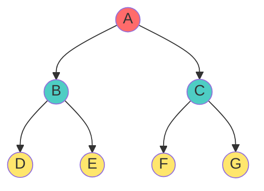
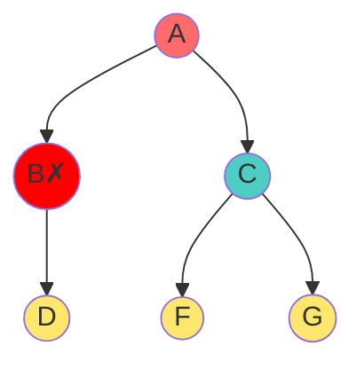
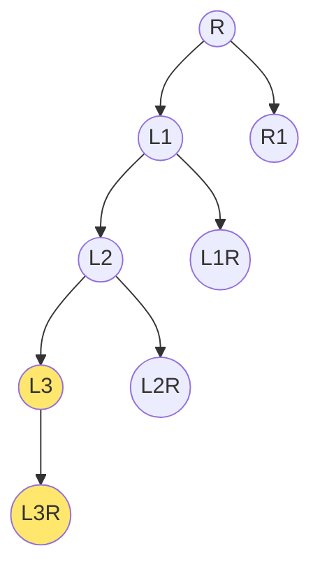
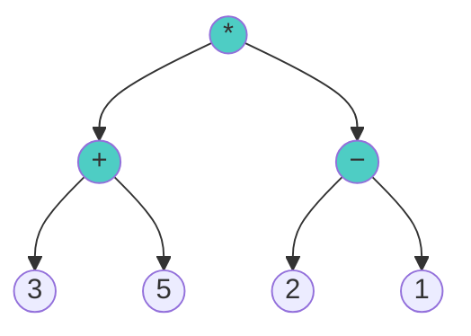

# 📏 Strict Binary Tree (Proper/Full Binary Tree) - Complete Guide

## Introduction

A **Strict Binary Tree** (also called **Proper Binary Tree** or sometimes **Full Binary Tree**, depending on the textbook) is a specialized type of binary tree with one simple but powerful constraint:

> **The Golden Rule of Strict Trees:** Every node must have **exactly 0 or 2 children**. No node can have 1 child.

This constraint creates elegant mathematical properties that are used extensively in data structures like **Huffman Coding**, **Expression Trees**, and **Tournament Systems**.

> **Real-World Analogy**: Think of tournament brackets. Each match either:
> - Has NO sub-matches (it's a base match)
> - Has 2 sub-matches (left semifinal and right semifinal)
> - Never has just 1 sub-match

This matches structure exactly follows strict binary tree properties!

---

## 🏛️ The Rule: {0, 2} Degree Set

### Definition

In a Strict Binary Tree, every node **n** satisfies:
$$\text{Degree}(n) \in \{0, 2\}$$

### What This Means

- **0 children** → Node is a leaf (external node)
- **2 children** → Node is internal, must have both left AND right child
- **1 child** → ❌ **IMPOSSIBLE** - violates the strict property

### Forbidden Configuration

A node with degree 1 breaks the strictness:
```cpp
// ❌ NOT ALLOWED in strict tree:
Node A: [left child: B, right child: NULL]  // Degree = 1 ❌
```

This must be:
```cpp
// ✅ ALLOWED - either:
Node A: [left child: B, right child: C]     // Degree = 2 ✅
Node A: [left child: NULL, right child: NULL]  // Degree = 0 ✅
```

---

## 📸 Visual Examples: YES vs. NO

### ✅ VALID Strict Binary Tree



**Analysis**:
- A: 2 children (B, C) ✅
- B: 2 children (D, E) ✅
- C: 2 children (F, G) ✅
- D, E, F, G: 0 children ✅
- **Result**: All nodes have degree {0, 2} → **VALID** ✅

### ❌ INVALID - Has a Node with 1 Child



**Analysis**:
- A: 2 children ✅
- **B: 1 child (D) ❌** - Violates strict rule
- C: 2 children ✅
- Result: **NOT VALID** ❌

---

## 🎭 Nomenclature (Different Textbooks Use Different Names)

This tree structure has been called:

| Name | Source/Usage | Notes |
|:----|:----|:----|
| **Strict Binary Tree** | Modern texts, unambiguous | Best term - clearly indicates degree restriction |
| **Proper Binary Tree** | Classic texts | Emphasizes "proper" (complete) structure |
| **Full Binary Tree** | Some contexts | **Caution**: Others use "Full" for Perfect trees! |
| **Perfect Binary Tree** | Structure-focused texts | When all leaves are at same level |
| **Regular Binary Tree** | Less common | Indicates regularity/uniformity |

**Recommendation**: Use "**Strict Binary Tree**" to avoid confusion!

---

## 📐 Mathematical Properties

### Property 1: Odd Number of Nodes

**Theorem**: Any strict binary tree has an **odd number of nodes**.

**Proof**:
- Start with root (1 node): odd ✓
- Every operation adds a node with 2 children: adds 2 nodes
- 1 + 2 + 2 + ... + 2 = 1 + 2k = **odd** ✓

Therefore, you can have trees with 1, 3, 5, 7, 9, 15, 31, ... nodes but never 2, 4, 6, 8, ... nodes.

### Property 2: Internal Nodes = (Total Nodes - 1) / 2

**Formula**:
$$i = \frac{n - 1}{2}$$

where:
- $i$ = number of internal nodes
- $n$ = total nodes

**Derivation**:
- Every internal node has 2 children
- Total children = 2i
- But total children = n - 1 (all except root)
- Therefore: 2i = n - 1 → i = (n-1)/2

**Example**: For n = 15 nodes, i = (15-1)/2 = 7 internal nodes

### Property 3: Leaves = (Total Nodes + 1) / 2

**Formula**:
$$e = \frac{n + 1}{2}$$

where:
- $e$ = number of external nodes (leaves)
- $n$ = total nodes

**Derivation**:
- From n = i + e and i = (n-1)/2:
- e = n - i = n - (n-1)/2 = (2n - n + 1)/2 = (n+1)/2

**Example**: For n = 15 nodes, e = (15+1)/2 = 8 leaves

### Property 4: Relationship Between Internal and External

$$e = i + 1$$

This is the strict-tree version of the general $n_0 = n_2 + 1$ formula!

---

## 💡 Key Insight: Why "Strict" Matters

The {0, 2} constraint creates these benefits:

1. **Perfect Balance Potential**: Easier to maintain balanced structure
2. **No Wasted Space**: No "half-empty" nodes
3. **Mathematical Elegance**: Clean formulas (odd nodes, specific ratios)
4. **Optimal Search**: Can achieve O(log n) more consistently
5. **Huffman Coding**: Natural fit for binary encoding problems

---

## 📈 Height vs. Nodes in Strict Trees

### Minimum Nodes for Height h

For height h, minimum strict tree has nodes lined up left-heavy:

**Formula**: $n_{min} = 2h + 1$

**Example** (h = 3):

Nodes: 2(3) + 1 = 7

### Maximum Nodes for Height h

For height h, maximum strict tree is perfect:

**Formula**: $n_{max} = 2^{h+1} - 1$

This is the same as general binary trees!

---

## 🎯 Part: Real-World Applications

### 1. Huffman Coding (Data Compression)

In Huffman trees, every internal node has exactly 2 children (merge two subtrees), making it strict!

**Example**: Building a Huffman tree for 5 characters:
- Leaf nodes: 5 characters
- Internal nodes: 4 (merge operations)
- Total nodes: 5 + 4 = 9 (odd ✓)
- Relationship: 5 = 4 + 1 ✓

### 2. Expression Evaluation Trees

Binary operators (*, +, -, /) create strict trees:
- Leaf nodes: operands (numbers)
- Internal nodes: operators (each has exactly 2 operands)

Example: `(3 + 5) * (2 - 1)`



Tree nodes: 7 (odd ✓), internal: 3, leaves: 4 (3 = 4-1 ✓)

### 3. Tournament Brackets

Single-elimination tournaments create strict binary trees:
- Internal nodes: matches (every match has 2 competitors)
- Leaf nodes: initial contestants
- Total: always odd number of games

---

## 🎓 Part: Practice Exercises

**Exercise 1**: Is this a strict binary tree?
```
     A
    / \
   B   C
   / \ / \
  D  E F  G
```
**Answer**: Yes ✓ (all nodes have degree {0,2})

**Exercise 2**: How many nodes in a strict binary tree with 10 internal nodes?
- Formula: n = 2i + 1 = 2(10) + 1 = 21 nodes
- Check: 10 = (21-1)/2 ✓

**Exercise 3**: A strict binary tree has 31 nodes. How many leaves?
- Leaves: e = (31 + 1)/2 = 16
- Check: 16 = 15 + 1 ✓

**Exercise 4**: Can a strict binary tree have 50 nodes?
- Answer: No ❌ (50 is even, strict trees always have odd nodes)

**Exercise 5**: In an expression tree for `2 * (3 + 4)`, is it strict?
- Answer: Yes ✓ (operators are internal with 2 children, numbers are leaves with 0)

**Exercise 6**: Prove that in any strict tree with n nodes, exactly (n+1)/2 nodes are leaves.
- Proof: Since every internal node has 2 children and root has no parent:
  - Internal nodes i: each has 2 children
  - External nodes e: have 0 children
  - Total: n = i + e
  - Children count: 2i (all edges + 1)
  - 2i = n - 1 (all nodes except root)
  - i = (n-1)/2, so e = n - i = (n+1)/2 ✓

---

## 📋 Summary Reference

| Property | Formula | Example (n=15) |
|:----|:----|:----|
| **Total Nodes** | Must be odd | 15 ✓ |
| **Internal Nodes** | i = (n-1)/2 | 7 |
| **External Nodes** | e = (n+1)/2 | 8 |
| **Relationship** | e = i + 1 | 8 = 7+1 ✓ |
| **Height Range** | 2h+1 ≤ n ≤ 2^(h+1)-1 | h=3: 7≤n≤15 |

---

## 🎯 Key Takeaways

1. **Strict = No Single Child** - Every node has 0 or 2 children, never 1
2. **Always Odd Nodes** - Foundational property
3. **Elegant Ratios** - Exactly (n+1)/2 leaves and (n-1)/2 internal nodes
4. **Real Applications** - Huffman coding, expression trees, tournaments
5. **Mathematical Beauty** - Clean formulas derived from the constraint
6. **Distinction from Complete** - Strict is about degree; Complete is about position
