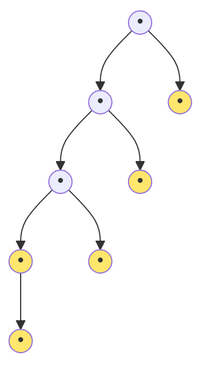
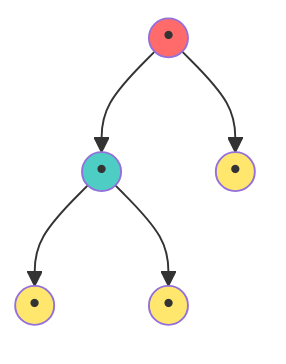
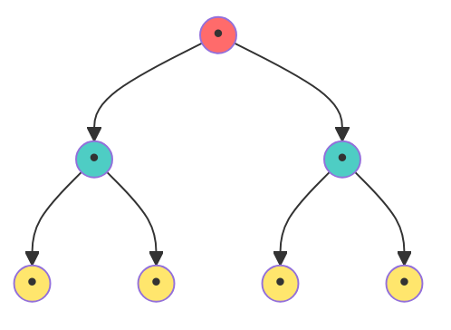
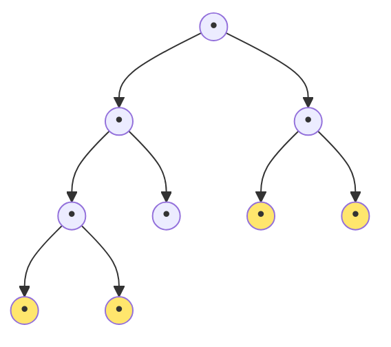
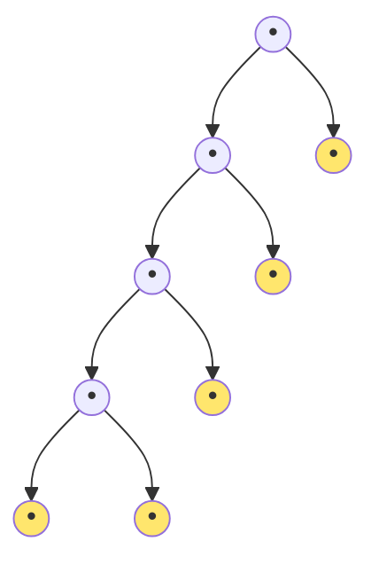
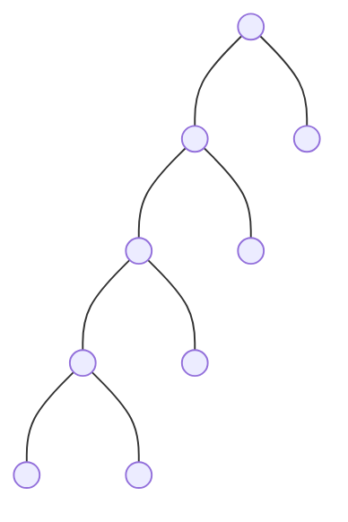

# 📏 Strict Binary Tree: Height vs. Nodes - Complete Analysis

## Introduction

In a **Strict Binary Tree**, every node has either **0 or 2 children**. This constraint fundamentally changes the relationship between height and node count compared to general binary trees.

> **Key Insight**: Since no node can have 1 child, the minimum height for a given number of nodes is **always greater** than in general trees. This makes strict trees less efficient for sparse data but more mathematically elegant.

---

## Part 1: When Height is Given

If we know the height **h**, what are the minimum and maximum nodes possible in a strict binary tree?

### Minimum Nodes ($n_{min}$)

In a strict tree, the thinnest possible structure is when we create a chain but follow the {0,2} rule.

**Strategy**: Build a "left-heavy" tree where the left subtree chains down:

**Formula**:
$$n_{min} = 2h + 1$$

**Derivation**:
- Root has 2 children: +1 node
- Left subtree (strict, height h-1): min nodes = 2(h-1) + 1
- Right subtree (leaf only): +1 node
- Total: 1 + [2(h-1) + 1] + 1 = 2h + 1 ✓

**Example (h=3)**:
- Min nodes: 2(3) + 1 = 7



Node count: 7, Last internal at height 3 ✓

### Maximum Nodes ($n_{max}$)

The densest strict tree is **perfect** (all levels completely filled):

**Formula**:
$$n_{max} = 2^{h+1} - 1$$

This is identical to general binary trees!

**Example (h=3)**:
- Max nodes: 2^4 - 1 = 15

**Why Perfect Trees Are Optimal for Strict Trees**:
- In a perfect tree, all levels are complete
- Every internal node has exactly 2 children ✓
- Every leaf node has 0 children ✓
- All degree requirements satisfied!

---

## The "Odd Nodes Rule"

**Critical Property**: Any strict binary tree has an **odd** total number of nodes.

**Why**: 
- Start with 1 node (root): odd
- Every addition adds 1 internal node with 2 children = +2 nodes
- Even number + odd = odd ✓

**Implication**: Valid strict trees have 1, 3, 5, 7, 9, 15, 31, 63, 127, ... nodes.

**Invalid**: 2, 4, 6, 8, 10, ... nodes can NEVER form a strict binary tree.

---

## Part 2: When Nodes are Known

If we know the total nodes **n**, what height range is possible?

### Maximum Height ($h_{max}$)

Happens in the minimum-spanning configuration (left-heavy chain):

**Formula**:
$$h_{max} = \frac{n-1}{2}$$

**Derivation**:
- From n = 2h + 1 (minimum node formula)
- n - 1 = 2h
- h = (n-1)/2 ✓

**Example (n=7)**:
- Max height: (7-1)/2 = 3

### Minimum Height ($h_{min}$)

Happens in perfect tree configuration:

**Formula**:
$$h_{min} = \log_2(n+1) - 1$$

This is the same as general balanced trees!

**Example (n=15)**:
- Min height: log₂(16) - 1 = 4 - 1 = 3

**Note**: For strict trees with n nodes, hmin is often achieved naturally because the perfect structure satisfies the {0,2} constraint.

---

## Detailed Comparison Tables

### Table 1: Height to Nodes Mapping

| h | n_min | n_max | Formula Check |
|:----|:----|:----|:----|
| 0 | 1 | 1 | 2(0)+1=1, 2^1-1=1 ✓ |
| 1 | 3 | 3 | 2(1)+1=3, 2^2-1=3 ✓ |
| 2 | 5 | 7 | 2(2)+1=5, 2^3-1=7 |
| 3 | 7 | 15 | 2(3)+1=7, 2^4-1=15 |
| 4 | 9 | 31 | 2(4)+1=9, 2^5-1=31 |
| 5 | 11 | 63 | 2(5)+1=11, 2^6-1=63 |

**Pattern**: n_min always odd, n_max always odd (2^(h+1) - 1 is always odd)

### Table 2: Nodes to Height Mapping

| n | h_min | h_max | Notes |
|:----|:----|:----|:----|
| 1 | 0 | 0 | Perfect tree: single node |
| 3 | 1 | 1 | Perfect tree: 3 nodes (root + 2 leaves) |
| 5 | 2 | 2 | Perfect tree: full level tree |
| 7 | 2 | 3 | Range: 2 to 3 |
| 9 | 3 | 4 | Range: 3 to 4 |
| 15 | 3 | 7 | Range: 3 to 7 |
| 31 | 4 | 15 | Range: 4 to 15 |

---

## Visual Comparisons

### Case 1: Height h = 2

**Minimum Nodes (5)**:

Nodes: 5, Internal: 2, Leaves: 3

**Maximum Nodes (7)**:

Nodes: 7, Internal: 3, Leaves: 4

### Case 2: Nodes n = 9

**Minimum Height (3)**:

Height: 3 (9 nodes in almost complete form)

**Maximum Height (4)**:

Height: 4 (left-heavy chain)

---

## Comparison: Strict vs. General Binary Trees

| Scenario | General Tree | Strict Tree | Difference |
|:----|:----|:----|:----|
| Min nodes for h=5 | 6 | 11 | Strict needs more! |
| Max nodes for h=5 | 63 | 63 | Same |
| Max height for n=31 | 30 | 15 | Strict more efficient! |
| Guaranteed Odd Nodes | No | Yes | Always |
| Perfect Balance Chance | Lower | Higher | Constraint helps |

**Key Insight**: Strict trees prevent skewing! Maximum height is roughly half of general trees.

---

## Mathematical Formulas Summary

### Given Height h, find n range:
$$2h + 1 \leq n \leq 2^{h+1} - 1$$

### Given Nodes n, find h range:
$$\log_2(n+1) - 1 \leq h \leq \frac{n-1}{2}$$

### Number of internal nodes in strict tree:
$$i = \frac{n-1}{2}$$

### Number of leaves in strict tree:
$$e = \frac{n+1}{2}$$

### Valid n values:
$$n \in \{1, 3, 5, 7, 9, 11, ...\}$$

---

## Real-World Applications

### 1. Huffman Coding Trees
- Internal nodes: merge operations (always 2 branches)
- Guaranteed optimal compression structure
- Input: n symbols → Output: n + (n-1) = 2n-1 nodes (odd ✓)

### 2. Expression Evaluation
- Binary operators: each has 2 operands
- Structure guarantees validity of expressions
- Example: `((2+3) * (4-1))` forms strict tree

### 3. Tournament Brackets (Double Elimination)
- Each match combines exactly 2 competitors
- Perfect bracket structure with strict trees

---

## 🎓 Practice Exercises

**Exercise 1**: A strict binary tree has height 4. What's the range of nodes?
- Min: 2(4) + 1 = 9
- Max: 2^5 - 1 = 31
- Answer: 9 ≤ n ≤ 31

**Exercise 2**: A strict binary tree has 21 nodes. What's the range of heights?
- Min: log₂(22) - 1 = 4.46 - 1 ≈ 3.46 → ⌈3.46⌉ - 1 = 3
- Max: (21-1)/2 = 10
- Answer: h between 3 and 10

**Exercise 3**: Is 25 a valid number of nodes for a strict tree?
- Answer: Yes ✓ (25 is odd)
- h_min = log₂(26) - 1 ≈ 4.7 - 1 ≈ 3.7 → need h ≥ 4
- h_max = (25-1)/2 = 12
- Valid between heights 4-12 ✓

**Exercise 4**: Prove that any strict binary tree has an odd number of nodes.
- Proof by induction:
  - Base: Single node = 1 (odd) ✓
  - Step: Each strict tree with i+1 internal nodes = previous tree + 1 new internal + 2 children = +2 nodes
  - Adding even numbers to odd stays odd ✓

**Exercise 5**: For a perfect strict tree with n = 31 nodes, find height.
- 31 = 2^5 - 1 → h + 1 = 5 → h = 4
- Verify: min = 9, max = 31 ✓ (31 is max)

**Exercise 6**: Compare space efficiency of two 31-node trees:
- General tree (skewed): height 30 (space for 30 edges)
- Strict perfect tree: height 4 (space for 4×2 edges)
- Ratio: 30:8 = 3.75:1 (strict is much better!)

---

## Key Takeaways

1. **Minimum nodes = 2h + 1** (grows linearly with height)
2. **Maximum nodes = 2^(h+1) - 1** (same as general trees)
3. **All strict trees have odd node counts** (fundamental property)
4. **Max height = (n-1)/2** (prevents skewing)
5. **Strict trees naturally resist poor balancing** (constraint helps!)
6. **Perfect trees are both strict AND complete** (elegant structure)
7. **Real applications ensure efficient use** (Huffman, tournaments, expressions)
    C2 --- G2(( ))
    D2 --- H2(( ))
    D2 --- I2(( ))
```

### ✅ Max Height (h=4)


---

## 📊 Summary Comparison
| Feature | General Binary Tree | Strict Binary Tree |
| :--- | :--- | :--- |
| **Min Nodes** | $h + 1$ | **$2h + 1$** |
| **Max Nodes** | $2^{h+1} - 1$ | $2^{h+1} - 1$ |
| **Min Height** | $\log_2(n+1) - 1$ | $\log_2(n+1) - 1$ |
| **Max Height** | $n - 1$ | **$\frac{n-1}{2}$** |
