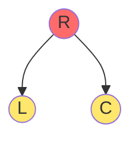
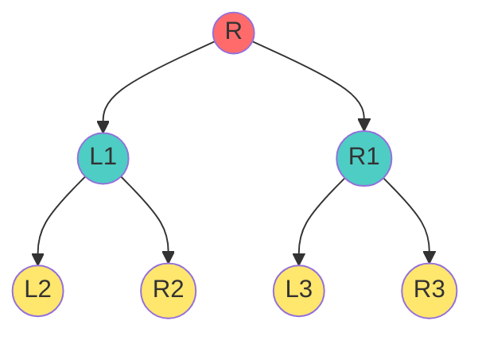
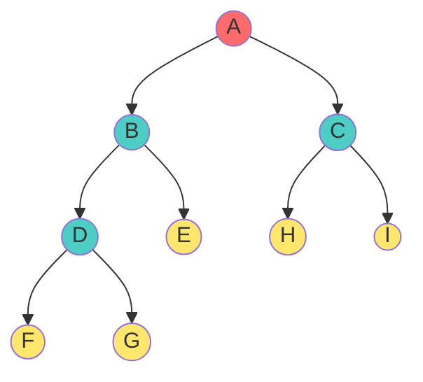
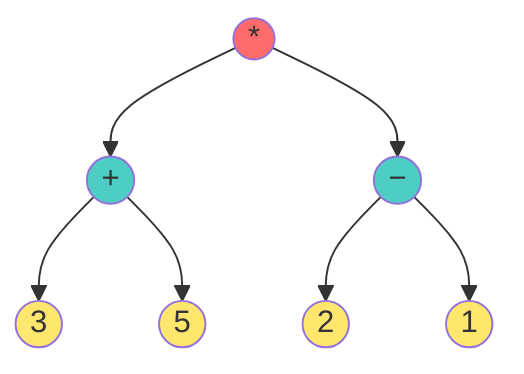

# 🌳 Strict Binary Tree: Internal vs. External Nodes Complete Guide

## Introduction

In a **Strict Binary Tree** (where every node has either 0 or 2 children), the relationship between internal nodes (nodes with children) and external nodes (leaves) is mathematically beautiful and powerful.

> **The Central Truth**: In any strict binary tree, **the number of leaves is always exactly one more than the number of internal nodes**.

This simple relationship, expressed as $e = i + 1$, is one of the most useful properties in tree data structure analysis.

---

## 📝 Precise Definitions

### Internal Nodes (i)

**Definition**: Nodes that have children (i.e., degree > 0)

In a strict tree, internal nodes have **exactly 2 children** (since degree must be in {0, 2}).

**Notation**: $i$ or $i_2$ (sometimes called "non-leaf nodes")

**Properties**:
- At least one child: edges going DOWN
- Can be accessed via parent edges: edges going UP (except root)

### External Nodes (e)

**Definition**: Nodes with no children (degree = 0), also called **Leaf Nodes**

**Notation**: $e$ or $e_0$ (sometimes $n_0$)

**Properties**:
- Terminal nodes of the tree
- No outgoing edges
- "Boundary" of the tree structure

---

##The Golden Rule: $e = i + 1$

### Theorem

**In any strict binary tree**: 
$$\text{Number of External Nodes} = \text{Number of Internal Nodes} + 1$$

$$e = i + 1$$

### Proof (Most Elegant)

**Given**:
- Every internal node has exactly 2 children (strict tree constraint)
- Every node except root is a child of exactly one parent
- Total nodes: $n = i + e$

**Counting edges via children**:
- Each internal node contributes 2 children
- Total child pointers from internal nodes: $2i$

**Counting edges via parents**:
- Every node except root has exactly one parent-child edge
- Total edges: $n - 1$

**Therefore**:
$$2i = n - 1$$
$$2i = (i + e) - 1$$
$$2i = i + e - 1$$
$$i = e - 1$$
$$e = i + 1$$ ✅ **QED**

### Alternative Proof (By Induction)

**Base case (i = 0)**: 
- Tree is just root (leaf only)
- e = 1, i = 0
- 1 = 0 + 1 ✓

**Inductive step**: 
- Assume $e = i + 1$ for a tree with $i$ internal nodes
- Add new internal node with 2 children:
  - Internal nodes increase by 1: $i' = i + 1$
  - External nodes change by: -1 (node loses leaf status) +2 (two new leaves) = +1
  - New external: $e' = e + 1$
  - Check: $e' = e + 1 = (i + 1) + 1 = i' + 1$ ✓

---

## 📸 Detailed Case-by-Case Analysis

### Example 1: Minimal Tree (Just Root)

**Counts**:
- Internal nodes: $i = 0$
- External nodes: $e = 1$ (root is a leaf)
- Total: $n = 1$

**Verification**: 
- $e = i + 1$ → $1 = 0 + 1$ ✓
- n = i + e → $1 = 0 + 1$ ✓

---

### Example 2: Smallest Non-Trivial Strict Tree

**Counts**:
- Internal nodes: $i = 1$ (R has 2 children)
- External nodes: $e = 2$ (L, C are leaves)
- Total: $n = 3$

**Verification**:
- $e = i + 1$ → $2 = 1 + 1$ ✓
- $n = i + e$ → $3 = 1 + 2$ ✓

---

### Example 3: Perfect Tree (4 Internal Nodes)

**Counts**:
- Internal nodes: $i = 3$ (R, L1, R1)
- External nodes: $e = 4$ (L2, R2, L3, R3)
- Total: $n = 7$

**Verification**:
- $e = i + 1$ → $4 = 3 + 1$ ✓
- Odd nodes: $7 = 2(3) + 1$ ✓

---

### Example 4: Complex Asymmetrical Tree

**Node Analysis**:
- A: 2 children → INTERNAL
- B: 2 children → INTERNAL
- C: 2 children → INTERNAL
- D: 2 children → INTERNAL
- E: 0 children → EXTERNAL
- F: 0 children → EXTERNAL
- G: 0 children → EXTERNAL
- H: 0 children → EXTERNAL
- I: 0 children → EXTERNAL

**Counts**:
- Internal: $i = 4$ (A, B, C, D)
- External: $e = 5$ (E, F, G, H, I)
- Total: $n = 9$

**Verification**:
- $e = i + 1$ → $5 = 4 + 1$ ✓
- All odd: $n = 2(4) + 1 = 9$ ✓

---

##  Why This Is True: The Intuition

### The "Branching" Intuition

Think of each **internal node as a branching point**:
- Every branch from an internal node eventually terminates at a leaf
- But each internal node has 2 branches
- With $i$ internal nodes, you have $2i$ total "slots" for nodes
- These slots are either: filled by more internal nodes, or filled by leaves
- **Total children = $2i$ = $(i' \text{ new internal}) \times 2 + (e \text{ leaves})$**
- Rearranging: $2i = 2i' + e$ (where $i' < i$)
- For the tree as a whole: leaves "fill out" the final level
- Result: exactly one extra leaf per internal node

### Mathematical Elegance

The formula $e = i + 1$ is:
1. **Independent of tree shape** - applies to all strict trees
2. **Derived purely from degree constraints** - doesn't need specific structure
3. **Invariant under tree operations** - adding/removing subtrees preserves the relationship

---

## Comprehensive Formula Relationships

### Total Nodes Formula

$$n = i + e$$

Combining with $e = i + 1$:
$$n = i + (i + 1) = 2i + 1$$

This confirms: **strict trees always have odd number of nodes!**

### Finding Any Variable

Given any one of {$i$, $e$, $n$}, find the others:

| Given | Find | Formula |
|:----|:----|:----|
| **i** | $e$ | $e = i + 1$ |
| **i** | $n$ | $n = 2i + 1$ |
| **e** | $i$ | $i = e - 1$ |
| **e** | $n$ | $n = 2e - 1$ |
| **n** | $i$ | $i = \frac{n-1}{2}$ |
| **n** | $e$ | $e = \frac{n+1}{2}$ |

### Verification Checklist

For any strict tree, **verify**:
1. Total nodes is ODD
2. $e = i + 1$
3. $n = 2i + 1$
4. $e = \frac{n+1}{2}$ (always results in integer!)
5. Every internal node has exactly 2 children

---

## Real-World Applications

### Application 1: Huffman Coding

Huffman trees are strict binary trees!

**Example**: Compress 5 symbols {A, B, C, D, E}
- Leaf nodes: 5 symbols (e = 5)
- Internal nodes (merge operations): must be $i = 4$ (from $e = i+1$)
- Total nodes: $n = 9$ (odd ✓)
- Tree height: 2-4 levels

**Why it matters**: The formula guarantees the number of merge operations!

### Application 2: Expression Trees

Mathematical expressions like `(3+5)*(2-1)` form strict trees:
- Leaves: operands (numbers)
- Internal: operators (each has 2 operands/children)
- Formula ensures consistency

- Operators (internal): 3 (*,+,-)
- Operands (leaves): 4 (3,5,2,1)
- Check: $4 = 3 + 1$ ✓

### Application 3: Tournament Brackets

Single-elimination tournaments create strict trees:
- Internal nodes: matches (each needs 2 competitors)
- Leaf nodes: initial contestants
- The formula $e = i + 1$ predicts: for n participants, need (n-1)/2 matches!

**Example**: 8 contestants
- Leaves: $e = 8$
- Matches needed: $i = 7$ (from $e = i + 1$)
- Verification: $7 = 8 - 1$ ✓

---

## 🎓 Practice Exercises

**Exercise 1**: In a strict tree with 10 internalnodes, how many leaves?
- Formula: $e = i + 1 = 10 + 1 = 11$
- Total nodes: $n = 2(10) + 1 = 21$

**Exercise 2**: Is this valid?
- $n = 50, i = 24$
- Answer: No ❌ (50 is even; strict trees must be odd)

**Exercise 3**: Is this valid?
- $n = 31, i = 15$
- Check: $e = 31 - 15 = 16$
- $e = i +1$? → $16 = 15 + 1$ ✓ **YES**

**Exercise 4**: In a Huffman tree for 7 symbols:
- Leaves: $e = 7$
- Internal (merges): $i = ?$
- Answer: $i = 6$ (merging 7 items requires 6 merge operations)

**Exercise 5**: A strict tree has height 4. What are min/max leaves?
- Min nodes: $2(4) + 1 = 9$ → min leaves: $(9+1)/2 = 5$
- Max nodes: $2^5 - 1 = 31$ → max leaves: $(31+1)/2 = 16$
- Answer: between 5 and 16 leaves

**Exercise 6**: Verify the formula for 15-node perfect tree:
- Perfect tree with 15 nodes
- Internal: $(15-1)/2 = 7$
- External: $(15+1)/2 = 8$
- Check: $8 = 7 + 1$ ✓

---

## Summary Reference Table

| Property | Symbol | Formula | Example (n=15) |
|:----|:----|:----|:----|
| **Internal Nodes** | $i$ | $(n-1)/2$ | 7 |
| **External Nodes** | $e$ | $(n+1)/2$ | 8 |
| **Total Nodes** | $n$ | $i + e$ | 15 |
| **Relationship** | - | $e = i + 1$ | 8=7+1 ✓ |
| **Odd Check** | - | $n$ is odd | 15 ✓ |

---

## Key Takeaways

1. **$e = i + 1$ is fundamental** - core property of all strict trees
2. **Totals are always odd** - no even-sized strict trees exist
3. **Explicit calculations** - given any one variable, find all others
4. **Real applications** - Huffman, expressions, tournaments all use this
5. **Proof by counting** - edges argument is the clearest proof
6. **Invariant property** - doesn't depend on tree shape or balance
7. **Practical validation** - use formula to check if configuration is valid
