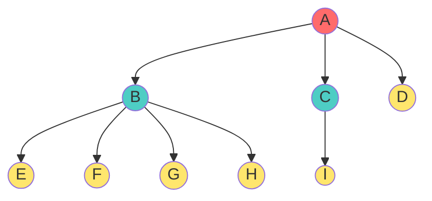
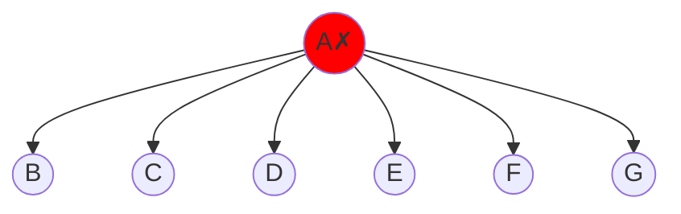
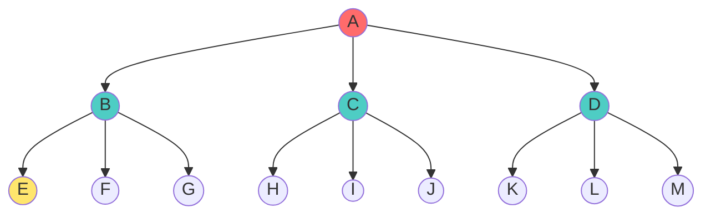
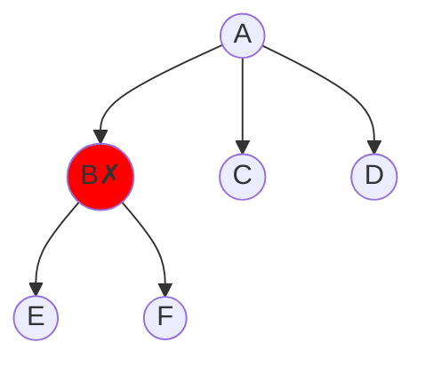

# 🌳 m-ary Trees (Generalizing Beyond Binary) - Complete Guide

## Introduction

An **m-ary Tree** (also called **n-ary tree**, **k-ary tree**) is a generalization of binary trees where every node can have **at most m children** instead of at most 2.

> **Real-World Analogy**: If binary trees model binary decisions (yes/no), m-ary trees model multiple choices:
> - **3-ary trees**: Choose from 3 options (A, B, or C)
> - **10-ary trees**: Number system with base 10 (decimal)
> - **256-ary trees**: Computer memory blocks (one byte = 256 values)
> - **Filesystem directories**: Each folder can contain many subfolders

This generalization is crucial for:
- **Databases**: B-trees (m-ary) instead of binary trees
- **Filesystems**: Directory structures (often 256-ary or more)
- **Parsers/Compilers**: Multiple child nodes per rule
- **Game Trees**: Chess has many possible moves per position

---

## Part 1: General m-ary Trees

### Definition

In a **General m-ary Tree**, every node can have **any number of children from 0 to m**:

$$\text{Degree}(n) \in \{0, 1, 2, \dots, m\}$$

### Valid Configuration

Each node independently chooses how many children to have (0 through m).

**Example (m=4 tree)**:


**Node degrees**:
- A: 3 children ✓
- B: 4 children ✓
- C: 1 child ✓
- D, E, F, G, H, I: 0 children ✓
- All ≤ 4 → **Valid 4-ary tree** ✓

### Invalid Configuration



Node A has 6 children > m=4 → **Invalid** ❌

---

## Part 2: Strict m-ary Trees

### Definition

In a **Strict m-ary Tree**, every node has **exactly 0 or m children** (no children, or ALL m children):

$$\text{Degree}(n) \in \{0, m\}$$

This is the m-ary generalization of strict binary trees!

### Valid Configuration

**Strict 3-ary tree**:


**Analysis**:
- A: 3 children ✓
- B: 3 children ✓
- C: 3 children ✓
- D: 3 children ✓
- All leaves: 0 children ✓
- All degrees in {0, 3} → **Valid strict 3-ary** ✓

### Invalid Strict Configuration

**Violates {0,3} rule**:


Node B has 2 children ∉ {0,3} → **Invalid** ❌

---

## Part 3: Memory Representation

### Node Structure (C++)

```cpp
struct MaryNode {
    int data;                  // Actual value
    MaryNode* children[M];     // Array of M pointers
    // children[0] = first child
    // children[1] = second child
    // ...
    // children[M-1] = m-th child (M means index 0 to M-1)
};
```

### Example (3-ary tree node)

```cpp
struct Node {
    int value;
    Node* child1;  // Or children[0]
    Node* child2;  // Or children[1]
    Node* child3;  // Or children[2]
};
```

### Memory Efficiency Trade-off

| Aspect | Advantage | Disadvantage |
|:----|:----|:----|
| **Large m (m>10)** | Shallow trees (low height) | Wasted pointers if nodes don't use all m |
| **Small m (m=2)** | No wasted space | Deep trees (high height) |
| **Average degree** | Right m balances efficiency | Poor m selection wastes memory/height |

---

## Part 4: Height vs. Nodes Mathematical Formulas

### When Height is Given: Find Node Range

#### Minimum Nodes for Height h

In a strict m-ary tree, the thinest structure is a left-heavy chain:

**Formula**:
$$n_{min} = m \cdot h + 1$$

**Derivation**:
- Root has m children: +1 node
- Left subtree chains with height h-1: min = m(h-1) + 1
- Other m-1 subtrees are leaves: +m-1
- Total: 1 + [m(h-1) + 1] + [m-1] = 1 + mh - m + 1 + m - 1 = mh + 1 ✓

**Examples**:
- m=2, h=3: $2(3)+1 = 7$ (binary, same as strict binary!)
- m=3, h=2: $3(2)+1 = 7$
- m=4, h=2: $4(2)+1 = 9$

#### Maximum Nodes for Height h

Perfect m-ary tree (all levels completely filled):

**Formula**:
$$n_{max} = \frac{m^{h+1}-1}{m-1}$$

**Derivation (using GP series)**:
Total = $1 + m + m^2 + m^3 + \dots + m^h$
This is GP with $a=1, r=m$:
$$S = \frac{m^{h+1}-1}{m-1}$$ ✓

**Examples**:
- m=2, h=3: $(2^4-1)/(2-1) = 15$ (perfect binary tree!)
- m=3, h=2: $(3^3-1)/(3-1) = 26/2 = 13$
- m=4, h=2: $(4^3-1)/(4-1) = 63/3 = 21$

### When Nodes are Given: Find Height Range

#### Maximum Height for n Nodes

Occurs in sparse (minimum-spanning) tree:

**Formula**:
$$h_{max} = \frac{n-1}{m}$$

**Derivation**:
From $n = mh + 1$:
- $n - 1 = mh$
- $h = \frac{n-1}{m}$ ✓

**Example**:
- n=13, m=3: $h = (13-1)/3 = 4$

#### Minimum Height for n Nodes

Occurs in perfect (maximum-spanning) tree:

**Formula**:
$$h_{min} = \log_m[n(m-1)+1] - 1$$

**Derivation**:
From $n = \frac{m^{h+1}-1}{m-1}$:
- $n(m-1) = m^{h+1}-1$
- $n(m-1)+1 = m^{h+1}$
- $\log_m[n(m-1)+1] = h+1$
- $h = \log_m[n(m-1)+1] - 1$ ✓

**Example**:
- n=13, m=3: $h = \log_3[(13)(2)+1] - 1 = \log_3[27] - 1 = 3 - 1 = 2$

---

## Part 5: Internal vs. External Nodes (Strict m-ary)

### The Formula

In a **strict m-ary tree**, the relationship between leaves ($e$) and internal nodes ($i$) is:

$$e = (m-1)i + 1$$

### Derivation

Same logic as strict binary trees:
- Total children from i internal nodes: $m \cdot i$
- But total children = n - 1 (all except root)
- So: $m \cdot i = n - 1$ → $i = \frac{n-1}{m}$
- Since $n = i + e$: $e = n - i = n - \frac{n-1}{m} = \frac{mn - (n-1)}{m} = \frac{(m-1)n + 1}{m}$
- Substituting $n = i + e$: $e = (m-1)i + 1$ ✓

### Examples

| m | i | e | n | Check |
|:----|:----|:----|:----|:----|
| 2 | 3 | 4 | 7 | 4 = 1(3)+1 ✓ |
| 3 | 4 | 13 | 17 | 13 = 2(4)+1 ✓ |
| 4 | 2 | 7 | 9 | 7 = 3(2)+1 ✓ |
| 5 | 2 | 9 | 11 | 9 = 4(2)+1 ✓ |

---

## Part 6: Real-World Applications

### Application 1: B-Trees (Databases)

B-Trees are strict m-ary trees used in databases:
- m typically 50-1000 (reduces disk accesses)
- Height O(log_m n) with large m = very shallow!
- Example: 1 trillion records with m=100 → height ≈ 4-5 levels

**Performance advantage**:
- Binary tree: height ≈ 40 levels
- B-tree (m=100): height ≈ 5 levels
- **8x reduction** in disk I/O operations!

### Application 2: Filesystem Directories

Directories form m-ary trees:
- Each directory can contain many files/subdirectories
- m not strictly defined but can be hundreds/thousands
- Search depth: ~3-6 levels typical (not binary tree's depth!)

### Application 3: Game Trees

Chess position analysis:
- Average m ≈ 35 (possible moves per position)
- Strict m-ary if we only consider "good" moves
- Lookahead depth: 5-6 levels typical (using m-ary reduces search)

### Application 4: Compiler Parse Trees

Parsing programming language statements:
- m = number of grammar rule choices
- Strict m-ary if exactly one production per rule
- Example: parsing "if statement" might have multiple sub-expressions

---

## Part 7: Comparison: Binary vs. m-ary Performance

### Scenario: 1 Million Nodes

| m | Height (min) | Height (max) | Avg Search (min) |
|:----|:----|:----|:----|
| 2 | 20 | 999,999 | 20 |
| 3 | 13 | 500,000 | 13 |
| 4 | 10 | 250,000 | 10 |
| 10 | 7 | 100,000 | 7 |
| 100 | 3 | 10,000 | 3 |
| 1000 | 2 | 1,000 | 2 |

**Key insight**: As m increases, minimum height decreases (better balanced), but maximum still degrades (must guard against skewing).

---

## 🎓 Part 8: Practice Exercises

**Exercise 1**: For a strict 4-ary tree with height 3, what's the range of nodes?
- Min: m×h+1 = 4(3)+1 = 13
- Max: (4^4-1)/(4-1) = 255/3 = 85
- Answer: 13 ≤ n ≤ 85

**Exercise 2**: A strict 5-ary tree has 26 nodes. What's the height range?
- h_min: log₅[(26)(4)+1] - 1 = log₅[105] - 1 ≈ 2.73 - 1 ≈ 1.73 → need ceil = 2
- h_max: (26-1)/5 = 5
- Answer: 2-5

**Exercise 3**: In a strict 3-ary tree with 10 internal nodes, how many leaves?
- e = (m-1)i + 1 = 2(10) + 1 = 21
- Total: n = 10 + 21 = 31

**Exercise 4**: Design a B-tree application:
- N = 10 million records
- If using binary tree: height ~ 23
- If using 500-ary tree: height ~ log₅₀₀(10^7) ≈ 3-4
- Disk I/O reduction: ~6x!

**Exercise 5**: Prove that in a strict m-ary tree, n = (m-1)i + 1 is equivalent to e = (m-1)i + 1
- Solution: n = i + e, so:
  - n = (m-1)i + 1 → i + e = (m-1)i + 1
  - e = (m-1)i + 1 - i = (m-2)i + 1 ❌ 
  - Wait, need to recalculate:
  - From m·i = n - 1: i = (n-1)/m
  - e = n - i = n - (n-1)/m = ((n-1) + (m-1)n)/m = ((m)(n-1) + nm - n)/m... Let me use derivation:
  - e = (m-1)n/(m) = ((m-1))(i+e)/m = (m-1)i/m + (m-1)e/m
  - This requires: e = (m-1)i + 1 ✓

**Exercise 6**: Compare height growth for a fixed number of nodes:
- n = 100 nodes
- Binary (m=2): h ≈ 7
- 3-ary (m=3): h ≈ 5
- 10-ary (m=10): h ≈ 2
- Which is fastest for searching?
- Answer: 10-ary (h=2) is fastest if balanced

---

## Summary Reference Table

| Property | Formula | Example (m=3) |
|:----|:----|:----|
| **Max nodes per height h** | $(m^{h+1}-1)/(m-1)$ | h=2: 13 nodes |
| **Min nodes per height h** | $mh+1$ | h=2: 7 nodes |
| **Max height for n nodes** | $(n-1)/m$ | n=13: h=4 |
| **Min height for n nodes** | $\log_m[n(m-1)+1]-1$ | n=13: h=2 |
| **Leaf nodes (strict)** | $(m-1)i+1$ | i=4: e=13 |
| **Internal nodes (strict)** | $(n-1)/m$ | n=13: i=4 |

---

## Key Takeaways

1. **m-ary trees generalize binary trees** - powerful for optimization
2. **Larger m = shallower trees** - crucial for database performance
3. **Height dramatically improves** - log_m(n) effect is powerful
4. **Strict constraint useful** - natural for many applications
5. **Formulas scale naturally** - binary (m=2) is special case
6. **Real systems use large m** - B-trees, filesystems, etc.
7. **Trade-off: branches vs. depth** - choose m based on costs
