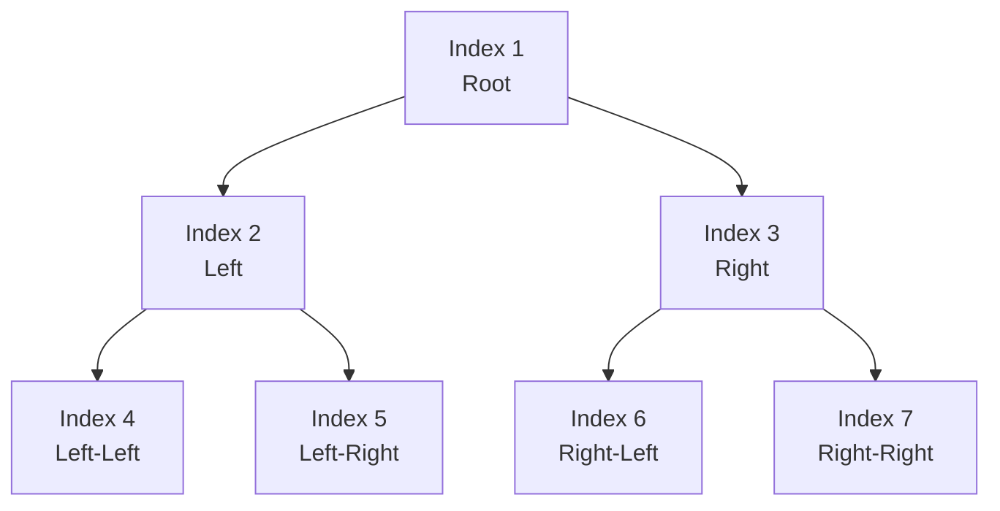
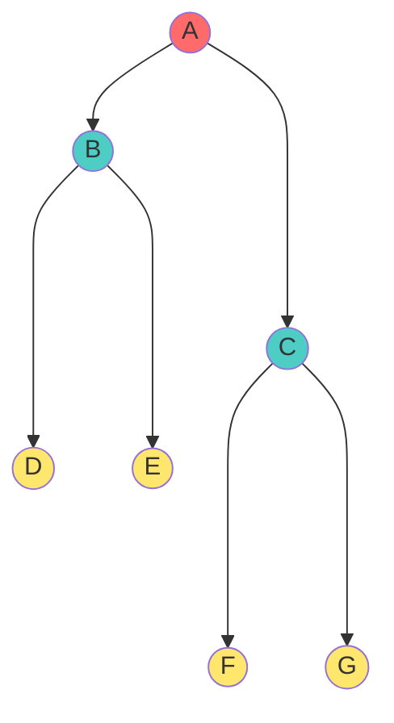
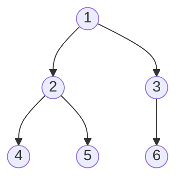
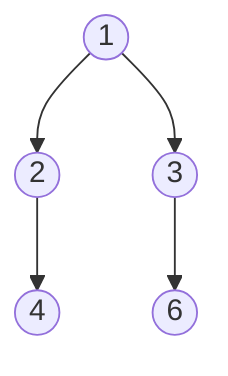

# 📑 Array Representation of Binary Trees - Complete Guide

## Introduction

Array (Sequential) Representation stores a binary tree in a linear array using mathematical index relationships between parent and child positions. This is one of the most elegant and efficient representations for **complete binary trees**.

> **Real-World Use**: Heaps, priority queues, and segment trees all use array representation internally.

---

## Core Concept: Index-Based Parent-Child Mapping

### Mathematical Rules (1-Based Indexing)

For a node at **index i** in array (starting from 1):

$$\text{Left Child Index} = 2i$$
$$\text{Right Child Index} = 2i + 1$$
$$\text{Parent Index} = \left \lfloor \frac{i}{2} \right \rfloor$$

### Why This Works

Binary representation insight:
- Index 1 (001): root
- Index 2-3 (010-011): level 1 children
- Index 4-7 (100-111): level 2 children
- Pattern: left child = i*2, right child = i*2+1 ✓

### Visual Mapping Example



**Array Layout**:
```
Index:  1   2   3   4   5   6   7
Value: [A] [B] [C] [D] [E] [F] [G]
```

---

## Complete Example: Tree to Array

### Tree Structure


### Array Storage
```
Index:  1   2   3   4   5   6   7
Array: [A] [B] [C] [D] [E] [F] [G]
```

### Verification Table

| Element | Index | Left (2i) | Right (2i+1) | Parent (⌊i/2⌋) |
|:----|:-:|:-:|:-:|:-:|
| A | 1 | 2 (B) | 3 (C) | — |
| B | 2 | 4 (D) | 5 (E) | 1 (A) |
| C | 3 | 6 (F) | 7 (G) | 1 (A) |
| D | 4 | — | — | 2 (B) |
| E | 5 | — | — | 2 (B) |
| F | 6 | — | — | 3 (C) |
| G | 7 | — | — | 3 (C) |

---

## Implementation Details

### 0-Based Indexing (More Common in Code)

If array starts at **index 0**:

$$\text{Left Child Index} = 2i + 1$$
$$\text{Right Child Index} = 2i + 2$$
$$\text{Parent Index} = \left \lfloor \frac{i-1}{2} \right \rfloor$$

### C++ Implementation

```cpp
struct HeapNode {
    int value;
};

class ArrayTree {
private:
    vector<HeapNode> nodes;
    
public:
    int leftChild(int i) {
        return 2 * i + 1;  // 0-based
    }
    
    int rightChild(int i) {
        return 2 * i + 2;  // 0-based
    }
    
    int parent(int i) {
        return (i - 1) / 2;  // 0-based
    }
    
    bool hasLeft(int i) {
        return leftChild(i) < nodes.size();
    }
    
    bool hasRight(int i) {
        return rightChild(i) < nodes.size();
    }
};
```

### Java Implementation

```java
public class ArrayTree {
    private List<Integer> nodes;
    
    public int leftChild(int i) {
        return 2 * i + 1;
    }
    
    public int rightChild(int i) {
        return 2 * i + 2;
    }
    
    public int parent(int i) {
        return (i - 1) / 2;
    }
}
```

---

## Advantages and Disadvantages

### Advantages ✅

1. **Space Efficient for Complete Trees**: No pointers needed, just array
2. **O(1) Random Access**: Get any node in constant time
3. **Parent/Child Navigation**: O(1) using index formulas
4. **Cache Friendly**: Sequential memory access (better CPU cache)
5. **Simple Implementation**: No complex pointer management

### Disadvantages ⚠️

1. **Wasted Space for Sparse Trees**: Empty slots waste memory
2. **Resizing Overhead**: Adding nodes may require array reallocation
3. **Fixed Size Issues**: Size must be determined upfront (in some implementations)
4. **Not Suitable for Skewed Trees**: Almost all indices wasted!

### Memory Comparison

**Complete Binary Tree (100 nodes)**:
- Linked: 100 nodes × (3 pointers + data) ≈ 400 bytes
- Array: 100 elements ≈ 400 bytes (similar!)

**Skewed Binary Tree (100 nodes)**:
- Linked: 100 nodes × (3 pointers + data) ≈ 400 bytes
- Array: 2^100 theoretical size (!!) → impractical
- Practical: ~199 array slots to hold 100 nodes → ~50% wasted!

---

## Special Case: Complete Binary Trees

A tree is **complete** if and only if:
- All levels full except possibly last
- Last level filled left-to-right
- **In array: NO GAPS** between index 1 and n

### Example of Complete Tree



Array: `[1, 2, 3, 4, 5, 6]` - No gaps ✓

### Example of Non-Complete Tree



**Would need Array**: `[1, 2, 3, 4, _, 6]` - **Gap at index 5!** ❌

---

## Real-World Applications

### 1. Min-Heaps and Max-Heaps

Priority queues use array representation with complete binary tree constraint:

```cpp
class MinHeap {
    vector<int> heap;
    
    void bubbleUp(int i) {
        while (i > 0 && heap[i] < heap[(i-1)/2]) {
            swap(heap[i], heap[(i-1)/2]);
            i = (i - 1) / 2;
        }
    }
};
```

### 2. Segment Trees

Range sum queries use array indexing:
- Original array: positions 1-n
- Internal nodes: positions n+1 onward
- Index formulas ensure O(log n) query/update

### 3. Binary Indexed Trees (Fenwick Trees)

Efficient prefix sum calculation using smart index encoding

### 4. Heap Sort

Uses array representation to sort in O(n log n) time

---

## Index Formula Derivation

### Why `2i` and `2i+1`?

**Level-order traversal pattern**:
- Level 0: 1 node (index 1)
- Level 1: 2 nodes (indices 2-3)
- Level 2: 4 nodes (indices 4-7)
- Level k: 2^k nodes (indices 2^k to 2^(k+1)-1)

**First node at level k**: index 2^k
- Node at position j in level k: index = 2^k + j
- Its left child at level k+1, position 2j: index = 2^(k+1) + 2j = 2(2^k + j) = 2i ✓
- Its right child: index = 2^(k+1) + 2j + 1 = 2i + 1 ✓

### Parent Formula Justification

If i is at index = 2i or 2i+1:
- If i node is at 2j: parent at level k is 2^k + j, so index = 2^k + j = (2^(k+1) + 2j) / 2 = i/2
- Floor handles both cases ⌊i/2⌋ ✓

---

## Height Analysis

**For a complete binary tree with n nodes**:
- Height h = ⌊log₂(n)⌋
- Array indices: 1 to n (contiguous!)
- No unused indices in between

**Example**:
- n = 7: h = ⌊log₂(7)⌋ = 2
- n = 15: h = ⌊log₂(15)⌋ = 3
- n = 100: h = ⌊log₂(100)⌋ = 6

---

## 🎓 Practice Exercises

**Exercise 1**: In 0-based array, find relations for node at index 5
- Left child: 2(5)+1 = 11
- Right child: 2(5)+2 = 12
- Parent: ⌊(5-1)/2⌋ = 2

**Exercise 2**: Build array for given tree:
```
    A
   / \
  B   C
 / \
D   E
```
Array (1-indexed): `[A, B, C, D, E]`
Verify: C at index 3, parent = 3/2 = 1(A) ✓

**Exercise 3**: How many array indices for binary tree with 10 nodes if complete?
- Answer: 10 (exactly dense array needed)
- If trying to store skewed tree of 10 nodes: would need up to 2^11 - 1 = 2047!

**Exercise 4**: What's the maximum "gap" (wasted indices) for 20 nodes in array?
- Complete tree: 20 nodes → 20 indices (no gap)
- Worst skewed: 20 nodes → potentially 2^20-1 indices (massive gap!)
- Answer: depends on tree structure, complete determines no gaps

**Exercise 5**: For a max-heap stored in array `[50, 40, 30, 35, 25]` (1-indexed):
- Element 40 at index 2: children are 4(35) and 5(25)
- Parent of 35 (index 4) is index 2 (40) ✓

**Exercise 6**: Implement level-order insertion for complete binary tree:
- New node always goes to index n+1
- Only need to track array size, no pointer manipulation needed!

---

## Key Takeaways

1. **Index formulas are elegant**: 2i for left, 2i+1 for right, ⌊i/2⌋ for parent
2. **Perfect for complete trees**: Zero wasted space
3. **Terrible for skewed trees**: Exponential waste possible
4. **Real implementations**: Heaps, segment trees, priority queues
5. **Space vs. Access trade-off**: More compact but limited flexibility
6. **Level-order natural**: Array follows level-order directly
7. **0-based vs. 1-based**: Just index formula differences
