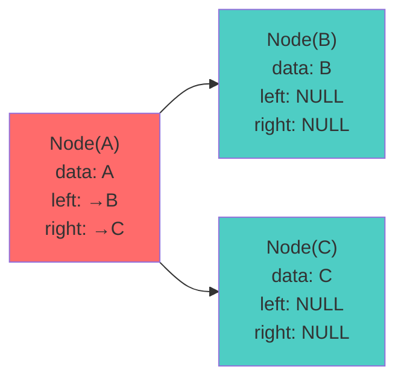
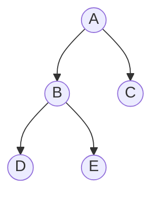

# 🔗 Linked Representation of Binary Trees - Complete Guide

## Introduction

Linked Representation stores nodes as separate objects with explicit pointers to left and right children. This is the **most flexible and commonly used** representation in practice.

> **Real-World Use**: Expression trees, search trees (BST, AVL), syntax trees, DOM trees in browsers

---

## Node Structure

### Basic Definition

```cpp
// C++ Implementation
struct Node {
    int data;           // Data
    struct Node* left;  // Pointer to left child
    struct Node* right; // Pointer to right child
};
```

### Memory Layout



---

## Complete Example: Building a Tree

### Tree Structure


### Code Implementation

```cpp
struct Node {
    char data;
    Node* left;
    Node* right;
    
    Node(char val) : data(val), left(NULL), right(NULL) {}
};

// Create tree
Node* root = new Node('A');
root->left = new Node('B');
root->right = new Node('C');
root->left->left = new Node('D');
root->left->right = new Node('E');
```

### Node Allocation in Memory

| Address | Node | Data | left pointer | right pointer |
|:---:|:---:|:---:|:---:|:---:|
| 0x1000 | root | A | 0x2000 | 0x3000 |
| 0x2000 | Node B | B | 0x4000 | 0x5000 |
| 0x3000 | Node C | C | NULL | NULL |
| 0x4000 | Node D | D | NULL | NULL |
| 0x5000 | Node E | E | NULL | NULL |

---

## NULL Pointer Analysis

### Theorem: Number of NULL Pointers

For a binary tree with **n nodes**, the total number of pointers is **2n** (each node has 2 pointers).

Since there are **n nodes connected** (each new node adds 1 incoming edge):
- **Edges used**: n - 1 (tree has n-1 edges)
- **NULL pointers**: 2n - (n-1) = **n + 1**

### Proof by Induction

**Base case** (n=1): 
- Single node: 2 pointers, both NULL → 2 = 1+1 ✓

**Inductive step** (assume true for tree T with k nodes):
- Adding node to T: new tree has k+1 nodes
- We replace 1 NULL pointer with pointer to new node
- New NULL count: (k+1) + 1 - 1 + 1 = k + 2 ✓

### Example Verification

Tree with 5 nodes (A, B, C, D, E):
- Total pointers: 2 × 5 = 10
- Used pointers (edges): 4
- NULL pointers: 10 - 4 = **6 = 5 + 1** ✓

---

## Java Implementation

```java
public class TreeNode {
    int data;
    TreeNode left;
    TreeNode right;
    
    public TreeNode(int val) {
        this.data = val;
        this.left = null;
        this.right = null;
    }
}

public class BinaryTree {
    TreeNode root;
    
    public void insert(int val) {
        if (root == null) {
            root = new TreeNode(val);
        } else {
            insertHelper(root, val);
        }
    }
    
    private void insertHelper(TreeNode node, int val) {
        if (node.left == null) {
            node.left = new TreeNode(val);
        } else if (node.right == null) {
            node.right = new TreeNode(val);
        } else {
            insertHelper(node.left, val);
        }
    }
}
```

---

## Array vs. Linked Representation Comparison

### Comprehensive Comparison Table

| Feature | Array (1-based) | Linked |
|:---|:---:|:---:|
| **Space for Complete Tree** | O(n) exact | O(n) exact |
| **Space for Skewed Tree** | O(2^h) wasteful | O(n) no waste |
| **Parent Access** | O(1) formula | O(n) worst case |
| **Child Access** | O(1) formula | O(1) pointer |
| **Insert Node** | O(n) reallocation | O(h) average |
| **Delete Node** | O(n) reallocation | O(h) average |
| **Traversal** | O(n) cache friendly | O(n) pointer chase |
| **Memory Overhead** | None | 2 pointers per node |
| **Cache Efficiency** | Excellent (sequential) | Poor (scattered) |
| **Flexibility** | Limited (complete only) | Complete flexibility |
| **Insertion Pattern** | Level-order sequential | Any insertion point |
| **Implementation** | Simple math | Pointer management |

---

## Space Complexity Analysis

### Linked Representation Space

For a tree with **n nodes**:

$$\text{Space} = \text{(Data + 2 Pointers)} \times n$$

Assuming:
- Data: 4 bytes
- Pointer: 8 bytes (64-bit system)

$$\text{Total} = (4 + 16) \times n = 20n \text{ bytes}$$

For 1,000,000 nodes: **20 MB**

### Space Comparison

**Complete Binary Tree with 1 Million Nodes**:

| Representation | Space | Why |
|:---|:---:|:---|
| **Array** | 4 MB | Just integers, no pointers |
| **Linked** | 20 MB | Integers + 2 pointers each |
| **Overhead** | 5× | Pointers add significant cost |

**Skewed Tree with 1 Million Nodes**:

| Representation | Space | Why |
|:---|:---:|:---|
| **Array** | > 1 TB | Needs 2^20 million slots! |
| **Linked** | 20 MB | Only stores existing nodes |
| **Advantage** | 50M× | Linked is vastly superior |

---

## Traversal Implementation

### In-Order Traversal (Linked)

```cpp
void inOrder(Node* node) {
    if (node == NULL) return;
    
    inOrder(node->left);           // O(h) pointer chasing
    cout << node->data << " ";     // O(1) process
    inOrder(node->right);          // O(h) pointer chasing
}
// Total: O(n) time, O(h) space (recursion stack)
```

### Level-Order Traversal (Linked)

```cpp
void levelOrder(Node* root) {
    queue<Node*> q;
    q.push(root);
    
    while (!q.empty()) {
        Node* curr = q.front();
        q.pop();
        cout << curr->data << " ";
        
        if (curr->left) q.push(curr->left);
        if (curr->right) q.push(curr->right);
    }
}
// Time: O(n), Space: O(w) where w = max width
```

---

## Real-World Applications

### 1. Binary Search Trees (BST)

```cpp
class BST {
    Node* root;
    
public:
    void insert(int val) {
        root = insertBST(root, val);
    }
    
private:
    Node* insertBST(Node* node, int val) {
        if (node == NULL) return new Node(val);
        
        if (val < node->data)
            node->left = insertBST(node->left, val);
        else
            node->right = insertBST(node->right, val);
        
        return node;
    }
};
```

**Advantage**: Linked representation allows **dynamic insertion** without array resizing

### 2. Expression Trees

Parse mathematical expressions:
```
    +
   / \
  *   3
 / \
2   5
```

Represents: (2 * 5) + 3

### 3. DOM Trees (Web Browsers)

HTML structure uses linked representation for flexibility

### 4. Syntax Trees (Compilers)

AST (Abstract Syntax Tree) for parsing code uses linked representation

---

## Comparison Case Study: 1 Billion Node Tree

### Scenario: Store 1 billion nodes

**Array Representation** (if complete):
- Space: 4 bytes × 10^9 = 4 GB
- Access time: O(1) index lookup

**Linked Representation**:
- Space: 20 bytes × 10^9 = 20 GB
- Access time: O(h) pointer chasing = O(30) for balanced tree
- Flexibility: Can add/remove anywhere

### Decision Criteria

Use **Array** if:
- Tree is complete binary tree
- Memory is limited
- Random access common

Use **Linked** if:
- Tree is arbitrary shape
- Dynamic insertion/deletion needed
- Flexibility over space efficiency

---

## Advanced: Threaded Binary Trees

**Problem**: Traversal requires recursive stack space O(h)

**Solution**: Use unused NULL pointers to thread back to parent/successor

```cpp
struct ThreadedNode {
    int data;
    ThreadedNode* left;
    ThreadedNode* right;
    bool leftThread;   // true if left is thread (not child)
    bool rightThread;  // true if right is thread (not child)
};
```

**Benefit**: O(1) traversal to next node without recursion

---

## Memory Management Concerns

### Potential Pitfalls

**1. Memory Leaks**
```cpp
// WRONG: Deleting only root leaves children
delete root;  // Children still allocated!

// RIGHT: Post-order delete
void deleteTree(Node* node) {
    if (node == NULL) return;
    deleteTree(node->left);
    deleteTree(node->right);
    delete node;
}
```

**2. Dangling Pointers**
```cpp
Node* getNode() {
    Node* temp = new Node(5);
    return temp;  // OK - caller owns
}

void badFunction() {
    Node* ptr = getNode();
    delete ptr;
    ptr->data = 10;  // CRASH: dangling pointer!
}
```

**3. Use Smart Pointers (Modern C++)**
```cpp
struct Node {
    int data;
    unique_ptr<Node> left;
    unique_ptr<Node> right;
    
    Node(int val) : data(val) {}
};
// Automatic cleanup!
```

---

## 🎓 Practice Exercises

**Exercise 1**: Count total and NULL pointers for 8-node tree
- Total: 16, Used: 7, NULL: 9 = 8+1 ✓

**Exercise 2**: Build linked tree from array `[1,2,3,4,5,6,7]`

**Exercise 3**: Compute space comparison for 100 nodes
- Linked: 2000 bytes, Array (complete): 400 bytes

**Exercise 4**: Write comprehensive deleteTree function

**Exercise 5**: Implement findHeight for linked trees

**Exercise 6**: Convert BST insert algorithm to use linked pointers

---

## Key Takeaways

1. **Flexibility**: Can represent any tree shape
2. **NULL Pointer Formula**: n+1 NULL pointers for n node tree
3. **Space Trade-off**: Uses pointers but no unused slots
4. **Dynamic Operations**: Insertion/deletion without resizing
5. **Traversal Cost**: O(n) time but may need recursion stack O(h)
6. **Real-World Use**: Primary representation for BSTs, expression trees, DOM
7. **Memory Management**: Must carefully handle allocation/deallocation
8. **Comparison**: Better than array for arbitrary trees, worse for complete trees
