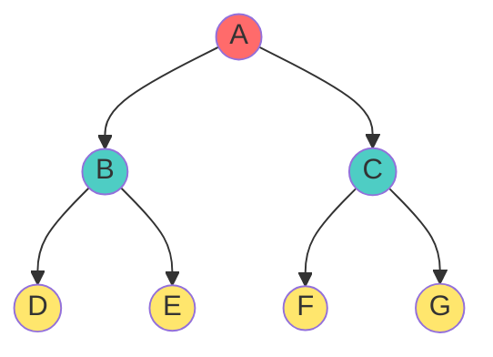
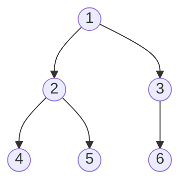
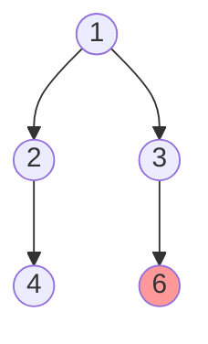

# 🏁 Full vs. Complete Binary Tree - Complete Guide

## Introduction

**Full** (Perfect) and **Complete** binary trees are two different but related classifications. Understanding their distinction is critical for data structures like **heaps**, **segment trees**, and **array representation**.

> **Real-World**: Heaps use complete binary trees for optimal performance. Perfect binary trees appear in theoretical analysis.

---

## Full (Perfect) Binary Tree

### Definition

A Full Binary Tree (also called Perfect Binary Tree) is a binary tree where:
- **All internal nodes have exactly 2 children**
- **All leaf nodes are at the same level h**
- **Every level is completely filled**

### Mathematical Properties

For a Full Binary Tree with **height h**:

$$\text{Total Nodes} = n = 2^{h+1} - 1$$

$$\text{Leaf Nodes} = 2^h$$

$$\text{Internal Nodes} = 2^h - 1$$

### Derivation

**Level-wise node count**:
- Level 0: 1 node
- Level 1: 2 nodes
- Level 2: 4 nodes
- Level k: 2^k nodes

**Total nodes up to level h**:
$$n = 1 + 2 + 4 + ... + 2^h = \sum_{i=0}^{h} 2^i = \frac{2^{h+1}-1}{2-1} = 2^{h+1} - 1$$

### Visual Examples

**Height h=2 (7 nodes)**:


Array: `[A, B, C, D, E, F, G]` - **No gaps!**

**Height h=3 (15 nodes):**
- Total: 2^4 - 1 = 15
- Leaf nodes: 2^3 = 8
- All 15 indices filled in array representation

### Key Insight: Internal Nodes

For strict trees (every node has 0 or 2 children):
$$\text{Internal Nodes} = 2^h - 1$$
$$\text{Leaf Nodes} = 2^h$$
$$\text{Ratio} = e = i + 1$$

---

## Complete Binary Tree

### Definition

A Complete Binary Tree is a binary tree where:
- **All levels are completely full EXCEPT possibly the last level**
- **The last level is filled strictly LEFT-TO-RIGHT**
- **No gaps between array indices 1 and n**

### Key Distinction from Full Trees

| Full Tree | Complete Tree |
|:---|:---|
| **All** levels full | All except last level full |
| h height → 2^(h+1)-1 nodes | h height → can have fewer nodes in last level |
| Example: 7, 15, 31 nodes | Example: 7, 8, 9, 10, 11, 12, 13, 14 nodes |

### Visual Example 1: Valid Complete Tree



Array (1-indexed): `[1, 2, 3, 4, 5, 6]` - **perfect mapping!**

### Visual Example 2: Invalid (Gaps in Array)



Array representation would need: `[1, 2, 3, 4, _, 6]`

Gap at index 5! **NOT COMPLETE** ❌

### Complete Tree Verification Algorithm

For array representation, verify:
1. Consecutive indices: 1, 2, 3, ..., n
2. No gaps or holes
3. Last node fills left-to-right

```cpp
bool isCompleteTree(vector<int>& arr) {
    int n = arr.size();
    // Check if indices are consecutive (1-based)
    for (int i = 0; i < n; i++) {
        if (arr[i] == EMPTY) return false;  // Gap found
    }
    return true;
}
```

---

## Detailed Comparison Table

| Feature | Full (Perfect) | Complete |
|:---|:---:|:---:|
| All levels completely full | ✓ | ✗ (except last) |
| Last level filled left-to-right | N/A | ✓ **Required** |
| No array gaps | ✓ | ✓ |
| Possible node counts | 2^(h+1)-1 only | Variable: 2^h to 2^(h+1)-1 |
| Example (h=2) | 7 nodes | 4-7 nodes |
| Memory efficiency | Worst (forces full) | Best (no wasted slots) |
| Height for n nodes | log₂(n+1)-1 | ⌊log₂(n)⌋ |

---

## Real-World Applications

### 1. Heaps (Priority Queues)

**Min-Heap Example** (Complete, not necessarily Full):
```
Min-Heap:       Array:
      1         [1, 3, 2, 7, 4, 8, 5]
     / \
    3   2
   / \ / \
  7  4 8  5
```

- **Always complete**: enables efficient array storage
- **Not always full**: heap height = ⌊log₂(n)⌋

```cpp
class MinHeap {
    vector<int> heap;
    
public:
    void insert(int val) {
        heap.push_back(val);
        bubbleUp(heap.size() - 1);
    }
    
private:
    void bubbleUp(int i) {
        while (i > 0 && heap[i] < heap[(i-1)/2]) {
            swap(heap[i], heap[(i-1)/2]);
            i = (i-1)/2;
        }
    }
};
```

**Why complete trees?**
- Predictable structure
- Fast parent/child access
- Minimal wasted space
- Height guaranteed O(log n)

### 2. Segment Trees

Segment trees are stored as arrays and maintain complete structure for efficient indexing.

### 3. Binary Indexed Trees (Fenwick)

These use complete tree structure for range queries in O(log n)

---

## Height Analysis

### Full Binary Tree

Height h always has exactly **2^(h+1) - 1 nodes**:

$$h = \log_2(n+1) - 1$$

### Complete Binary Tree

Height h with n nodes:

$$h = \lfloor \log_2(n) \rfloor$$

### Height Comparison Example

| Nodes | Full Height | Complete Height |
|:---:|:---:|:---:|
| 1 | 0 | 0 |
| 2-3 | 1 | 1 |
| 4-7 | 2 | 2 |
| 8-15 | 3 | 3 |
| 16-31 | 4 | 4 |
| 1 million | 20 | 20 |

---

## Terminology Confusion Clarification

### Different Literature Conventions

**Convention 1 (Common in Indian universities)**:
- "Full Binary Tree" = Every node has 0 or 2 children (Strict)
- "Complete Binary Tree" = All levels full except possibly last

**Convention 2 (CLRS textbook)**:
- "Perfect Binary Tree" = All levels completely full
- "Complete Binary Tree" = All levels full except possibly last

**This guide uses Convention 1** (most common in DSA courses)

---

## 🎓 Practice Exercises

**Exercise 1**: Find height of full binary tree with 31 nodes
- n = 31 = 2^5 - 1
- h = 5 - 1 = 4

**Exercise 2**: How many nodes in complete tree with height 4?
- Min: 2^4 = 16 (last level has 1 node)
- Max: 2^5 - 1 = 31 (last level full)
- Answer: 16-31 nodes possible

**Exercise 3**: Is tree from array [1,2,3,4,_,6,7] complete?
- Answer: NO - gap at index 5

**Exercise 4**: Max number of leaves in complete tree with n nodes?
- Last level can have at most ⌈n/2⌉ leaves (when tree is complete)

**Exercise 5**: Minimum height for 100 nodes  
- Complete tree: h = ⌊log₂(100)⌋ = 6
- Full tree: 2^7 - 1 = 127 needed, so not possible with exactly 100

**Exercise 6**: Implement heap operations on complete tree
- Insert: add at end, bubble up
- Delete min: swap root with last, remove last, bubble down

---

## Implementation: Complete Tree Struct

```cpp
class CompleteTree {
    vector<int> nodes;
    
public:
    void insert(int val) {
        nodes.push_back(val);
    }
    
    int parent(int i) {
        return (i - 1) / 2;
    }
    
    int leftChild(int i) {
        return 2 * i + 1;
    }
    
    int rightChild(int i) {
        return 2 * i + 2;
    }
    
    bool isComplete() {
        // Complete if no gaps in array
        for (int i = 0; i < nodes.size(); i++) {
            if (nodes[i] == NULL_VALUE) return false;
        }
        return true;
    }
};
```

---

## Key Takeaways

1. **Full = All levels full**: 2^(h+1)-1 nodes exactly
2. **Complete = All except last, filled left-to-right**: more flexible
3. **Array representation**: Both work perfectly, but complete is more practical
4. **Height difference**: Small for practical sizes (max 1 level difference)
5. **Heaps use complete**: For optimal memory + speed trade-off
6. **Perfect terminology**: Varies by textbook (use context carefully)
7. **Real-world impact**: Complete trees dominate (heaps, priority queues)
8. **Verification**: Check no gaps in array indices for complete property
