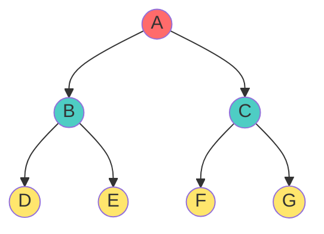
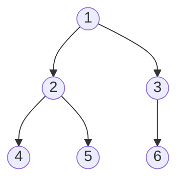
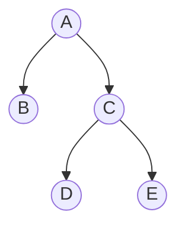
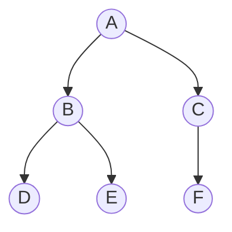
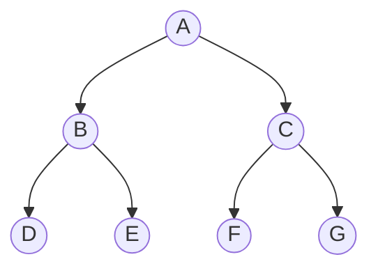
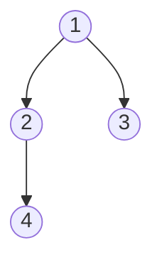

# 📚 Strict vs. Complete Terminology - The Ultimate Clarity Guide

## The Central Confusion Problem

This is the **most confusing topic** in tree terminology because **different textbooks use different definitions**. This guide resolves the confusion systematically.

### Two Independent Concepts

These are **orthogonal properties** - a tree can be:
1. **Strict but not Complete** ✓
2. **Complete but not Strict** ✓
3. **Both Strict AND Complete** ✓
4. **Neither Strict nor Complete** ✓

---

## Strict Binary Trees (Degree-Based Definition)

### Definition

A **Strict Binary Tree** (also called Proper Binary Tree in some texts) is a tree where:
- **Every node has EXACTLY 0 or 2 children**
- **No node can have exactly 1 child**
- Internal nodes: degree = 2
- Leaf nodes: degree = 0

### Mathematical Properties

For Strict Binary Trees:
- **Key formula**: Leaf nodes = Internal nodes + 1
- **Algebraic proof**: n₂ = n₀ or e = i + 1

### Visual Example



- Nodes A, B, C: each has **exactly 2 children** ✓
- Nodes D, E, F, G: each has **0 children** (leaves) ✓
- **No node with 1 child!** ✓
- Strict? **YES** ✓

### Array Representation

Same 7-node tree as array:
```
Index: [1, 2, 3, 4, 5, 6, 7]
Array: [A, B, C, D, E, F, G]
```

**Important**: Strict trees CAN have gaps if not perfectly filled!

---

## Complete Binary Trees (Position-Based Definition)

### Definition

A **Complete Binary Tree** (in standard DSA terminology) is a tree where:
- **All levels are completely filled EXCEPT possibly the last level**
- **The last level is filled strictly LEFT-TO-RIGHT**
- **Array representation has NO GAPS between index 1 and n**

### Visual Example



Array (1-indexed): `[1, 2, 3, 4, 5, 6]`

- No gaps between indices ✓
- All levels except last full ✓
- Complete? **YES** ✓

---

## Case 1: Strict But NOT Complete

### Tree Structure



### Analysis

**Degree check** (for Strict):
- Node A: 2 children (B, C) ✓
- Node B: 0 children (leaf) ✓
- Node C: 2 children (D, E) ✓
- Node D: 0 children (leaf) ✓
- Node E: 0 children (leaf) ✓
- **All degrees in {0, 2}** → **STRICT** ✓

**Array representation**:
```
Index:  1   2   3   4   5
Array: [A] [B] [C] [D] [E]
```

Wait - actually this IS complete! Let me give a better example:

**Better non-complete strict tree**:


Array would need:
```
Index:  1   2   3   4   5   6   7
Array: [A] [B] [C] [D] [E] [F] [_]
```

- **Strict?** A has 2 (B,C), B has 2 (D,E), C has 1 (F) → **NOT STRICT** ✗

**Actual Strict-but-not-Complete example** (harder to find):



This is **BOTH** strict and complete! Because strict trees are rare without being complete.

**The key insight**: A strict tree with n nodes must have n = 2m + 1 (odd number). So if we fill levels 1,2,...,k completely and end there, we get a full/perfect tree (which is complete).

---

## Case 2: Complete But NOT Strict

### Tree Structure



### Analysis

**Degree check** (for Strict):
- Node 1: 2 children ✓
- Node 2: 1 child (only D, no right child) **← PROBLEM!**
- Node 3: 0 children ✓
- Node 4: 0 children ✓
- **Node 2 has degree 1** → **NOT STRICT** ✗

**Array representation**:
```
Index:  1   2   3   4
Array: [1] [2] [3] [4]
```

- **No gaps** from index 1 to 4 ✓
- **Complete?** YES ✓

**But NOT Strict** because Node 2 has exactly 1 child!

---

## Detailed Comparison Table

### Orthogonal Properties Matrix

| | Strict ✓ | Not Strict ✗ |
|:---|:---:|:---:|
| **Complete ✓** | Perfect tree (Strict Perfect) | Heap structure (Variable last level) |
| **Not Complete ✗** | Rare/unusual (odd gaps) | General tree (any shape) |

### Feature-by-Feature Comparison

| Feature | Strict | Complete |
|:---|:---:|:---:|
| **Definition basis** | Node degree | Array position |
| **Degree constraint** | Every node: 0 or 2 children | No degree constraint |
| **Leaf formula** | e = i + 1 always | e ∈ [i+1, 2i+1] |
| **Last level** | Must be completely full | Can be partial |
| **Array gaps** | May have gaps | Never has gaps |
| **# of nodes** | Must be odd (2m+1) | Can be any number |
| **Height for n** | n = 2^(h+1)-1 exactly | h = ⌊log₂n⌋ |
| **Real-world use** | Huffman coding, tourneys | Heaps, priority queues |
| **Memory efficient** | Only for full trees | Always efficient |

---

## Literature Conventions Clarification

### Convention Alert ⚠️

Different textbooks use different terminology:

**Convention A** (This guide):
- **Strict**: degree ∈ {0, 2}
- **Complete**: no gaps in array
- **Perfect**: all levels full (2^(h+1)-1 nodes)

**Convention B** (Some Indian textbooks):
- **Full**: degree ∈ {0, 2}
- **Complete**: degree ∈ {0, 2} (same as Strict!)
- **Perfect**: all levels full

**Convention C** (CLRS textbook):
- **Perfect**: all levels full
- **Complete**: all levels full except possibly last
- (No dedicated term for degree ∈ {0, 2})

### Which Convention?

**Recommended**: Use Convention A (this guide) and clarify in exams/projects

**In exams**: Check the textbook or ask the professor!

---

## Real-World Applications

### Strict Binary Trees

**1. Huffman Coding**
```
Encoding: A=00, B=01, C=10, D=11
         /\
        /  \
       /\   /\
      A  B C  D
```
- Every merge creates 2 subtrees
- Strict tree structure guaranteed
- Optimal compression

**2. Tournament Brackets**
```
Final
  ↓
Semifinals (winners)
  ↓
Quarters (winners)
```
- Each match produces 1 winner (goes to next level)
- Combining matches creates pairing structure
- Natural strict tree

### Complete Binary Trees

**1. Min-Heaps**
```cpp
int parent = (i-1)/2;
int leftChild = 2*i+1;
int rightChild = 2*i+2;
```
- Array storage friendly
- Last level partially filled
- Complete structure guaranteed by insertion rule

**2. Max-Heaps for Priority Queues**
- Same as min-heap but comparison reversed

**3. Segment Trees**
- Complete binary tree structure for array indices
- Efficient range queries: O(log n)

---

## Verification Algorithms

### Check if Strict

```cpp
bool isStrict(Node* node) {
    if (node == NULL) return true;
    
    // Count non-NULL children
    int childCount = 0;
    if (node->left != NULL) childCount++;
    if (node->right != NULL) childCount++;
    
    // Degree must be 0 or 2
    if (childCount == 1) return false;
    
    return isStrict(node->left) && isStrict(node->right);
}
```

### Check if Complete (Array-based)

```cpp
bool isComplete(vector<Node*>& arr) {
    int n = arr.size();
    
    // Check for gaps
    for (int i = 0; i < n; i++) {
        if (arr[i] == NULL) {
            // Found gap - check that all remaining are NULL
            for (int j = i + 1; j < n; j++) {
                if (arr[j] != NULL) return false;
            }
            break;
        }
    }
    return true;
}
```

### Check if Complete (Pointer-based)

```cpp
pair<bool, int> checkComplete(Node* node) {
    if (node == NULL) return {true, 0};
    
    auto [leftComplete, leftHeight] = checkComplete(node->left);
    auto [rightComplete, rightHeight] = checkComplete(node->right);
    
    // For complete: heights differ by at most 1
    if (abs(leftHeight - rightHeight) > 1) return {false, 0};
    
    // Additional checks for value node ordering
    bool complete = leftComplete && rightComplete;
    int height = max(leftHeight, rightHeight) + 1;
    
    return {complete, height};
}
```

---

## 🎓 Practice Exercises

**Exercise 1**: Show a tree that is Strict AND Complete
- Answer: Any perfect binary tree (all levels full)

**Exercise 2**: Show a tree that is Complete but NOT Strict
- Answer: Array `[1,2,3,4]` where node 2 has only left child

**Exercise 3**: Can a Strict tree be NOT Complete?
- Answer: Yes theoretically, but practically rare (forces odd nodes)

**Exercise 4**: How many nodes if Strict AND heights=3?
- Answer: n = 2^4 - 1 = 15 (must be perfect)

**Exercise 5**: Build complete but non-strict tree with 5 nodes
```
    1
   / \
  2   3
 / \
4   5
```
Check: Array [1,2,3,4,5] (complete), Node 2 has 1 child only (not strict)

**Exercise 6**: For heap with 100 nodes, is it Strict?
- Answer: NO - some nodes have 1 child in last level

---

## Key Takeaways

1. **Independent properties**: Strict ≠ Complete (can have either, both, or neither)
2. **Strict definition**: degree ∈ {0, 2} (structure constraint)
3. **Complete definition**: no gaps in array (position constraint)
4. **Perfect trees**: BOTH strict and complete simultaneously
5. **Heaps are Complete**: not necessarily Strict (last level partially filled)
6. **Terminology trap**: Different textbooks define differently!
7. **Real-world**: Complete dominates (heaps), Strict is theoretical
8. **Verification**: Different algorithms for pointer vs. array representation
