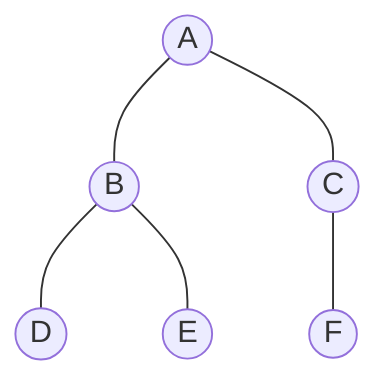

# 🌊 Level Order Traversal (Breadth-First Search)

**Level Order Traversal** visits every node in the tree level by level, from left to right. It is a **Breadth-First Search (BFS)** strategy, fundamentally different from the DFS-based Pre/In/Post-order traversals.

---

## 💡 Why a Queue?
DFS traversals use a **Stack** (via recursion). Level Order requires visiting neighbours before going deeper, so we use a **Queue (FIFO)**.

### The Algorithm:
1. **Enqueue** the root.
2. While the queue is not empty:
   a. **Dequeue** the front node and **visit it**.
   b. **Enqueue** its **left child** (if it exists).
   c. **Enqueue** its **right child** (if it exists).

---

## 📸 Visual Dry Run


### Step-by-Step Queue Simulation:
| Step | Action | Queue State (Front → Back) | Visited |
| :---: | :--- | :--- | :--- |
| 1 | Enqueue Root | `[A]` | — |
| 2 | Dequeue A, Enqueue B, C | `[B, C]` | A |
| 3 | Dequeue B, Enqueue D, E | `[C, D, E]` | A, B |
| 4 | Dequeue C, Enqueue F | `[D, E, F]` | A, B, C |
| 5 | Dequeue D (no children) | `[E, F]` | A, B, C, D |
| 6 | Dequeue E (no children) | `[F]` | A, B, C, D, E |
| 7 | Dequeue F (no children) | `[]` | A, B, C, D, E, F |

**Result:** `A → B → C → D → E → F` ✅

---

## 💻 C++ Implementation

```cpp
#include <iostream>
#include <queue>
using namespace std;

struct Node {
    int data;
    Node *lchild, *rchild;
};

// Level Order Traversal using a Queue
void levelorder(Node *root) {
    if (!root) return;

    queue<Node*> q;
    q.push(root);     // Enqueue the root

    while (!q.empty()) {
        Node *curr = q.front();
        q.pop();

        cout << curr->data << " "; // Visit

        if (curr->lchild) q.push(curr->lchild); // Enqueue left
        if (curr->rchild) q.push(curr->rchild); // Enqueue right
    }
}
```

---

## 📊 Time and Space Complexity
| Property | Complexity |
| :--- | :--- |
| **Time** | $O(n)$ – Every node is enqueued and dequeued exactly once |
| **Space** | $O(w)$ – Where $w$ is the **maximum width** of the tree (worst case: $O(n)$ for a complete tree) |

---

## 🆚 DFS vs. BFS Comparison
| Feature | DFS (Pre/In/Post) | BFS (Level Order) |
| :--- | :--- | :--- |
| **Data Structure** | Stack (implicit/recursion) | Queue (explicit) |
| **Explores** | Branch by branch (depth first) | Level by level |
| **Use Case** | Searching paths, expression trees | Shortest path, serialisation |
