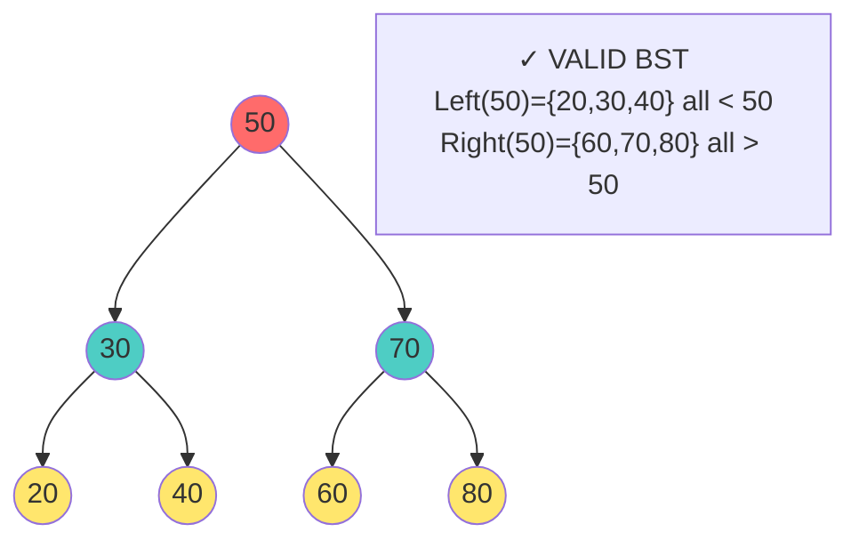
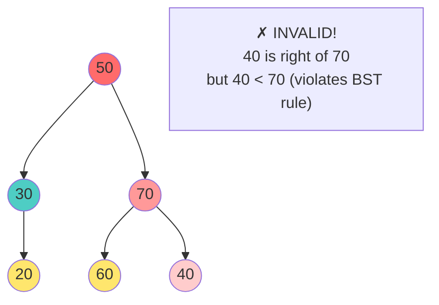
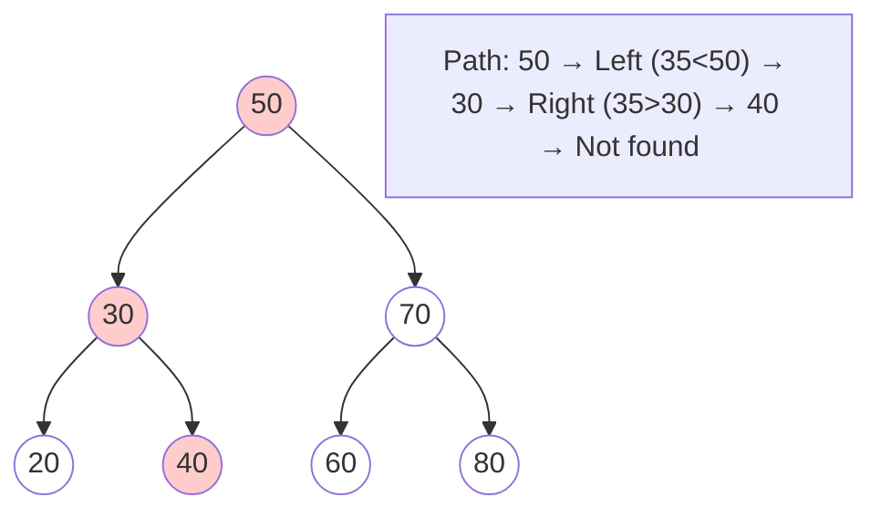
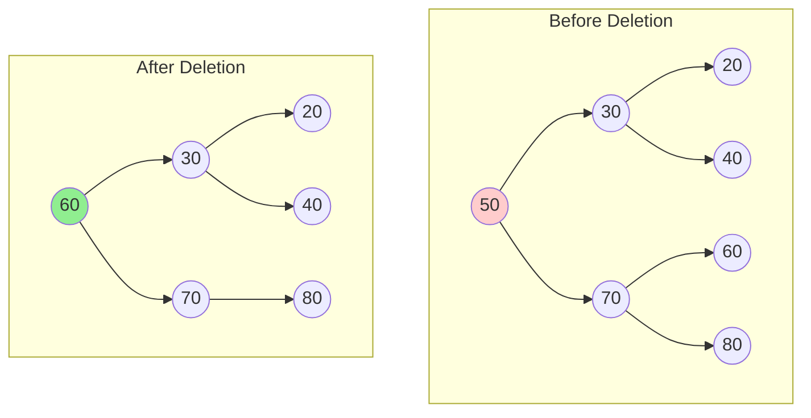
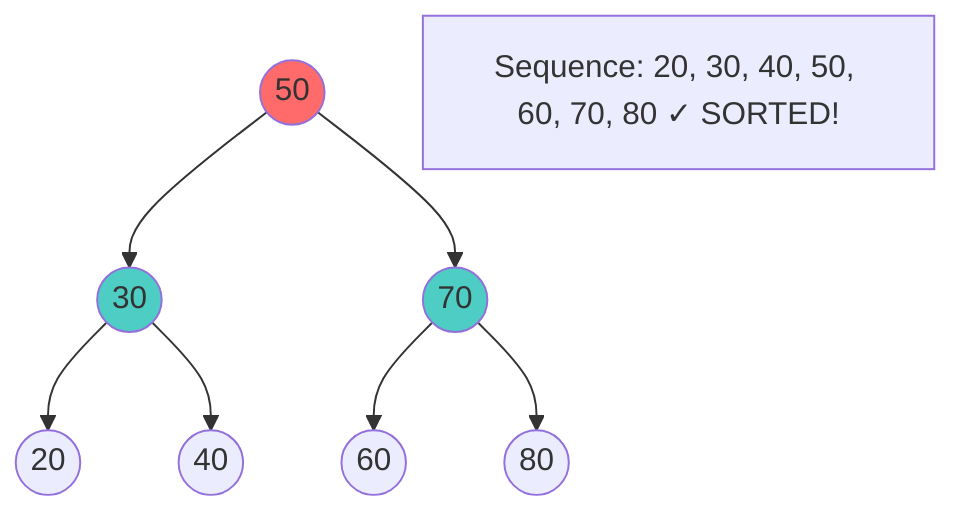
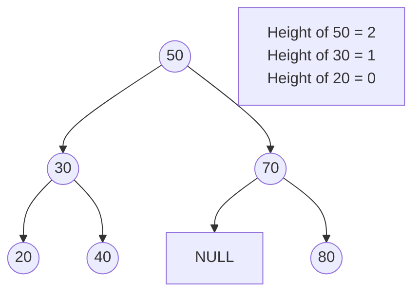

# 🌳 Binary Search Trees (BST) - Complete Comprehensive Guide

## 📚 Table of Contents
1. [Foundation Concepts](#foundation-concepts)
2. [Core Operations (All 10+)](#all-operations)
3. [Visual Graphs for Each Operation](#visual-graphs)
4. [Complete C++ Implementation](#implementation)
5. [Edge Cases & Special Scenarios](#edge-cases)

---

## Foundation Concepts

### What is a Binary Search Tree?

A tree where:
- Each node has **≤ 2 children** (left & right)
- **Left subtree < Node < Right subtree** (ALL nodes, recursively)
- No duplicates (typically)

### Visual Property Explanation



### Invalid BST Example



---

## All Operations (10+)

### 1. SEARCH

#### Concept
Find if a value exists in the tree.

#### Visual Example: Search for 35



#### Algorithm
```cpp
bool search(Node* node, int value) {
    if (node == NULL) return false;      // Not found
    if (node->data == value) return true; // Found!
    
    if (value < node->data)
        return search(node->left, value);  // Go left
    else
        return search(node->right, value); // Go right
}
```

**Time**: O(log n) avg, O(n) worst  
**Space**: O(h) where h = height

---

### 2. INSERT

#### Concept
Add a new value maintaining BST property.

#### Visual Example: Inserting 25, then 35

```
Step 1: Insert 25
          50              50
        /    \          /    \
      30      70   →  30      70
     / \             / \ 
    20 40           20  40
                   /
                  25

Step 2: Insert 35
          50
        /    \
      30      70
     / \      / \
    20  40   60  80
   /    /
  25   35
```

#### Algorithm
```cpp
Node* insert(Node* node, int value) {
    if (node == NULL) {
        return new Node(value);  // Create new node
    }
    
    if (value < node->data) {
        node->left = insert(node->left, value);
    } 
    else if (value > node->data) {
        node->right = insert(node->right, value);
    }
    // Ignore duplicates
    
    return node;
}
```

**Time**: O(log n) avg, O(n) worst  
**Space**: O(h) recursive

---

### 3. DELETE - Case 0: No Children (Leaf)

#### Visual Example

```
Before:                After:
      50                    50
    /    \              /      \
  30      70    →      30       70
 / \                   /  \
20  40                40   (null)
  \
   35

Delete 35: Just remove it!
```

#### Code
```cpp
if (node->left == NULL && node->right == NULL) {
    delete node;
    return NULL;
}
```

---

### 4. DELETE - Case 1: One Child

#### Visual Example - Node with Right Child

```
Before:                After:
      50                    50
    /    \              /      \
  30      70    →      25       70
 /                           /  \
25                         (null) 60

Delete 30: Replace with its child (25)
```

#### Visual Example - Node with Left Child

```
Before:                 After:
      50                     50
    /    \              /       \
  35      70    →      30        70
   /                   / \
  30                 (null)(null)

Delete 35: Replace with its child (30)
```

#### Code
```cpp
// Has only right child
if (node->left == NULL) {
    Node* temp = node->right;
    delete node;
    return temp;
}

// Has only left child
if (node->right == NULL) {
    Node* temp = node->left;
    delete node;
    return temp;
}
```

---

### 5. DELETE - Case 2: Two Children (Complex!)

#### Concept
**In-order Successor Method**: Replace node with smallest value from right subtree

#### Visual Example: Delete 50

```
Before:
          50 ← DELETE
        /    \
      30      70
     / \      / \
    20  40   60  80

Step 1: Find in-order successor (min in right subtree)
        Go to right child (70)
        Find minimum: 60
        
Step 2: Copy successor value
          60 ← Now root
        /    \
      30      70
     / \       \
    20  40     80

Step 3: Delete original successor (60)
          60
        /    \
      30      70
     / \       \
    20  40     80
```

#### Visual Step-by-Step



#### Code
```cpp
// Case: Two children
Node* minNode = node->right;           // Go right
while (minNode->left != NULL) {        // Find min
    minNode = minNode->left;
}

node->data = minNode->data;            // Copy value
node->right = deleteNode(node->right, minNode->data);  // Delete successor

return node;
```

**Why in-order successor?** It's the smallest value larger than current node, so it maintains BST property!

---

### 6. INORDER TRAVERSAL

#### Concept
Left → Node → Right (produces **sorted output**)

#### Visual with Numbers



#### Algorithm
```cpp
void inorder(Node* node) {
    if (node == NULL) return;
    
    inorder(node->left);       // Left
    cout << node->data << " "; // Node
    inorder(node->right);      // Right
}
```

**Output**: Sorted sequence!

---

### 7. PREORDER TRAVERSAL

#### Concept
Node → Left → Right (useful for copying trees)

```
          50
        /    \
      30      70
     / \      / \
    20  40   60  80

Sequence: 50, 30, 20, 40, 70, 60, 80

(Root first, then descendants)
```

#### Algorithm
```cpp
void preorder(Node* node) {
    if (node == NULL) return;
    
    cout << node->data << " "; // Node
    preorder(node->left);      // Left
    preorder(node->right);     // Right
}
```

---

### 8. POSTORDER TRAVERSAL

#### Concept
Left → Right → Node (useful for deletion)

```
          50
        /    \
      30      70
     / \      / \
    20  40   60  80

Sequence: 20, 40, 30, 60, 80, 70, 50

(Children first, then root)
```

#### Algorithm
```cpp
void postorder(Node* node) {
    if (node == NULL) return;
    
    postorder(node->left);      // Left
    postorder(node->right);     // Right
    cout << node->data << " ";  // Node
}
```

---

### 9. FIND MINIMUM VALUE

#### Concept
Smallest value = **keep going LEFT**

```
          50
        /    \
      30      70
     / \      / \
    20←←←     60  80 ← minimum path
   /    \
  10← ←  25

Minimum: 10
```

#### Algorithm
```cpp
int findMin(Node* node) {
    if (node == NULL) return -1;
    
    while (node->left != NULL)
        node = node->left;
    
    return node->data;
}
```

**Time**: O(h) where h = height

---

### 10. FIND MAXIMUM VALUE

#### Concept
Largest value = **keep going RIGHT**

```
          50
        /    \
      30      70
     / \      / \
    20  40   60  80→→ ← maximum path
          \      \
           50     90→

Maximum: 90
```

#### Algorithm
```cpp
int findMax(Node* node) {
    if (node == NULL) return -1;
    
    while (node->right != NULL)
        node = node->right;
    
    return node->data;
}
```

**Time**: O(h)

---

### 11. FIND HEIGHT

#### Concept
Longest path from node to leaf



#### Algorithm
```cpp
int height(Node* node) {
    if (node == NULL) return -1;  // Empty subtree
    
    int leftHeight = height(node->left);
    int rightHeight = height(node->right);
    
    return max(leftHeight, rightHeight) + 1;
}
```

**Time**: O(n) - must visit all nodes

---

### 12. IS BALANCED BST?

#### Concept
Check if height difference ≤ 1 at every node

```
Balanced:               Unbalanced:
      50                     50
     /  \                   /
    30   70              30
   / \                  / \
  20  40               20  40
                      /
                     10
                    /
                   5
```

#### Algorithm
```cpp
int isBalanced(Node* node) {
    if (node == NULL) return 0;
    
    int leftHeight = isBalanced(node->left);
    if (leftHeight == -1) return -1;  // Already unbalanced
    
    int rightHeight = isBalanced(node->right);
    if (rightHeight == -1) return -1;  // Already unbalanced
    
    if (abs(leftHeight - rightHeight) > 1)
        return -1;  // Not balanced
    
    return max(leftHeight, rightHeight) + 1;  // Balanced
}

bool checkBalanced(Node* node) {
    return isBalanced(node) != -1;
}
```

---

### 13. VALIDATE BST

#### Concept
Ensure every node follows BST property

```cpp
bool isValidBST(Node* node, int minVal, int maxVal) {
    if (node == NULL) return true;
    
    // Check if current node violates bounds
    if (node->data <= minVal || node->data >= maxVal)
        return false;
    
    // Check left (all < node) and right (all > node)
    return isValidBST(node->left, minVal, node->data) &&
           isValidBST(node->right, node->data, maxVal);
}

// Call with: isValidBST(root, INT_MIN, INT_MAX)
```

---

### 14. FIND K-TH SMALLEST

#### Concept
Use in-order traversal → k-th element is k-th smallest

```cpp
int kthSmallest(Node* node, int& k) {
    if (node == NULL) return -1;
    
    // Go left first
    int result = kthSmallest(node->left, k);
    if (result != -1) return result;
    
    // Visit current
    k--;
    if (k == 0) return node->data;
    
    // Go right
    return kthSmallest(node->right, k);
}
```

---

### 15. LOWEST COMMON ANCESTOR (LCA)

#### Concept
Find deepest node that has both nodes as descendants

```
          50 ← LCA of (20, 40)
        /    \
      30      70
     / \      / \
    20  40   60  80

LCA(20, 40) = 30 (parent of both)
LCA(20, 60) = 50 (common ancestor)
```

#### Algorithm
```cpp
Node* LCA(Node* node, Node* p, Node* q) {
    if (node == NULL) return NULL;
    
    // Both in left subtree
    if (p->data < node->data && q->data < node->data)
        return LCA(node->left, p, q);
    
    // Both in right subtree
    if (p->data > node->data && q->data > node->data)
        return LCA(node->right, p, q);
    
    // One on left, one on right (or node is one of them)
    return node;  // This is LCA!
}
```

---

## Complete C++ Implementation

```cpp
#include <iostream>
#include <algorithm>
using namespace std;

struct Node {
    int data;
    Node* left;
    Node* right;
    
    Node(int val) : data(val), left(NULL), right(NULL) {}
};

class BST {
private:
    Node* root;
    
    // 1. Search
    bool searchHelper(Node* node, int value) {
        if (node == NULL) return false;
        if (node->data == value) return true;
        
        if (value < node->data)
            return searchHelper(node->left, value);
        else
            return searchHelper(node->right, value);
    }
    
    // 2. Insert
    Node* insertHelper(Node* node, int value) {
        if (node == NULL)
            return new Node(value);
        
        if (value < node->data)
            node->left = insertHelper(node->left, value);
        else if (value > node->data)
            node->right = insertHelper(node->right, value);
        
        return node;
    }
    
    // 3. Delete
    Node* findMin(Node* node) {
        while (node->left != NULL)
            node = node->left;
        return node;
    }
    
    Node* deleteHelper(Node* node, int value) {
        if (node == NULL) return NULL;
        
        if (value < node->data)
            node->left = deleteHelper(node->left, value);
        else if (value > node->data)
            node->right = deleteHelper(node->right, value);
        else {
            // Case 1: No children
            if (node->left == NULL && node->right == NULL) {
                delete node;
                return NULL;
            }
            
            // Case 2: One child (left)
            if (node->right == NULL) {
                Node* temp = node->left;
                delete node;
                return temp;
            }
            
            // Case 2: One child (right)
            if (node->left == NULL) {
                Node* temp = node->right;
                delete node;
                return temp;
            }
            
            // Case 3: Two children
            Node* successor = findMin(node->right);
            node->data = successor->data;
            node->right = deleteHelper(node->right, successor->data);
        }
        
        return node;
    }
    
    // 4. Inorder
    void inorderHelper(Node* node) {
        if (node == NULL) return;
        inorderHelper(node->left);
        cout << node->data << " ";
        inorderHelper(node->right);
    }
    
    // 5. Preorder
    void preorderHelper(Node* node) {
        if (node == NULL) return;
        cout << node->data << " ";
        preorderHelper(node->left);
        preorderHelper(node->right);
    }
    
    // 6. Postorder
    void postorderHelper(Node* node) {
        if (node == NULL) return;
        postorderHelper(node->left);
        postorderHelper(node->right);
        cout << node->data << " ";
    }
    
    // 7. Min Value
    int findMinHelper(Node* node) {
        if (node == NULL) return -1;
        while (node->left != NULL)
            node = node->left;
        return node->data;
    }
    
    // 8. Max Value
    int findMaxHelper(Node* node) {
        if (node == NULL) return -1;
        while (node->right != NULL)
            node = node->right;
        return node->data;
    }
    
    // 9. Height
    int heightHelper(Node* node) {
        if (node == NULL) return -1;
        return max(heightHelper(node->left), 
                   heightHelper(node->right)) + 1;
    }
    
    // 10. Is Balanced
    int isBalancedHelper(Node* node) {
        if (node == NULL) return 0;
        
        int leftHeight = isBalancedHelper(node->left);
        if (leftHeight == -1) return -1;
        
        int rightHeight = isBalancedHelper(node->right);
        if (rightHeight == -1) return -1;
        
        if (abs(leftHeight - rightHeight) > 1)
            return -1;
        
        return max(leftHeight, rightHeight) + 1;
    }
    
    // 11. Validate BST
    bool isValidBSTHelper(Node* node, long long minVal, long long maxVal) {
        if (node == NULL) return true;
        
        if (node->data <= minVal || node->data >= maxVal)
            return false;
        
        return isValidBSTHelper(node->left, minVal, node->data) &&
               isValidBSTHelper(node->right, node->data, maxVal);
    }
    
public:
    BST() : root(NULL) {}
    
    void search(int value) {
        cout << (searchHelper(root, value) ? "Found" : "Not Found") << endl;
    }
    
    void insert(int value) {
        root = insertHelper(root, value);
    }
    
    void deleteValue(int value) {
        root = deleteHelper(root, value);
    }
    
    void inorder() {
        inorderHelper(root);
        cout << endl;
    }
    
    void preorder() {
        preorderHelper(root);
        cout << endl;
    }
    
    void postorder() {
        postorderHelper(root);
        cout << endl;
    }
    
    void findMin() {
        cout << "Min: " << findMinHelper(root) << endl;
    }
    
    void findMax() {
        cout << "Max: " << findMaxHelper(root) << endl;
    }
    
    void getHeight() {
        cout << "Height: " << heightHelper(root) << endl;
    }
    
    void isBalanced() {
        cout << (isBalancedHelper(root) != -1 ? "Balanced" : "Not Balanced") << endl;
    }
    
    void isValidBST() {
        cout << (isValidBSTHelper(root, LLONG_MIN, LLONG_MAX) ? "Valid" : "Invalid") << endl;
    }
};

int main() {
    BST tree;
    
    // Insert
    tree.insert(50);
    tree.insert(30);
    tree.insert(70);
    tree.insert(20);
    tree.insert(40);
    tree.insert(60);
    tree.insert(80);
    
    cout << "Inorder: ";
    tree.inorder();  // 20 30 40 50 60 70 80
    
    cout << "Preorder: ";
    tree.preorder();  // 50 30 20 40 70 60 80
    
    cout << "Postorder: ";
    tree.postorder();  // 20 40 30 60 80 70 50
    
    tree.findMin();    // 20
    tree.findMax();    // 80
    tree.getHeight();  // 2
    tree.isBalanced(); // Balanced
    
    tree.search(40);   // Found
    tree.search(25);   // Not Found
    
    tree.deleteValue(30);
    cout << "After deleting 30: ";
    tree.inorder();    // 20 40 50 60 70 80
    
    return 0;
}
```

---

## Edge Cases & Special Scenarios

### Edge Case 1: Empty Tree
```cpp
// All operations should handle NULL root
// Example: search(NULL, 50) → false
```

### Edge Case 2: Single Node
```cpp
       50
       
// Height = 0
// Min = Max = 50
```

### Edge Case 3: Skewed Tree (Worst Case)
```
      10
        \
        20
          \
          30
            \
            40

Height = 3 (degrades to linked list!)
Search becomes O(n)
```

### Edge Case 4: Delete Root with Two Children
```
       50 ← DELETE
      /  \
    30   70
   / \   / \
  20  40 60 80

Replace with successor (60)
      60
     /  \
    30   70
   / \    \
  20  40  80
```

---

## Complexity Summary

| Operation | Time | Space |
|-----------|------|-------|
| Search | O(log n) avg, O(n) worst | O(h) |
| Insert | O(log n) avg, O(n) worst | O(h) |
| Delete | O(log n) avg, O(n) worst | O(h) |
| Inorder | O(n) | O(h) |
| Height | O(n) | O(h) |
| Validate | O(n) | O(h) |

**h** = height (0 for single node, n-1 for skewed)

---

## Key Takeaways

✅ **BST enables efficient searching** - O(log n) on balanced trees  
✅ **Maintains sorted property** - In-order traversal = sorted sequence  
✅ **Requires balance** - Unbalanced trees degrade performance  
✅ **Delete is complex** - Three cases to handle  
✅ **Foundation for advanced trees** - AVL, Red-Black extend BST  

**Remember**: A well-balanced BST is the foundation of efficient databases and file systems! 🌳