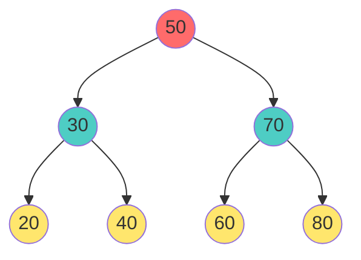
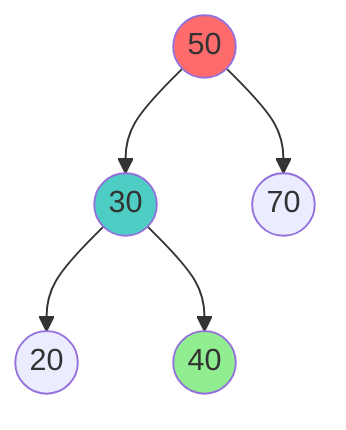
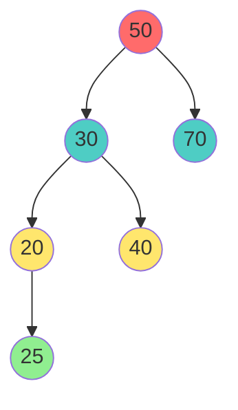
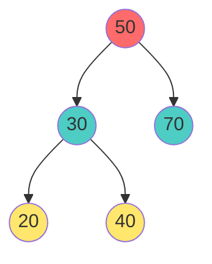
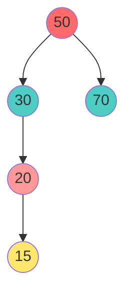
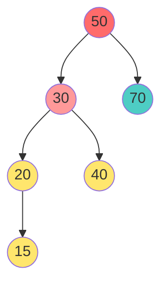
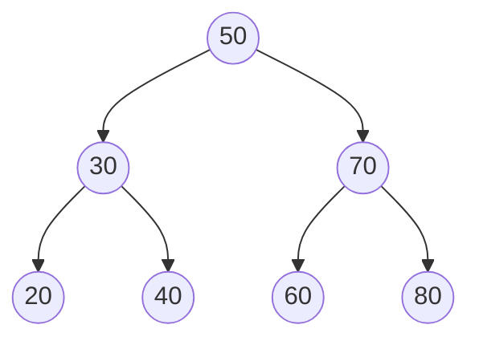

# 🌳 Binary Search Trees (BST) - From 5 Year Old to Pro

## 🧒 Imagine a Magic Sorting Box (For 5-Year-Olds)

Imagine you have a special toy box that **sorts toys automatically**:
- You put a toy in → it goes to the RIGHT if it's bigger
- You put a toy in → it goes to the LEFT if it's smaller
- Now all toys are organized by size!

That's a **Binary Search Tree**!

---

## What is a Binary Search Tree?

### Simple Definition
A **Binary Search Tree (BST)** is a tree where:
- Every node has **at most 2 children** (left and right)
- **All nodes on the LEFT are smaller**
- **All nodes on the RIGHT are bigger**

### Example Tree



**Rule**: 
- Left of 50: 30, 20, 40 (all < 50) ✓
- Right of 50: 70, 60, 80 (all > 50) ✓

---

## Core Operations

### Operation 1: Search (Finding a Value)

#### Beginner Explanation
"I'm looking for the number 40. Do I go left or right?"

#### Visual Search Example



**Search for 40**:
1. Start at 50: "Is 40 here?" → No
2. 40 < 50 → Go LEFT
3. Reach 30: "Is 40 here?" → No
4. 40 > 30 → Go RIGHT
5. Reach 40: "Found it!" ✓

#### C++ Implementation

```cpp
// Search function
bool search(Node* node, int value) {
    // Base case: reached the end
    if (node == NULL) {
        return false;  // Not found
    }
    
    // Found it!
    if (node->data == value) {
        return true;
    }
    
    // Value is smaller, search LEFT
    if (value < node->data) {
        return search(node->left, value);
    }
    
    // Value is bigger, search RIGHT
    return search(node->right, value);
}
```

#### Time Complexity
- **Best/Average**: O(log n) - Each step eliminates half the tree
- **Worst**: O(n) - When tree is very skewed (like a line)

---

### Operation 2: Insert (Adding a Value)

#### Beginner Explanation
"Where should I put this number? Keep comparing and go left or right until I find an empty spot!"

#### Visual Insert Example

**Insert 25 into existing tree**:



**Steps**:
1. 25 compared to 50: 25 < 50 → Go LEFT
2. 25 compared to 30: 25 < 30 → Go LEFT
3. 25 compared to 20: 25 > 20 → Go RIGHT
4. Right of 20 is empty → **Insert 25 here!**

#### C++ Implementation

```cpp
// Insert function
Node* insert(Node* node, int value) {
    // Empty spot found! Create new node
    if (node == NULL) {
        return new Node(value);
    }
    
    // Value is smaller, insert LEFT
    if (value < node->data) {
        node->left = insert(node->left, value);
    }
    // Value is bigger, insert RIGHT
    else if (value > node->data) {
        node->right = insert(node->right, value);
    }
    // Value already exists (ignore duplicates)
    
    return node;
}
```

#### Time Complexity
- **Average**: O(log n)
- **Worst**: O(n)

---

### Operation 3: Delete (Removing a Value)

This is the **hardest operation**. Three cases:

#### Case 1: Delete Leaf (No Children)



**Delete 20** (it's alone):
- Just remove it!
- Parent now points to NULL

```cpp
// Case 1: No children
if (node->left == NULL && node->right == NULL) {
    delete node;
    return NULL;  // Parent points to NULL
}
```

#### Case 2: Delete Node with 1 Child



**Delete 20** (has 1 child - 15):
- Take the child (15)
- Replace 20 with it
- Now 30's left child is 15

```cpp
// Case 2: One child only
if (node->left == NULL) {
    // Has right child
    Node* temp = node->right;
    delete node;
    return temp;
}

if (node->right == NULL) {
    // Has left child
    Node* temp = node->left;
    delete node;
    return temp;
}
```

#### Case 3: Delete Node with 2 Children (Hardest!)



**Delete 30** (has 2 children):

**Strategy**: Find the **next bigger value** (in-order successor)
- Go RIGHT once → 40
- Is 40 the smallest on right side? Yes!
- Replace 30 with 40
- Now delete original 40

```cpp
// Case 3: Two children
// Find in-order successor (smallest in right subtree)
Node* minNode = node->right;
while (minNode->left != NULL) {
    minNode = minNode->left;
}

// Replace node's data with successor's data
node->data = minNode->data;

// Delete the successor (it won't have left child)
node->right = deleteNode(node->right, minNode->data);
```

#### Full Delete Function

```cpp
Node* deleteNode(Node* node, int value) {
    if (node == NULL) return NULL;
    
    // Find the node to delete
    if (value < node->data) {
        node->left = deleteNode(node->left, value);
    } 
    else if (value > node->data) {
        node->right = deleteNode(node->right, value);
    } 
    else {
        // Found the node to delete
        
        // Case 1: No children
        if (node->left == NULL && node->right == NULL) {
            delete node;
            return NULL;
        }
        
        // Case 2: One child
        if (node->left == NULL) {
            Node* temp = node->right;
            delete node;
            return temp;
        }
        if (node->right == NULL) {
            Node* temp = node->left;
            delete node;
            return temp;
        }
        
        // Case 3: Two children
        Node* minNode = node->right;
        while (minNode->left != NULL) {
            minNode = minNode->left;
        }
        
        node->data = minNode->data;
        node->right = deleteNode(node->right, minNode->data);
    }
    
    return node;
}
```

#### Time Complexity: O(log n) average, O(n) worst

---

### Operation 4: In-Order Traversal (Get Sorted Output)

**Magic Property**: In-order traversal of BST gives **sorted order**!

```cpp
void inOrder(Node* node) {
    if (node == NULL) return;
    
    inOrder(node->left);           // Left
    cout << node->data << " ";     // Root
    inOrder(node->right);          // Right
}
```

**Example Tree**:


**In-order**: 20 → 30 → 40 → 50 → 60 → 70 → 80 ✓ (Sorted!)

---

### Operation 5: Find Minimum & Maximum

#### Find Minimum

```cpp
// Smallest is always leftmost
int findMin(Node* node) {
    if (node == NULL) return -1;
    
    while (node->left != NULL) {
        node = node->left;
    }
    
    return node->data;
}
```

#### Find Maximum

```cpp
// Largest is always rightmost
int findMax(Node* node) {
    if (node == NULL) return -1;
    
    while (node->right != NULL) {
        node = node->right;
    }
    
    return node->data;
}
```

---

## BST Class - Complete Implementation

```cpp
#include <iostream>
#include <queue>
using namespace std;

struct Node {
    int data;
    Node* left;
    Node* right;
    
    Node(int val) : data(val), left(NULL), right(NULL) {}
};

class BST {
private:
    Node* root;
    
    Node* insertHelper(Node* node, int value) {
        if (node == NULL) {
            return new Node(value);
        }
        
        if (value < node->data) {
            node->left = insertHelper(node->left, value);
        } 
        else if (value > node->data) {
            node->right = insertHelper(node->right, value);
        }
        
        return node;
    }
    
    bool searchHelper(Node* node, int value) {
        if (node == NULL) return false;
        
        if (node->data == value) return true;
        
        if (value < node->data) {
            return searchHelper(node->left, value);
        }
        
        return searchHelper(node->right, value);
    }
    
    Node* deleteHelper(Node* node, int value) {
        if (node == NULL) return NULL;
        
        if (value < node->data) {
            node->left = deleteHelper(node->left, value);
        } 
        else if (value > node->data) {
            node->right = deleteHelper(node->right, value);
        } 
        else {
            // No children
            if (node->left == NULL && node->right == NULL) {
                delete node;
                return NULL;
            }
            
            // One child
            if (node->left == NULL) {
                Node* temp = node->right;
                delete node;
                return temp;
            }
            if (node->right == NULL) {
                Node* temp = node->left;
                delete node;
                return temp;
            }
            
            // Two children
            Node* minNode = node->right;
            while (minNode->left != NULL) {
                minNode = minNode->left;
            }
            
            node->data = minNode->data;
            node->right = deleteHelper(node->right, minNode->data);
        }
        
        return node;
    }
    
    void inOrderHelper(Node* node) {
        if (node == NULL) return;
        inOrderHelper(node->left);
        cout << node->data << " ";
        inOrderHelper(node->right);
    }
    
    void preOrderHelper(Node* node) {
        if (node == NULL) return;
        cout << node->data << " ";
        preOrderHelper(node->left);
        preOrderHelper(node->right);
    }
    
    int findMinHelper(Node* node) {
        while (node->left != NULL) {
            node = node->left;
        }
        return node->data;
    }
    
    int findMaxHelper(Node* node) {
        while (node->right != NULL) {
            node = node->right;
        }
        return node->data;
    }
    
    int getHeightHelper(Node* node) {
        if (node == NULL) return 0;
        return 1 + max(getHeightHelper(node->left), getHeightHelper(node->right));
    }
    
public:
    BST() : root(NULL) {}
    
    void insert(int value) {
        root = insertHelper(root, value);
    }
    
    bool search(int value) {
        return searchHelper(root, value);
    }
    
    void deleteValue(int value) {
        root = deleteHelper(root, value);
    }
    
    void inOrder() {
        inOrderHelper(root);
        cout << endl;
    }
    
    void preOrder() {
        preOrderHelper(root);
        cout << endl;
    }
    
    int findMin() {
        if (root == NULL) return -1;
        return findMinHelper(root);
    }
    
    int findMax() {
        if (root == NULL) return -1;
        return findMaxHelper(root);
    }
    
    int getHeight() {
        return getHeightHelper(root);
    }
    
    ~BST() {
        deleteAll(root);
    }
    
private:
    void deleteAll(Node* node) {
        if (node == NULL) return;
        deleteAll(node->left);
        deleteAll(node->right);
        delete node;
    }
};

// Main program
int main() {
    BST tree;
    
    // Insert values
    int values[] = {50, 30, 70, 20, 40, 60, 80};
    for (int val : values) {
        tree.insert(val);
    }
    
    cout << "In-order (sorted): ";
    tree.inOrder();  // 20 30 40 50 60 70 80
    
    cout << "Search 40: " << (tree.search(40) ? "Found" : "Not found") << endl;
    cout << "Search 25: " << (tree.search(25) ? "Found" : "Not found") << endl;
    
    cout << "Min: " << tree.findMin() << endl;  // 20
    cout << "Max: " << tree.findMax() << endl;  // 80
    cout << "Height: " << tree.getHeight() << endl;
    
    tree.deleteValue(30);
    cout << "After deleting 30: ";
    tree.inOrder();  // 20 40 50 60 70 80
    
    return 0;
}
```

---

## Properties & Analysis

### Time Complexity

| Operation | Average | Worst |
|:---|:---:|:---:|
| **Search** | O(log n) | O(n) |
| **Insert** | O(log n) | O(n) |
| **Delete** | O(log n) | O(n) |
| **Min/Max** | O(log n) | O(n) |
| **Traversal** | O(n) | O(n) |

### Space Complexity

| Type | Space |
|:---|:---:|
| **Storage** | O(n) |
| **Recursion Stack** | O(h) where h = height |

### When Tree Becomes Unbalanced

```
GOOD (balanced):           BAD (skewed):
    50                      50
   /  \                      \
  30   70                     70
 / \  / \                      \
20 40 60 80                    80
Height: 3                  Height: 4 (like a line!)
```

**Worst case**: Tree becomes like a linked list → O(n) operations!

---

## Real-World Applications

### 1. **Databases** - Indexing
- B+ trees (extension of BST) used in databases
- Fast lookup of records

### 2. **File Systems**
- Directory structures
- File organization

### 3. **Autocomplete**
- Search suggestions based on prefixes
- (Uses special BST called Trie)

### 4. **Expression Evaluation**
- Build expression trees
- Evaluate mathematical expressions

---

## 🎯 LeetCode Problems (Learn These Principles!)

### Problem 1: Search in BST
**Link**: [LeetCode 700 - Search in a Binary Search Tree](https://leetcode.com/problems/search-in-a-binary-search-tree/)

**Principle**: Use the ordering property!
- If target < node → search left
- If target > node → search right
- Otherwise found!

```cpp
TreeNode* searchBST(TreeNode* root, int val) {
    if (root == NULL) return NULL;
    if (root->val == val) return root;
    if (val < root->val) return searchBST(root->left, val);
    return searchBST(root->right, val);
}
```

---

### Problem 2: Insert into BST
**Link**: [LeetCode 701 - Insert into a Binary Search Tree](https://leetcode.com/problems/insert-into-a-binary-search-tree/)

**Principle**: Find empty spot maintaining BST order

```cpp
TreeNode* insertIntoBST(TreeNode* root, int val) {
    if (root == NULL) return new TreeNode(val);
    
    if (val < root->val) {
        root->left = insertIntoBST(root->left, val);
    } else {
        root->right = insertIntoBST(root->right, val);
    }
    
    return root;
}
```

---

### Problem 3: Delete Node in BST
**Link**: [LeetCode 450 - Delete Node in BST](https://leetcode.com/problems/delete-node-in-a-bst/)

**Principle**: Handle 3 cases (leaf, 1 child, 2 children)

---

### Problem 4: Validate BST
**Link**: [LeetCode 98 - Validate Binary Search Tree](https://leetcode.com/problems/validate-binary-search-tree/)

**Principle**: In-order traversal should be sorted!

```cpp
bool isValidBST(TreeNode* root) {
    vector<int> result;
    inOrder(root, result);
    
    for (int i = 1; i < result.size(); i++) {
        if (result[i] <= result[i-1]) return false;
    }
    return true;
}
```

---

### Problem 5: Lowest Common Ancestor
**Link**: [LeetCode 235 - Lowest Common Ancestor of BST](https://leetcode.com/problems/lowest-common-ancestor-of-a-binary-search-tree/)

**Principle**: Use BST property to find split point!

```cpp
TreeNode* lowestCommonAncestor(TreeNode* root, TreeNode* p, TreeNode* q) {
    if (p->val < root->val && q->val < root->val) {
        return lowestCommonAncestor(root->left, p, q);
    }
    if (p->val > root->val && q->val > root->val) {
        return lowestCommonAncestor(root->right, p, q);
    }
    return root;  // Split found!
}
```

---

### Problem 6: Kth Smallest Element
**Link**: [LeetCode 230 - Kth Smallest Element in BST](https://leetcode.com/problems/kth-smallest-element-in-a-bst/)

**Principle**: In-order gives sorted, so count first K!

```cpp
int kthSmallest(TreeNode* root, int k) {
    int count = 0, result = 0;
    inOrderCount(root, k, count, result);
    return result;
}

void inOrderCount(TreeNode* node, int k, int& count, int& result) {
    if (node == NULL) return;
    
    inOrderCount(node->left, k, count, result);
    count++;
    if (count == k) result = node->val;
    inOrderCount(node->right, k, count, result);
}
```

---

### Problem 7: BST to Greater Sum Tree
**Link**: [LeetCode 1038 - Binary Search Tree to Greater Sum Tree](https://leetcode.com/problems/binary-search-tree-to-greater-sum-tree/)

**Principle**: Reverse in-order (right → root → left) gives descending!

```cpp
void convertBST(TreeNode* root, int& sum) {
    if (root == NULL) return;
    
    convertBST(root->right, sum);      // Process right first
    sum += root->val;                   // Add to sum
    root->val = sum;                    // Update node
    convertBST(root->left, sum);        // Process left
}
```

---

### Problem 8: Binary Search Tree Range Sum
**Link**: [LeetCode 938 - Range Sum of BST](https://leetcode.com/problems/range-sum-of-bst/)

**Principle**: Only go into subtrees that can have values in range!

```cpp
int rangeSumBST(TreeNode* root, int low, int high) {
    if (root == NULL) return 0;
    
    int result = 0;
    
    if (root->val >= low && root->val <= high) {
        result = root->val;
    }
    
    if (root->val > low) {
        result += rangeSumBST(root->left, low, high);
    }
    
    if (root->val < high) {
        result += rangeSumBST(root->right, low, high);
    }
    
    return result;
}
```

---

## Common Mistakes & Tips

### ❌ WRONG - Forgetting BST Order Property

```cpp
// WRONG - Doesn't use ordering!
bool wrongSearch(Node* node, int target) {
    if (node == NULL) return false;
    if (node->data == target) return true;
    
    // This is inefficient!
    return wrongSearch(node->left, target) || wrongSearch(node->right, target);
}
```

### ✅ CORRECT - Use BST Property

```cpp
// CORRECT - Uses ordering to skip half the tree!
bool correctSearch(Node* node, int target) {
    if (node == NULL) return false;
    if (node->data == target) return true;
    
    if (target < node->data) {
        return correctSearch(node->left, target);
    }
    return correctSearch(node->right, target);
}
```

---

## Key Takeaways

1. **Ordering Property**: Left < Parent < Right (use it!)
2. **Search**: O(log n) average (binary elimination)
3. **Insert**: Find empty spot maintaining order
4. **Delete**: 3 cases (leaf, 1 child, 2 children)
5. **In-order**: Always gives sorted output
6. **Worst case**: Unbalanced tree → O(n)
7. **Solutions**: AVL trees, Red-Black trees (self-balancing)
8. **LeetCode**: Start with 700, 701, 98, 235, 230

---

## Practice Path

**Level 1 (Beginner)**:
- Build a BST manually
- Insert 10 values
- Search for random values
- Print in-order (verify sorted)

**Level 2 (Intermediate)**:
- LeetCode 700 (Search)
- LeetCode 701 (Insert)
- LeetCode 98 (Validate)

**Level 3 (Advanced)**:
- LeetCode 450 (Delete)
- LeetCode 235 (LCA)
- LeetCode 230 (Kth Smallest)

**Level 4 (Pro)**:
- LeetCode 1038 (Greater Sum)
- LeetCode 938 (Range Sum)
- Mix multiple operations