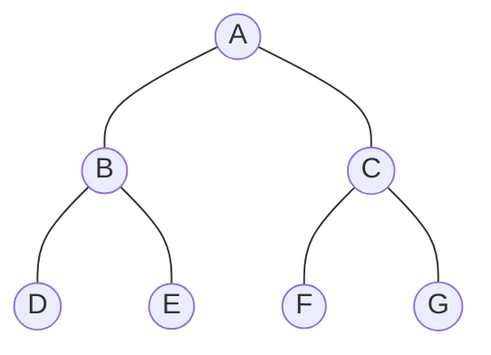

# 🔧 Generating a Tree from Traversals

A single traversal sequence alone **cannot** uniquely define a binary tree. However, combining **two traversal sequences** is sufficient — as long as one of them is **In-order**.

---

## ⚠️ The Key Rule
| Given Traversals | Can reconstruct unique tree? |
| :--- | :---: |
| **In-order + Pre-order** | ✅ Yes |
| **In-order + Post-order** | ✅ Yes |
| **Pre-order + Post-order** | ❌ No (ambiguous for non-full trees) |

> [!IMPORTANT]
> **In-order is mandatory** for unique tree reconstruction. The reason: In-order tells us the **structural split** (what's left vs. right of root), while Pre/Post tells us the **root** of each subtree.

---

## 🌳 Method 1: Using In-order + Pre-order

### How It Works:
1. The **first element** of Pre-order is the **root**.
2. Find this root in the **In-order** sequence — everything to the left is the **left subtree**, everything to the right is the **right subtree**.
3. **Recursively repeat** for each subtree.

### 📸 Example
- **Pre-order:** `A, B, D, E, C, F, G`
- **In-order:** `D, B, E, A, F, C, G`

**Step-by-step:**

| Step | Root | Left (In-order) | Right (In-order) |
| :--- | :--- | :--- | :--- |
| 1 | **A** (Pre[0]) | `D, B, E` | `F, C, G` |
| 2 | **B** (Pre[1]) | `D` | `E` |
| 3 | **D** (leaf) | — | — |
| 4 | **E** (leaf) | — | — |
| 5 | **C** (Pre[5]) | `F` | `G` |
| 6 | **F** (leaf) | — | — |
| 7 | **G** (leaf) | — | — |

**Reconstructed Tree:**


---

## 🌳 Method 2: Using In-order + Post-order

### How It Works:
1. The **last element** of Post-order is the **root**.
2. Find this root in the **In-order** sequence — left side is left subtree, right side is right subtree.
3. **Recursively repeat**, always taking the last element of the current Post-order slice.

### 📸 Example
- **Post-order:** `D, E, B, F, G, C, A`
- **In-order:** `D, B, E, A, F, C, G`

| Step | Root | Left (In-order) | Right (In-order) |
| :--- | :--- | :--- | :--- |
| 1 | **A** (Post[-1]) | `D, B, E` | `F, C, G` |
| 2 | **B** (Post[-2]... yes B) | `D` | `E` |
| 3 | **C** (Post[-2] of right) | `F` | `G` |
> Result is the **same tree** as above ✅

---

## 💻 C++ Implementation (In-order + Pre-order)

```cpp
#include <iostream>
#include <string>
using namespace std;

struct Node {
    char data;
    Node *lchild, *rchild;
};

// Create a new node
Node* createNode(char val) {
    Node* n = new Node();
    n->data = val;
    n->lchild = n->rchild = nullptr;
    return n;
}

// Find index of value in array between l and r
int search(char in[], int l, int r, char val) {
    for (int i = l; i <= r; i++)
        if (in[i] == val) return i;
    return -1;
}

// Build tree from In-order + Pre-order sequences
Node* buildTree(char pre[], char in[], int inStart, int inEnd, int &preIndex) {
    if (inStart > inEnd) return nullptr;

    // Current root is the next element in pre-order
    char rootVal = pre[preIndex++];
    Node* root = createNode(rootVal);

    // Find this root in in-order to split subtrees
    int inIndex = search(in, inStart, inEnd, rootVal);

    // Recurse on left and right subtrees
    root->lchild = buildTree(pre, in, inStart, inIndex - 1, preIndex);
    root->rchild = buildTree(pre, in, inIndex + 1, inEnd, preIndex);

    return root;
}

// In-order printing to verify
void inorder(Node* root) {
    if (root) {
        inorder(root->lchild);
        cout << root->data << " ";
        inorder(root->rchild);
    }
}

int main() {
    char pre[] = {'A', 'B', 'D', 'E', 'C', 'F', 'G'};
    char in[]  = {'D', 'B', 'E', 'A', 'F', 'C', 'G'};
    int n = 7, preIndex = 0;

    Node* root = buildTree(pre, in, 0, n - 1, preIndex);
    cout << "In-order of reconstructed tree: ";
    inorder(root); // Should print: D B E A F C G
    return 0;
}
```

---

## 📊 Complexity
| Property | Complexity |
| :--- | :--- |
| **Time** | $O(n^2)$ naive (linear search). $O(n \log n)$ with hash map |
| **Space** | $O(h)$ for recursion stack, where $h$ is tree height |
