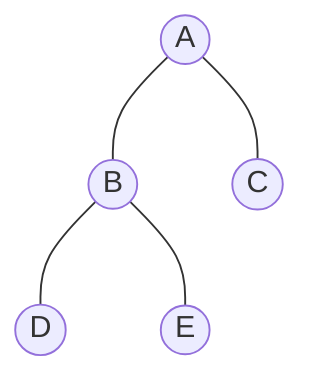
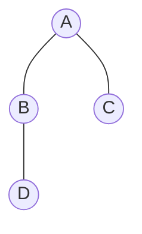

# ⚙️ Binary Tree Operations: Height, Count & Leaf Count

All three operations — **Height**, **Node Count**, and **Leaf Count** — follow the same **recursive (post-order)** pattern:
> *Process the left subtree, process the right subtree, then compute the answer at the current node.*

---

## 🏗️ Shared Node Structure
```cpp
struct Node {
    int data;
    Node *lchild, *rchild;
};
```

---

## 📐 1. Height of a Binary Tree

### 🧠 Concept
The **height** of a tree is the number of **edges** on the longest root-to-leaf path.

- **Base case:** An empty tree has height **-1**. A single node has height **0**.
- **Recursive case:** The height of a node = **1 + max(height of left, height of right)**.

### 📸 Visual Dry Run

Calculating bottom-up:
- D, E → height = 0 (leaves)
- B → 1 + max(0, 0) = **1**
- C → height = 0 (leaf)
- A → 1 + max(1, 0) = **2** ✅

### 💻 C++ Code
```cpp
int height(Node *p) {
    if (p == nullptr)
        return -1;                         // empty tree

    int leftH  = height(p->lchild);       // height of left subtree
    int rightH = height(p->rchild);       // height of right subtree

    return 1 + max(leftH, rightH);        // current height
}
```

---

## 🔢 2. Count of Nodes in a Binary Tree

### 🧠 Concept
Count **every** node in the tree.

- **Base case:** Count of an empty tree = **0**.
- **Recursive case:** Count = **1 (current node) + count(left) + count(right)**.

### 📸 Visual Dry Run

- D → 1
- B → 1 + 1 + 0 = **2**
- C → 1
- A → 1 + 2 + 1 = **4** ✅

### 💻 C++ Code
```cpp
int count(Node *p) {
    if (p == nullptr)
        return 0;                          // empty tree

    return 1 + count(p->lchild) + count(p->rchild);
}
```

---

## 🍃 3. Count of Leaf Nodes

### 🧠 Concept
A **leaf node** is any node with **no children** (both left and right are NULL).

- **Base case (empty):** Leaf count = **0**.
- **Base case (leaf):** If both children are NULL → returns **1**.
- **Recursive case:** leafCount(left) + leafCount(right).

### 📸 Visual Dry Run

- D → leaf → **1**
- E → leaf → **1**
- B → 1 + 1 = **2** (passes up the leaf counts, not a leaf itself)
- C → leaf → **1**
- A → 2 + 1 = **3** ✅

### 💻 C++ Code
```cpp
int leafCount(Node *p) {
    if (p == nullptr)
        return 0;                              // empty

    if (p->lchild == nullptr && p->rchild == nullptr)
        return 1;                              // this IS a leaf

    return leafCount(p->lchild) + leafCount(p->rchild);
}
```

---

## 📊 Summary: All Three Functions
```cpp
int height(Node *p) {
    if (!p) return -1;
    return 1 + max(height(p->lchild), height(p->rchild));
}

int count(Node *p) {
    if (!p) return 0;
    return 1 + count(p->lchild) + count(p->rchild);
}

int leafCount(Node *p) {
    if (!p) return 0;
    if (!p->lchild && !p->rchild) return 1;
    return leafCount(p->lchild) + leafCount(p->rchild);
}
```

## ⏱️ Complexity (all three)
| Property | Complexity |
| :--- | :--- |
| **Time** | $O(n)$ — every node visited exactly once |
| **Space** | $O(h)$ — recursion stack depth = tree height |
