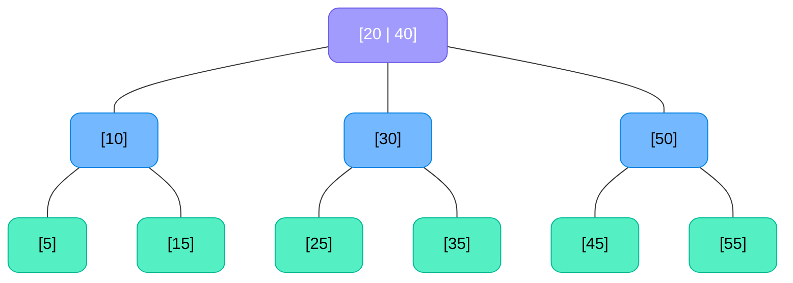
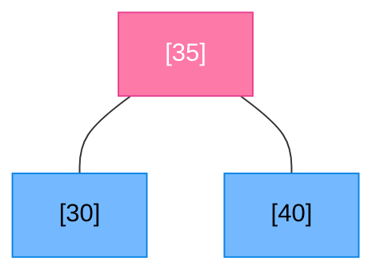

# 🌳 2-3 Trees — For Complete Beginners

> Think of a 2-3 Tree as a "self-balancing bookshelf." No matter how many books you add, every shelf always stays the same height!

---

## 🎯 What is a 2-3 Tree?

A **2-3 Tree** is a special type of search tree where:
- Every **internal node** has either **2 or 3 children** (that's why it's called 2-3!)
- All **leaf nodes** are at the **same level** (perfectly balanced!)
- Data is stored in **sorted order** (like a BST)

### 🍂 Node Types

| Node Type | Keys it holds | Children it has |
|:---|:---:|:---:|
| **2-node** | 1 key | 2 children |
| **3-node** | 2 keys | 3 children |

---

## 📚 Key Properties

1. **Always balanced** — All leaves at the same depth.
2. **Ordered** — For a 2-node with key `K`: left subtree < K < right subtree.
3. For a 3-node with keys `K1 < K2`:
   - Left subtree < K1
   - Middle subtree between K1 and K2
   - Right subtree > K2

---

## 📸 Visual Example

**🔵 Blue = 2-node | 🟣 Purple = 3-node | 🟢 Green = Leaves**

---

## 🔍 Operation 1: Search

Searching is just like BST search, but at each node you compare against 1 or 2 keys.

### Algorithm:
1. Start at root.
2. At each node:
   - If the key matches — ✅ **Found!**
   - If node has 1 key `K`:
     - Key < K → go **left**
     - Key > K → go **right**
   - If node has 2 keys `K1, K2`:
     - Key < K1 → go **left**
     - K1 < Key < K2 → go **middle**
     - Key > K2 → go **right**
3. If you hit NULL → ❌ **Not Found**.

### Example: Search for **30**
- Root = [20 | 40]: 20 < 30 < 40 → go **middle**
- Middle = [30]: Match! ✅

---

## ➕ Operation 2: Insertion

> **Rule:** Never insert into an internal node. Always insert at a **leaf**.

### Steps:
1. **Search** for the position (always reaches a leaf).
2. Try to **add the key** to that leaf node.
   - If the leaf is a **2-node** → absorb the key, making it a **3-node**. Done! ✅
   - If the leaf is a **3-node** → it **overflows** (temporarily has 3 keys). Split it!

### 🔪 Splitting (overflow handling):
- Take the **middle key** and **push it up** to the parent.
- The left and right keys become **two new 2-nodes**.
- If the parent also overflows, repeat the split upward.
- If the **root overflows**, create a **new root** → tree grows taller by 1.

### Example: Insert **35** into a 2-3 Tree with leaves at [30], [40]:

Before → Leaf [30 | 40] is a 3-node. After adding 35:
Temporarily: [30 | 35 | 40] → **overflow!**
Split: push **35** up. Left = [30], Right = [40].

**🔴 Pink = Newly created/promoted node**

---

## ❌ Operation 3: Deletion

Deletion is the most complex. The goal is to maintain the 2-3 tree invariants.

### Cases:
1. **Key is at a leaf and leaf is a 3-node** → Simply remove the key. Done!
2. **Key is at a leaf and leaf is a 2-node** → Removing it creates an **underflow** (empty node). Fix by:
   - **Borrow** from a sibling (if sibling is a 3-node).
   - **Merge** with a sibling (if all siblings are 2-nodes) — pull down a parent key.

### Visual: Borrowing from Sibling
If deleting from a 2-node but a sibling 3-node [20|30] exists:
Rotate a key through the parent — the parent's key goes down to the deficient node, and the sibling's key goes up.

---

## ⏱️ Complexity Summary
| Operation | Time Complexity |
|:---|:---:|
| **Search** | $O(\log n)$ |
| **Insert** | $O(\log n)$ |
| **Delete** | $O(\log n)$ |
| **Space** | $O(n)$ |

> 🎉 **Height is always** $O(\log n)$ — the tree is always perfectly balanced!
