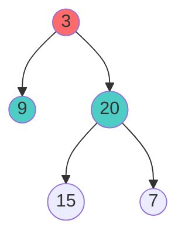
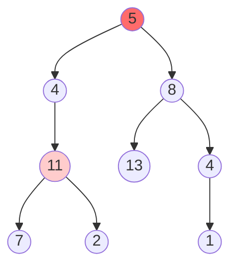
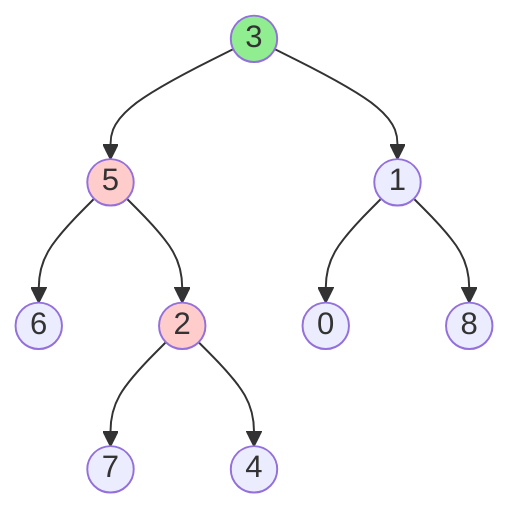
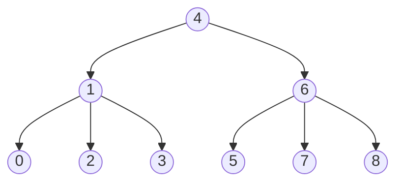

# 🎯 LeetCode Tree Problems - Complete Guide

## 🧒 Beginner's Mindset

**Key Principle**: Solve tree problems by asking yourself:
1. "What do I do at this node?"
2. "What do my left child return?"
3. "What do my right child return?"
4. "How do I combine them?"

**That's it!** Most tree problems follow this pattern.

---

## Pattern 1: Traversal Problems

### Problem 1: Binary Tree Level Order Traversal
**LeetCode**: [102 - Binary Tree Level Order Traversal](https://leetcode.com/problems/binary-tree-level-order-traversal/)

**Difficulty**: Easy

**Principle**: Use a **QUEUE** to process level by level

**Think Like This**:
- "I need to visit all nodes at depth 1, then depth 2, then 3..."
- Queue is FIFO (first-in-first-out) - perfect for level order!

**Visual**:


**Expected Output**: `[[3], [9, 20], [15, 7]]`

**Solution**:
```cpp
vector<vector<int>> levelOrder(TreeNode* root) {
    vector<vector<int>> result;
    if (root == NULL) return result;
    
    queue<TreeNode*> q;
    q.push(root);
    
    while (!q.empty()) {
        int levelSize = q.size();  // Number of nodes at current level
        vector<int> currentLevel;
        
        // Process all nodes at this level
        for (int i = 0; i < levelSize; i++) {
            TreeNode* node = q.front();
            q.pop();
            
            currentLevel.push_back(node->val);
            
            // Add children for next level
            if (node->left) q.push(node->left);
            if (node->right) q.push(node->right);
        }
        
        result.push_back(currentLevel);
    }
    
    return result;
}
```

**Time**: O(n) - visit each node once
**Space**: O(n) - queue can have max n/2 nodes

---

### Problem 2: Post-Order Traversal
**LeetCode**: [145 - Binary Tree Postorder Traversal](https://leetcode.com/problems/binary-tree-postorder-traversal/)

**Difficulty**: Easy

**Principle**: Visit LEFT → RIGHT → ROOT (process children before parent)

**Use Case**: **Delete tree** (delete children before deleting parent!)

**Recursive Solution** (Easiest):
```cpp
void postOrder(TreeNode* root, vector<int>& result) {
    if (root == NULL) return;
    
    postOrder(root->left, result);      // LEFT
    postOrder(root->right, result);     // RIGHT
    result.push_back(root->val);        // ROOT
}

vector<int> postorderTraversal(TreeNode* root) {
    vector<int> result;
    postOrder(root, result);
    return result;
}
```

**Iterative Solution** (Using Stack):
```cpp
vector<int> postorderTraversal(TreeNode* root) {
    vector<int> result;
    if (root == NULL) return result;
    
    stack<TreeNode*> st;
    st.push(root);
    TreeNode* lastVisited = NULL;
    
    while (!st.empty()) {
        TreeNode* current = st.top();
        
        // If current has children, push them
        if (current->left || current->right) {
            // Process left first, so push right first
            if (current->right && current->right != lastVisited) {
                st.push(current->right);
            }
            if (current->left && current->left != lastVisited) {
                st.push(current->left);
            }
        } else {
            // Both children processed, visit current
            result.push_back(current->val);
            st.pop();
            lastVisited = current;
        }
    }
    
    return result;
}
```

**Time**: O(n)
**Space**: O(h) where h = height

---

## Pattern 2: Path Sum Problems

### Problem 3: Path Sum I
**LeetCode**: [112 - Path Sum](https://leetcode.com/problems/path-sum/)

**Difficulty**: Easy

**Principle**: DFS to explore all root-to-leaf paths, check if any equals target sum

**Think**: "Is there a path from root to leaf that sums to targetSum?"



**Example**: Root to leaf: 5→4→11→2 = 22 ✓

**Solution**:
```cpp
bool hasPathSum(TreeNode* root, int targetSum) {
    // Base case: no node
    if (root == NULL) {
        return false;
    }
    
    // Leaf node check
    if (root->left == NULL && root->right == NULL) {
        return root->val == targetSum;
    }
    
    // Reduce target and check left/right
    return hasPathSum(root->left, targetSum - root->val) ||
           hasPathSum(root->right, targetSum - root->val);
}
```

**Why it works**:
- Subtract node value from target at each step
- If target becomes 0 at leaf → path found!

**Time**: O(n) to explore worst case
**Space**: O(h) recursion stack

---

### Problem 4: Path Sum III (Hard)
**LeetCode**: [437 - Path Sum III](https://leetcode.com/problems/path-sum-iii/)

**Difficulty**: Medium

**Principle**: Path can **start anywhere** (not just root!)

**Think**: "Find all paths (starting from any node) that sum to target"

```cpp
int pathSum(TreeNode* root, int targetSum) {
    if (root == NULL) return 0;
    
    return countPaths(root, targetSum) +
           pathSum(root->left, targetSum) +
           pathSum(root->right, targetSum);
}

int countPaths(TreeNode* node, long long targetSum) {
    if (node == NULL) return 0;
    
    int count = 0;
    
    if (node->val == targetSum) {
        count = 1;
    }
    
    count += countPaths(node->left, targetSum - node->val) +
             countPaths(node->right, targetSum - node->val);
    
    return count;
}
```

**Optimization with Map** (Track prefix sums):
```cpp
int pathSum(TreeNode* root, int targetSum) {
    unordered_map<long long, int> prefixSumCount;
    prefixSumCount[0] = 1;  // Base case
    return dfs(root, 0, targetSum, prefixSumCount);
}

int dfs(TreeNode* node, long long currentSum, int targetSum, 
        unordered_map<long long, int>& prefixSumCount) {
    if (node == NULL) return 0;
    
    currentSum += node->val;
    
    // Check if (currentSum - targetSum) exists in past
    int count = prefixSumCount[currentSum - targetSum];
    
    // Add current sum to map
    prefixSumCount[currentSum]++;
    
    count += dfs(node->left, currentSum, targetSum, prefixSumCount) +
             dfs(node->right, currentSum, targetSum, prefixSumCount);
    
    // Backtrack: remove current sum
    prefixSumCount[currentSum]--;
    
    return count;
}
```

**Time**: O(n) optimized vs O(n²) naive
**Space**: O(h) for recursion + O(n) for map

---

## Pattern 3: Lowest Common Ancestor (LCA)

### Problem 5: LCA in Binary Tree
**LeetCode**: [236 - Lowest Common Ancestor](https://leetcode.com/problems/lowest-common-ancestor-of-a-binary-tree/)

**Difficulty**: Medium

**Principle**: First node that has both p and q in its subtree

**Think**: "Which node is the 'deepest meeting point' of two nodes?"

**Visual**:


**Find LCA(5, 4)**: These nodes meet at... 5!

**Solution**:
```cpp
TreeNode* lowestCommonAncestor(TreeNode* root, TreeNode* p, TreeNode* q) {
    // Base cases
    if (root == NULL || root == p || root == q) {
        return root;
    }
    
    // Search in left and right subtrees
    TreeNode* left = lowestCommonAncestor(root->left, p, q);
    TreeNode* right = lowestCommonAncestor(root->right, p, q);
    
    // If both found in different subtrees
    if (left && right) {
        return root;
    }
    
    // If only one side has result
    return left != NULL ? left : right;
}
```

**How it works**:
1. If current node is p or q → might be LCA
2. Search left subtree
3. Search right subtree
4. If found on both sides → current is LCA
5. Otherwise return whichever side has it

**Time**: O(n) - worst case visit all nodes
**Space**: O(h) recursion stack

---

### Problem 6: LCA in Binary Search Tree (Faster!)
**LeetCode**: [235 - Lowest Common Ancestor of BST](https://leetcode.com/problems/lowest-common-ancestor-of-a-binary-search-tree/)

**Difficulty**: Easy

**Principle**: Use BST ordering to prune search!

**Think**: "If both p and q are > current node, they're on right. If both < current, they're on left."

**Solution**:
```cpp
TreeNode* lowestCommonAncestor(TreeNode* root, TreeNode* p, TreeNode* q) {
    // Both on left side
    if (p->val < root->val && q->val < root->val) {
        return lowestCommonAncestor(root->left, p, q);
    }
    
    // Both on right side
    if (p->val > root->val && q->val > root->val) {
        return lowestCommonAncestor(root->right, p, q);
    }
    
    // They split here or one is root
    return root;
}
```

**Why faster**: O(log n) average vs O(n) for regular BT

---

## Pattern 4: Construction Problems

### Problem 7: Construct BST from Traversals
**LeetCode**: [105 - Construct from Preorder + Inorder](https://leetcode.com/problems/construct-binary-tree-from-preorder-and-inorder-traversal/)

**Difficulty**: Medium

**Principle**: 
- **Preorder**: ROOT first, then left subtree, then right
- **Inorder**: Left subtree, ROOT, right subtree
- Combine both to reconstruct!

**Think**: "First element in preorder is root. Find it in inorder to split tree."

```cpp
TreeNode* buildTree(vector<int>& preorder, vector<int>& inorder) {
    int preIdx = 0;
    unordered_map<int, int> inIdx;
    
    for (int i = 0; i < inorder.size(); i++) {
        inIdx[inorder[i]] = i;
    }
    
    return build(preorder, inorder, 0, inorder.size() - 1, preIdx, inIdx);
}

TreeNode* build(vector<int>& preorder, vector<int>& inorder, 
                int inStart, int inEnd, int& preIdx, 
                unordered_map<int, int>& inIdx) {
    if (inStart > inEnd) return NULL;
    
    // First element in preorder is root
    TreeNode* root = new TreeNode(preorder[preIdx++]);
    
    // Find root in inorder
    int inRootIdx = inIdx[root->val];
    
    // Build left and right
    root->left = build(preorder, inorder, inStart, inRootIdx - 1, preIdx, inIdx);
    root->right = build(preorder, inorder, inRootIdx + 1, inEnd, preIdx, inIdx);
    
    return root;
}
```

**Example**:
- Preorder: [3, 9, 20, 15, 7]
- Inorder: [9, 3, 15, 20, 7]
- Preorder[0] = 3 (root)
- Inorder: [9 | 3 | 15, 20, 7]
- Left from [9], Right from [15, 20, 7]

**Time**: O(n) with hash map
**Space**: O(n) for map + O(h) recursion

---

## Pattern 5: Modification Problems

### Problem 8: Kth Smallest Element in BST
**LeetCode**: [230 - Kth Smallest Element](https://leetcode.com/problems/kth-smallest-element-in-a-bst/)

**Difficulty**: Medium

**Principle**: In-order traversal gives sorted! Count until K.

**Think**: "Do in-order, count nodes. Kth one is answer."

```cpp
int kthSmallest(TreeNode* root, int k) {
    int count = 0, result = 0;
    inOrder(root, k, count, result);
    return result;
}

void inOrder(TreeNode* node, int k, int& count, int& result) {
    if (node == NULL) return;
    
    inOrder(node->left, k, count, result);
    
    count++;
    if (count == k) {
        result = node->val;
        return;
    }
    
    inOrder(node->right, k, count, result);
}
```

**Optimal with Early Stopping**: Once found, stop!

**Time**: O(k) in best case, O(n) worst
**Space**: O(h)

---

### Problem 9: Convert BST to Greater Sum Tree
**LeetCode**: [1038 - Binary Search Tree to Greater Sum Tree](https://leetcode.com/problems/binary-search-tree-to-greater-sum-tree/)

**Difficulty**: Medium

**Principle**: **Reverse in-order** (right → root → left) gives descending!

**Think**: "Traverse right-to-left (biggest first), accumulate sum, update node."



**After Conversion**:
```
     30 → 1+4+6+7+8+...
    All values become "me + everything to right"
```

```cpp
void convertBST(TreeNode* root, int& sum) {
    if (root == NULL) return;
    
    // Process right subtree first (larger values)
    convertBST(root->right, sum);
    
    // Add current node to sum
    sum += root->val;
    
    // This is new value after conversion
    root->val = sum;
    
    // Process left subtree
    convertBST(root->left, sum);
}
```

**Why it works**:
- Reverse in-order visits nodes from largest to smallest
- Running sum accumulates
- Each node becomes "node value + all greater nodes"

**Time**: O(n)
**Space**: O(h)

---

## Pattern 6: Height & Balance Problems

### Problem 10: Balanced Binary Tree
**LeetCode**: [110 - Balanced Binary Tree](https://leetcode.com/problems/balanced-binary-tree/)

**Difficulty**: Easy

**Principle**: Height difference ≤ 1 at every node

```cpp
bool isBalanced(TreeNode* root) {
    return getHeight(root) != -1;
}

int getHeight(TreeNode* root) {
    if (root == NULL) return 0;
    
    int leftHeight = getHeight(root->left);
    int rightHeight = getHeight(root->right);
    
    // Return -1 to signal unbalanced
    if (leftHeight == -1 || rightHeight == -1) {
        return -1;
    }
    
    if (abs(leftHeight - rightHeight) > 1) {
        return -1;
    }
    
    return max(leftHeight, rightHeight) + 1;
}
```

**Key Trick**: Return -1 to mark unbalanced, avoid recalculating

**Time**: O(n) - single pass
**Space**: O(h)

---

### Problem 11: Maximum Depth
**LeetCode**: [104 - Maximum Depth](https://leetcode.com/problems/maximum-depth-of-binary-tree/)

**Difficulty**: Easy

**Principle**: Max of left + right subtree depths + 1

```cpp
int maxDepth(TreeNode* root) {
    if (root == NULL) return 0;
    return 1 + max(maxDepth(root->left), maxDepth(root->right));
}
```

**Time**: O(n)
**Space**: O(h)

---

## Problem Summary Table

| # | Problem | Link | Difficulty | Pattern | Key Idea |
|---|---------|------|------------|---------|----------|
| 102 | Level Order | [Link](https://leetcode.com/problems/binary-tree-level-order-traversal/) | Easy | Traversal | Queue for BFS |
| 145 | Postorder | [Link](https://leetcode.com/problems/binary-tree-postorder-traversal/) | Easy | Traversal | LEFT→RIGHT→ROOT |
| 112 | Path Sum | [Link](https://leetcode.com/problems/path-sum/) | Easy | Path Sum | Subtract at each node |
| 437 | Path Sum III | [Link](https://leetcode.com/problems/path-sum-iii/) | Medium | Path Sum | Prefix sum map |
| 236 | LCA | [Link](https://leetcode.com/problems/lowest-common-ancestor-of-a-binary-tree/) | Medium | LCA | First common point |
| 235 | LCA BST | [Link](https://leetcode.com/problems/lowest-common-ancestor-of-a-binary-search-tree/) | Easy | LCA | Use BST ordering |
| 105 | Build from Pre+In | [Link](https://leetcode.com/problems/construct-binary-tree-from-preorder-and-inorder-traversal/) | Medium | Construction | Combine traversals |
| 230 | Kth Smallest | [Link](https://leetcode.com/problems/kth-smallest-element-in-a-bst/) | Medium | Modification | In-order traversal |
| 1038 | Greater Sum Tree | [Link](https://leetcode.com/problems/binary-search-tree-to-greater-sum-tree/) | Medium | Modification | Reverse in-order |
| 110 | Balanced Tree | [Link](https://leetcode.com/problems/balanced-binary-tree/) | Easy | Height | Height difference ≤ 1 |

---

## 6-Point Learning Framework

### 1. **Identify the Pattern**
- Is it traversal? → Use DFS/BFS/Stack/Queue
- Is it finding paths? → Use DFS
- Is it LCA? → Think about splitting
- Is it construction? → Combine traversals
- Is it BST? → Use ordering property

### 2. **Clarify Base Cases**
- NULL nodes
- Leaf nodes
- Root nodes
- Edge cases (1 node, duplicate values)

### 3. **Write Recursive Pattern**
- What do I do at this node?
- What do left/right return?
- How to combine?

### 4. **Test With Small Example**
- Tree with 1, 3, 5 nodes
- Draw it out
- Trace through code mentally

### 5. **Optimize**
- Can I use BST property?
- Can I use hash map?
- Can I prune search space?
- Can I do early stopping?

### 6. **Handle Edge Cases**
- Empty tree
- Single node
- Skewed tree
- Complete tree

---

## Practice Progression

**Week 1 (Easy)**: 102, 145, 112, 104, 110
**Week 2 (Medium)**: 235, 236, 230, 105
**Week 3 (Medium+)**: 437, 1038
**Week 4 (Mix)**: Combine multiple patterns

---

## Pro Tips from Experienced Coders

1. **Always ask about NULL checks** - Most bugs come from NULL!
2. **Use descriptive variable names** - `leftHeight` not `lh`
3. **Draw the tree first** - Visualize before coding
4. **Test with duplicates** - Tree problems often miss this
5. **Consider time constraints** - O(n) vs O(n²) matters at scale
6. **Use auxiliary data structures** - Hash maps, queues, stacks!
7. **Write helper functions** - Keep main logic clean
8. **Comment your base cases** - Critical for tree problems!