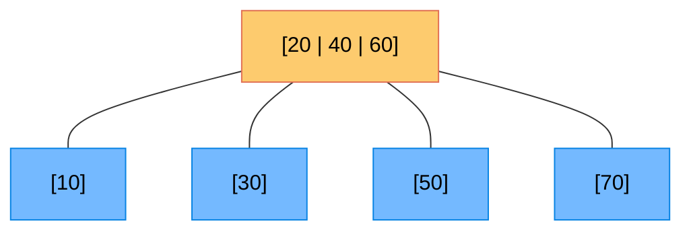
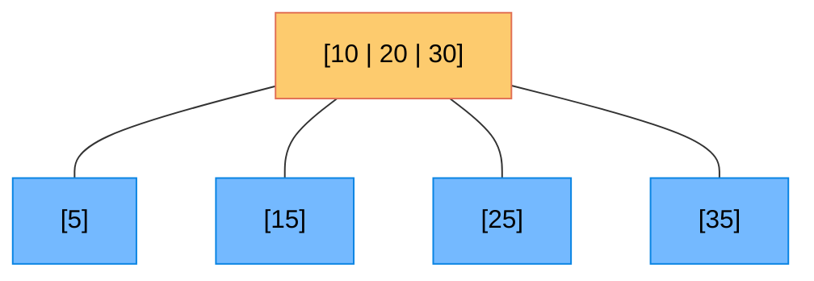
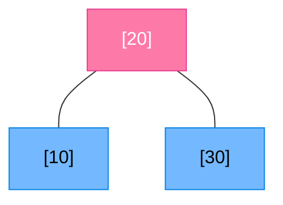
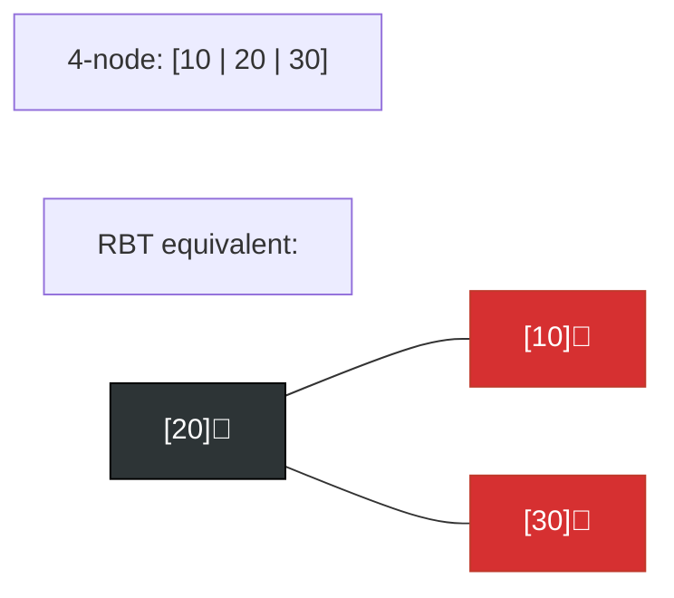

# 🌳 2-3-4 Trees — For Complete Beginners

> A 2-3-4 Tree is like a 2-3 Tree on steroids! Nodes can now hold up to **3 keys**, which means **less splitting** during insertions.

---

## 🎯 What is a 2-3-4 Tree?

A **2-3-4 Tree** (also called a **B-Tree of order 4**) is a self-balancing tree where:
- Every internal node has **2, 3, or 4 children**
- Nodes hold **1, 2, or 3 keys** respectively
- All **leaf nodes** are at the **same level** (always balanced!)

### 🧱 Node Types

| Node Type | Keys | Children | Color below |
|:---|:---:|:---:|:---:|
| **2-node** | 1 | 2 | 🔵 Blue |
| **3-node** | 2 | 3 | 🟣 Purple |
| **4-node** | 3 | 4 | 🟠 Orange |

---

## 📸 Visual Example — A 2-3-4 Tree

**🔵 Blue = 2-node | 🟣 Purple = 3-node | 🟠 Orange = 4-node | 🟢 Green = Leaf**

---

## 🔍 Operation 1: Search

Identical to 2-3 tree search, but now you compare against up to **3 keys** at each node.

### Algorithm:
1. At each node with keys `K1 ≤ K2 ≤ K3`:
   - `target == K1` or `K2` or `K3` → ✅ **Found!**
   - `target < K1` → **child 1 (leftmost)**
   - `K1 < target < K2` → **child 2**
   - `K2 < target < K3` → **child 3**
   - `target > K3` → **child 4 (rightmost)**
2. If NULL reached → ❌ **Not found**.

---

## ➕ Operation 2: Insertion (Top-Down Splitting)

2-3-4 Trees use a **proactive top-down** approach: split any **4-node** you encounter on the **way down**, before you need it.

### Why split on the way down?
This guarantees that when you finally reach a leaf, there's always room to insert. No need to backtrack!

### Splitting a 4-node `[K1 | K2 | K3]`:
1. Push the **middle key K2** up to the parent.
2. Split the 4-node into two 2-nodes: `[K1]` and `[K3]`.

### Steps:
1. Start at root. If root is a 4-node → **split it first** (new root grows).
2. Walk down, splitting any 4-node you encounter.
3. At the leaf → insert the key (it is guaranteed to have room).

### 📸 Insertion Example: Insert **25** into:

**Before:** Root = `[10 | 20 | 30]` (4-node), with children below.

**Step 1:** Root is a 4-node → split it. Push 20 to new root.

**Pink = promoted key (new root)**

**Step 2:** Traverse. 25 > 20 → go right. Arrive at leaf [30] (a 2-node). Insert 25 → becomes [25 | 30].

---

## ❌ Operation 3: Deletion

Deletion is symmetric to insertion. The 2-3-4 tree uses **top-down adjustment** to ensure no underflows.

### Adjustment before descent:
- When descending, if the current child is a **2-node**, fix it first:
  - **Transfer**: borrow a key from a sibling 3 or 4-node via the parent.
  - **Merge**: if all siblings are 2-nodes, merge with a sibling and pull down a parent key.

---

## 🔗 Connection to Red-Black Trees

> **This is the most important insight!**

Every 2-3-4 tree can be converted directly to a **Red-Black tree**:
- A **2-node** → One black node
- A **3-node** → One black node + one red child
- A **4-node** → One black node + two red children

This is why Red-Black trees and 2-3-4 trees have the same worst-case height!

---

## ⏱️ Complexity
| Operation | Time |
|:---|:---:|
| **Search** | $O(\log n)$ |
| **Insert** | $O(\log n)$ |
| **Delete** | $O(\log n)$ |
