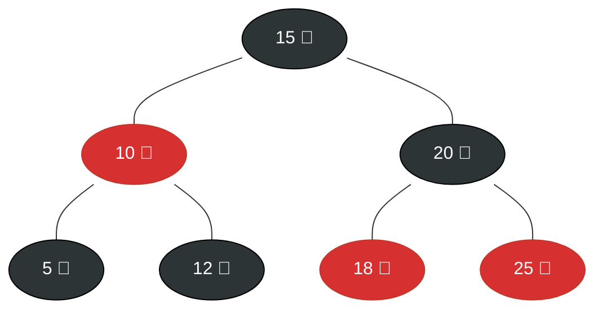
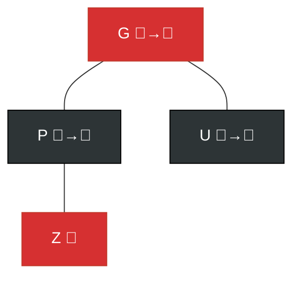
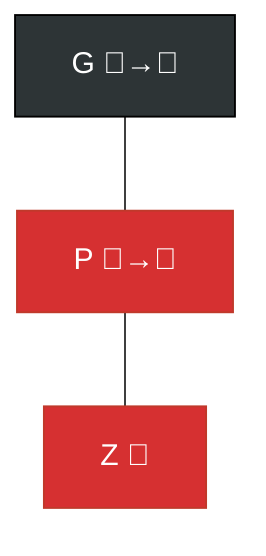

# 🔴⚫ Red-Black Trees — For Complete Beginners

> Imagine painting every node of a BST either **red** or **black**, following strict rules — you get a Red-Black Tree! It's a clever way to keep a BST balanced without storing height info in every node.

---

## 🎯 What is a Red-Black Tree?

A **Red-Black Tree (RBT)** is a **Binary Search Tree** with an extra bit of information per node: its **color** (red or black). This color bit enforces a balance guarantee.

---

## 📜 The 5 Rules (Must Know!)

> Every valid Red-Black Tree **must** satisfy all 5 rules. If any rule is violated after an insert or delete, we fix it.

| Rule | Description |
|:---:|:---|
| **1** | Every node is either **Red** or **Black** |
| **2** | The **Root** is always **Black** |
| **3** | Every **NULL leaf** (sentinel) is **Black** |
| **4** | If a node is **Red**, both its children must be **Black** *(no two reds in a row!)* |
| **5** | Every path from a node to any of its NULL descendants has the **same number of Black nodes** (Black-height is uniform) |

> [!IMPORTANT]
> Rule 4 + Rule 5 together guarantee the tree height is at most **2 × log(n+1)**, ensuring O(log n) operations.

---

## 📸 Visual: A Valid Red-Black Tree


**Check Rules:**
- ✅ Root (15) is Black
- ✅ No two consecutive Reds
- ✅ Every path has exactly 2 black nodes (not counting NULL leaves: 15→10→5, 15→10→12, 15→20→18, 15→20→25)

---

## 🔧 Two Key Fix-Up Tools

Before operations, learn these two tools:

### 🔄 Tool 1: Rotation
A **rotation** restructures the tree **locally** without breaking BST ordering.

**Left Rotation** (at node X):
```
    X              Y
   / \    →       / \
  a   Y          X   c
     / \        / \
    b   c      a   b
```

**Right Rotation** (at node Y):
```
      Y           X
     / \   →     / \
    X   c        a   Y
   / \              / \
  a   b            b   c
```

### 🎨 Tool 2: Recoloring
Simply flip colors: Red → Black or Black → Red.

---

## 🔍 Operation 1: Search

**Identical to BST search** — color is ignored during lookup.

```cpp
Node* search(Node* root, int key) {
    if (!root || root->data == key) return root;
    if (key < root->data) return search(root->left, key);
    return search(root->right, key);
}
```

---

## ➕ Operation 2: Insertion

### Steps:
1. **Insert like a normal BST** and color the new node **RED**.
2. Fix any violated rules using **rotations + recoloring**.

### Fix-Up Cases (new node = `Z`, parent = `P`, uncle = `U`, grandparent = `G`):

#### Case 1: Uncle is Red (Recolor)

**Fix:** Recolor P and U to Black, G to Red. Then treat G as the new problematic node.

#### Case 2: Uncle is Black, Z is an "inner child" (Rotate P)
Rotate P in the **opposite direction** of Z to convert it to Case 3.

#### Case 3: Uncle is Black, Z is an "outer child" (Rotate G + Recolor)

**Fix:** Right-rotate at G, then swap colors of P and G.

### C++ Pseudo-code
```cpp
enum Color { RED, BLACK };

struct Node {
    int data;
    Color color;
    Node *left, *right, *parent;
};

// After standard BST insert, call fixInsert:
void fixInsert(Node*& root, Node* z) {
    while (z->parent && z->parent->color == RED) {
        Node* uncle = getUncle(z);

        if (uncle && uncle->color == RED) {
            // Case 1: Uncle is red → recolor
            z->parent->color = BLACK;
            uncle->color = BLACK;
            z->parent->parent->color = RED;
            z = z->parent->parent;
        } else {
            if (isInnerChild(z)) {
                // Case 2: Inner child → rotate parent
                z = z->parent;
                rotate(root, z, direction);
            }
            // Case 3: Outer child → rotate grandparent + recolor
            z->parent->color = BLACK;
            z->parent->parent->color = RED;
            rotate(root, z->parent->parent, oppositeDirection);
        }
    }
    root->color = BLACK; // Rule 2: root is always black
}
```

---

## ❌ Operation 3: Deletion

Deletion is more complex. The key insight is:
1. **Delete like BST**.
2. If the deleted node or its replacement was **Black**, the Black-height may be violated.
3. Fix with **Double-Black** resolution:
   - **Case 1:** Sibling is Red → Rotate + Recolor
   - **Case 2:** Sibling is Black with Black children → Recolor sibling
   - **Case 3:** Sibling is Black with outer Red child → Rotate + Recolor
   - **Case 4:** Sibling is Black with inner Red child → Rotate + go to Case 3

---

## ⏱️ Complexity Summary
| Operation | Best | Worst |
|:---|:---:|:---:|
| **Search** | $O(\log n)$ | $O(\log n)$ |
| **Insert** | $O(\log n)$ | $O(\log n)$ |
| **Delete** | $O(\log n)$ | $O(\log n)$ |
| **Height** | $\leq 2\log(n+1)$ | — |

> 🏆 Red-Black Trees are the preferred choice for most standard library implementations in **Java (TreeMap)**, **C++ (std::map)**, and **Linux kernel**.
