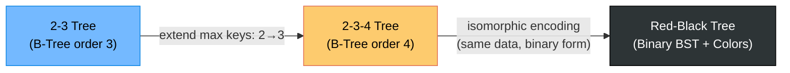
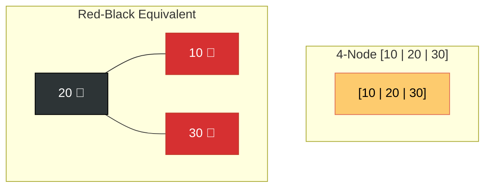

# ⚖️ Comparing 2-3, 2-3-4 and Red-Black Trees

---

## 🗺️ The Big Picture

All three are **self-balancing search trees**. The key differences are *how* they balance and *where* they store data.

---

## 📊 Side-by-Side Comparison

| Feature | 2-3 Tree | 2-3-4 Tree | Red-Black Tree |
|:---|:---:|:---:|:---:|
| **Node children** | 2 or 3 | 2, 3, or 4 | Always 2 (binary) |
| **Keys per node** | 1 or 2 | 1, 2, or 3 | 1 |
| **Type of tree** | Multi-way | Multi-way | Binary |
| **Always balanced?** | ✅ Yes (all leaves same depth) | ✅ Yes | ✅ Yes (height ≤ 2 log n) |
| **Height guarantee** | $O(\log n)$ | $O(\log n)$ | $O(\log n)$ |
| **Insert fixing** | Bottom-up split | Top-down split | Rotations + Recoloring |
| **Delete complexity** | High | Moderate | Moderate |
| **Space overhead** | Variable node size | Variable node size | Fixed (1 extra bit/node) |
| **Real world use** | Databases (B-Trees) | Databases (B-Trees) | `std::map`, `TreeMap`, Linux |

---

## 🔗 Equivalence: 2-3-4 Tree ↔ Red-Black Tree

Every 2-3-4 tree has a **direct 1-to-1 mapping** to a Red-Black Tree:

| 2-3-4 Node | Red-Black Encoding |
|:---|:---|
| **2-node** [K] | One **Black** node |
| **3-node** [K1\|K2] | One Black node + one **Red** child |
| **4-node** [K1\|K2\|K3] | One Black node + two **Red** children |

---

## 🎯 When to Use Which?

| Scenario | Best Choice |
|:---|:---|
| **Memory is limited** (1 bit overhead is fine) | 🔴⚫ Red-Black Tree |
| **Disk-based storage** (read large chunks) | 2-3 Tree (or B-Tree) |
| **You need conceptual simplicity** | 2-3 Tree |
| **Most software implementations** (Java, C++) | 🔴⚫ Red-Black Tree |
| **Learning B-Trees** | Start with 2-3, extend to 2-3-4 |

---

## 🔑 Key Insight for Exams

1. **2-3 tree insert** = bottom-up promotion (may require many passes).
2. **2-3-4 tree insert** = top-down split (single pass, faster in practice).
3. **Red-Black insert** = bottom-up fix (but only at most 2 rotations needed!).
4. **Red-Black delete** = at most 3 rotations needed.
5. **All three guarantee O(log n)** for all operations.
