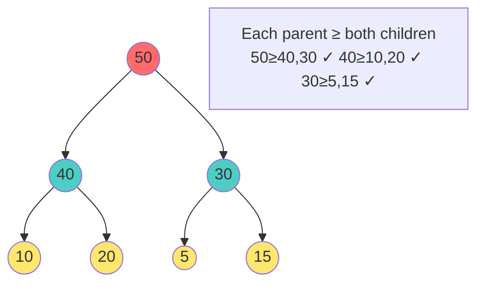
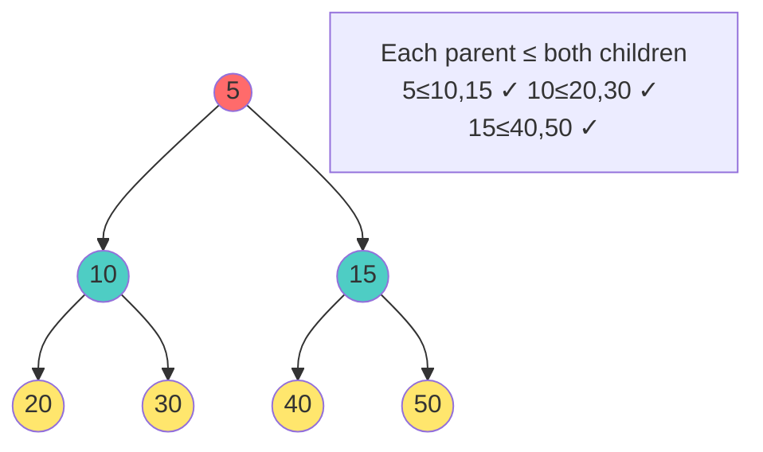

# 📚 Heaps: Complete Comprehensive Guide with All Operations

## 🎯 Table of Contents
1. [Foundation Concepts](#foundation)
2. [Visual Representations](#visuals)
3. [All Operations (15+)](#all-operations)
4. [Complete Implementation](#implementation)
5. [Advanced Concepts](#advanced)

---

## Foundation Concepts

### What is a Heap?

A **complete binary tree** that satisfies the heap property:
- **Max Heap**: Parent ≥ Children (largest at top)
- **Min Heap**: Parent ≤ Children (smallest at top)

### Key Properties
- **Complete**: All levels filled, last level filled left-to-right
- **Array-based**: Stored as simple array
- **Index formulas**: Parent = (i-1)/2, Left = 2i+1, Right = 2i+2

### Visual Comparison

#### Max Heap Property


#### Min Heap Property


#### Array Representation
```
Max Heap Tree:          Array (0-indexed):
        50              [50, 40, 30, 10, 20, 5, 15]
       /  \
      40  30            Index: 0  1  2  3  4  5  6
     / \  / \
    10 20 5 15

Index relationships:
- Node at i: left child = 2i+1, right = 2i+2, parent = (i-1)/2
- Node 1 (40): left = 3 (10), right = 4 (20), parent = 0 (50) ✓
- Node 2 (30): left = 5 (5),  right = 6 (15), parent = 0 (50) ✓
```

---

## All Heap Operations (15+)

### 1. INSERT (Add New Element)

#### Concept: "Bubble Up"
1. Add at end
2. Compare with parent
3. Swap if violates heap property
4. Repeat until heap property restored

#### Visual Example: Insert 45 into Max Heap

```
Initial:            After append:        After bubble up:
      50                  50                   50
     /  \                /  \                /    \
    40  30              40  30              45    30
   / \  /              / \  /              / \    /
  10 20 5              10 20 5 45          40 20  5
                                           / \
                                          10 (45)

Step 3: 45 > 40, so swap
Step 4: 45 < 50, DONE!
```

#### Algorithm
```cpp
void insert(vector<int>& heap, int value) {
    heap.push_back(value);  // Add at end
    int index = heap.size() - 1;
    
    // Bubble up
    while (index > 0) {
        int parent = (index - 1) / 2;
        
        if (heap[index] > heap[parent]) {
            swap(heap[index], heap[parent]);
            index = parent;
        } else {
            break;
        }
    }
}
```

**Time**: O(log n)  
**Space**: O(1)

---

### 2. EXTRACT MAX (Remove Root)

#### Concept: "Bubble Down" / "Heapify"
1. Store root (to return)
2. Move last element to root
3. Bubble down, swapping with larger child
4. Repeat until heap property restored

#### Visual Example: Extract 50

```
Before:             Move last:          Bubble down:
    50                  5                   40
   /  \               /  \                /   \
  40  30     →       40  30      →       5    30
 / \  / \           / \  / \            / \   / \
10 20 5 15         10 20                10 20

Bubble:
- 5 vs children (40, 30): swap with 40
- 5 vs children (20): no swap
- DONE!

Final:     Output: 50
    40
   /  \
  20  30
 / \
10 5
```

#### Algorithm
```cpp
int extractMax(vector<int>& heap) {
    if (heap.empty()) return -1;
    
    int max = heap[0];
    heap[0] = heap.back();
    heap.pop_back();
    
    // Bubble down
    int index = 0;
    while (true) {
        int largest = index;
        int left = 2 * index + 1;
        int right = 2 * index + 2;
        
        // Find largest among node and children
        if (left < heap.size() && heap[left] > heap[largest])
            largest = left;
        if (right < heap.size() && heap[right] > heap[largest])
            largest = right;
        
        if (largest != index) {
            swap(heap[index], heap[largest]);
            index = largest;
        } else {
            break;  // Heap property restored
        }
    }
    
    return max;
}
```

**Time**: O(log n)  
**Space**: O(1)

---

### 3. PEEK MAX (Get Max without Removal)

#### Concept
Just return root element!

```cpp
int peekMax(const vector<int>& heap) {
    return heap.empty() ? -1 : heap[0];
}
```

**Time**: O(1)  
**Space**: O(1)

---

### 4. BUILD HEAP FROM ARRAY (Heapify)

#### Naive Way: Insert each - O(n log n)
```cpp
void buildHeapNaive(vector<int>& arr) {
    vector<int> heap;
    for (int x : arr) {
        heap.push_back(x);
        bubbleUp(heap, heap.size() - 1);
    }
}
```

#### Optimal Way: Bottom-Up - O(n)
Start from last non-leaf, heapify downward

```
Before heapify:     After heapify:
[3, 1, 4]           [4, 1, 3]
   3                   4
  / \                 / \
 1   4      →        1   3

Start from index 0 (3), bubble down
3 vs children (1,4): swap with 4
Done!
```

#### Algorithm
```cpp
void buildHeap(vector<int>& arr) {
    int n = arr.size();
    
    // Start from last non-leaf node
    for (int i = n / 2 - 1; i >= 0; i--) {
        heapifyDown(arr, i, n);
    }
}

void heapifyDown(vector<int>& arr, int index, int n) {
    int largest = index;
    int left = 2 * index + 1;
    int right = 2 * index + 2;
    
    if (left < n && arr[left] > arr[largest])
        largest = left;
    if (right < n && arr[right] > arr[largest])
        largest = right;
    
    if (largest != index) {
        swap(arr[index], arr[largest]);
        heapifyDown(arr, largest, n);
    }
}
```

**Time Analysis**:
- Nodes at height h: ~n/2^(h+1)
- Work per node: h comparisons
- Total: Σ(n/2^(h+1) × h) = O(n)

**Why O(n) not O(n log n)?** Most nodes near bottom (little work), few at top (much work but few)

---

### 5. HEAP SORT

#### Concept
1. Build max heap - O(n)
2. Extract max n times - O(n log n)

```
Input: [3, 1, 4, 1, 5, 9, 2, 6]

Step 1: Build heap
        [9, 6, 5, 1, 1, 3, 2, 4]
            9
           / \
          6   5
         / \ / \
        1  1 3  2

Step 2: Extract 9
        [8, 6, 5, 1, 1, 3, 2]
        [9, 8, 6, 5, 1, 1, 3, 2]

...continue until sorted↓
Output: [1, 1, 2, 3, 4, 5, 6, 9] ✓
```

#### Algorithm
```cpp
void heapSort(vector<int>& arr) {
    int n = arr.size();
    
    // Build max heap - O(n)
    for (int i = n / 2 - 1; i >= 0; i--)
        heapifyDown(arr, i, n);
    
    // Extract elements - O(n log n)
    for (int i = n - 1; i > 0; i--) {
        swap(arr[0], arr[i]);           // Move root to end
        heapifyDown(arr, 0, i);         // Heapify reduced heap
    }
}
```

**Time**: O(n log n)  
**Space**: O(1) in-place

---

### 6. FIND MIN (For Min Heap)

#### Concept
Minimum is always at root!

```cpp
int findMin(const vector<int>& heap) {
    return heap.empty() ? -1 : heap[0];
}
```

**Time**: O(1)

---

### 7. FIND K-TH LARGEST

#### Concept
Use min-heap of size K, keep only K largest elements

```
Array: [3, 1, 4, 1, 5, 9, 2, 6]
Find 3 largest:

Initial:        Add 1:          Add 4:
              [1]             [1, 4]
                              
Add 5:          Remove min:     Final:
[1, 5]          [4, 5]          [4, 5, 9]
 / \             / \             / \
4   5           4   5           4   5
```

#### Algorithm
```cpp
vector<int> findKLargest(vector<int>& arr, int k) {
    priority_queue<int, vector<int>, greater<int>> minHeap;
    
    for (int x : arr) {
        minHeap.push(x);
        if (minHeap.size() > k)
            minHeap.pop();  // Remove min when size > k
    }
    
    vector<int> result;
    while (!minHeap.empty()) {
        result.push_back(minHeap.top());
        minHeap.pop();
    }
    return result;
}
```

**Time**: O(n log k)  
**Space**: O(k)

---

### 8. FIND MEDIAN IN STREAM

#### Concept
Use two heaps: max-heap (left/small) + min-heap (right/large)

```
Stream: 1, 2, 3, 4, 5

After 1:        After 2:          After 3:
maxHeap: [1]    maxHeap: [1]      maxHeap: [2]
minHeap: []     minHeap: [2]      minHeap: [3]
Median: 1       Median: 1.5       Median: 2
```

#### Algorithm
```cpp
class MedianFinder {
private:
    priority_queue<int> maxHeap;  // Left side
    priority_queue<int, vector<int>, greater<int>> minHeap;  // Right side
    
public:
    void addNum(int num) {
        // Add to max heap first
        if (maxHeap.empty() || num <= maxHeap.top())
            maxHeap.push(num);
        else
            minHeap.push(num);
        
        // Balance if needed
        if (maxHeap.size() > minHeap.size() + 1) {
            minHeap.push(maxHeap.top());
            maxHeap.pop();
        }
        if (minHeap.size() > maxHeap.size()) {
            maxHeap.push(minHeap.top());
            minHeap.pop();
        }
    }
    
    double findMedian() {
        if (maxHeap.size() > minHeap.size())
            return maxHeap.top();
        return (maxHeap.top() + minHeap.top()) / 2.0;
    }
};
```

**Time**: O(log n) per operation  
**Space**: O(n)

---

### 9. PRIORITY QUEUE (Using Max Heap)

#### Concept
Process elements by priority, highest first

```
Insert with priority:
Items: [(Pizza, 10), (Salad, 5), (Burger, 8)]

MaxHeap by priority:
         Pizza(10)
        /         \
    Burger(8)    Salad(5)

Extract:
1. Pizza (priority 10)
2. Burger (priority 8)
3. Salad (priority 5)
```

#### Algorithm
```cpp
class PriorityQueue {
private:
    vector<pair<int, string>> heap;  // (priority, task)
    
    int parent(int i) { return (i - 1) / 2; }
    int left(int i) { return 2 * i + 1; }
    int right(int i) { return 2 * i + 2; }
    
    void bubbleUp(int i) {
        while (i > 0 && heap[parent(i)].first < heap[i].first) {
            swap(heap[i], heap[parent(i)]);
            i = parent(i);
        }
    }
    
    void bubbleDown(int i) {
        int largest = i;
        if (left(i) < heap.size() && heap[left(i)].first > heap[largest].first)
            largest = left(i);
        if (right(i) < heap.size() && heap[right(i)].first > heap[largest].first)
            largest = right(i);
        
        if (largest != i) {
            swap(heap[i], heap[largest]);
            bubbleDown(largest);
        }
    }
    
public:
    void push(int priority, string task) {
        heap.push_back({priority, task});
        bubbleUp(heap.size() - 1);
    }
    
    pair<int, string> pop() {
        pair<int, string> top = heap[0];
        heap[0] = heap.back();
        heap.pop_back();
        bubbleDown(0);
        return top;
    }
    
    bool empty() { return heap.empty(); }
};
```

---

### 10. DIJKSTRA'S SHORTEST PATH (Using Min-Heap)

```cpp
vector<int> dijkstra(vector<vector<pair<int,int>>>& graph, int start) {
    int n = graph.size();
    vector<int> dist(n, INT_MAX);
    priority_queue<pair<int,int>, vector<pair<int,int>>, greater<pair<int,int>>> pq;
    
    dist[start] = 0;
    pq.push({0, start});
    
    while (!pq.empty()) {
        auto [d, u] = pq.top();
        pq.pop();
        
        if (d > dist[u]) continue;  // Skip outdated entry
        
        for (auto [v, w] : graph[u]) {
            if (dist[u] + w < dist[v]) {
                dist[v] = dist[u] + w;
                pq.push({dist[v], v});
            }
        }
    }
    
    return dist;
}
```

---

### 11. CHECK IF HEAP PROPERTY

#### Concept
Verify every parent ≥ children (for max-heap)

```cpp
bool isMaxHeap(const vector<int>& arr) {
    int n = arr.size();
    for (int i = 0; i <= (n - 2) / 2; i++) {
        int left = 2 * i + 1;
        int right = 2 * i + 2;
        
        if (left < n && arr[i] < arr[left])
            return false;
        if (right < n && arr[i] < arr[right])
            return false;
    }
    return true;
}
```

**Time**: O(n)  
**Space**: O(1)

---

### 12. HEAP INCREASE KEY

#### Concept
Increase value of element at index i

```cpp
void increaseKey(vector<int>& heap, int index, int newValue) {
    if (newValue < heap[index]) return;  // Can't decrease
    
    heap[index] = newValue;
    
    // Bubble up if needed
    while (index > 0) {
        int parent = (index - 1) / 2;
        if (heap[index] > heap[parent]) {
            swap(heap[index], heap[parent]);
            index = parent;
        } else {
            break;
        }
    }
}
```

**Time**: O(log n)

---

### 13. HEAP DECREASE KEY (For Min-Heap)

```cpp
void decreaseKey(vector<int>& heap, int index, int newValue) {
    if (newValue > heap[index]) return;  // Can't increase
    
    heap[index] = newValue;
    
    // Bubble up if needed
    while (index > 0) {
        int parent = (index - 1) / 2;
        if (heap[index] < heap[parent]) {
            swap(heap[index], heap[parent]);
            index = parent;
        } else {
            break;
        }
    }
}
```

---

### 14. CONVERT to MIN-HEAP

```cpp
vector<int> convertToMinHeap(vector<int> arr) {
    // Just negate all values, build max-heap, then negate back
    for (auto& x : arr) x = -x;
    
    buildHeap(arr);  // Build max-heap of negatives
    
    for (auto& x : arr) x = -x;  // Negate back
    return arr;
}
```

---

### 15. MERGE TWO HEAPS

```cpp
vector<int> mergeHeaps(vector<int> heap1, vector<int> heap2) {
    // Combine both
    heap1.insert(heap1.end(), heap2.begin(), heap2.end());
    
    // Rebuild as heap
    buildHeap(heap1);
    return heap1;
}
```

**Time**: O(n + m)

---

## Complete C++ Implementation

```cpp
#include <iostream>
#include <vector>
#include <algorithm>
using namespace std;

class MaxHeap {
private:
    vector<int> heap;
    
    int parent(int i) { return (i - 1) / 2; }
    int left(int i) { return 2 * i + 1; }
    int right(int i) { return 2 * i + 2; }
    
    void bubbleUp(int i) {
        while (i > 0 && heap[parent(i)] < heap[i]) {
            swap(heap[i], heap[parent(i)]);
            i = parent(i);
        }
    }
    
    void bubbleDown(int i) {
        while (true) {
            int largest = i;
            if (left(i) < heap.size() && heap[left(i)] > heap[largest])
                largest = left(i);
            if (right(i) < heap.size() && heap[right(i)] > heap[largest])
                largest = right(i);
            
            if (largest == i) break;
            
            swap(heap[i], heap[largest]);
            i = largest;
        }
    }
    
public:
    // 1. Insert
    void insert(int value) {
        heap.push_back(value);
        bubbleUp(heap.size() - 1);
    }
    
    // 2. Extract Max
    int extractMax() {
        if (heap.empty()) return -1;
        
        int max = heap[0];
        heap[0] = heap.back();
        heap.pop_back();
        
        if (!heap.empty())
            bubbleDown(0);
        
        return max;
    }
    
    // 3. Peek Max
    int peekMax() {
        return heap.empty() ? -1 : heap[0];
    }
    
    // 4. Build Heap
    void buildHeap(vector<int>& arr) {
        heap = arr;
        for (int i = heap.size() / 2 - 1; i >= 0; i--)
            bubbleDown(i);
    }
    
    // 5. Heap Sort
    static vector<int> heapSort(vector<int> arr) {
        MaxHeap h;
        h.buildHeap(arr);
        
        vector<int> sorted;
        while (!h.heap.empty()) {
            sorted.push_back(h.extractMax());
        }
        return sorted;
    }
    
    // 6. Is Valid Max Heap
    bool isValidHeap() {
        for (int i = 0; i < (int)heap.size() / 2; i++) {
            if (left(i) < heap.size() && heap[i] < heap[left(i)])
                return false;
            if (right(i) < heap.size() && heap[i] < heap[right(i)])
                return false;
        }
        return true;
    }
    
    // 7. Get Size
    int size() { return heap.size(); }
    
    // 8. Display
    void display() {
        for (int x : heap)
            cout << x << " ";
        cout << endl;
    }
};

int main() {
    MaxHeap heap;
    
    // Insert elements
    heap.insert(50);
    heap.insert(30);
    heap.insert(20);
    heap.insert(10);
    heap.insert(40);
    
    cout << "Heap: ";
    heap.display();  // 50 40 20 10 30 (max-heap property)
    
    cout << "Peek Max: " << heap.peekMax() << endl;  // 50
    cout << "Extract Max: " << heap.extractMax() << endl;  // 50
    
    cout << "After extraction: ";
    heap.display();  // 40 30 20 10
    
    // Build heap from array
    vector<int> arr = {5, 3, 8, 1, 2};
    heap.buildHeap(arr);
    cout << "Built heap: ";
    heap.display();
    
    // Heap sort
    vector<int> sorted = MaxHeap::heapSort({3, 1, 4, 1, 5, 9, 2, 6});
    cout << "Sorted array: ";
    for (int x : sorted)
        cout << x << " ";  // 1 1 2 3 4 5 6 9
    cout << endl;
    
    // Verify heap property
    cout << "Is valid heap? " << (heap.isValidHeap() ? "Yes" : "No") << endl;
    
    return 0;
}
```

---

## Complexity Comparison

| Operation | Time | Space |
|-----------|------|-------|
| Insert | O(log n) | O(1) |
| Extract Max | O(log n) | O(1) |
| Peek | O(1) | O(1) |
| Build Heap | O(n) | O(n) |
| Heap Sort | O(n log n) | O(1) |
| Find K-largest | O(n log k) | O(k) |
| Dijkstra | O((V+E) log V) | O(V) |

---

## Real-World Applications

✅ **Priority Queues** - Task scheduling (OS)  
✅ **Dijkstra's Algorithm** - Shortest path (GPS)  
✅ **Huffman Coding** - Data compression  
✅ **Heap Sort** - General sorting  
✅ **Median Finder** - Stream processing  
✅ **K-largest Elements** - Top-K problems  
✅ **Prim's Algorithm** - Minimum spanning tree  

---

## Key Takeaways

✅ **Complete binary tree** stored as array  
✅ **O(log n) operations** for insert/extract  
✅ **O(n) build heap** - Better than n insertions  
✅ **O(1) space** - In-place sort with O(n log n) time  
✅ **Two variants** - Max heap (scheduling) & min heap (priority queues)  

**Heaps are the foundation of efficient algorithms!** 🚀