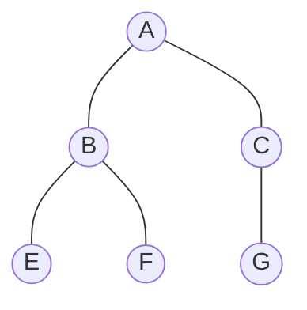
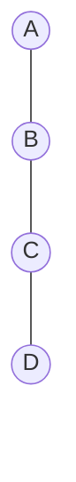
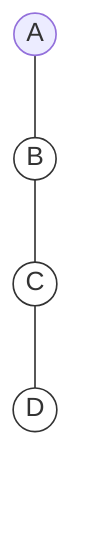
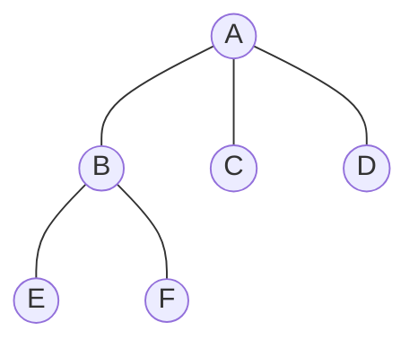
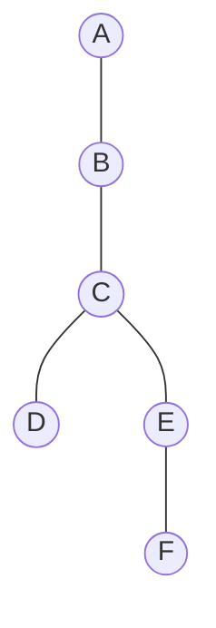

# 🚀 Binary Tree: From Beginner to Pro

A **Binary Tree** is a special type of tree where every node can have **at most 2 children**. Think of it as a family tree where each parent can have a maximum of two kids.

---

## 🏷️ The Core Rule
In a Binary Tree:
- **Degree of Tree = 2**
- **Number of Children = {0, 1, or 2}**
> [!IMPORTANT]
> A node *cannot* have more than 2 children in a binary tree. If it does, it's just a general tree!

---

## 📦 Concept Cards

### 1. Standard Binary Tree
> This is what a "normal" binary tree looks like. Each node has 0, 1, or 2 children.

**Explanation:** Node A has 2 children (B, C). Node B has 2 children (E, F). Node C has 1 child (G). Since no node exceeds 2 children, this is a **Binary Tree**.

---

### 2. Left Skewed Binary Tree
> Sometimes a tree grows in only one direction. This is a "Left Skewed" tree.

**Explanation:** Every node has only a **Left child** (or 0 children). In this case, the height of the tree is equal to the number of nodes.

---

### 3. Right Skewed Binary Tree
> Just like the left-skewed, but it grows entirely to the right.

**Explanation:** Every node has only a **Right child**. This structure behaves almost like a Linked List!

---

### 4. ❌ NOT a Binary Tree!
> Understanding what is *not* a binary tree is key to becoming a pro.

**Explanation:** Look at Node **A**. It has **3 children** (B, C, D). 
**Why it fails:** Since `Degree(A) = 3`, it violates the "Max 2 children" rule. This is a **General Tree**, not a binary tree.

---

### 5. Irregular Binary Tree
> Binary trees don't have to be symmetrical.

**Explanation:** Even though it looks irregular, it's still a binary tree because no node has more than 2 children.

---

## 🎓 Pro Tip: Why do we care?
Binary trees are the foundation for **Binary Search Trees (BST)** and **Heaps**. By limiting children to 2, we can make searching and sorting extremely fast (O(log N)).
