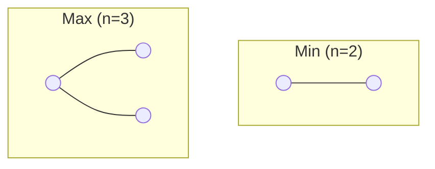
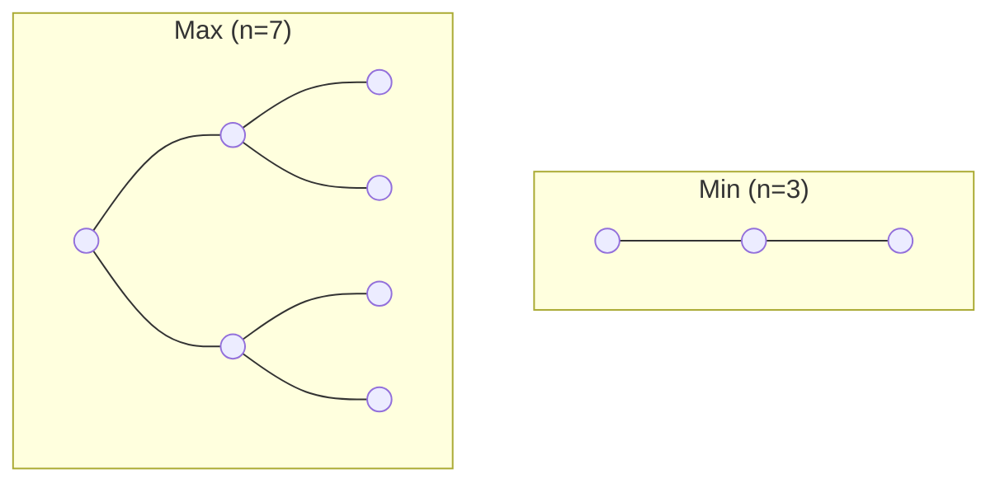
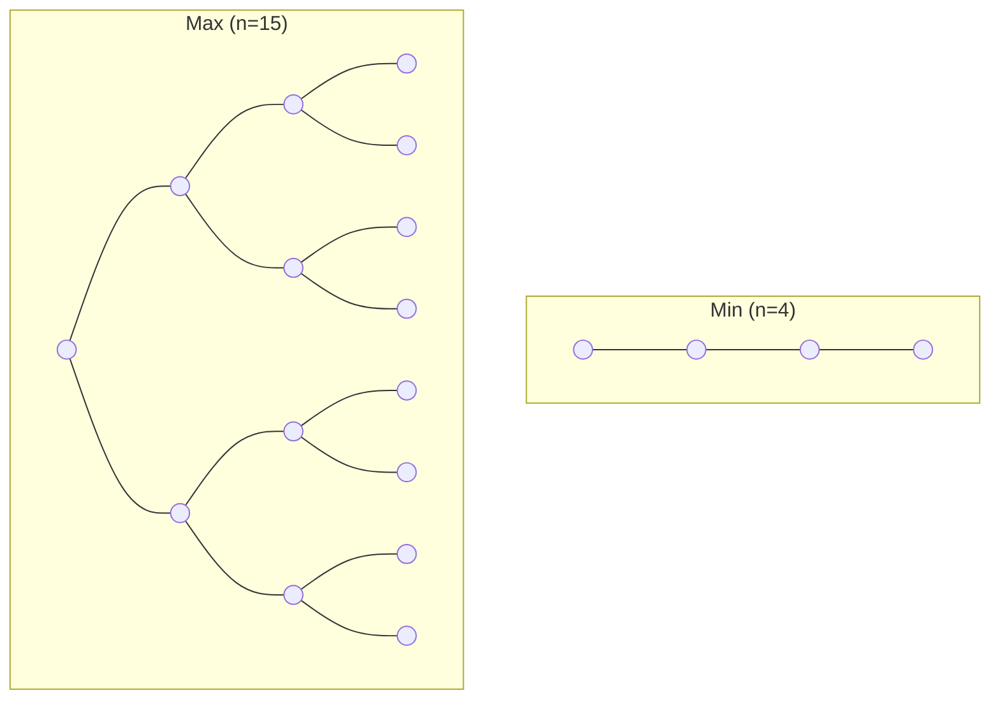
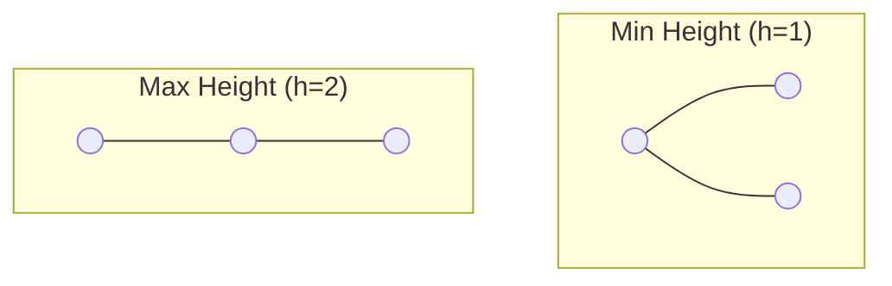
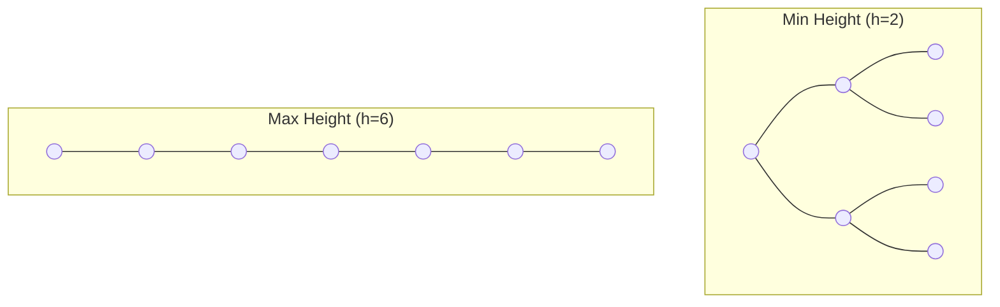
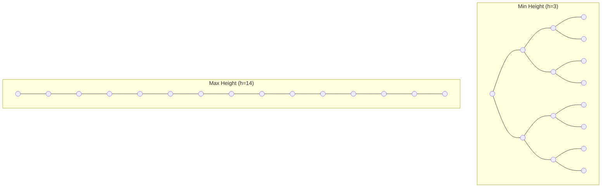

# 📏 Binary Tree: Height vs. Nodes

Understanding the relationship between the **Height (h)** of a tree and the **Number of Nodes (n)** is key to analyzing performance. Let's break it down step-by-step.

---

## 🏗️ Scenario 1: If Height (h) is Given
If we know the height, what are the minimum and maximum nodes possible?

### 1. Minimum Nodes ($n_{min}$)
To have the absolute minimum nodes, the tree should be as "thin" as possible. This happens in a **Skewed Tree**.
- **Formula:** $n = h + 1$
- **Example ($h=2$):** Nodes = $2+1 = 3$.

### 2. Maximum Nodes ($n_{max}$)
To have the maximum nodes, every level must be completely full. This is a **Full/Perfect Binary Tree**.
- **Formula:** $n = 2^{h+1} - 1$
- **Example ($h=2$):** Nodes = $2^{2+1} - 1 = 8 - 1 = 7$.

#### 🎓 Derivation (using G.P. Series)
The total nodes are the sum of nodes at each level:
- Level 0: $2^0 = 1$
- Level 1: $2^1 = 2$
- ...
- Level h: $2^h$

Total $n = 1 + 2 + 2^2 + 2^3 + \dots + 2^h$.
This is a **Geometric Progression (G.P.)** where $a=1, r=2$.
$$S = \frac{a(r^{h+1}-1)}{r-1} = \frac{1(2^{h+1}-1)}{2-1} = 2^{h+1} - 1$$

---

## 📸 Visual Comparison ($h=1$ to $h=3$)
Here is how the trees look at their absolute minimum (Skewed) and absolute maximum (Full).

### 🏷️ Case: Height h = 1
- **Min Nodes ($h+1$):** 2
- **Max Nodes ($2^{h+1}-1$):** 3

### 🏷️ Case: Height h = 2
- **Min Nodes:** 3
- **Max Nodes:** 7

### 🏷️ Case: Height h = 3
- **Min Nodes:** 4
- **Max Nodes:** 15

---

## 📐 Scenario 2: If Nodes (n) are Given
If we know how many nodes we have, what are the possible heights?

### 1. Maximum Height ($h_{max}$)
Just like min nodes, max height happens when the tree is as "thin" as possible (**Skewed**).
- **Formula:** $h = n - 1$
- **Example ($n=15$):** $h = 14$ (Linear growth).

### 2. Minimum Height ($h_{min}$)
Minimum height happens when the tree is packed densly (**Full/Complete**).
- **Formula:** $h = \log_{2}(n+1) - 1$
- **Example ($n=15$):** $h = \log_{2}(16) - 1 = 4 - 1 = 3$.

#### 🎓 Derivation (using Logarithms)
We start with the Max Nodes formula:
1. $n = 2^{h+1} - 1$
2. $n + 1 = 2^{h+1}$
3. Take $\log_2$ on both sides: $\log_2(n+1) = h+1$
4. $h = \log_2(n+1) - 1$

---

## 📸 Visual Comparison (Nodes Fixed)
What happens to the **Height** when we keep the number of nodes fixed?

### 🏷️ Case: n = 3 Nodes
- **Min Height ($\log_2(n+1)-1$):** 1 (Perfect)
- **Max Height ($n-1$):** 2 (Skewed)

### 🏷️ Case: n = 7 Nodes
- **Min Height:** 2 (Perfect)
- **Max Height:** 6 (Skewed)

### 🏷️ Case: n = 15 Nodes
- **Min Height:** 3 (Perfect)
- **Max Height:** 14 (Skewed)

---

## 📊 Summary Cards (n nodes)

### Card 1: Range of Nodes
For a given height **h**:
$$h+1 \le n \le 2^{h+1}-1$$

### Card 2: Range of Height
For a given node count **n**:
$$\log_2(n+1)-1 \le h \le n-1$$

---

## 💡 Pro Tip: Performance
- **Skewed Trees** are slow because height is **O(n)**.
- **Balanced Trees** are fast because height is **O(log n)**.
This is why we always try to keep trees balanced!
