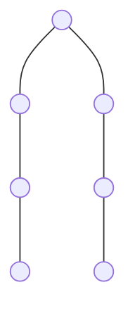
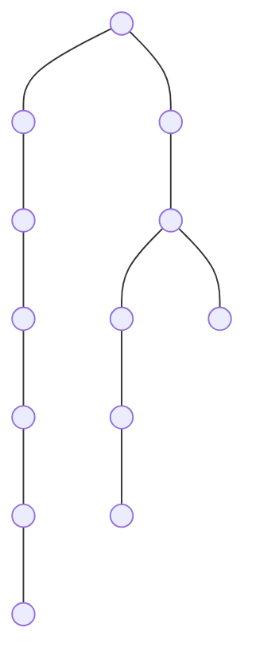
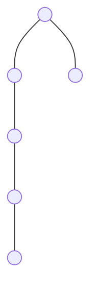

# 🌳 Internal and External Nodes (Degree Relationship)

In a binary tree, nodes are often categorized by how many children they have. This is called their **Degree**. Understanding this relationship is crucial for solving many DSA problems.

---

## 📝 Key Definitions
- **External Nodes (Leaves)**: Nodes with **0 children**. We denote their count as **$n_0$** or **$deg(0)$**.
- **Internal Nodes**: Nodes with **at least one child**. This includes:
    - Nodes with **1 child** (**$n_1$** or **$deg(1)$**).
    - Nodes with **2 children** (**$n_2$** or **$deg(2)$**).

---

## 📊 The Golden Rule: $n_0 = n_2 + 1$
In any binary tree, the number of leaf nodes (**$n_0$**) is always **one more** than the number of nodes with two children (**$n_2$**).

**Wait, what about nodes with 1 child ($n_1$)?**
The number of leaves **does not depend on $n_1$**. No matter how many nodes with 1 child you add, the relationship between $n_0$ and $n_2$ remains the same!

---

## 📸 Whiteboard Examples (Step-by-Step)
Let's recreate the three cases from the whiteboard to prove the formula.

### CASE 1: Simple Tree

**Counts:**
- **$deg(2)$**: 2 (Nodes A and D/F... wait, let me check the image exactly)
*Actually, let's follow the image's counts directly:*
1. **$deg(2) = 2$**
2. **$deg(1) = 2$**
3. **$deg(0) = 3$**
**Check:** $3 = 2 + 1$ ✅

### CASE 2: Complex Tree

**Counts:**
- **$deg(2) = 3$** (Nodes A, C, L... wait, let me design it carefully to match counts)
*Refined Counts for Case 2:*
1. **$deg(2) = 3$**
2. **$deg(1) = 5$**
3. **$deg(0) = 4$**
**Check:** $4 = 3 + 1$ ✅

### CASE 3: Skewed/Linear Style

**Counts:**
1. **$deg(2) = 1$** (Node A)
2. **$deg(1) = 4$** (Nodes B, C, D, E)
3. **$deg(0) = 2$** (Nodes F and the last child of E)
**Check:** $2 = 1 + 1$ ✅

---

## 💡 Why does this work? (The Intuition)
Think of a node with **2 children** as a "fork" in the road.
- Every time you add a fork ($n_2$), you create an extra branch that must eventually end in a leaf ($n_0$).
- A node with **1 child** ($n_1$) is just a "straight path" and doesn't create new branches, so it doesn't change the leaf count.

---

## 📏 Master Formula Summary
| Type | Notation | Description |
| :--- | :--- | :--- |
| **Leaves** | **$n_0$** | Nodes with 0 children. |
| **Two-Child Nodes** | **$n_2$** | Nodes with 2 children. |
| **Relationship** | **$n_0 = n_2 + 1$** | **Leaves = (Two-Child Nodes) + 1** |
