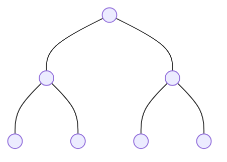
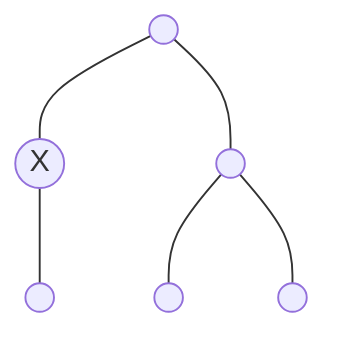

# 📏 Strict Binary Tree (Proper/Full)

A **Strict Binary Tree** is a specific type of binary tree where every node follows a very simple rule regarding its children.

---

## 🏛️ The Rule: $\{0, 2\}$
In a Strict Binary Tree, every node must have either:
- **0 children** (it's a leaf)
- **2 children** (it's an internal node)

**🚫 The Forbidden Case:**
A node **cannot** have exactly **1 child**. If even one node in the tree has only 1 child, the entire tree is no longer "Strict."

---

## 📸 Visual Examples (Yes vs. No)

### ✅ YES: This is a Strict Binary Tree
Notice how every node has either 2 children or is a leaf (0 children).

### ❌ NO: This is NOT a Strict Binary Tree
The node marked with **X** has only **1 child**, which breaks the strict rule.

---

## 🎭 Other Names (Aliases)
Depending on the textbook or professor, a Strict Binary Tree is also called:
1. **Proper** Binary Tree
2. **Full** Binary Tree (Note: Some authors use "Full" for "Perfect," so "Strict" is the most unambiguous term).

---

## 💡 Summary Card
| Feature | Strict Binary Tree |
| :--- | :--- |
| **Possible Degrees** | $\{0, 2\}$ |
| **Forbidden Degree** | $\{1\}$ |
| **Key Characteristic** | No "half-empty" internal nodes. |
