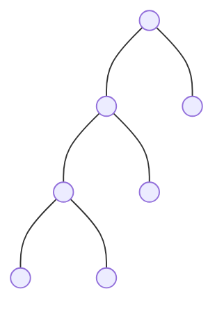
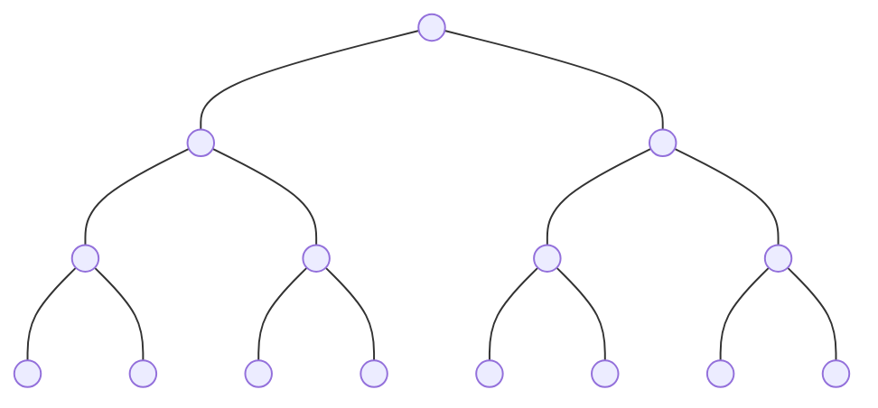
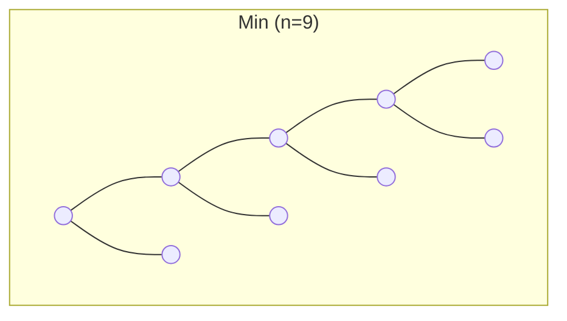
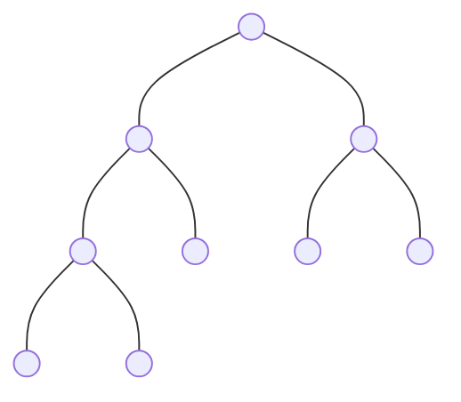
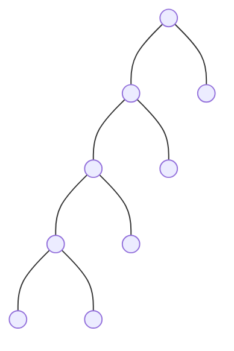

# 📏 Strict Binary Tree: Height vs. Nodes

In a **Strict Binary Tree**, the requirement that every node must have either **0 or 2 children** changes the mathematical relationship between height and nodes significantly.

---

## 🏗️ Scenario 1: If Height (h) is Given
If we know the height, what are the minimum and maximum nodes possible?

### 1. Minimum Nodes ($n_{min}$)
The "thinnest" strict tree is no longer a simple line (skewed). To stay strict, every internal node must have exactly 2 children.
- **Formula:** $n = 2h + 1$
- **Example ($h=3$):** Nodes = $2(3) + 1 = 7$.

### 2. Maximum Nodes ($n_{max}$)
The densest strict tree is a **Perfect Binary Tree**.
- **Formula:** $n = 2^{h+1} - 1$
- **Example ($h=3$):** Nodes = $2^4 - 1 = 15$.

---

## 📸 Visual Comparison (h = 3)

### ✅ Min Nodes (n=7)
Each level adds exactly one internal node and one leaf to keep it strict.

### ✅ Max Nodes (n=15)
A Perfect Binary Tree where every level is full.

### 🏷️ Case: Height h = 4
- **Min Nodes ($2h+1$):** 9
- **Max Nodes:** 31 (Perfect)

---

## 🛑 The "Odd Nodes" Rule
In a Strict Binary Tree, the total number of nodes (**n**) must **always be ODD**.
- **Reason:** The formula $n = 2h + 1$ (for min nodes) and the fact that adding any internal node adds exactly **2 children** means you start with 1 (root) and keep adding 2.
- **Example:** You can have a strict tree with 7, 9, or 31 nodes, but **never 8 or 10 nodes**.

---

## 📐 Scenario 2: If Nodes (n) are Given
If we know the count of nodes, what height range is possible?

### 1. Minimum Height ($h_{min}$)
Happens when the tree is packed perfectly.
- **Formula:** $h = \log_2(n+1) - 1$
- **Example ($n=31$):** $h = \log_2(32) - 1 = 4$.

### 2. Maximum Height ($h_{max}$)
Happens when the tree is as "thin" as possible while remaining strict.
- **Formula:** $h = \frac{n-1}{2}$
- **Example ($n=9$):** $h = \frac{9-1}{2} = 4$.

---

## 📸 Visual Comparison (Nodes Fixed: n = 9)

### ✅ Min Height (h=3)

### ✅ Max Height (h=4)

---

## 📊 Summary Comparison
| Feature | General Binary Tree | Strict Binary Tree |
| :--- | :--- | :--- |
| **Min Nodes** | $h + 1$ | **$2h + 1$** |
| **Max Nodes** | $2^{h+1} - 1$ | $2^{h+1} - 1$ |
| **Min Height** | $\log_2(n+1) - 1$ | $\log_2(n+1) - 1$ |
| **Max Height** | $n - 1$ | **$\frac{n-1}{2}$** |
