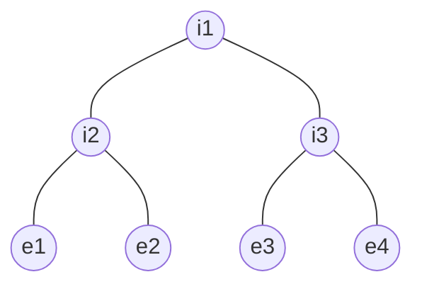
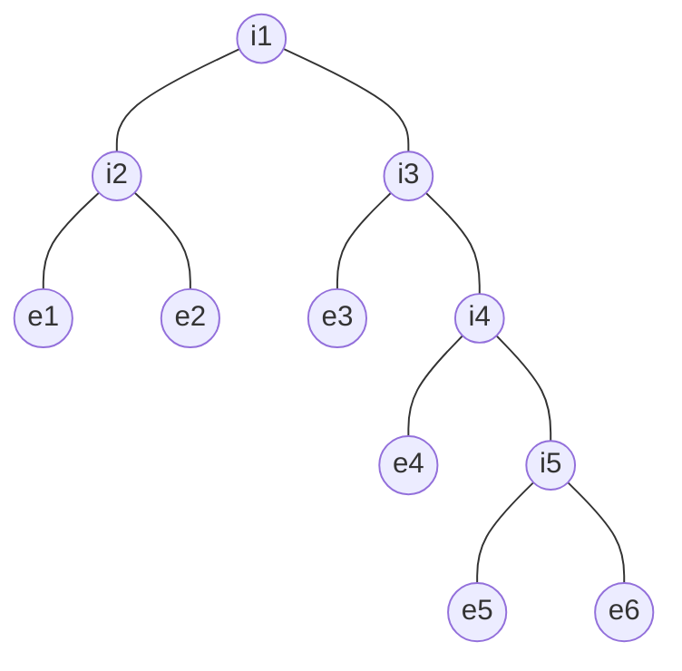

# 🌳 Strict Binary Tree: Internal vs. External Nodes

In a **Strict Binary Tree**, the relationship between internal nodes ($i$) and external nodes ($e$) is one of the most elegant mathematical properties in tree data structures.

---

## 📝 Definitions
- **Internal Nodes ($i$)**: Nodes that have children (in a strict tree, they **must** have 2 children).
- **External Nodes ($e$)**: Nodes with 0 children, also known as **Leaves**.

---

## 📐 The Golden Rule: $e = i + 1$
In any strict binary tree, the number of external nodes is always **exactly one more** than the number of internal nodes.

> [!TIP]
> This is a specialized version of the general formula $n_0 = n_2 + 1$. Because in a strict tree, every internal node has 2 children ($i = n_2$), the formula simplifies directly to $e = i + 1$.

---

## 📸 Whiteboard Proofs

### CASE 1: $i = 3, e = 4$
A small perfect-style tree.

**Check:** $4 = 3 + 1$ ✅

### CASE 2: $i = 5, e = 6$
A deeper, non-symmetrical strict tree exactly as shown on the whiteboard.

**Counts:**
- **Internal ($i$):** A2, B2, C2, G2, I2 (**Total = 5**)
- **External ($e$):** D2, E2, F2, H2, J2, K2 (**Total = 6**)
**Check:** $6 = 5 + 1$ ✅

---

## 💡 Summary Card
| Node Type | Count | Relationship |
| :--- | :--- | :--- |
| **Internal** | **$i$** | $i = e - 1$ |
| **External** | **$e$** | **$e = i + 1$** |
| **Total Nodes** | **$n$** | $n = i + e = 2i + 1$ |
