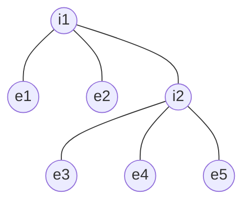

# 🌳 m-ary Trees (Generalizing Binary Trees)

An **m-ary Tree** (or n-ary tree) is a tree where every node can have **at most m** children. Binary trees are simply the case where $m=2$.

---

## 🏛️ Strict m-ary Tree
A Strict m-ary tree follows the **$\{0, m\}$** rule:
- Every node has either **0 children** (leaf) or **exactly m children**.

---

## 🏗️ Scenario 1: If Height (h) is Given

### 1. Minimum Nodes ($n_{min}$)
To have the minimum nodes, we add exactly $m$ nodes at each level to stay strict.
- **Formula:** $n = m \times h + 1$
- **Example ($m=3, h=2$):** $3(2) + 1 = 7$.

### 2. Maximum Nodes ($n_{max}$)
A "Perfect" m-ary tree where every internal node is fully packed.
- **Formula:** $n = \frac{m^{h+1}-1}{m-1}$
- **Example ($m=3, h=2$):** $\frac{3^3 - 1}{3-1} = \frac{26}{2} = 13$.

---

## 📐 Scenario 2: Internal vs. External Nodes
In a strict m-ary tree, the relationship between internal nodes ($i$) and leaves ($e$) is:

$$e = (m-1)i + 1$$

### 📸 Visual Proof: 3-ary Tree (m=3)

**Counts:**
- **Internal ($i$):** 2 (A1, D1)
- **External ($e$):** 5 (B1, C1, E1, F1, G1)
- **Formula Check:** $e = (3-1) \times 2 + 1 = 2 \times 2 + 1 = 5$ ✅

---

## 📊 The "Master" m-ary Formulas
| Property | Formula |
| :--- | :--- |
| **Max Nodes (fixed h)** | $n = \frac{m^{h+1}-1}{m-1}$ |
| **Min Nodes (fixed h)** | $n = m \cdot h + 1$ |
| **Leaves (fixed i)** | $e = (m-1)i + 1$ |
| **Internal Nodes (fixed n)** | $i = \frac{n-1}{m}$ |
