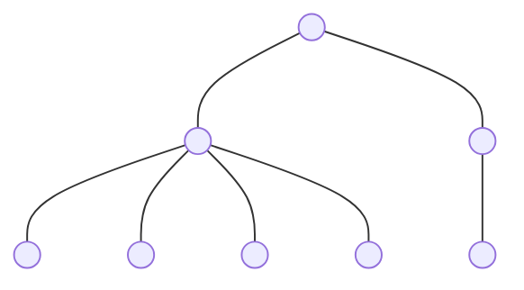
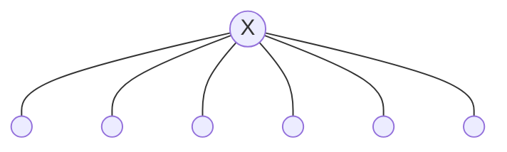
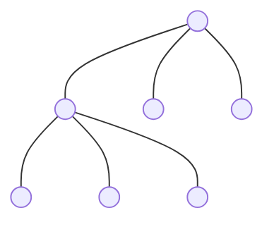
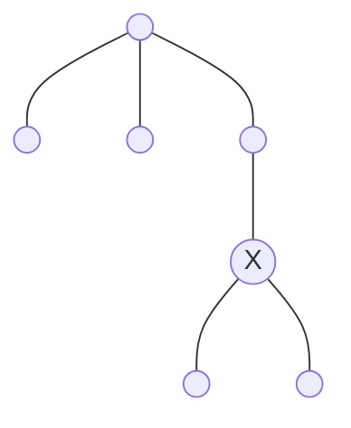

# 🌳 m-ary Trees (Generalizing Binary Trees)

An **m-ary Tree** (or n-ary tree) is a tree where every node can have **at most m** children. 

---

## 🏛️ 1. General m-ary Tree
In a general m-ary tree, the number of children for any node belongs to the set:
**$$\text{Children} \in \{0, 1, 2, \dots, m\}$$**

### 📸 Visual Example (4-ary Tree: m=4)

**✅ VALID 4-ary Tree**
Every node has between 0 and 4 children.


**❌ INVALID 4-ary Tree**
The node marked with **X** has **5 children**, which exceeds $m=4$.


---

## 🛡️ 2. Strict m-ary Tree
A Strict m-ary tree follows a much tighter rule. The number of children for any node belongs to the set:
**$$\text{Children} \in \{0, m\}$$**

### 📸 Visual Example (Strict 3-ary Tree: m=3)

**✅ VALID Strict 3-ary**
Every node has exactly 0 or 3 children.


**❌ INVALID Strict 3-ary**
The node marked with **X** has only **2 children**, which is not allowed.


---

## 💾 3. Memory Representation
In a programming language like C/C++ or Java, an m-ary tree node is usually represented using an **array of pointers**.

**Node Structure:**
- **Data Field**: Stores the actual value.
- **Child Array**: An array of size $m$ to store pointers to children.

```cpp
struct Node {
    int data;
    Node* children[M]; // Array of M pointers
};
```

---

## 📐 4. Height vs. Nodes (Strict m-ary)

### 1. Minimum Nodes ($n_{min}$)
- **Formula:** $n = m \times h + 1$
- **Example ($m=3, h=2$):** $3(2) + 1 = 7$.

### 2. Maximum Nodes ($n_{max}$)
- **Formula:** $n = \frac{m^{h+1}-1}{m-1}$
- **Example ($m=3, h=2$):** $\frac{3^3 - 1}{3-1} = 13$.

---

## ⚖️ 5. Internal vs. External Nodes (Strict)
In a strict m-ary tree, the number of leaves ($e$) and internal nodes ($i$) satisfy:

**$$e = (m-1)i + 1$$**

---

## 📊 Summary Card
| Feature | General m-ary | Strict m-ary |
| :--- | :--- | :--- |
| **Allowed children** | $\{0, 1, \dots, m\}$ | $\{0, m\}$ |
| **Max Nodes** | $\frac{m^{h+1}-1}{m-1}$ | $\frac{m^{h+1}-1}{m-1}$ |
| **Internal Nodes** | - | $i = \frac{n-1}{m}$ |
