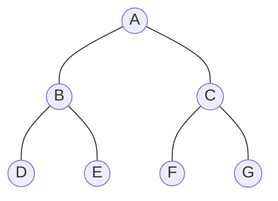

# 📑 Array (Sequential) Representation of Binary Tree

A binary tree can be stored in an array by mapping each node to a specific index. This is known as **Sequential Representation**.

---

## 🗺️ The Mapping Logic (1-based Indexing)
When storing a binary tree in an array starting from **Index 1**, the relationship between a parent and its children follows a strict mathematical rule.

### 📐 The Formulas
For a node located at **Index i**:
- **Left Child**: $2 \times i$
- **Right Child**: $2 \times i + 1$
- **Parent**: $\left \lfloor \frac{i}{2} \right \rfloor$

---

## 📸 Visual Example: Tree to Array

### 1. The Tree Structure

### 2. The Array Storage (T)
| Index | 1 | 2 | 3 | 4 | 5 | 6 | 7 |
| :--- | :-: | :-: | :-: | :-: | :-: | :-: | :-: |
| **Element** | **A** | **B** | **C** | **D** | **E** | **F** | **G** |

---

## 📊 Parent-Child Relationship Table

| Element | Index (i) | Left Child ($2i$) | Right Child ($2i+1$) | Parent ($\lfloor i/2 \rfloor$) |
| :--- | :---: | :---: | :---: | :---: |
| **A (Root)** | 1 | 2 (B) | 3 (C) | - |
| **B** | 2 | 4 (D) | 5 (E) | 1 (A) |
| **C** | 3 | 6 (F) | 7 (G) | 1 (A) |
| **D** | 4 | - | - | 2 (B) |
| **E** | 5 | - | - | 2 (B) |
| **F** | 6 | - | - | 3 (C) |
| **G** | 7 | - | - | 3 (C) |

---

## 📝 Key Observations
1. **Efficiency**: This representation is extremely space-efficient for **Complete Binary Trees** because no memory is wasted.
2. **Waste in Sparse Trees**: For a skewed tree, many array indices will remain empty (NULL), leading to high memory wastage.
3. **0-based Indexing**: If the array starts at **index 0**, the formulas shift:
   - Left Child: $2i + 1$
   - Right Child: $2i + 2$
   - Parent: $\lfloor (i-1)/2 \rfloor$
