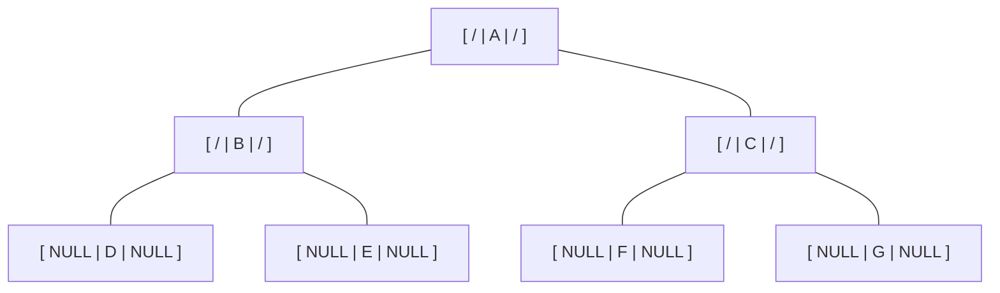

# 🔗 Linked Representation of Binary Tree

The **Linked Representation** uses dynamic memory and pointers (references) to store a binary tree. This is the most common way to implement trees in modern programming.

---

## 🏗️ The Node Structure
Each node in a linked representation consists of three distinct parts:
1. **Left Child Pointer (`lchild`)**: Stores the address of the left child.
2. **Data**: Stores the actual value/element.
3. **Right Child Pointer (`rchild`)**: Stores the address of the right child.

### 💻 C / C++ Implementation
```cpp
struct Node {
    struct Node *lchild; // Pointer to left child
    int data;           // Actual data
    struct Node *rchild; // Pointer to right child
};
```

---

## 📸 Visual Linked Model
In this model, a leaf node has its child pointers set to **NULL** (represented here by `/`).



---

## 📐 The NULL Pointer Rule
A very important property of binary trees in linked representation is the count of empty (NULL) links.

### **The Formula:**
If a binary tree has **n nodes**, it will have exactly **n + 1 NULL pointers**.

### **The Mathematical Proof:**
1. **Total Pointers**: Each node has 2 pointers (left and right). So, for $n$ nodes, total pointers = $2n$.
2. **Used Pointers**: Every node in the tree **except the root** must have exactly one incoming pointer from its parent.
   - Therefore, the number of "used" pointers = $n - 1$.
3. **NULL Pointers**:
   - $\text{Total} - \text{Used} = \text{NULL}$
   - $2n - (n - 1) = 2n - n + 1 = \mathbf{n + 1}$

**Example ($n=7$):**
In a tree with 7 nodes, there are $7 + 1 = 8$ NULL pointers.

---

## ⚖️ Comparison: Linked vs. Array
| Feature | Array Representation | Linked Representation |
| :--- | :--- | :--- |
| **Memory** | Static (Fixed size) | Dynamic (Grows as needed) |
| **Wastage** | High for sparse trees | Low (only pointer overhead) |
| **Access** | Random ($O(1)$ via index) | Sequential (Need to follow pointers) |
| **Structure** | Best for Complete Trees | Best for General/Sparse Trees |
