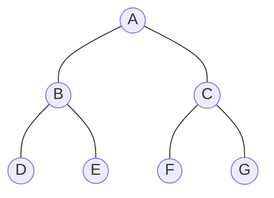
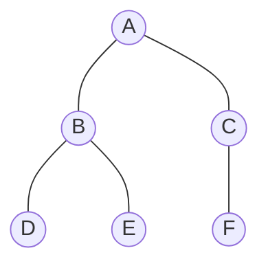
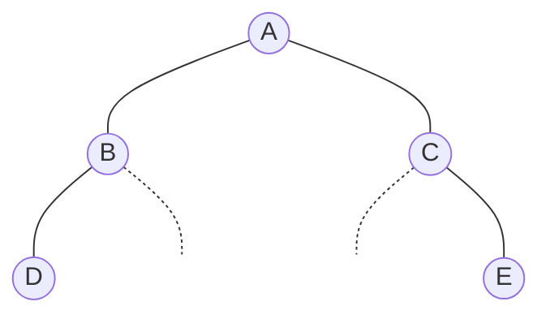

# 🏁 Full vs. Complete Binary Tree

Understanding the difference between a **Full** and a **Complete** binary tree is crucial for mastering tree storage and data structures like Heaps.

---

## 🏗️ 1. Full Binary Tree (Perfect Binary Tree)
A **Full Binary Tree** is a tree where every single possible node is present up to a certain height $h$. 

### 📐 Key Properties
- All levels are completely full.
- All leaf nodes are at the same maximum depth.
- **Total Nodes ($n$):** $n = 2^{h+1} - 1$
- **Array Storage:** No gaps from index $1$ to $n$.

### 📸 Visual Example (Height $h=2$)
Nodes: $2^{(2+1)} - 1 = 7$.

**Array:** `[A, B, C, D, E, F, G]` (Indices 1-7, No Gaps ✅)

---

## 🏗️ 2. Complete Binary Tree
A **Complete Binary Tree** is slightly more flexible. It is a tree where:
1. Every level is completely filled, **except possibly the last level**.
2. The nodes in the last level are filled strictly from **left to right**.

### 📐 The Array Property
A binary tree is **Complete** if and only if there are **no gaps** between elements in its array representation.

### 📸 Visual Example (✅ VALID)

**Array:** `[A, B, C, D, E, F]` (Indices 1-6, No Gaps ✅)

---

## ❌ 3. Non-Complete Binary Tree (The "Gap" Rule)
If a tree has a missing child on the left or middle of a level, it creates a "gap" in the array, making it **not complete**.

### 📸 Visual Example (❌ INVALID)
Note how **Node B** is missing its right child, and **Node C** is missing its left child, while **Node E** exists at the end.

**Array Representation (T):**
| Index | 1 | 2 | 3 | 4 | 5 | 6 | 7 |
| :--- | :-: | :-: | :-: | :-: | :-: | :-: | :-: |
| **Element** | **A** | **B** | **C** | **D** | **-** | **-** | **E** |

Because indices **5 and 6 are empty** while index 7 is filled, this is **NOT** a complete binary tree. ❌

---

## 📊 Comparison Summary
| Feature | Full (Perfect) Binary Tree | Complete Binary Tree |
| :--- | :--- | :--- |
| **All Levels Full?** | Yes | Except possibly the last level |
| **Last Level Rule** | Must be full | Filled from Left-to-Right |
| **Array Representation** | No Gaps ($0 \dots 2^{h+1}-1$) | No Gaps ($0 \dots n$) |
| **Example Use Case** | Theoretical Maximum | Priority Queues (Heaps) |
