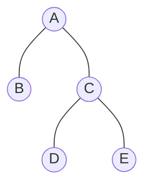
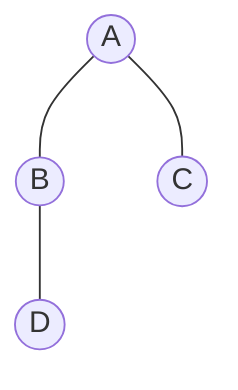

# 📚 Strictly vs. Complete (The Terminology Paradox)

The terms **"Strictly Binary Tree"** and **"Complete Binary Tree"** are often swapped depending on which textbook you read. This module clears up the confusion using the "Gap Rule" and degree-based rules.

---

## 🎭 The Naming Conflict (The Rosetta Stone)
Different authors use different names for the same concepts. Use this table as your "Rosetta Stone":

| If the rule is... | Standard Name | Common Alternative |
| :--- | :--- | :--- |
| **Degree is {0, 2}** | **Strictly Binary** | Proper / Full / **Complete** |
| **No Gaps in Array** | **Complete** | **Almost Complete** / Nearly Complete |
| **All Levels Full** | **Perfect Binary** | Full / Complete |

> [!WARNING]
> **Paradox Alert:** In some exams, "Complete" means $\{0, 2\}$. In others, "Complete" means "No Gaps in Array". Always check the context!

---

## 📂 Case A: Strictly Binary but NOT Complete
A tree where every node has **0 or 2 children** (Strictly Binary), but it is NOT filled left-to-right (NOT Complete).

### 📸 Visual Mapping

**Array Representation ($T$):**
| Index | 1 | 2 | 3 | 4 | 5 | 6 | 7 |
| :---: | :-: | :-: | :-: | :-: | :-: | :-: | :-: |
| **Node** | **A** | **B** | **C** | **-** | **-** | **D** | **E** |

- **Why Strictly Binary?** Every internal node (A, C) has exactly 2 kids. Node B is a leaf (0 kids). ✅
- **Why NOT Complete?** There are **gaps at index 4 and 5**. A complete tree must have no empty slots between the first and last element. ❌

---

## 📂 Case B: Complete but NOT Strictly Binary
A tree that is filled left-to-right (Complete), but has a node with only **1 child** (NOT Strictly Binary).

### 📸 Visual Mapping

**Array Representation ($T$):**
| Index | 1 | 2 | 3 | 4 |
| :---: | :-: | :-: | :-: | :-: |
| **Node** | **A** | **B** | **C** | **D** |

- **Why Complete?** No gaps in the array! $T[1]$ to $T[4]$ are all filled. ✅
- **Why NOT Strictly Binary?** **Node B has only 1 child (D)**. A strictly binary tree forbids degree-1 nodes. ❌

---

## 💡 Summary Comparison
| Property | Strictly Binary | Complete Binary |
| :--- | :--- | :--- |
| **Focus** | Node Degree (Children count) | Node Position (Array index) |
| **Constraint** | No nodes with 1 child | No gaps in the array |
| **Memory** | Can be sparse (wasteful) | Always dense (efficient) |
