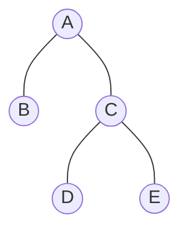
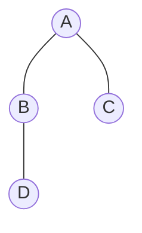

# 📚 Strict vs. Complete (The Terminology Paradox)

The terms **"Strict"** and **"Complete"** are among the most confused names in Data Structures. Different authors use these words to mean completely different things. Let's clear the air using visual and mathematical proofs.

---

## 🎭 The Naming Conflict
| Concept | Common Name | Alternative Name (Sahni/Others) |
| :--- | :--- | :--- |
| **{0, 2} Children Only** | Strict / Proper | **Full** or **Complete** |
| **No Gaps in Array** | **Complete** | **Almost Complete** |

> [!IMPORTANT]
> To avoid confusion, always check if your examiner means the **$\{0, 2\}$ property** or the **Array Mapping property**.

---

## 📂 Concept 1: The $\{0, 2\}$ Rule (Strict/Proper)
A tree where every node has either **0 or 2 children**. It has nothing to do with how the nodes are arranged in memory.

### 📸 Visual: Strict but NOT Complete
This tree follows the $\{0, 2\}$ rule but has **gaps** in its array representation.

**Array:** `[A, B, C, -, -, D, E]` (Gaps at index 4, 5. **NOT Complete** ❌)

---

## 📂 Concept 2: The Array Mapping Rule (Complete)
A tree that is filled level-by-level from left-to-right. It has no gaps in memory but might violate the $\{0, 2\}$ rule.

### 📸 Visual: Complete but NOT Strict
This tree has **no gaps** in its array, but **Node B** has only **1 child**, violating the $\{0, 2\}$ rule.

**Array:** `[A, B, C, D]` (No Gaps. **Complete** ✅ but **NOT Strict** ❌)

---

## 🏁 The "Rosetta Stone" Table
Use this table to translate between different textbook terminologies:

| Your Goal | Term to use (Standard) | Term to use (Alternative) |
| :--- | :--- | :--- |
| Every node has 0 or 2 kids | **Strict Binary Tree** | Proper / Full / Complete |
| No gaps in the array | **Complete Binary Tree** | Almost / Nearly Complete |
| Every level is 100% full | **Perfect Binary Tree** | Full / Max Nodes |

---

## 💡 Summary
- **Strictness** is about the **degree** of nodes ($\{0, 2\}$).
- **Completeness** is about the **position** of nodes (Array mapping).
- A **Perfect** tree is both Strict AND Complete!
