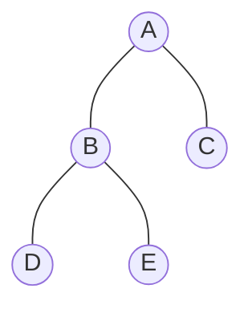

# 🌳 Mastering Tree Traversals

**Traversal** is the process of visiting each node in a tree exactly once. Unlike linear data structures (Arrays, Linked Lists) which have only one logical way to traverse, trees can be explored in several different orders.

---

## 🧭 1. Depth First Search (DFS) Traversals
The most common traversals are defined by the position of the **Root** relative to its children.

### 💡 The Memory Trick
- **Pre**-order: **Root** is *Pre* (before) its children.
- **In**-order: **Root** is *In* (between) its children.
- **Post**-order: **Root** is *Post* (after) its children.

| Traversal | Logical Order | Used For |
| :--- | :--- | :--- |
| **Pre-order** | **Root** $\rightarrow$ Left $\rightarrow$ Right | Creating a copy of the tree. |
| **In-order** | Left $\rightarrow$ **Root** $\rightarrow$ Right | Getting sorted data from a BST. |
| **Post-order** | Left $\rightarrow$ Right $\rightarrow$ **Root** | Deleting a tree / Evaluating expressions. |

---

## 🌊 2. Level Order Traversal (BFS)
In **Level Order**, we visit nodes level-by-level, from top to bottom and left to right. This is a **Breadth First Search (BFS)** approach.

---

## 📸 3. Visual Dry Run
Let's use this sample tree for a dry run:



### **Execution Results:**
- **Pre-order (Root-L-R)**: `A, B, D, E, C`
- **In-order (L-Root-R)**: `D, B, E, A, C`
- **Post-order (L-R-Root)**: `D, E, B, C, A`
- **Level Order**: `A, B, C, D, E`

---

## 💻 4. Recursive Implementation (C++)
Using the `struct Node` we defined in the linked representation module:

```cpp
// 1. Pre-order Traversal
void preorder(Node *p) {
    if (p) {
        printf("%d ", p->data); // Visit Root
        preorder(p->lchild);    // Visit Left
        preorder(p->rchild);    // Visit Right
    }
}

// 2. In-order Traversal
void inorder(Node *p) {
    if (p) {
        inorder(p->lchild);     // Visit Left
        printf("%d ", p->data); // Visit Root
        inorder(p->rchild);     // Visit Right
    }
}

// 3. Post-order Traversal
void postorder(Node *p) {
    if (p) {
        postorder(p->lchild);    // Visit Left
        postorder(p->rchild);    // Visit Right
        printf("%d ", p->data);  // Visit Root
    }
}
```

---

## 📏 5. Key Difference: DFS vs BFS
- **DFS (Pre/In/Post)**: Explores as far as possible along each branch before backtracking. Uses a **Stack** (implicitly via recursion).
- **BFS (Level Order)**: Explores all nodes at the present depth before moving to the next level. Uses a **Queue**.
