# Tree Traversals

## Table of Contents
1. [Introduction](#introduction)
2. [Preorder Traversal (DLR)](#preorder-traversal)
3. [Inorder Traversal (LDR)](#inorder-traversal)
4. [Postorder Traversal (LRD)](#postorder-traversal)
5. [Level Order Traversal (BFS)](#level-order-traversal)
6. [Visual Traversal Methods](#visual-traversal-methods)
7. [Comparison Table](#comparison-table)

---

## Introduction

Tree traversal is the process of visiting all nodes in a tree data structure. There are several ways to traverse a tree:

- **Depth-First Search (DFS)**: Preorder, Inorder, Postorder
- **Breadth-First Search (BFS)**: Level Order

Each traversal method visits nodes in a different order and is useful for different applications.

---

## Preorder Traversal (DLR)

**Order**: Visit node → Traverse Left Subtree → Traverse Right Subtree

### Concept

Preorder traversal processes the node before visiting its children. This is useful for:
- Creating a copy of the tree
- Getting prefix expression from an expression tree
- Serializing a tree

### Simple Example (3-node tree)

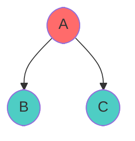

**Preorder**: A, B, C

**Execution Steps**:
1. Visit A → Output: A
2. Traverse left subtree (B) → Output: B
3. Traverse right subtree (C) → Output: C
4. **Result**: A, B, C

### Complex Example (6-node tree)

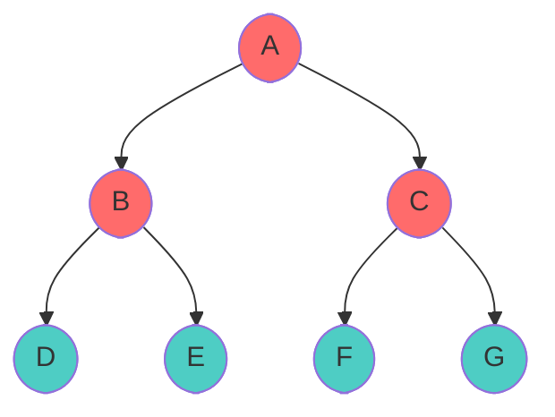

**Preorder**: A, B, D, E, C, F, G

**Execution Steps**:
1. Visit A → Output: A
2. Go to B (left child)
   - Visit B → Output: B
   - Go to D (left child of B)
     - Visit D → Output: D
     - No children, backtrack
   - Go to E (right child of B)
     - Visit E → Output: E
     - No children, backtrack
3. Go to C (right child of A)
   - Visit C → Output: C
   - Go to F (left child of C)
     - Visit F → Output: F
     - No children, backtrack
   - Go to G (right child of C)
     - Visit G → Output: G
     - No children, backtrack
4. **Result**: A, B, D, E, C, F, G

### Visual Graph - Preorder Execution

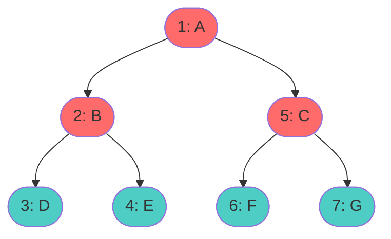

**Execution Order**: A(1) → B(2) → D(3) → E(4) → C(5) → F(6) → G(7)
**Output**: A, B, D, E, C, F, G

### Pseudocode

**Recursive Approach**:
```
function preorder(node):
    if node is NULL:
        return
    
    visit(node)                    // Process the node
    preorder(node.left)            // Traverse left subtree
    preorder(node.right)           // Traverse right subtree
```

**Iterative Approach (using Stack)**:
```
function preorderIterative(root):
    if root is NULL:
        return
    
    stack = new Stack()
    stack.push(root)
    
    while stack is not empty:
        node = stack.pop()
        visit(node)                // Process the node
        
        // Push right first so left is processed first
        if node.right is not NULL:
            stack.push(node.right)
        if node.left is not NULL:
            stack.push(node.left)
```

---

## Inorder Traversal (LDR)

**Order**: Traverse Left Subtree → Visit node → Traverse Right Subtree

### Concept

Inorder traversal processes the node between its children. This is useful for:
- Getting sorted output from a Binary Search Tree
- Expression evaluation
- Symmetric tree processing

### Simple Example (3-node tree)

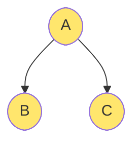

**Inorder**: B, A, C

**Execution Steps**:
1. Go to left subtree (B) → Output: B
2. Visit A → Output: A
3. Go to right subtree (C) → Output: C
4. **Result**: B, A, C

### Complex Example (6-node tree)

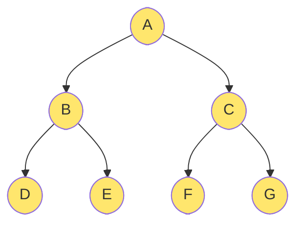

**Inorder**: D, B, E, A, F, C, G

**Execution Steps**:
1. Go to left subtree of A (B)
   - Go to left subtree of B (D)
     - Visit D → Output: D
     - No right child
   - Visit B → Output: B
   - Go to right subtree of B (E)
     - Visit E → Output: E
     - No right child
2. Visit A → Output: A
3. Go to right subtree of A (C)
   - Go to left subtree of C (F)
     - Visit F → Output: F
     - No right child
   - Visit C → Output: C
   - Go to right subtree of C (G)
     - Visit G → Output: G
4. **Result**: D, B, E, A, F, C, G

### Visual Graph - Inorder Execution

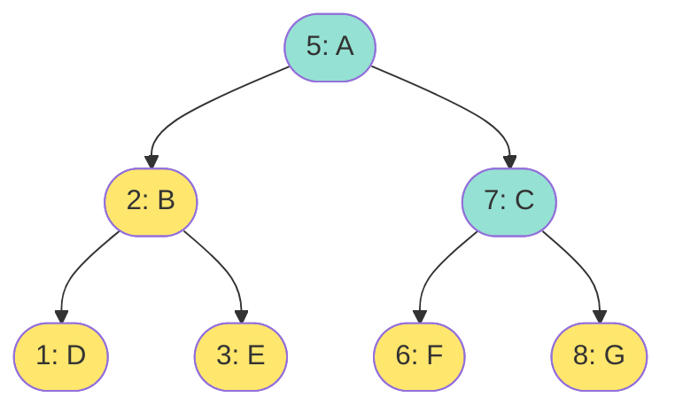

**Execution Order**: D(1) → B(2) → E(3) → A(4) → F(5) → C(6) → G(7)
**Output**: D, B, E, A, F, C, G

### Pseudocode

**Recursive Approach**:
```
function inorder(node):
    if node is NULL:
        return
    
    inorder(node.left)             // Traverse left subtree
    visit(node)                    // Process the node
    inorder(node.right)            // Traverse right subtree
```

**Iterative Approach (using Stack)**:
```
function inorderIterative(root):
    stack = new Stack()
    current = root
    
    while current is not NULL or stack is not empty:
        // Go to leftmost node
        while current is not NULL:
            stack.push(current)
            current = current.left
        
        // Current is NULL, pop from stack
        current = stack.pop()
        visit(current)             // Process the node
        
        // Visit right subtree
        current = current.right
```

---

## Postorder Traversal (LRD)

**Order**: Traverse Left Subtree → Traverse Right Subtree → Visit node

### Concept

Postorder traversal processes the node after visiting its children. This is useful for:
- Deleting a tree
- Calculating tree properties (height, size)
- Postfix expressions from an expression tree

### Simple Example (3-node tree)

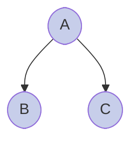

**Postorder**: B, C, A

**Execution Steps**:
1. Go to left subtree (B) → Output: B
2. Go to right subtree (C) → Output: C
3. Visit A → Output: A
4. **Result**: B, C, A

### Complex Example (6-node tree)

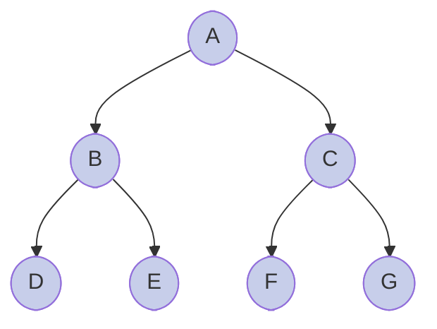

**Postorder**: D, E, B, F, G, C, A

**Execution Steps**:
1. Go to left subtree of A (B)
   - Go to left subtree of B (D)
     - Visit D → Output: D
   - Go to right subtree of B (E)
     - Visit E → Output: E
   - Visit B → Output: B
2. Go to right subtree of A (C)
   - Go to left subtree of C (F)
     - Visit F → Output: F
   - Go to right subtree of C (G)
     - Visit G → Output: G
   - Visit C → Output: C
3. Visit A → Output: A
4. **Result**: D, E, B, F, G, C, A

### Visual Graph - Postorder Execution

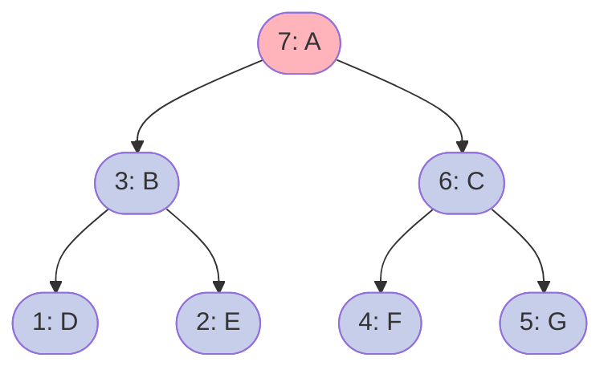

**Execution Order**: D(1) → E(2) → B(3) → F(4) → G(5) → C(6) → A(7)
**Output**: D, E, B, F, G, C, A

### Pseudocode

**Recursive Approach**:
```
function postorder(node):
    if node is NULL:
        return
    
    postorder(node.left)           // Traverse left subtree
    postorder(node.right)          // Traverse right subtree
    visit(node)                    // Process the node
```

**Iterative Approach (using Two Stacks)**:
```
function postorderIterative(root):
    if root is NULL:
        return
    
    stack1 = new Stack()
    stack2 = new Stack()
    
    stack1.push(root)
    
    // Push nodes to stack2 in postorder manner
    while stack1 is not empty:
        node = stack1.pop()
        stack2.push(node)
        
        if node.left is not NULL:
            stack1.push(node.left)
        if node.right is not NULL:
            stack1.push(node.right)
    
    // Pop all nodes from stack2 and visit
    while stack2 is not empty:
        node = stack2.pop()
        visit(node)
```

---

## Level Order Traversal (BFS)

**Order**: Visit nodes level by level from top to bottom, left to right

### Concept

Level order traversal explores nodes at each depth level completely before moving to the next level. This is useful for:
- Serializing/deserializing trees
- Shortest path in unweighted binary tree
- Finding level information

### Simple Example (3-node tree)

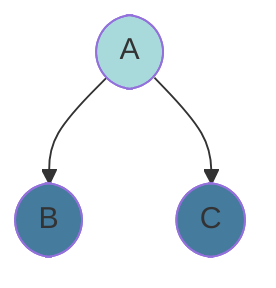

**Level Order**: A, B, C

Level 0: A
Level 1: B, C

**Execution Steps**:
1. Process Level 0: Visit A → Output: A
2. Process Level 1: Visit B, C → Output: B, C
3. **Result**: A, B, C

### Complex Example (6-node tree)

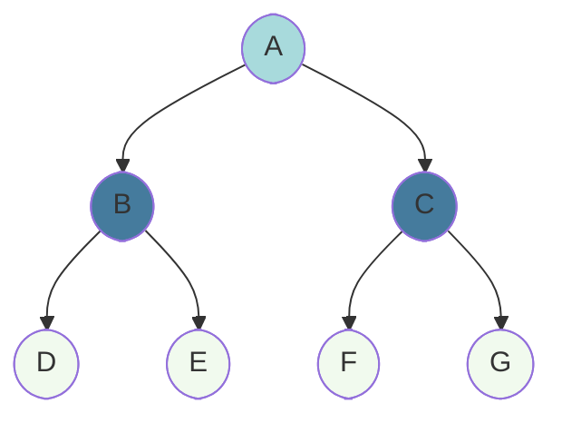

**Level Order**: A, B, C, D, E, F, G

Level 0: A
Level 1: B, C
Level 2: D, E, F, G

**Execution Steps**:
1. Process Level 0: Visit A → Output: A
2. Process Level 1: Visit B, C → Output: B, C
3. Process Level 2: Visit D, E, F, G → Output: D, E, F, G
4. **Result**: A, B, C, D, E, F, G

### Visual Graph - Level Order Execution

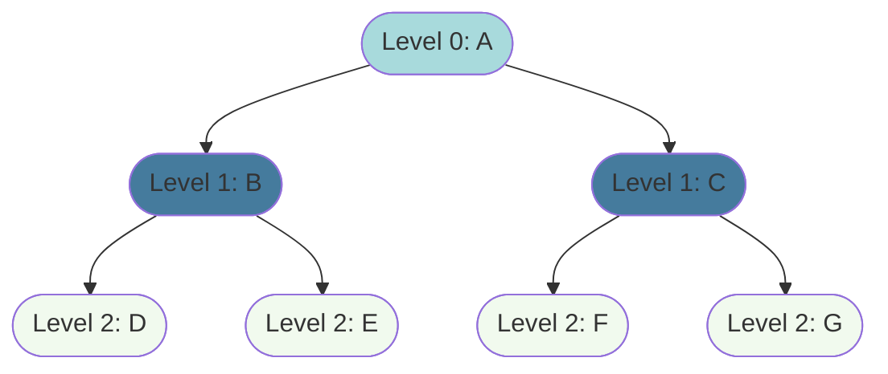

**Execution Order (Queue Process)**:
- Dequeue A → Output: A
- Dequeue B, C → Output: B, C  
- Dequeue D, E, F, G → Output: D, E, F, G

**Output**: A, B, C, D, E, F, G

### Pseudocode

**Iterative Approach (using Queue)**:
```
function levelOrder(root):
    if root is NULL:
        return
    
    queue = new Queue()
    queue.enqueue(root)
    
    while queue is not empty:
        node = queue.dequeue()
        visit(node)                // Process the node
        
        if node.left is not NULL:
            queue.enqueue(node.left)
        if node.right is not NULL:
            queue.enqueue(node.right)
```

**Recursive Approach (using Depth)**:
```
function levelOrderRecursive(root):
    height = findHeight(root)
    
    for level = 1 to height:
        printLevel(root, level)

function printLevel(node, level):
    if node is NULL:
        return
    
    if level == 1:
        visit(node)
    else:
        printLevel(node.left, level - 1)
        printLevel(node.right, level - 1)
```

---

## Visual Traversal Methods

These techniques help visualize the execution order of traversals by using arrows and systematic patterns.

### Method 1: Preorder - Visit First

Preorder visits the root first, marking it with an arrow pointing down, then recursively processes the left and right subtrees.

```
Step-by-step visualization:
        ┌─────────┐
        │    A    │ ← Start here
        └───┬─────┘
            │
        ┌───┴──────┐
        │          │
    ┌───▼──┐   ┌───▼──┐
    │  B   │   │  C   │
    └───┬──┘   └───┬──┘
        │          │
    ┌───┴───┐  ┌───┴───┐
 ┌──▼┐ ┌───▼─┤┌──▼┐ ┌──▼──┐
 │ D │ │ E  ││ F │ │ G  │
 └────┘ └────┘  └────┘ └─────┘

Arrows show: Visit node, visit left subtree, visit right subtree
Output: A, B, D, E, C, F, G
```

### Method 2: Inorder - Visit Middle

Inorder writes arrows around each node: left arrow, visit, right arrow. This creates a symmetric traversal pattern.

```
Pattern: Left → Node → Right

        ┌─────────┐
        │    A    │
        └───┬─────┘
            │
        ┌───┴──────┐
        │          │
    ┌───▼──┐   ┌───▼──┐
    │  B   │   │  C   │
    └─┬─┬──┘   └───┬──┘
      ││        │
    ┌─▼┼─┐  ┌───┴───┐
 ┌──┼─┐│E ││  F │ ┌──▼──┐
 │ D │││  ││  │ │ G  │
 └────┘└──┘  └────┘ └─────┘

Output: D, B, E, A, F, C, G
Useful for BST to get sorted order
```

### Method 3: Postorder - Visit Last

Postorder processes the node after its children, like collecting leaves first.

```
Pattern: Left Subtree → Right Subtree → Node

        ┌─────────┐
        │    A    │ ← Visit last
        └───┬─────┘
            │
        ┌───┴──────┐
        │          │
    ┌───▼──┐   ┌───▼──┐
    │  B   │   │  C   │
    └───┬──┘   └───┬──┘
        │          │
    ┌───┴───┐  ┌───┴───┐
        │       │
 ┌──▼┐ ┌───▼─┤┌──▼┐ ┌──▼──┐
 │ D │ │ E  ││ F │ │ G  │
 └────┘ └────┘  └────┘ └─────┘

Arrows point upward: process children first, node last
Output: D, E, B, F, G, C, A
```

---

## Comparison Table

| Aspect | Preorder (DLR) | Inorder (LDR) | Postorder (LRD) | Level Order |
|--------|---|---|---|---|
| **Order** | Node → Left → Right | Left → Node → Right | Left → Right → Node | Level by Level |
| **Time Complexity** | O(n) | O(n) | O(n) | O(n) |
| **Space Complexity** | O(h) | O(h) | O(h) | O(w) |
| **Use Cases** | Tree copy, Prefix expr | BST sort, Symmetric view | Tree deletion, Postfix expr | Serialization, Shortest path |
| **Approach** | Recursive/Stack | Recursive/Stack | Recursive/Two Stacks | Queue (BFS) |
| **Output Sample** | A, B, D, E, C, F, G | D, B, E, A, F, C, G | D, E, B, F, G, C, A | A, B, C, D, E, F, G |

**Legend**:
- **h** = height of tree
- **w** = maximum width of tree (nodes at any level)
- **n** = total number of nodes

---

## Complexity Analysis

### Time Complexity
- **All Traversals**: O(n) where n is the number of nodes
- Each node is visited exactly once

### Space Complexity
- **DFS (Preorder, Inorder, Postorder)**: O(h) where h is the height
  - In best case (balanced tree): O(log n)
  - In worst case (skewed tree): O(n)
- **BFS (Level Order)**: O(w) where w is the maximum width of any level
  - Best case: O(1) for single node
  - Worst case: O(n) for complete binary tree

---

## Summary

Tree traversals are fundamental techniques for exploring tree data structures. Each traversal method has unique characteristics:

1. **Preorder**: Process node before children (useful for tree copying)
2. **Inorder**: Process node between children (useful for sorted BST output)
3. **Postorder**: Process node after children (useful for tree deletion)
4. **Level Order**: Process level by level (useful for serialization and shortest paths)

Master all four traversals to handle various tree-related problems efficiently!
