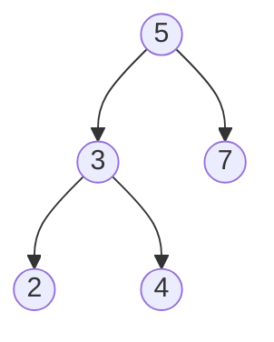
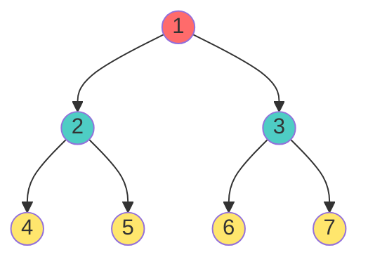
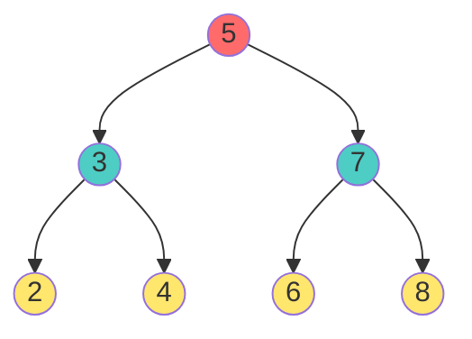
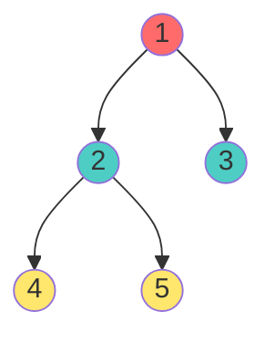
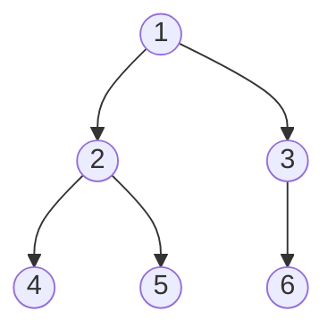
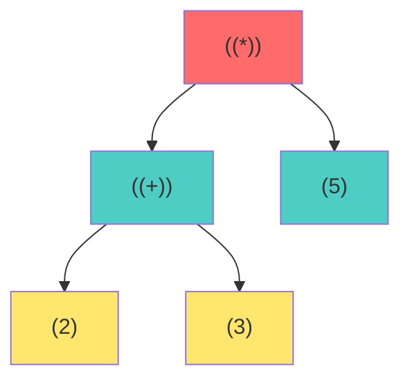
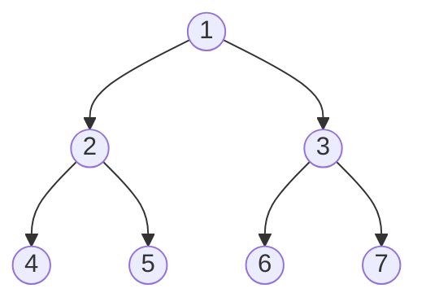
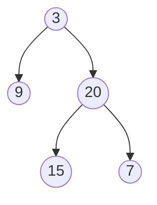

# 🌳 Creating Binary Trees - Complete Guide

## Introduction

Creating a binary tree involves constructing a tree structure from scratch or converting existing data into a tree format. There are multiple approaches depending on the input format and requirements.

> **Real-World Use**: Building search trees, constructing expression trees, loading data structures, parsing hierarchical data

---

## Two Main Categories

### 1. Manual Creation (Explicit Node Building)
Build nodes one by one and link them together

### 2. Automated Creation (From Various Inputs)
- From arrays (level-order, in-order, pre-order)
- From strings (serialized format)
- From user input (interactive)
- From files (data loading)

---

## Manual Node Creation

### Node Structure Definition

```cpp
struct Node {
    int data;
    Node* left;
    Node* right;
    
    // Constructor
    Node(int val) : data(val), left(NULL), right(NULL) {}
};
```

### Basic Manual Tree Creation

**Requirement**: Build this tree manually



**C++ Implementation**:

```cpp
// Step 1: Create root node
Node* root = new Node(5);

// Step 2: Create left subtree
root->left = new Node(3);
root->left->left = new Node(2);
root->left->right = new Node(4);

// Step 3: Create right subtree
root->right = new Node(7);

// Result: Complete BST with 5 nodes
```

### Java Implementation

```java
public class TreeNode {
    int data;
    TreeNode left;
    TreeNode right;
    
    public TreeNode(int val) {
        this.data = val;
        this.left = null;
        this.right = null;
    }
}

// Usage
TreeNode root = new TreeNode(5);
root.left = new TreeNode(3);
root.right = new TreeNode(7);
root.left.left = new TreeNode(2);
root.left.right = new TreeNode(4);
```

---

## Creating Trees from Arrays

### Method 1: Level-Order Array Input

**Array Format**: `[1, 2, 3, 4, 5, 6, 7]` (Complete binary tree representation)

**Tree Structure**:


**C++ Implementation (Queue-Based)**:

```cpp
Node* createTreeFromArray(vector<int>& arr) {
    if (arr.empty()) return NULL;
    
    Node* root = new Node(arr[0]);
    queue<Node*> q;
    q.push(root);
    
    int i = 1;
    
    while (!q.empty() && i < arr.size()) {
        Node* current = q.front();
        q.pop();
        
        // Create left child
        if (i < arr.size()) {
            current->left = new Node(arr[i]);
            q.push(current->left);
            i++;
        }
        
        // Create right child
        if (i < arr.size()) {
            current->right = new Node(arr[i]);
            q.push(current->right);
            i++;
        }
    }
    
    return root;
}
```

**Step-by-Step Trace**:

| Step | Queue | i | Action |
|:---:|:---|:---:|:---|
| 1 | [root:1] | 1 | Process node 1 |
| 2 | [2, 3] | 3 | Create children 2, 3 |
| 3 | [3, 4, 5] | 5 | Process node 2, create children 4, 5 |
| 4 | [4, 5, 6, 7] | 7 | Process node 3, create children 6, 7 |
| 5 | [] | 7 | Done - tree complete |

---

## Creating Binary Search Trees (BST)

### Method 2: Insert Elements One by One

**Goal**: Insert values [5, 3, 7, 2, 4, 6, 8] to build BST

**Resulting Tree**:


**C++ Implementation (Recursive)**:

```cpp
class BST {
    Node* root;
    
public:
    BST() : root(NULL) {}
    
    void insert(int val) {
        root = insertHelper(root, val);
    }
    
private:
    Node* insertHelper(Node* node, int val) {
        // Base case: create new node
        if (node == NULL) {
            return new Node(val);
        }
        
        // Recursive case: insert in appropriate subtree
        if (val < node->data) {
            node->left = insertHelper(node->left, val);
        } else if (val > node->data) {
            node->right = insertHelper(node->right, val);
        }
        // If val == node->data, ignore (no duplicates)
        
        return node;
    }
};

// Usage
BST tree;
tree.insert(5);
tree.insert(3);
tree.insert(7);
tree.insert(2);
tree.insert(4);
tree.insert(6);
tree.insert(8);
```

**Insertion Trace**:

| Value | Action | Location |
|:---:|:---|:---|
| 5 | Root created | root = 5 |
| 3 | 3 < 5 | left of 5 |
| 7 | 7 > 5 | right of 5 |
| 2 | 2 < 5, 2 < 3 | left of 3 |
| 4 | 4 < 5, 4 > 3 | right of 3 |
| 6 | 6 > 5, 6 < 7 | left of 7 |
| 8 | 8 > 5, 8 > 7 | right of 7 |

**Iterative Version**:

```cpp
void insertIterative(int val) {
    if (root == NULL) {
        root = new Node(val);
        return;
    }
    
    Node* current = root;
    
    while (current != NULL) {
        if (val < current->data) {
            if (current->left == NULL) {
                current->left = new Node(val);
                return;
            }
            current = current->left;
        } else if (val > current->data) {
            if (current->right == NULL) {
                current->right = new Node(val);
                return;
            }
            current = current->right;
        } else {
            return;  // Duplicate ignored
        }
    }
}
```

---

## Creating Complete Binary Trees

### Method 3: Fill Level by Level (Left to Right)

**Rule**: All levels full except possibly last, filled left-to-right

**C++ Implementation**:

```cpp
class CompleteBinaryTree {
    Node* root;
    
public:
    CompleteBinaryTree() : root(NULL) {}
    
    void insert(int val) {
        if (root == NULL) {
            root = new Node(val);
            return;
        }
        
        queue<Node*> q;
        q.push(root);
        
        // Find first NULL position
        while (!q.empty()) {
            Node* current = q.front();
            
            if (current->left == NULL) {
                current->left = new Node(val);
                return;
            }
            
            if (current->right == NULL) {
                current->right = new Node(val);
                return;
            }
            
            q.pop();
            q.push(current->left);
            q.push(current->right);
        }
    }
};

// Usage
CompleteBinaryTree tree;
tree.insert(1);
tree.insert(2);
tree.insert(3);
tree.insert(4);
tree.insert(5);
```

**Result**:


---

## Creating Trees from Serialized Strings

### Method 4: From Pre-Order String with Level Markers

**Format**: Pre-order traversal + "-1" for NULL pointers

**Example**: "1 2 4 -1 -1 5 -1 -1 3 -1 6 -1 -1"

**Represents**:


**C++ Implementation**:

```cpp
class TreeDeserializer {
    int index;
    
public:
    Node* deserialize(vector<int>& data) {
        index = 0;
        return deserializeHelper(data);
    }
    
private:
    Node* deserializeHelper(vector<int>& data) {
        if (index >= data.size() || data[index] == -1) {
            index++;
            return NULL;
        }
        
        Node* node = new Node(data[index]);
        index++;
        
        node->left = deserializeHelper(data);
        node->right = deserializeHelper(data);
        
        return node;
    }
};

// Usage
vector<int> data = {1, 2, 4, -1, -1, 5, -1, -1, 3, -1, 6, -1, -1};
TreeDeserializer deserializer;
Node* root = deserializer.deserialize(data);
```

**Deserialization Trace**:

| Index | Value | Action |
|:---:|:---:|:---|
| 0 | 1 | Create node 1 (root) |
| 1 | 2 | Create node 2 (left of 1) |
| 2 | 4 | Create node 4 (left of 2) |
| 3 | -1 | NULL (left of 4) |
| 4 | -1 | NULL (right of 4) |
| 5 | 5 | Create node 5 (right of 2) |
| ... | ... | Continue recursively |

---

## Creating Expression Trees

### Method 5: From Infix Expression

**Expression**: (2 + 3) * 5

**Steps**:
1. Parse expression using stack or recursive descent
2. Create operators as internal nodes
3. Create operands as leaf nodes

**Resulting Tree**:


**C++ Implementation (Simplified)**:

```cpp
struct ExprNode {
    string value;  // Operator or operand
    ExprNode* left;
    ExprNode* right;
    
    ExprNode(string val) : value(val), left(NULL), right(NULL) {}
};

class ExpressionTree {
public:
    ExprNode* buildFromPostfix(vector<string>& postfix) {
        stack<ExprNode*> s;
        
        for (const string& token : postfix) {
            if (isOperator(token)) {
                // Pop two operands
                ExprNode* right = s.top(); s.pop();
                ExprNode* left = s.top(); s.pop();
                
                // Create operator node
                ExprNode* opNode = new ExprNode(token);
                opNode->left = left;
                opNode->right = right;
                
                s.push(opNode);
            } else {
                // Operand - create leaf
                s.push(new ExprNode(token));
            }
        }
        
        return s.top();
    }
    
private:
    bool isOperator(const string& token) {
        return token == "+" || token == "-" || 
               token == "*" || token == "/";
    }
};

// Usage
vector<string> postfix = {"2", "3", "+", "5", "*"};
ExpressionTree tree;
ExprNode* root = tree.buildFromPostfix(postfix);
```

---

## Creating Perfect Binary Trees

### Method 6: Recursive Full Tree Creation

**Goal**: Create perfect binary tree of height h

```cpp
Node* createPerfectTree(int height, int& nodeValue) {
    if (height < 0) return NULL;
    
    Node* node = new Node(nodeValue);
    nodeValue++;
    
    node->left = createPerfectTree(height - 1, nodeValue);
    node->right = createPerfectTree(height - 1, nodeValue);
    
    return node;
}

// Usage
int nodeValue = 1;
Node* perfectTree = createPerfectTree(2, nodeValue);  // Height 2
// Creates tree with 2^3 - 1 = 7 nodes
```

**Perfect Tree with Height 2** (7 nodes):


---

## Creating Trees from Pre-order and In-order

### Method 7: Reconstruction Algorithm

**Given**:
- Pre-order: [3, 9, 20, 15, 7]
- In-order: [9, 3, 15, 20, 7]

**Result**:


**C++ Implementation**:

```cpp
class TreeBuilder {
    int preIndex;
    
public:
    Node* buildTree(vector<int>& preorder, vector<int>& inorder) {
        preIndex = 0;
        return buildHelper(preorder, inorder, 0, inorder.size() - 1);
    }
    
private:
    Node* buildHelper(vector<int>& preorder, vector<int>& inorder,
                      int inStart, int inEnd) {
        if (inStart > inEnd) return NULL;
        
        Node* node = new Node(preorder[preIndex]);
        preIndex++;
        
        // Find root in inorder
        int inRoot = inStart;
        while (inorder[inRoot] != node->data) {
            inRoot++;
        }
        
        // Recursively build subtrees
        node->left = buildHelper(preorder, inorder, inStart, inRoot - 1);
        node->right = buildHelper(preorder, inorder, inRoot + 1, inEnd);
        
        return node;
    }
};

// Usage
vector<int> preorder = {3, 9, 20, 15, 7};
vector<int> inorder = {9, 3, 15, 20, 7};
TreeBuilder builder;
Node* root = builder.buildTree(preorder, inorder);
```

**Reconstruction Trace**:

| Step | Pre[i] | In.Index | Location |
|:---:|:---:|:---:|:---|
| 1 | 3 | Center | Root |
| 2 | 9 | Left | Left of 3 |
| 3 | 20 | Right | Right of 3 |
| 4 | 15 | Left-of-right | Left of 20 |
| 5 | 7 | Right-of-right | Right of 20 |

---

## Performance Comparison

### Time Complexity for Different Methods

| Method | Time | Space | When to Use |
|:---|:---:|:---:|:---|
| Manual Creation | O(n) | O(n) | Small fixed trees |
| Array Level-Order | O(n) | O(n) | Complete trees |
| BST Insertion | O(h) average | O(h) | Dynamic trees |
| Serialization | O(n) | O(h) | Persistence |
| Reconstruction | O(n log n) avg | O(h) | From traversals |
| Perfect Tree | O(n) | O(h) | Full binary trees |

---

## Real-World Applications

### 1. File System Hierarchy

```cpp
struct FileNode {
    string name;
    bool isDirectory;
    vector<FileNode*> children;
};

// Create file tree
FileNode* root = new FileNode();
root->name = "/";
root->isDirectory = true;

FileNode* home = new FileNode();
home->name = "home";
home->isDirectory = true;
root->children.push_back(home);
```

### 2. Document Object Model (DOM)

Web browsers use trees to represent HTML structure:

```cpp
// DOM representation
struct DOMElement {
    string tagName;
    map<string, string> attributes;
    DOMElement* parent;
    vector<DOMElement*> children;
};
```

### 3. Game Trees (AI)

```cpp
struct GameNode {
    int score;
    vector<GameNode*> possibleMoves;
};

// Build game tree for chess/tic-tac-toe
GameNode* buildGameTree(BoardState state, int depth);
```

---

## 🎓 Practice Exercises

**Exercise 1**: Create BST from array [4, 2, 6, 1, 3, 5, 7]
- Use insert method
- Verify tree structure with in-order traversal

**Exercise 2**: Build complete binary tree with 10 nodes
- Use insert method
- Check height = ⌊log₂(10)⌋ = 3

**Exercise 3**: Create perfect binary tree of height 3
- Use recursive method
- Total nodes = 2^4 - 1 = 15

**Exercise 4**: Deserialize "[1,2,3,null,null,4,5]"
- Parse level-order format
- Handle NULL pointers correctly

**Exercise 5**: Reconstruct tree from:
- Pre: [1, 2, 3]
- In: [2, 1, 3]

**Exercise 6**: Build expression tree for "a + b * c"
- Convert to postfix first
- Create operator and operand nodes

---

## Key Takeaways

1. **Manual Creation**: Simple for small, fixed trees
2. **Array-Based**: Efficient for complete/perfect trees
3. **BST Insertion**: Dynamic tree building with ordering guarantee
4. **Serialization**: Convert between trees and linear formats
5. **Reconstruction**: Use traversals to rebuild trees
6. **Time Efficiency**: Most methods O(n), insertion depends on height
7. **Space Trade-off**: Recursive methods use O(h) stack
8. **Real-World**: Trees model hierarchies (files, DOM, AI)
9. **Validation**: Always verify structure after creation
10. **Different Methods**: Choose based on input format and constraints