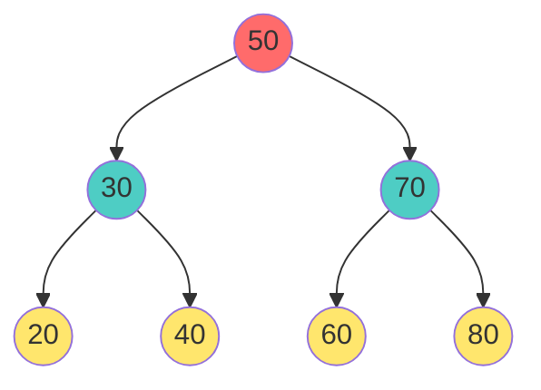
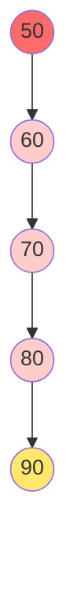
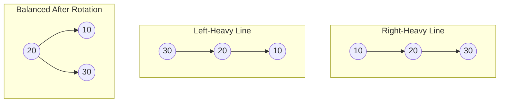
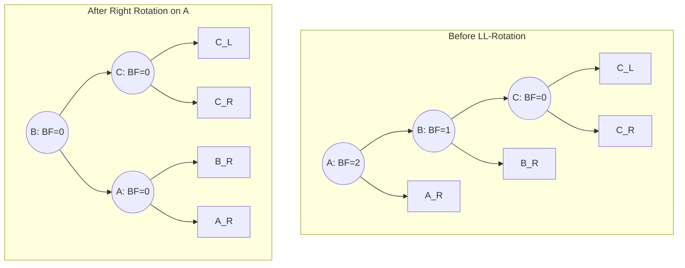

# 🌳 AVL Trees - Keeping BSTs Balanced

## 🧒 The Problem (Explain to 5-Year-Old)

Remember our "Magic Box" from BST lesson? 

**Problem**: What if you keep adding numbers **only bigger than the last one**?

```
50
  \
   70
     \
      80
        \
        100
```

Now it's not a tree anymore - it's a **line**! 🪜 No more magic speed!

**Solution**: **AVL Trees** automatically **fix themselves** to stay balanced!

---

## What is an AVL Tree?

**AVL = Adelson-Velsky and Landis** (the people who invented it)

### Simple Definition

An **AVL Tree** is a **self-balancing BST** where:
- Every node has a **balance factor**
- Balance factor = Height of left - Height of right
- Balance factor must be **-1, 0, or +1** (never 2 or -2!)
- If it goes outside range → **automatically rotate** to fix!

### Balance Factor Calculation

```
     A
    / \
   B   C
  /
 D

Height of B's subtree (left) = 2
Height of C's subtree (right) = 1
Balance Factor of A = 2 - 1 = +1 ✓ (Valid: between -1 and +1)
```

---

## Understanding Height & Balance

### Visual Example



**Balance Factors**:
- Node 20: height = 1, BF = 0 (no children)
- Node 30: height = 2, BF = 0 (balanced)
- Node 50: height = 3, BF = 0 (perfectly balanced!)

---

## The Problem Scenario

When not balanced:



**Balance Factors** (from bottom to top):
- Node 80: BF = -1 ✓
- Node 70: BF = 0 - 1 = -1 ✓
- Node 60: BF = 0 - 2 = **-2** ❌ (Unbalanced!)
- Node 50: BF = 0 - 3 = **-3** ❌ (Very unbalanced!)

**Speed problem**: Searching becomes O(n) like a line! 😟

---

## Solution: Rotations

When a node becomes unbalanced, we **rotate** the tree to fix it!

### Type 1: Left Rotation (Right-Heavy)

**When to use**: Balance factor = -2 (right side too heavy)

**Before Rotation**:
```
      A                      B
       \                    / \
        B    --------->    A   C
         \
          C
```

**C++ Code**:
```cpp
Node* leftRotate(Node* node) {
    // node is A, node->right is B
    Node* rightChild = node->right;
    
    // Rotate
    node->right = rightChild->left;      // A's right becomes B's left
    rightChild->left = node;              // B's left becomes A
    
    // Update heights
    node->height = max(height(node->left), height(node->right)) + 1;
    rightChild->height = max(height(rightChild->left), height(rightChild->right)) + 1;
    
    return rightChild;  // B is new root
}
```

### Type 2: Right Rotation (Left-Heavy)

**When to use**: Balance factor = +2 (left side too heavy)

**Before Rotation**:
```
        A                      B
       /        --------->    / \
      B                      C   A
     /
    C
```

**C++ Code**:
```cpp
Node* rightRotate(Node* node) {
    // node is A, node->left is B
    Node* leftChild = node->left;
    
    // Rotate
    node->left = leftChild->right;       // A's left becomes B's right
    leftChild->right = node;              // B's right becomes A
    
    // Update heights
    node->height = max(height(node->left), height(node->right)) + 1;
    leftChild->height = max(height(leftChild->left), height(leftChild->right)) + 1;
    
    return leftChild;  // B is new root
}
```

### Type 3: Left-Right Rotation (Mixed)

**When to use**: Left child is heavy, its right child is heavier

```
     A              A              B
    /              /              / \
   B    -left->   C    -right->  C   A
    \            /
     C          B
```

**C++ Code**:
```cpp
// First rotate left child to the left
// Then rotate node to the right
Node* leftRightRotate(Node* node) {
    node->left = leftRotate(node->left);
    return rightRotate(node);
}
```

### Type 4: Right-Left Rotation (Mixed)

**When to use**: Right child is heavy, its left child is heavier

```
   A                 A                 B
    \       -right->  \       -left->  / \
     B                 B              A   C
    /                   \
   C                     C
```

**C++ Code**:
```cpp
Node* rightLeftRotate(Node* node) {
    node->right = rightRotate(node->right);
    return leftRotate(node);
}
```

---

## AVL Insertion with Balancing

### Step-by-Step Example

**Insert 50, 30, 20** (becomes unbalanced):

```
Step 1: Insert 50
    50

Step 2: Insert 30
    50              BF = 0 (balanced)
   /
  30

Step 3: Insert 20
    50              BF = +1... wait!
   /
  30
 /
20
        
        Actually BF = +2 (unbalanced!)
        Need RIGHT rotation!
        
    30              BF = 0 (balanced!)
   /  \
  20   50
```

### Insertion Algorithm

```cpp
Node* insert(Node* node, int value) {
    // Step 1: Normal BST insert
    if (node == NULL) {
        return new Node(value);
    }
    
    if (value < node->data) {
        node->left = insert(node->left, value);
    } 
    else if (value > node->data) {
        node->right = insert(node->right, value);
    } 
    else {
        return node;  // Duplicate
    }
    
    // Step 2: Update height
    node->height = max(height(node->left), height(node->right)) + 1;
    
    // Step 3: Calculate balance factor
    int bf = height(node->left) - height(node->right);
    
    // Step 4: If unbalanced, fix with rotations
    
    // Left-heavy
    if (bf > 1) {
        // Check if child is right-heavy (left-right case)
        if (height(node->left->left) < height(node->left->right)) {
            return leftRightRotate(node);
        }
        return rightRotate(node);
    }
    
    // Right-heavy
    if (bf < -1) {
        // Check if child is left-heavy (right-left case)
        if (height(node->right->right) < height(node->right->left)) {
            return rightLeftRotate(node);
        }
        return leftRotate(node);
    }
    
    return node;  // Still balanced
}
```

---

## 📐 Deep Dive: Rotation Formulas & Examples

Let's look at the mathematical formulation and detailed examples of these rotations, which visualize the balancing process step-by-step.

### 1. Basic Concept (Rotations for Insertion)
When inserting `n = 3` elements sequentially, the tree becomes a skewed line. Rotations perfectly balance it simply by pulling the middle element up.


- For a Right-Heavy line (`10 -> 20 -> 30`), we perform a **Left Rotation** on `10`.
- For a Left-Heavy line (`30 -> 20 -> 10`), we perform a **Right Rotation** on `30`.

### 2. LL - Rotation (Left-Left)
**Formula & Structure:**
This occurs when a node `A` has a Balance Factor (BF) of `2` (meaning the left subtree is significantly taller), and its left child `B` has a BF of `1` (or `0`). This often corresponds to a newly inserted node falling into the left subtree of the left child.

**Formula:** Left Child `B` moves up, Root `A` moves down to the right. `B`'s right child `BR` safely transfers to become `A`'s left child.


**Real Example (Inserting Key: `4`):**
Let's insert `4`. The node `30` becomes unbalanced (BF = 2).
Path to unbalanced node: `30 -> 20 -> 10 -> 5 -> 4`.
- Unbalanced Node (`A`) = `30`
- Left Child (`B`) = `20`
*Applying Right Rotation at `30` elevates `20` to the root of the subtree, pulling `30` down to its right. Notice how `25` switches parents from `20` to `30`, perfectly balancing the heights!*

```mermaid
graph TD
    subgraph Before Rotation (Insert: 4)
        30((30<br>BF=2)) --> 20((20<br>BF=1))
        30 --> 40((40<br>BF=-1))
        20 --> 10((10<br>BF=1))
        20 --> 25((25<br>BF=-1))
        10 --> 5((5<br>BF=1))
        10 --> 15((15<br>BF=0))
        5 --> 4((4<br>BF=0))
        40 --> 50((50<br>BF=0))
        25 --> 28((28<br>BF=0))
        
        style 30 fill:#ffcccc
        style 4 fill:#a8eda6
    end
    
    subgraph After LL-Rotation on 30
        20_new((20<br>BF=0)) --> 10_new((10<br>BF=1))
        20_new --> 30_new((30<br>BF=0))
        10_new --> 5_new((5<br>BF=1))
        10_new --> 15_new((15<br>BF=0))
        5_new --> 4_new((4<br>BF=0))
        
        30_new --> 25_new((25<br>BF=-1))
        30_new --> 40_new((40<br>BF=-1))
        
        25_new --> 28_new((28<br>BF=0))
        40_new --> 50_new((50<br>BF=0))
        
        style 25_new fill:#ffe66d
    end
```

### 3. LR - Rotation (Left-Right)
**Formula & Structure:**
Occurs when Node `A` has BF = `2` (left-heavy), but its left child `B` has BF = `-1` (right-heavy). The newly inserted node falls in the right subtree of the left child.
- This requires a **Double Rotation**: First Left Rotate on `B` (moving `C` up), then Right Rotate on `A` (moving `C` further up).

**Formula:** Inner node `C` is promoted to the very top. Its left child `CL` goes to `B`, and its right child `CR` goes to `A`.
```mermaid
graph TD
    subgraph Before LR-Rotation
        A((A: BF=2)) --> B((B: BF=-1))
        A --> AR[A_R]
        B --> BL[B_L]
        B --> C((C: BF=0))
        C --> CL[C_L]
        C --> CR[C_R]
    end
    
    subgraph After LR (Left on B, Right on A)
        C_new((C: BF=0)) --> B_new((B: BF=0))
        C_new --> A_new((A: BF=0))
        B_new --> BL_new[B_L]
        B_new --> CL_new[C_L]
        A_new --> CR_new[C_R]
        A_new --> AR_new[A_R]
    end
```

**Real Example (Inserting Key: `27`):**
Let's insert `27`. Node `40` becomes unbalanced (BF = `2`), while its left child `20` has BF = `-1`.
- Unbalanced Node (`A`) = `40`
- Left Child (`B`) = `20`
- Inner Node (`C`) = `30`
*Applying the double rotation elevates `30` all the way to the top. `25` goes to node `20`, and `36` goes to node `40`.*

```mermaid
graph TD
    subgraph Before Rotation (Insert: 27)
        40((40<br>BF=2)) --> 20((20<br>BF=-1))
        40 --> 50((50<br>BF=-1))
        20 --> 10((10<br>BF=1))
        20 --> 30((30<br>BF=1))
        10 --> 5((5<br>BF=0))
        30 --> 25((25<br>BF=-1))
        30 --> 36((36<br>BF=0))
        25 --> 27((27<br>BF=0))
        50 --> 60((60<br>BF=0))
        
        style 40 fill:#ffcccc
        style 20 fill:#ffcccc
        style 27 fill:#a8eda6
    end
    
    subgraph After LR-Rotation
        30_new((30<br>BF=0)) --> 20_new((20<br>BF=0))
        30_new --> 40_new((40<br>BF=-1))
        
        20_new --> 10_new((10<br>BF=1))
        20_new --> 25_new((25<br>BF=-1))
        10_new --> 5_new((5<br>BF=0))
        25_new --> 27_new((27<br>BF=0))
        
        40_new --> 36_new((36<br>BF=0))
        40_new --> 50_new((50<br>BF=-1))
        50_new --> 60_new((60<br>BF=0))
        
        style 30_new fill:#4ecdc4
    end
```

---

## Complete AVL Tree Implementation

```cpp
#include <iostream>
#include <algorithm>
#include <queue>
using namespace std;

struct Node {
    int data;
    Node* left;
    Node* right;
    int height;
    
    Node(int val) : data(val), left(NULL), right(NULL), height(1) {}
};

class AVLTree {
private:
    Node* root;
    
    int height(Node* node) {
        return (node == NULL) ? 0 : node->height;
    }
    
    int getBalanceFactor(Node* node) {
        if (node == NULL) return 0;
        return height(node->left) - height(node->right);
    }
    
    Node* leftRotate(Node* node) {
        Node* rightChild = node->right;
        node->right = rightChild->left;
        rightChild->left = node;
        
        node->height = max(height(node->left), height(node->right)) + 1;
        rightChild->height = max(height(rightChild->left), height(rightChild->right)) + 1;
        
        return rightChild;
    }
    
    Node* rightRotate(Node* node) {
        Node* leftChild = node->left;
        node->left = leftChild->right;
        leftChild->right = node;
        
        node->height = max(height(node->left), height(node->right)) + 1;
        leftChild->height = max(height(leftChild->left), height(leftChild->right)) + 1;
        
        return leftChild;
    }
    
    Node* insertHelper(Node* node, int value) {
        // Step 1: Normal BST insert
        if (node == NULL) {
            return new Node(value);
        }
        
        if (value < node->data) {
            node->left = insertHelper(node->left, value);
        } 
        else if (value > node->data) {
            node->right = insertHelper(node->right, value);
        } 
        else {
            return node;
        }
        
        // Step 2: Update height
        node->height = max(height(node->left), height(node->right)) + 1;
        
        // Step 3: Get balance factor
        int bf = getBalanceFactor(node);
        
        // Step 4: Fix if unbalanced
        
        // Left-left case
        if (bf > 1 && getBalanceFactor(node->left) >= 0) {
            return rightRotate(node);
        }
        
        // Left-right case
        if (bf > 1 && getBalanceFactor(node->left) < 0) {
            node->left = leftRotate(node->left);
            return rightRotate(node);
        }
        
        // Right-right case
        if (bf < -1 && getBalanceFactor(node->right) <= 0) {
            return leftRotate(node);
        }
        
        // Right-left case
        if (bf < -1 && getBalanceFactor(node->right) > 0) {
            node->right = rightRotate(node->right);
            return leftRotate(node);
        }
        
        return node;
    }
    
    Node* deleteHelper(Node* node, int value) {
        if (node == NULL) return NULL;
        
        if (value < node->data) {
            node->left = deleteHelper(node->left, value);
        } 
        else if (value > node->data) {
            node->right = deleteHelper(node->right, value);
        } 
        else {
            // Node found
            if (node->left == NULL && node->right == NULL) {
                delete node;
                return NULL;
            }
            
            if (node->left == NULL) {
                Node* temp = node->right;
                delete node;
                return temp;
            }
            
            if (node->right == NULL) {
                Node* temp = node->left;
                delete node;
                return temp;
            }
            
            // Two children
            Node* minNode = node->right;
            while (minNode->left != NULL) {
                minNode = minNode->left;
            }
            
            node->data = minNode->data;
            node->right = deleteHelper(node->right, minNode->data);
        }
        
        // Update height
        node->height = max(height(node->left), height(node->right)) + 1;
        
        // Get balance factor
        int bf = getBalanceFactor(node);
        
        // Fix if unbalanced
        if (bf > 1 && getBalanceFactor(node->left) >= 0) {
            return rightRotate(node);
        }
        
        if (bf > 1 && getBalanceFactor(node->left) < 0) {
            node->left = leftRotate(node->left);
            return rightRotate(node);
        }
        
        if (bf < -1 && getBalanceFactor(node->right) <= 0) {
            return leftRotate(node);
        }
        
        if (bf < -1 && getBalanceFactor(node->right) > 0) {
            node->right = rightRotate(node->right);
            return leftRotate(node);
        }
        
        return node;
    }
    
    bool searchHelper(Node* node, int value) {
        if (node == NULL) return false;
        if (node->data == value) return true;
        
        if (value < node->data) {
            return searchHelper(node->left, value);
        }
        return searchHelper(node->right, value);
    }
    
    void inOrderHelper(Node* node) {
        if (node == NULL) return;
        inOrderHelper(node->left);
        cout << node->data << "(" << getBalanceFactor(node) << ") ";
        inOrderHelper(node->right);
    }
    
    int getHeightHelper(Node* node) {
        return height(node);
    }
    
public:
    AVLTree() : root(NULL) {}
    
    void insert(int value) {
        root = insertHelper(root, value);
    }
    
    void deleteValue(int value) {
        root = deleteHelper(root, value);
    }
    
    bool search(int value) {
        return searchHelper(root, value);
    }
    
    void inOrder() {
        inOrderHelper(root);
        cout << "\n[Note: Numbers in () are balance factors]\n" << endl;
    }
    
    int getHeight() {
        return getHeightHelper(root);
    }
    
    ~AVLTree() {
        deleteAll(root);
    }
    
private:
    void deleteAll(Node* node) {
        if (node == NULL) return;
        deleteAll(node->left);
        deleteAll(node->right);
        delete node;
    }
};

// Main program
int main() {
    AVLTree tree;
    
    cout << "=== AVL Tree Operations ===\n" << endl;
    
    // Insert values
    int values[] = {50, 30, 70, 20, 40, 60, 80, 10};
    cout << "Inserting: ";
    for (int val : values) {
        cout << val << " ";
        tree.insert(val);
    }
    cout << "\n\nIn-order traversal (BF in parentheses):\n";
    tree.inOrder();
    
    cout << "Tree height: " << tree.getHeight() << endl;
    cout << "(Notice: height = log n, stays balanced automatically!)\n" << endl;
    
    // Search
    cout << "Searching for 40: " << (tree.search(40) ? "Found" : "Not found") << endl;
    cout << "Searching for 25: " << (tree.search(25) ? "Found" : "Not found") << endl;
    
    // Delete and observe rebalancing
    cout << "\nDeleting 20...\n";
    tree.deleteValue(20);
    tree.inOrder();
    
    return 0;
}
```

---

## Comparison: BST vs AVL

| Property | BST | AVL |
|:---|:---:|:---:|
| **Search** | O(log n) avg, O(n) worst | O(log n) guaranteed |
| **Insert** | O(log n) avg, O(n) worst | O(log n) guaranteed |
| **Delete** | O(log n) avg, O(n) worst | O(log n) guaranteed |
| **Space** | O(n) | O(n) + height tracking |
| **Rotations** | None | Automatic each unbalanced |
| **Complexity** | Simpler | More complex |
| **Real-world** | Less used | Databases, file systems |

---

## 🎯 LeetCode Problems for AVL Concepts

### Problem 1: Balanced Binary Tree
**Link**: [LeetCode 110 - Balanced Binary Tree](https://leetcode.com/problems/balanced-binary-tree/)

**Principle**: Check if tree is balanced (like AVL!)

```cpp
bool isBalanced(TreeNode* root) {
    return getHeight(root) != -1;
}

int getHeight(TreeNode* root) {
    if (root == NULL) return 0;
    
    int leftHeight = getHeight(root->left);
    int rightHeight = getHeight(root->right);
    
    // Unbalanced
    if (leftHeight == -1 || rightHeight == -1) {
        return -1;
    }
    
    // Check if current node is balanced
    if (abs(leftHeight - rightHeight) > 1) {
        return -1;
    }
    
    return max(leftHeight, rightHeight) + 1;
}
```

---

### Problem 2: Diameter of Binary Tree
**Link**: [LeetCode 543 - Diameter of Binary Tree](https://leetcode.com/problems/diameter-of-binary-tree/)

**Principle**: Find longest path (AVL trees have small diameter!)

```cpp
int diameterOfBinaryTree(TreeNode* root) {
    int diameter = 0;
    getHeight(root, diameter);
    return diameter;
}

int getHeight(TreeNode* root, int& diameter) {
    if (root == NULL) return 0;
    
    int leftHeight = getHeight(root->left, diameter);
    int rightHeight = getHeight(root->right, diameter);
    
    diameter = max(diameter, leftHeight + rightHeight);
    
    return max(leftHeight, rightHeight) + 1;
}
```

---

### Problem 3: Construct Balanced BST from Sorted Array
**Link**: [LeetCode 108 - Convert Sorted Array to Binary Search Tree](https://leetcode.com/problems/convert-sorted-array-to-binary-search-tree/)

**Principle**: Use middle element as root (keeps tree balanced!)

```cpp
TreeNode* sortedArrayToBST(vector<int>& nums) {
    return build(nums, 0, nums.size() - 1);
}

TreeNode* build(vector<int>& nums, int left, int right) {
    if (left > right) return NULL;
    
    int mid = left + (right - left) / 2;
    TreeNode* root = new TreeNode(nums[mid]);
    
    root->left = build(nums, left, mid - 1);
    root->right = build(nums, mid + 1, right);
    
    return root;
}
```

---

## Key Takeaways About AVL Trees

1. **Self-Balancing**: Maintains height ≈ log n automatically
2. **4 Rotation Types**: LL, RR, LR, RL (handle unbalance)
3. **Balance Factor**: left_height - right_height (must be -1, 0, +1)
4. **Every Op is O(log n)**: Guaranteed! (No worst case O(n))
5. **More Complex**: Than BST but guarantees performance
6. **Real World**: Databases, file systems use AVL concepts
7. **Trade-off**: Extra space for height tracking, rotation overhead

---

## Practice Path for AVL Trees

**Level 1**: Understand rotations visually
**Level 2**: Implement insertion with rotations
**Level 3**: Implement deletion with rebalancing
**Level 4**: LeetCode problems (110, 543)
**Level 5**: Compare with Red-Black trees

Now create more LeetCode-focused practical problems!