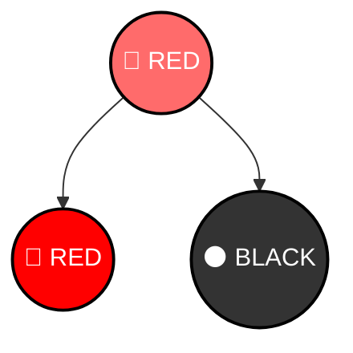
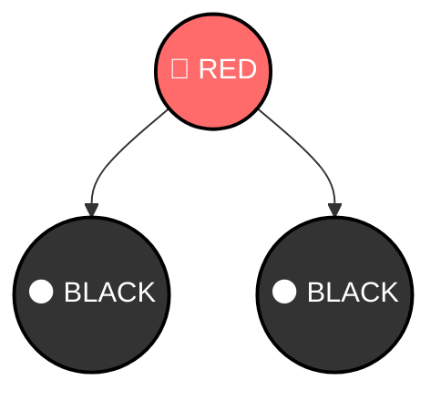
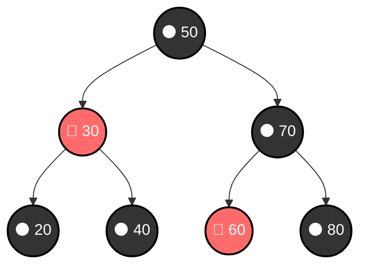

# 🔴⚫ Red-Black Trees - Self-Balancing with Colors

## 🧒 Imagine a Magic Coloring Game (For 5-Year-Olds)

Imagine a **Binary Search Tree that colors each node** either RED or BLACK:
- Some nodes must be RED, some must be BLACK
- Following special coloring rules
- Keeps itself balanced automatically!

**Red-Black Tree** = BST + special coloring rules = super balanced! 🎨

---

## What is a Red-Black Tree?

### Simple Definition

A **Red-Black Tree** is a **self-balancing BST** where:
- Each node is colored RED or BLACK
- Follow 5 **color rules** to maintain balance
- Guarantees O(log n) for all operations
- Used in real systems (STL maps, Linux kernel)

### The 5 Sacred Rules

1. **Every node is RED or BLACK** ✓
2. **Root is always BLACK** ✓
3. **Leaves (NULL) are BLACK** ✓
4. **RED nodes have BLACK children only** (no RED parent-child! 🚫)
5. **Every path from node to leaf has same BLACK count** ✓

---

## Rule Explanation with Examples

### Rule 4: RED Nodes Can't Have RED Children



**❌ WRONG**: RED (A) has RED child (B)



**✅ CORRECT**: RED (A) has only BLACK children

### Rule 5: All Paths Have Same BLACK Count



**Count BLACK nodes on each path:**
- 50 → 30 → 20: ⚫⚫⚫  = 3 black
- 50 → 30 → 40: ⚫⚫⚫  = 3 black
- 50 → 70 → 60: ⚫⚫🔴 = 2 black (60 is RED, doesn't count)
- 50 → 70 → 80: ⚫⚫⚫  = 3 black ✓

All paths have **same BLACK count** → Valid Red-Black Tree!

---

## How Red-Black Trees Stay Balanced

### Why These Rules Work

The 5 rules guarantee:
- **No path is more than 2x longer than another**
- BST is always "roughly balanced"
- Height ≈ 2 * log(n) maximum

**Result**: O(log n) always!

### Comparison: AVL vs Red-Black

| Aspect | AVL | Red-Black |
|--------|:---:|:---:|
| Balance Factor | -1, 0, +1 | Color-based |
| Rotations on Insert | Often multiple | 0-1 usually |
| Rotations on Delete | Often multiple | 0-1 usually |
| Search Speed | Slightly faster (more balanced) | O(log n) guaranteed |
| Insert/Delete Speed | Slower (more rotations) | Faster (fewer rotations) |
| Real-World Use | Less common | STL maps, Linux kernel |

---

## Red-Black Tree Operations

### Operation 1: Insertion

**Basic Idea**: Insert like BST, then **fix color violations**

#### Example: Insert 10 into existing tree

```
Before:  
    🔴 20
   /    \
⚫ 10   ⚫ 30

After insert 5 (RED):
    🔴 20
   /    \
⚫ 10   ⚫ 30
 /
🔴 5

Problem: 10 (BLACK) has RED child 5 - OK!
```

#### Fix Color Violations: 3 Cases

**Case 1: Uncle is RED**
```
Recolor: Change colors to fix violation
```

**Case 2: Uncle is BLACK (Triangle)**
```
Rotate: Fix tree structure first, then recolor
```

**Case 3: Uncle is BLACK (Line)**
```
Rotate + Recolor: One rotation fixes it
```

### Operation 2: Search (Same as BST!)

```cpp
bool search(Node* node, int value) {
    if (node == NULL) return false;
    if (node->data == value) return true;
    
    if (value < node->data) {
        return search(node->left, value);
    }
    return search(node->right, value);
}
```

**Time**: O(log n) guaranteed!

### Operation 3: Deletion (Most Complex!)

**Three cases like BST deletion, but need to fix colors afterward**

---

## Complete Red-Black Tree Implementation

```cpp
#include <iostream>
#include <algorithm>
using namespace std;

enum Color { RED, BLACK };

struct Node {
    int data;
    Node* left;
    Node* right;
    Node* parent;
    Color color;
    
    Node(int val) : data(val), left(NULL), right(NULL), 
                    parent(NULL), color(RED) {}
};

class RedBlackTree {
private:
    Node* root;
    
    void rotateLeft(Node* node) {
        Node* rightChild = node->right;
        node->right = rightChild->left;
        
        if (rightChild->left != NULL) {
            rightChild->left->parent = node;
        }
        
        rightChild->parent = node->parent;
        
        if (node->parent == NULL) {
            root = rightChild;
        } else if (node == node->parent->left) {
            node->parent->left = rightChild;
        } else {
            node->parent->right = rightChild;
        }
        
        rightChild->left = node;
        node->parent = rightChild;
    }
    
    void rotateRight(Node* node) {
        Node* leftChild = node->left;
        node->left = leftChild->right;
        
        if (leftChild->right != NULL) {
            leftChild->right->parent = node;
        }
        
        leftChild->parent = node->parent;
        
        if (node->parent == NULL) {
            root = leftChild;
        } else if (node == node->parent->left) {
            node->parent->left = leftChild;
        } else {
            node->parent->right = leftChild;
        }
        
        leftChild->right = node;
        node->parent = leftChild;
    }
    
    void fixInsert(Node* node) {
        while (node->parent != NULL && node->parent->color == RED) {
            if (node->parent == node->parent->parent->left) {
                Node* uncle = node->parent->parent->right;
                
                if (uncle != NULL && uncle->color == RED) {
                    // Case 1: Uncle is RED
                    node->parent->color = BLACK;
                    uncle->color = BLACK;
                    node->parent->parent->color = RED;
                    node = node->parent->parent;
                } else {
                    // Uncle is BLACK
                    if (node == node->parent->right) {
                        // Case 2: Triangle
                        node = node->parent;
                        rotateLeft(node);
                    }
                    // Case 3: Line
                    node->parent->color = BLACK;
                    node->parent->parent->color = RED;
                    rotateRight(node->parent->parent);
                }
            } else {
                Node* uncle = node->parent->parent->left;
                
                if (uncle != NULL && uncle->color == RED) {
                    node->parent->color = BLACK;
                    uncle->color = BLACK;
                    node->parent->parent->color = RED;
                    node = node->parent->parent;
                } else {
                    if (node == node->parent->left) {
                        node = node->parent;
                        rotateRight(node);
                    }
                    node->parent->color = BLACK;
                    node->parent->parent->color = RED;
                    rotateLeft(node->parent->parent);
                }
            }
        }
        root->color = BLACK;
    }
    
    Node* insertHelper(Node* node, int value, Node* parent) {
        if (node == NULL) {
            Node* newNode = new Node(value);
            newNode->parent = parent;
            return newNode;
        }
        
        if (value < node->data) {
            node->left = insertHelper(node->left, value, node);
        } else if (value > node->data) {
            node->right = insertHelper(node->right, value, node);
        } else {
            return node;
        }
        
        return node;
    }
    
    bool searchHelper(Node* node, int value) {
        if (node == NULL) return false;
        if (node->data == value) return true;
        
        if (value < node->data) {
            return searchHelper(node->left, value);
        }
        return searchHelper(node->right, value);
    }
    
    void inOrderHelper(Node* node) {
        if (node == NULL) return;
        inOrderHelper(node->left);
        cout << node->data << "(" << (node->color == RED ? "R" : "B") << ") ";
        inOrderHelper(node->right);
    }
    
    int getHeightHelper(Node* node) {
        if (node == NULL) return 0;
        return 1 + max(getHeightHelper(node->left), 
                       getHeightHelper(node->right));
    }
    
public:
    RedBlackTree() : root(NULL) {}
    
    void insert(int value) {
        root = insertHelper(root, value, NULL);
        
        // Find inserted node and fix colors
        Node* node = root;
        while (node != NULL && node->data != value) {
            if (value < node->data) {
                node = node->left;
            } else {
                node = node->right;
            }
        }
        
        if (node != NULL) {
            fixInsert(node);
        }
    }
    
    bool search(int value) {
        return searchHelper(root, value);
    }
    
    void inOrder() {
        inOrderHelper(root);
        cout << "\n[R=Red, B=Black]\n" << endl;
    }
    
    int getHeight() {
        return getHeightHelper(root);
    }
    
    ~RedBlackTree() {
        deleteAll(root);
    }
    
private:
    void deleteAll(Node* node) {
        if (node == NULL) return;
        deleteAll(node->left);
        deleteAll(node->right);
        delete node;
    }
};

// Main program
int main() {
    RedBlackTree tree;
    
    cout << "=== Red-Black Tree Operations ===\n" << endl;
    
    int values[] = {50, 30, 70, 20, 40, 60, 80, 10, 25};
    cout << "Inserting: ";
    for (int val : values) {
        cout << val << " ";
        tree.insert(val);
    }
    
    cout << "\n\nIn-order (with colors):\n";
    tree.inOrder();
    
    cout << "Tree height: " << tree.getHeight() << endl;
    cout << "(Height stays ~log n even with insertions!)\n" << endl;
    
    cout << "Searching for 40: " << (tree.search(40) ? "Found" : "Not found") << endl;
    cout << "Searching for 35: " << (tree.search(35) ? "Found" : "Not found") << endl;
    
    return 0;
}
```

---

## When to Use Red-Black Trees

### ✅ Perfect For:
1. **General BST operations** (insert, delete, search)
2. **Fewer rebalancing operations** (fewer rotations than AVL)
3. **Standard library maps** (C++ STL uses Red-Black trees!)
4. **Operating systems** (Linux kernel uses them)

### ❌ Not Good For:
1. **Frequent searching** (AVL better - more balanced)
2. **Read-heavy workloads** (search not the strength)

---

## Properties & Analysis

| Property | Value |
|----------|-------|
| **Height** | O(log n) |
| **Search** | O(log n) |
| **Insert** | O(log n) |
| **Delete** | O(log n) |
| **Space** | O(n) + color tracking |
| **Rotations per insert** | Average 0.5 |
| **Rotations per delete** | Average 1.5 |

---

## 🎯 LeetCode & Practice

While there are no specific "Red-Black Tree" problems in LeetCode (they're implementation detail), understanding them helps with:
- **LeetCode 1382**: Balance a Binary Search Tree
- Problems requiring ordered maps/sets with guaranteed performance

---

## Real-World Applications

### 1. **C++ Standard Template Library (STL)**
```cpp
map<int, string> myMap;  // Uses Red-Black tree internally!
// Every insertion/deletion automatically balanced
```

### 2. **Java TreeMap**
```java
TreeMap<Integer, String> map = new TreeMap<>();  // Red-Black tree!
```

### 3. **Linux Kernel**
- Processes scheduling (scheduler uses Red-Black trees)
- Virtual memory management

### 4. **Database Systems**
- MySQL InnoDB uses similar concepts
- Index balancing

### 5. **File Systems**
- Directory structures
- Fast file lookup

---

## Key Differences from AVL

| Factor | AVL | Red-Black |
|--------|:---:|:---:|
| **Balance strictness** | Very strict (BF must be -1,0,+1) | Loose (color rules) |
| **Rebalancing** | More frequent | Less frequent |
| **Rotation count** | Multiple per insert/delete | Single usually |
| **Search speed** | Slightly faster | Still O(log n) |
| **Insert/Delete speed** | Slower (more work) | Faster (less work) |
| **Easier to implement?** | AVL simpler | Red-Black simpler |

---

## Interview Notes

### If Asked About Red-Black Trees:

1. **"Explain the 5 rules"**
   - Think of them maintaining balance through color constraints

2. **"Why use Red-Black instead of AVL?"**
   - Fewer rotations = faster insert/delete (practical advantage)
   - Both guarantee O(log n)

3. **"Where are they used?"**
   - STL maps, Java TreeMap, Linux kernel

4. **"Can you code it?"**
   - Complex! Usually answer: "I understand concepts, would look up exact implementation"

5. **"What if uncle is RED vs BLACK?"**
   - Different fixing strategies for each case

---

## Key Takeaways

1. **5 Color Rules** maintain balance
2. **RED nodes can't have RED children** (critical rule!)
3. **All paths must have equal BLACK count** (ensures balance)
4. **Fewer rotations than AVL** but still O(log n)
5. **Used in real systems** (STL, Linux, databases)
6. **O(log n) guaranteed** for all operations
7. **More complex to implement** but worth understanding

---

## Practice Road Map

**Level 1**: Understand the 5 rules
**Level 2**: Trace through an insertion
**Level 3**: Understand the 3 cases for fixing
**Level 4**: Implement insertion (if time permits)
**Level 5**: Study deletions (very complex!)

Start simple, build up confidence. Red-Black trees are an implementation detail - **understanding concepts matters more than coding!**