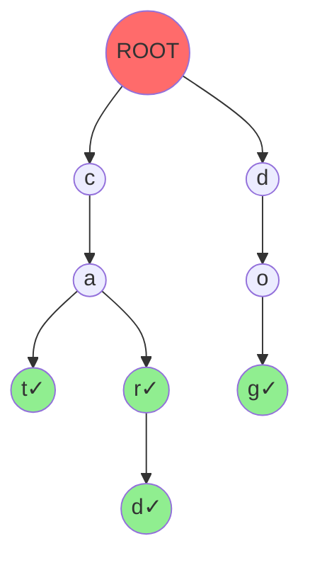

# 🔤 Tries (Prefix Trees) - String Magic!

## 🧒 Imagine a Word Game Board (For 5-Year-Olds)

Imagine a **game board for spelling words**:
- Each square is a LETTER
- Words share the starting letters!
- Find ANY word by following the path
- **Autocomplete works like magic!** ✨

**Trie** = Clever board for storing words fast = **Word finder!** 🎮

---

## What is a Trie?

### Simple Definition

A **Trie** (also "Prefix Tree") is a **tree for storing strings** where:
- Each node represents a CHARACTER
- Path from root to node = PREFIX
- Share common prefixes to save space
- Perfect for autocomplete, spell-check, IP routing

### Visual: Tree for Words "cat", "car", "car**d**", "dog"



**Words stored**: cat, car, card, dog
- "cat": follow C → A → T
- "car": follow C → A → R
- Notice: C-A shared! (space saved!)

---

## Node Structure

### Trie Node

```cpp
struct TrieNode {
    // 26 children (a-z), or use map for other chars
    TrieNode* children[26];
    
    // Mark end of word
    bool isEndOfWord;
    
    TrieNode() {
        for (int i = 0; i < 26; i++) {
            children[i] = NULL;
        }
        isEndOfWord = false;
    }
};
```

### Why This Structure?

- **Array [26]**: Fast access O(1) to any letter
- **isEndOfWord**: Mark valid word endings
- Example: "car" - C-A-R nodes exist, but only R.isEndOfWord = true

---

## Core Operations

### Operation 1: Insert (Add a Word)

#### Beginner Explanation

"To add 'CAT':
1. Start at ROOT
2. Check if 'C' child exists - if not, create it
3. Move to 'C' node, check 'A' - create if needed
4. Move to 'A' node, check 'T' - create if needed
5. Mark 'T' node: isEndOfWord = true"

#### Visual Insert Example

```
Insert "CAT" into empty trie:

Step 1: Create C
ROOT → C

Step 2: Add A to C
ROOT → C → A

Step 3: Add T to A, mark as word
ROOT → C → A → T✓

Now "CAT" is stored!
```

#### C++ Implementation

```cpp
void insert(TrieNode* root, string word) {
    TrieNode* current = root;
    
    for (char ch : word) {
        int index = ch - 'a';  // Convert 'a'=0, 'b'=1, etc.
        
        // Create node if doesn't exist
        if (current->children[index] == NULL) {
            current->children[index] = new TrieNode();
        }
        
        // Move to child
        current = current->children[index];
    }
    
    // Mark end of word
    current->isEndOfWord = true;
}
```

**Time**: O(L) where L = word length
**Space**: O(1) amortized (reuse existing nodes)

---

### Operation 2: Search (Find Exact Word)

#### Beginner Explanation

"To search for 'CAR':
1. Start at ROOT
2. Go to 'C' - exists? ✓
3. Go to 'A' - exists? ✓
4. Go to 'R' - exists? ✓
5. Is 'R' marked as end? YES! → Word found!"

#### C++ Implementation

```cpp
bool search(TrieNode* root, string word) {
    TrieNode* current = root;
    
    for (char ch : word) {
        int index = ch - 'a';
        
        // Path doesn't exist
        if (current->children[index] == NULL) {
            return false;
        }
        
        current = current->children[index];
    }
    
    // Check if it's marked as word
    return current->isEndOfWord;
}
```

**Time**: O(L) where L = word length
**Space**: O(1)

---

### Operation 3: StartsWith (Autocomplete Check)

**Perfect for autocomplete & spell-check!**

#### Beginner Explanation

"Does any word START with 'CAR'?
1. Follow path: C → A → R
2. If path exists, YES!
3. Don't need isEndOfWord check"

#### C++ Implementation

```cpp
bool startsWith(TrieNode* root, string prefix) {
    TrieNode* current = root;
    
    for (char ch : prefix) {
        int index = ch - 'a';
        
        if (current->children[index] == NULL) {
            return false;  // Prefix doesn't exist
        }
        
        current = current->children[index];
    }
    
    return true;  // Prefix exists!
}
```

**Time**: O(L) where L = prefix length

---

### Operation 4: Get All Words with Prefix

**For autocomplete suggestions!**

```cpp
void getAllWordsHelper(TrieNode* node, string current, vector<string>& result) {
    if (node->isEndOfWord) {
        result.push_back(current);
    }
    
    for (int i = 0; i < 26; i++) {
        if (node->children[i] != NULL) {
            char ch = 'a' + i;
            getAllWordsHelper(node->children[i], current + ch, result);
        }
    }
}

vector<string> getWordsWithPrefix(TrieNode* root, string prefix) {
    vector<string> result;
    TrieNode* current = root;
    
    // Navigate to prefix end
    for (char ch : prefix) {
        int index = ch - 'a';
        if (current->children[index] == NULL) {
            return result;  // No words
        }
        current = current->children[index];
    }
    
    // Get all words from this point
    getAllWordsHelper(current, prefix, result);
    return result;
}
```

**Example**:
```cpp
Trie contains: "cat", "car", "card", "dog"
getWordsWithPrefix("ca")
// Returns: ["cat", "car", "card"]
```

---

## Complete Trie Implementation

```cpp
#include <iostream>
#include <vector>
#include <string>
using namespace std;

struct TrieNode {
    TrieNode* children[26];
    bool isEndOfWord;
    
    TrieNode() {
        for (int i = 0; i < 26; i++) {
            children[i] = NULL;
        }
        isEndOfWord = false;
    }
};

class Trie {
private:
    TrieNode* root;
    
    void getAllWordsHelper(TrieNode* node, string current, vector<string>& result) {
        if (node == NULL) return;
        
        if (node->isEndOfWord) {
            result.push_back(current);
        }
        
        for (int i = 0; i < 26; i++) {
            if (node->children[i] != NULL) {
                getAllWordsHelper(node->children[i], current + (char)('a' + i), result);
            }
        }
    }
    
    void deleteHelper(TrieNode* node) {
        if (node == NULL) return;
        
        for (int i = 0; i < 26; i++) {
            if (node->children[i] != NULL) {
                deleteHelper(node->children[i]);
            }
        }
        
        delete node;
    }
    
public:
    Trie() {
        root = new TrieNode();
    }
    
    void insert(string word) {
        TrieNode* current = root;
        
        for (char ch : word) {
            int index = ch - 'a';
            
            if (current->children[index] == NULL) {
                current->children[index] = new TrieNode();
            }
            
            current = current->children[index];
        }
        
        current->isEndOfWord = true;
    }
    
    bool search(string word) {
        TrieNode* current = root;
        
        for (char ch : word) {
            int index = ch - 'a';
            
            if (current->children[index] == NULL) {
                return false;
            }
            
            current = current->children[index];
        }
        
        return current->isEndOfWord;
    }
    
    bool startsWith(string prefix) {
        TrieNode* current = root;
        
        for (char ch : prefix) {
            int index = ch - 'a';
            
            if (current->children[index] == NULL) {
                return false;
            }
            
            current = current->children[index];
        }
        
        return true;
    }
    
    vector<string> wordsWithPrefix(string prefix) {
        vector<string> result;
        TrieNode* current = root;
        
        for (char ch : prefix) {
            int index = ch - 'a';
            if (current->children[index] == NULL) {
                return result;
            }
            current = current->children[index];
        }
        
        getAllWordsHelper(current, prefix, result);
        return result;
    }
    
    ~Trie() {
        deleteHelper(root);
    }
};

// Main program
int main() {
    Trie trie;
    
    cout << "=== Trie (Prefix Tree) Operations ===\n" << endl;
    
    vector<string> words = {"cat", "car", "card", "care", "careful", "dog", "dodge", "door"};
    
    cout << "Inserting words: ";
    for (string word : words) {
        cout << word << " ";
        trie.insert(word);
    }
    cout << "\n" << endl;
    
    cout << "Search 'car': " << (trie.search("car") ? "Found" : "Not found") << endl;
    cout << "Search 'ca': " << (trie.search("ca") ? "Found" : "Not found") << endl;
    cout << "Search 'card': " << (trie.search("card") ? "Found" : "Not found") << endl;
    
    cout << "\nPrefix checks:" << endl;
    cout << "StartsWith 'ca': " << (trie.startsWith("ca") ? "YES" : "NO") << endl;
    cout << "StartsWith 'do': " << (trie.startsWith("do") ? "YES" : "NO") << endl;
    cout << "StartsWith 'bat': " << (trie.startsWith("bat") ? "YES" : "NO") << endl;
    
    cout << "\nAutocomplete suggestions:" << endl;
    vector<string> suggestions = trie.wordsWithPrefix("ca");
    cout << "Words starting with 'ca': ";
    for (string word : suggestions) {
        cout << word << " ";
    }
    cout << "\n" << endl;
    
    suggestions = trie.wordsWithPrefix("do");
    cout << "Words starting with 'do': ";
    for (string word : suggestions) {
        cout << word << " ";
    }
    cout << endl;
    
    return 0;
}
```

---

## Trie Properties

| Property | Value |
|----------|-------|
| **Insert** | O(L) where L = word length |
| **Search** | O(L) |
| **StartsWith** | O(L) |
| **Space** | O(ALPHABET_SIZE * N * L) worst case |
| **Space** | O(N * avg_L) typical case |
| **Where N** = total words, L = avg length |

---

## Trie vs Hash Set

| Feature | Trie | Hash Set |
|---------|:---:|:---:|
| **Search** | O(L) | O(L) average |
| **StartsWith** | O(L) | O(N*L) - must check all |
| **Autocomplete** | O(L) to prefix, O(N) to all | O(N) - must check all |
| **Space** | More (tree structure) | Less |
| **Ordered** | YES - naturally ordered | No |
| **Best Use** | Strings with common prefixes | Fast lookups only |

---

## Real-World Applications

### 1. **Search Engine Autocomplete**
```
User types "py"
Suggestions: python, payload, pyramid
(Trie finds all instantly!)
```

### 2. **Spell Checkers**
```cpp
if (!trie.search(word)) {
    cout << "Word not found - suggest alternatives\n";
}
```

### 3. **IP Routing**
- Route packets based on prefix
- Longest prefix match using Trie

### 4. **Dictionary/Thesaurus**
- Store all words efficiently
- Find all words with prefix

### 5. **Auto-completing Filename**
```
User types "Doc"
Suggests: "Documents", "Downloads", "Docker"
```

---

## 🎯 LeetCode Problems

### Problem 1: Implement Trie
**Link**: [LeetCode 208 - Implement Trie](https://leetcode.com/problems/implement-trie-prefix-tree/)

**Difficulty**: Medium

**Solution**: The implementation above!

---

### Problem 2: Search Word
**Link**: [LeetCode 211 - Design Add and Search Words](https://leetcode.com/problems/design-add-and-search-words-data-structure/)

**Difficulty**: Medium

**Key Difference**: Can use '.' as wildcard (matches any character)

```cpp
bool searchHelper(TrieNode* node, string& word, int idx) {
    if (idx == word.length()) {
        return node->isEndOfWord;
    }
    
    char ch = word[idx];
    
    if (ch == '.') {
        for (int i = 0; i < 26; i++) {
            if (node->children[i] != NULL && 
                searchHelper(node->children[i], word, idx + 1)) {
                return true;
            }
        }
        return false;
    } else {
        int index = ch - 'a';
        if (node->children[index] == NULL) {
            return false;
        }
        return searchHelper(node->children[index], word, idx + 1);
    }
}
```

---

### Problem 3: Word Break II (Backtracking + Trie)
**Link**: [LeetCode 140 - Word Break II](https://leetcode.com/problems/word-break-ii/)

**Difficulty**: Hard

Trie optimizes checking if prefix is valid word!

---

## Interesting Variants

### 1. **Compressed Trie (Radix Tree)**
- Like Trie but merges single children
- Saves space significantly

### 2. **Suffix Trie**
- Stores all suffixes
- Used for pattern matching

### 3. **Ternary Search Tree**
- Each node has 3 children (< = >)
- Hybrid between Trie and BST

---

## Key Takeaways

1. **Prefix sharing** makes Tries efficient
2. **O(L) for all operations** where L = length
3. **Perfect for autocomplete** patterns
4. **Naturally ordered** - traverse gives sorted words
5. **Space-efficient** only for word collections
6. **More complex than hash set** but more powerful
7. **LeetCode problems** test Trie concepts

---

## Interview Tips

**If asked about Trie:**
1. "Best for storing sets of strings with common prefixes"
2. "Autocomplete uses Trie internally"
3. "O(L) search is length-dependent, not dataset-size"
4. "Can easily find all words with prefix"
5. "Space efficient if words share prefixes"

---

## Practice Problems

**Easy**:
- Implement basic Trie (insert, search, startsWith)
- Count words starting with prefix

**Medium**:
- LeetCode 208, 211
- Replace words in sentence with Trie

**Hard**:
- LeetCode 140 (Word Break)
- Design search system with ranking

---

## Memory Note

> **"Trie = Shared Prefix Tree for Strings"**
>
> Think: How do autocomplete systems work SO fast? 🔍
> Answer: Tries! One traversal, find all suggestions. ✨