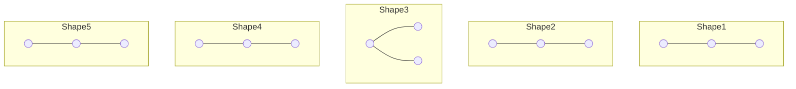

# 🔢 How many Binary Trees can you make?

When we have **n nodes**, how many different binary trees can we build? The answer depends on one big question: **Are the nodes labeled or unlabeled?**

---

## 🏗️ Concept 1: Unlabeled Nodes (Shapes Only)
If all nodes are identical (just empty circles), we only care about the **shape** of the tree.

**The Formula:**
We use the **Catalan Number** to find the number of unique shapes:
$$T(n) = \frac{1}{n+1} \binom{2n}{n}$$

### 🗃️ Card: Shapes for n=3
For $n=3$ nodes, there are exactly **5** possible shapes:

**Quick Results Table:**
| Nodes (n) | Number of Shapes $T(n)$ |
| :--- | :--- |
| **1** | 1 |
| **2** | 2 |
| **3** | **5** |
| **4** | **14** |
| **5** | **42** |

---

## 🏷️ Concept 2: Labeled Nodes (Names Matter)
If nodes are distinct (e.g., labeled A, B, C), each shape can have **n!** (n factorial) different arrangements of labels.

**The Formula:**
$$\text{Total Trees} = T(n) \times n! = \frac{(2n)!}{(n+1)!}$$

**Example for n=3:**
- Shapes = 5
- Permutations ($3!$) = 6
- **Total = 5 × 6 = 30 Binary Trees**

---

## 📏 Concept 3: Maximum Height (Skewed Trees)
If we want to know how many binary trees can be made with the **maximum possible height** (only 1 node per level), we use a simpler formula.

**The Formula:**
$$\text{Max Height Trees} = 2^{n-1}$$

**Example for n=3:**
- $2^{3-1} = 2^2 = 4$
- These are the 4 skewed shapes (Left-Left, Left-Right, Right-Left, Right-Right).

---

## 💡 Pro Summary for n=3
- **Unlabeled nodes**? ➡ 5 Shapes.
- **Labeled nodes**? ➡ 30 Trees.
- **Maximum height** only? ➡ 4 Skewed Trees.
