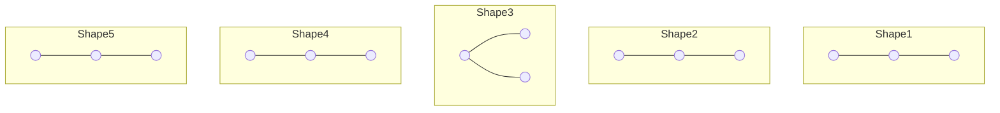

# 🔢 How many Binary Trees can you make?

When we have **n nodes**, how many different binary trees can we build? The answer depends on one big question: **Are the nodes labeled or unlabeled?**

---

## 🏗️ Concept 1: Unlabeled Nodes (Shapes Only)
If all nodes are identical (just empty circles), we only care about the **shape** of the tree.

**The Formula:**
We use the **Catalan Number** to find the number of unique shapes:
$$T(n) = \frac{1}{n+1} \binom{2n}{n}$$

### 🗃️ Card: Shapes for n=3
For $n=3$ nodes, there are exactly **5** possible shapes:

**Quick Results Table:**
| Nodes (n) | Number of Shapes $T(n)$ |
| :--- | :--- |
| **0** | **1** (Empty Tree) |
| **1** | 1 |
| **2** | 2 |
| **3** | **5** |
| **4** | **14** |
| **5** | **42** |
| **6** | **132** |

---

## 🎓 The Pro Derivation (Step-by-Step)
How do we actually come up with these numbers? Let's derive them just like a CS professor would.

### 1. Identify the Base Cases
- **n = 0 nodes**: Only 1 possibility—an **Empty Tree**. $T(0) = 1$.
- **n = 1 node**: Only 1 possibility—a **Root node**. $T(1) = 1$.
- **n = 2 nodes**: Fix 1 node as root. You have 1 node left. It can go either **Left** or **Right**. $T(2) = 2$.

### 2. The "Fix Root, Split Rest" Logic
To find the number of trees for **n** nodes:
1. Fix **1 node** as the Root.
2. You have **n - 1** nodes left.
3. Distribute these nodes between the **Left subtree** and **Right subtree**.

### 3. Deriving T(3)
Fix 1 root $\rightarrow$ 2 nodes left to split:
| Case | Left Subtree | Right Subtree | Ways ($T_L \times T_R$) | Calculation |
| :--- | :--- | :--- | :--- | :--- |
| **1** | 0 nodes | 2 nodes | $T(0) \times T(2)$ | $1 \times 2 = 2$ |
| **2** | 1 node | 1 node | $T(1) \times T(1)$ | $1 \times 1 = 1$ |
| **3** | 2 nodes | 0 nodes | $T(2) \times T(0)$ | $2 \times 1 = 2$ |
| **Total** | | | | **5** |

### 4. Deriving T(4)
Fix 1 root $\rightarrow$ 3 nodes left to split:
| Case | Left Subtree | Right Subtree | Ways ($T_L \times T_R$) | Calculation |
| :--- | :--- | :--- | :--- | :--- |
| **1** | 0 nodes | 3 nodes | $T(0) \times T(3)$ | $1 \times 5 = 5$ |
| **2** | 1 node | 2 nodes | $T(1) \times T(2)$ | $1 \times 2 = 2$ |
| **3** | 2 nodes | 1 node | $T(2) \times T(1)$ | $2 \times 1 = 2$ |
| **4** | 3 nodes | 0 nodes | $T(3) \times T(0)$ | $5 \times 1 = 5$ |
| **Total** | | | | **14** |

---

## 🔄 The General Recursive Formula (Catalan Series)
This pattern of "splitting and summing" is exactly what the summation formula represents:
$$T(n) = \sum_{i=1}^{n} T(i-1) \times T(n-i)$$

---

## 📝 Concept 3: Shapes vs. Filling (Labeled Nodes)
When nodes are **labeled** (e.g., A, B, C), we multiply the number of shapes by the number of ways to "fill" them.

**The Formula:**
$$\text{Total Trees} = \underbrace{\frac{\binom{2n}{n}}{n+1}}_{\text{Shapes}} \times \underbrace{n!}_{\text{Filling}} = \frac{(2n)!}{(n+1)!}$$

> [!TIP]
> **Shapes** = Catalan Number (Unlabeled)
> **Filling** = Factorial (Labeled)

---

## 🧮 Advanced Calculation: T(6)
Using the Catalan formula:
$$T(6) = \frac{\binom{12}{6}}{7} = \frac{924}{7} = \mathbf{132}$$

Using the Recursive formula:
$$T(6) = (T_0 T_5) + (T_1 T_4) + (T_2 T_3) + (T_3 T_2) + (T_4 T_1) + (T_5 T_0)$$
$$T(6) = (1 \times 42) + (1 \times 14) + (2 \times 5) + (5 \times 2) + (14 \times 1) + (42 \times 1)$$
$$T(6) = 42 + 14 + 10 + 10 + 14 + 42 = \mathbf{132}$$

---

## 📏 Concept 3: Maximum Height (Skewed Trees)
If we want to know how many binary trees can be made with the **maximum possible height** (only 1 node per level), we use a simpler formula.

**The Formula:**
$$\text{Max Height Trees} = 2^{n-1}$$

**Example for n=3:**
- $2^{3-1} = 2^2 = 4$
- These are the 4 skewed shapes (Left-Left, Left-Right, Right-Left, Right-Right).

---

## 💡 Pro Summary for n=3
- **Unlabeled nodes**? ➡ 5 Shapes.
- **Labeled nodes**? ➡ 30 Trees.
- **Maximum height** only? ➡ 4 Skewed Trees.
