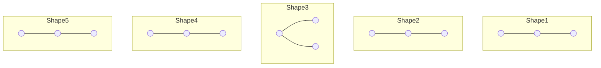
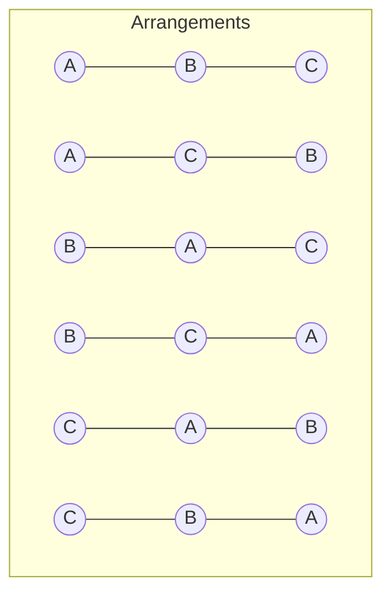

# 🔢 How many Binary Trees can you make?

When we have **n nodes**, how many different binary trees can we build? The answer depends on one big question: **Are the nodes labeled or unlabeled?**

---

## 🏗️ Concept 1: Unlabeled Nodes (Shapes Only)
If all nodes are identical (just empty circles), we only care about the **shape** of the tree.

**The Formula:**
We use the **Catalan Number** to find the number of unique shapes:
$$T(n) = \frac{1}{n+1} \binom{2n}{n}$$

### 🗃️ Card: Shapes for n=3
For $n=3$ nodes, there are exactly **5** possible shapes:

**Quick Results Table:**
| Nodes (n) | Number of Shapes $T(n)$ |
| :--- | :--- |
| **0** | **1** (Empty Tree) |
| **1** | 1 |
| **2** | 2 |
| **3** | **5** |
| **4** | **14** |
| **5** | **42** |
| **6** | **132** |

---

## 🎓 The Pro Derivation (Step-by-Step)
How do we actually come up with these numbers? Let's derive them just like a CS professor would.

### 1. Identify the Base Cases
- **n = 0 nodes**: Only 1 possibility—an **Empty Tree**. $T(0) = 1$.
- **n = 1 node**: Only 1 possibility—a **Root node**. $T(1) = 1$.
- **n = 2 nodes**: Fix 1 node as root. You have 1 node left. It can go either **Left** or **Right**. $T(2) = 2$.

### 2. The "Fix Root, Split Rest" Logic
To find the number of trees for **n** nodes:
1. Fix **1 node** as the Root.
2. You have **n - 1** nodes left.
3. Distribute these nodes between the **Left subtree** and **Right subtree**.

### 3. Deriving T(3)
Fix 1 root $\rightarrow$ 2 nodes left to split:
| Case | Left Subtree | Right Subtree | Ways ($T_L \times T_R$) | Calculation |
| :--- | :--- | :--- | :--- | :--- |
| **1** | 0 nodes | 2 nodes | $T(0) \times T(2)$ | $1 \times 2 = 2$ |
| **2** | 1 node | 1 node | $T(1) \times T(1)$ | $1 \times 1 = 1$ |
| **3** | 2 nodes | 0 nodes | $T(2) \times T(0)$ | $2 \times 1 = 2$ |
| **Total** | | | | **5** |

### 4. Deriving T(4)
Fix 1 root $\rightarrow$ 3 nodes left to split:
| Case | Left Subtree | Right Subtree | Ways ($T_L \times T_R$) | Calculation |
| :--- | :--- | :--- | :--- | :--- |
| **1** | 0 nodes | 3 nodes | $T(0) \times T(3)$ | $1 \times 5 = 5$ |
| **2** | 1 node | 2 nodes | $T(1) \times T(2)$ | $1 \times 2 = 2$ |
| **3** | 2 nodes | 1 node | $T(2) \times T(1)$ | $2 \times 1 = 2$ |
| **4** | 3 nodes | 0 nodes | $T(3) \times T(0)$ | $5 \times 1 = 5$ |
| **Total** | | | | **14** |

---

## 🔄 The General Recursive Formula (Catalan Series)
This pattern of "splitting and summing" is exactly what the summation formula represents:
$$T(n) = \sum_{i=1}^{n} T(i-1) \times T(n-i)$$

---

## 📝 Concept 3: Shapes vs. Filling (Labeled Nodes)
When nodes are **labeled** (e.g., A, B, C), we multiply the number of shapes by the number of ways to "fill" them. Think of "Shapes" as the architecture and "Filling" as the people moving into the rooms.

**The Formula:**
$$\text{Total Trees} = \underbrace{\frac{\binom{2n}{n}}{n+1}}_{\text{Shapes (Catalan)}} \times \underbrace{n!}_{\text{Filling (Factorial)}} = \frac{(2n)!}{(n+1)!}$$

### 🎨 Visualizing the "Filling" (for n=3)
Take **one shape** from our list. How many ways can we put labels A, B, and C into it?

**Total permutations = $3 \times 2 \times 1 = 6$ (or $3!$)**
Since we have 5 such shapes, the total is $5 \times 6 = 30$ trees.

---

## 🧮 Hand-Calculated Example: T(5)
Let's calculate $T(5)$ manually using the Catalan formula, just as you'd do on a whiteboard:

$$T(5) = \frac{\binom{10}{5}}{5+1} = \frac{\binom{10}{5}}{6}$$

**Step 1: Calculate $\binom{10}{5}$**
$$\binom{10}{5} = \frac{10 \times 9 \times 8 \times 7 \times 6}{5 \times 4 \times 3 \times 2 \times 1}$$
$$\binom{10}{5} = \frac{30240}{120} = 252$$

**Step 2: Divide by (n+1)**
$$T(5) = \frac{252}{6} = \mathbf{42}$$

---

## 📏 Concept 4: Maximum Height (Skewed Trees)
If we only want binary trees with the **maximum possible height** (1 node per level), the formula is simpler:
$$\text{Max Height Trees} = 2^{n-1}$$

**Quick Examples:**
- $n=3 \rightarrow 2^2 = 4$
- $n=4 \rightarrow 2^3 = 8$
- $n=5 \rightarrow 2^4 = 16$

---

## 📊 Formula Cheat Sheet (Pro Summary)

| Case | Formula | Description |
| :--- | :--- | :--- |
| **Unlabeled (Shapes)** | $T(n) = \frac{\binom{2n}{n}}{n+1}$ | Use **Catalan Number**. Only the shape matters. |
| **Labeled (Filling)** | $\frac{(2n)!}{(n+1)!}$ | Multiplies Shapes by $n!$ for distinct nodes. |
| **Recursive Approach** | $\sum_{i=1}^{n} T(i-1)T(n-i)$ | Build results using subtrees (Root Splitting). |
| **Maximum Height** | $2^{n-1}$ | Specifically for **Skewed Trees** (1 node per level). |

---

## 💡 Final Summary
- **Unlabeled (Shapes)**: Use **Catalan Number** $T(n)$.
- **Labeled (Filling)**: Use **$T(n) \times n!$**.
- **Max Height**: Use **$2^{n-1}$**.
