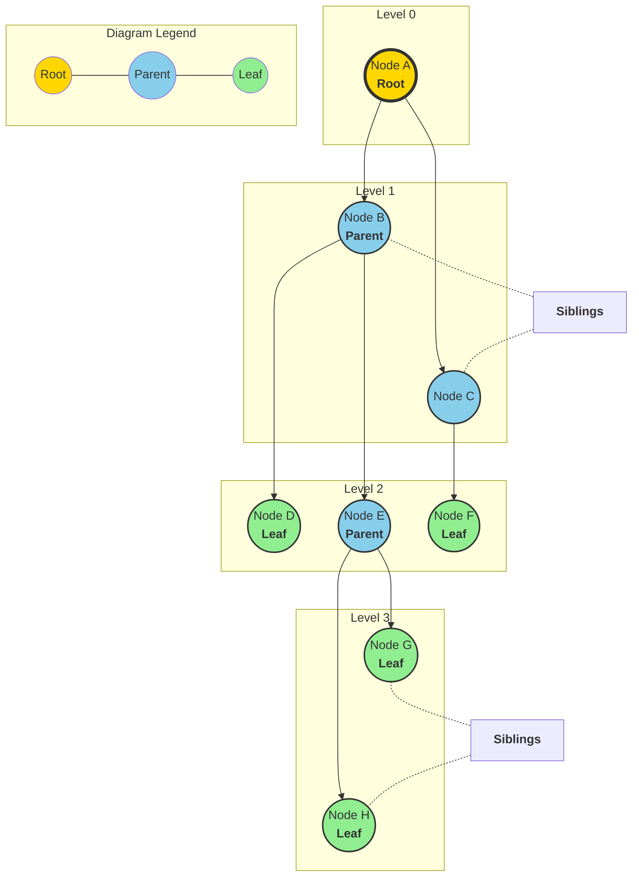

# Tree Data Structure: Terminology & Concepts

A **Tree** is a hierarchical data structure consisting of nodes connected by edges. It is a non-linear data structure, unlike arrays, linked lists, stacks, and queues.

---

## 🌳 Visual Representation (Tree Concepts)

---

## 📝 Key Terminology

### 1. Basic Components
- **Node**: Each element in a tree containing data and links to other nodes.
- **Root**: The topmost node of the tree. It has no parent. (Example: Node **A**)
- **Edge**: The connection between two nodes. If there are **N** nodes, there are **N-1** edges.
- **Parent**: A node that has child nodes. (Example: **A** is the parent of **B** and **C**)
- **Child**: A node that has a parent node. (Example: **B** and **C** are children of **A**)
- **Siblings**: Nodes that share the same parent. (Example: **B** and **C** are siblings)

### 2. Node Types
- **Leaf (External Node)**: A node with no children. (Example: **D, F, G, H**)
- **Internal Node**: A node with at least one child. (Example: **A, B, C, E**)
- **Ancestor**: Any node on the path from the root to that node (including parent and grandparent).
- **Descendant**: Any node in the subtree rooted at that node.

### 3. Tree Measurements
- **Degree of a Node**: The total number of children of that node. (Example: Degree of **B** is 2)
- **Degree of a Tree**: The maximum degree of any node in the tree.
- **Level**: The number of edges from the root to the node. (Root is at Level 0)
- **Depth**: The number of edges from the root to the node. (Same as Level)
- **Height of a Node**: The number of edges on the longest path from the node to a leaf.
- **Height of a Tree**: The height of the root node.

### 4. Structure Concepts
- **Subtree**: A portion of the tree that can be viewed as a complete tree itself.
- **Path**: A sequence of nodes and edges connecting a node with a descendant.
- **Forest**: A collection of disjoint trees.

---

## 💡 Quick Summary Table

| Term | Description | Position/Example |
| :--- | :--- | :--- |
| **Root** | Topmost node | Node A |
| **Leaf** | No children | Node D, F, G, H |
| **Height** | Max edges to leaf | Height of A = 3 |
| **Depth** | Edges from root | Depth of E = 2 |
| **Degree** | Number of children | Degree of E = 2 |
